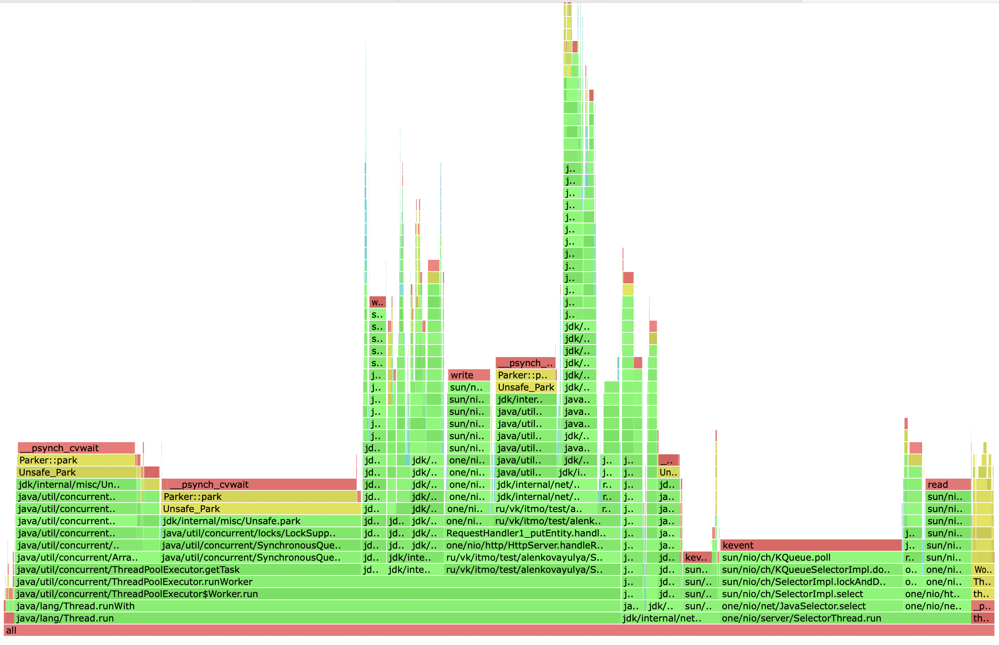
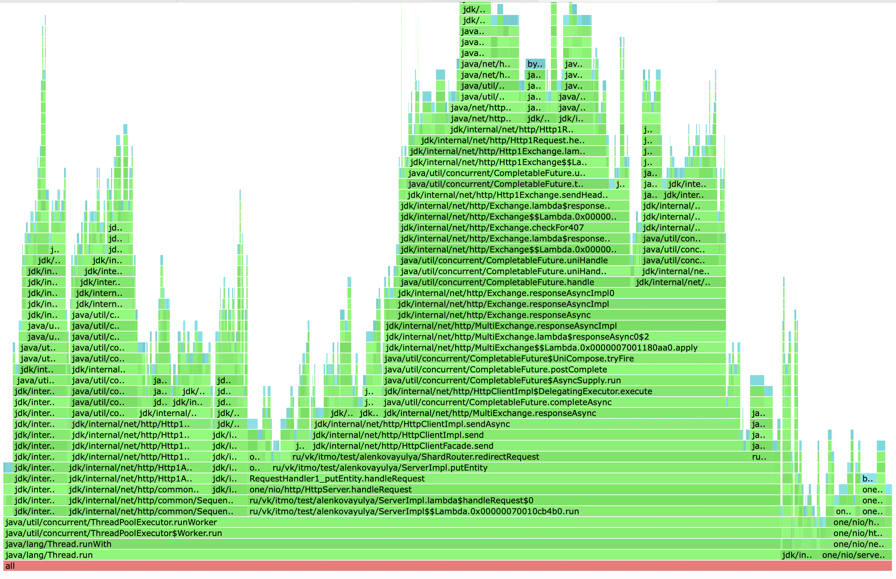
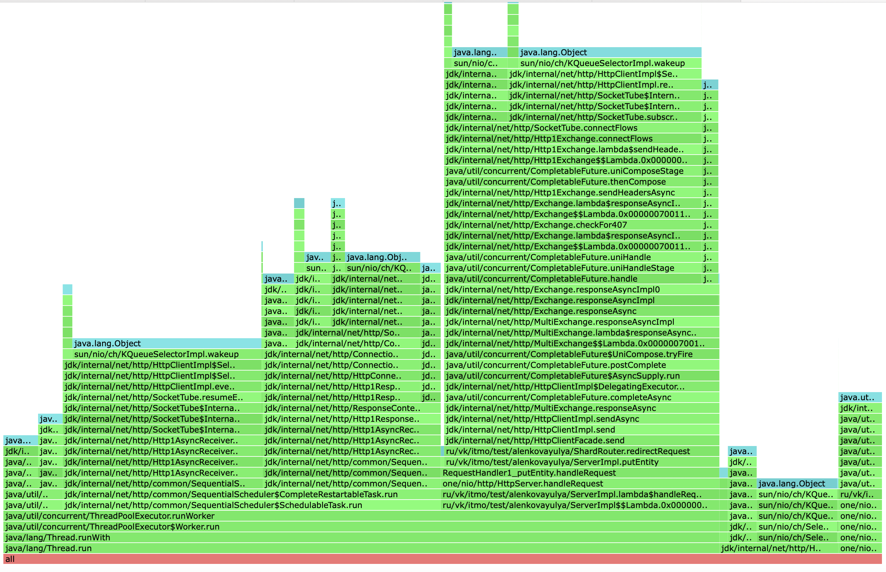
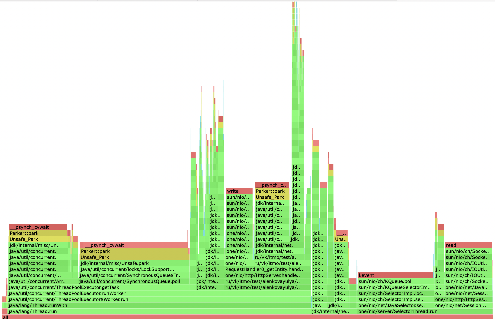
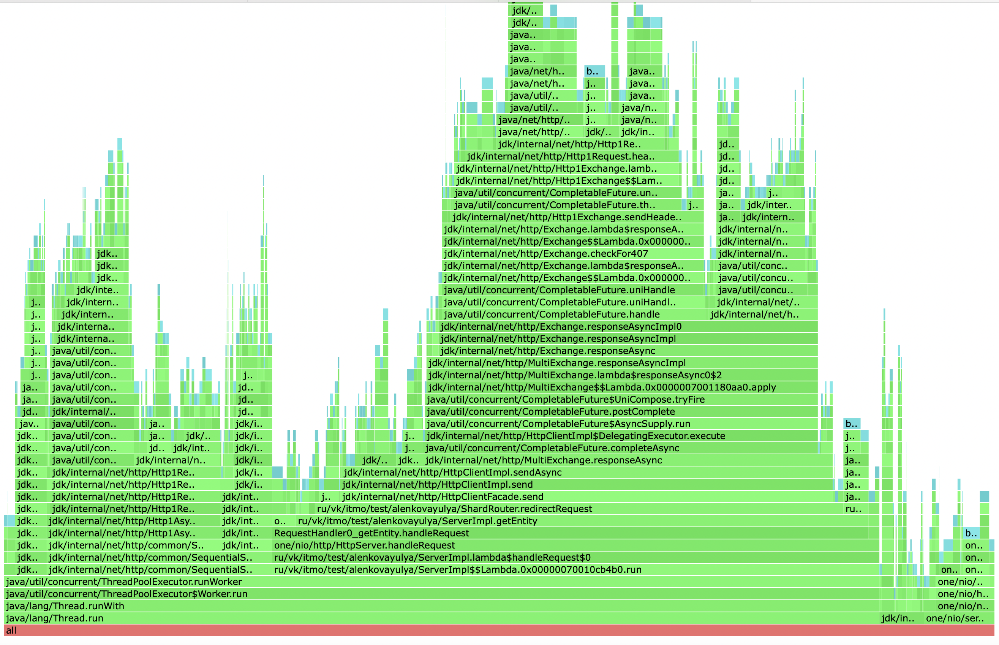
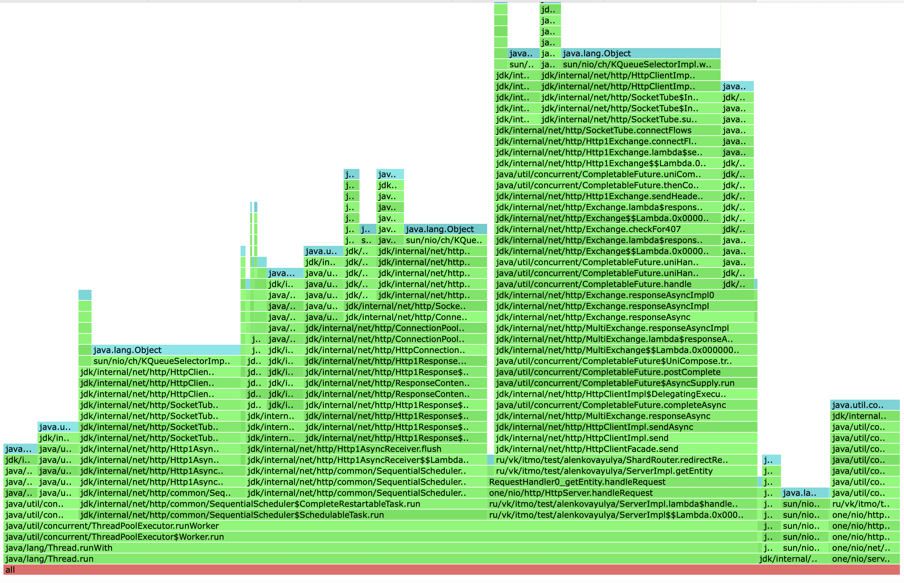

### Хеш-функция

В качестве хеш-функции для распределения по шардам была выбрана Murmur3, которая должна обесчечивать +- равномерное распределение. 

Попробуем проверить равномерность распределения. При помощи wrk2 нагрузим нашу базу PUT-запросами. Будем использовать 10 шард, чтобы лучше понять, как данные распределются между шардами. После нагрузки посмотрим на размер занимаемых SSTable для каждой шарды.

 ```
yulalenk@MacBook-Pro-Ulia tmp % du -sh *
556K    8080
552K    8085
556K    8090
556K    8095
552K    8100
544K    8105
544K    8110
556K    8115
544K    8120
560K    8125

 ```
Таким образом, можно сделать вывод, что распределение достаточно равномерное и выбранную функцию Murmur3 можно не заменять.

### Latency

Во всех дальнейших измерениях будем использовать кластер, состоящий из 3 шард. 

Попробуем найти точки разладки для put и get нагрузок при тех же размерах пула(32) и очереди(128) и тех же параметрах wrk (64 коннекшена), что и для 2 этапа, и сравним. 
Постепенно нагружая кластер, я определила следующие точки разладки: 

PUT - 40K RPS - 
MacBook-Pro-Ulia:wrk2-arm yulalenk$ ./wrk -c 64 -d 20 -t 1 -L -R 40000 -s /Users/yulalenk/sem2/2024-highload-dht/src/main/java/ru/vk/itmo/test/alenkovayulya/lua/put.lua http://localhost:8080
50.000%    1.84ms
75.000%    3.71ms
90.000%   12.99ms
99.000%   99.14ms
99.900%  152.70ms
99.990%  166.66ms
99.999%  172.16ms
100.000%  174.34ms

GET - 33K RPS - 
MacBook-Pro-Ulia:wrk2-arm yulalenk$ ./wrk -c 64 -d 30 -t 1 -L -R 33000 -s /Users/yulalenk/sem2/2024-highload-dht/src/main/java/ru/vk/itmo/test/alenkovayulya/lua/get.lua http://localhost:8080
50.000%    1.59ms
75.000%    2.38ms
90.000%    3.52ms
99.000%   36.90ms
99.900%   67.26ms
99.990%   83.58ms
99.999%  106.24ms
100.000%  112.25ms

В предыдущем этапе без шардирования точки разладки были такими:
GET -85K RPS
PUT - 100K RPS

Мы ожидаемо просели относительно предыдущего этапа, однако это объясняется необходимостью сервера проксировать запросы другим нодам по HTTP. 
Кроме того, если бы в кластере было еще больше шард, то мы бы просели еще сильнее, так как вероятность попасть сразу в нужную снижается. 

### Анализ профилирования

#### PUT, cpu



Относительно предыдущего этапа, можно заметить добавление работы HttpClientImpl$SelectorManager, ответсвенного за задачи клиента.
Кроме того, часть времени уходит на работу InternalWriteSubscriber и SequentialScheduler.SchedulableTask из пакета jdk.http.
Смотря на семлы, хочется ответить что 10.50% занимаем редирект на другую шарду, а лидирует по съеденному времени, как и в предыдущем этапе, ThreadPoolExecutor.getTask() - 34.95%


#### PUT, alloc



Здесь, ожидаемо, можно заметить много аллокаций, связанных с проксированием запросов другой шарде - 48.32% на send из HttpClientImpl


#### PUT, lock



новное время ожидания блокировок приходится на 
SequentialScheduler.run() - 43.04%
HttpClientImpl.send() - 31.33%
SelectorManager.run() - 13.55%


#### GET, cpu



Аналогично PUT-запросам, большую часть процессорного времени съели:

HttpClientImpl.send() - 10.11% 
SequentialScheduler.run() - 5.79%
SelectorManager.run() - 9.47%

И это нереально много, учитывая 1.22% на бизнес-логику Dao

#### GET, alloc



Как и с PUT - почти половина(49.74%) сэмплов на send из HttpClient.

#### GET, lock



Картина, аналогичная PUT: почти все время ожидания блокировок приходится на SequentialScheduler.run(), HttpClientImpl.send(), SelectorManager.run()

#### Итог

Согласно полученныи результатам профилирования, узкое место нашего приложение  - сетевое взаимодействие между шардами.
Кажется, что на его фоне работы по оптимизации dao не имеют практически никакого смысла.


