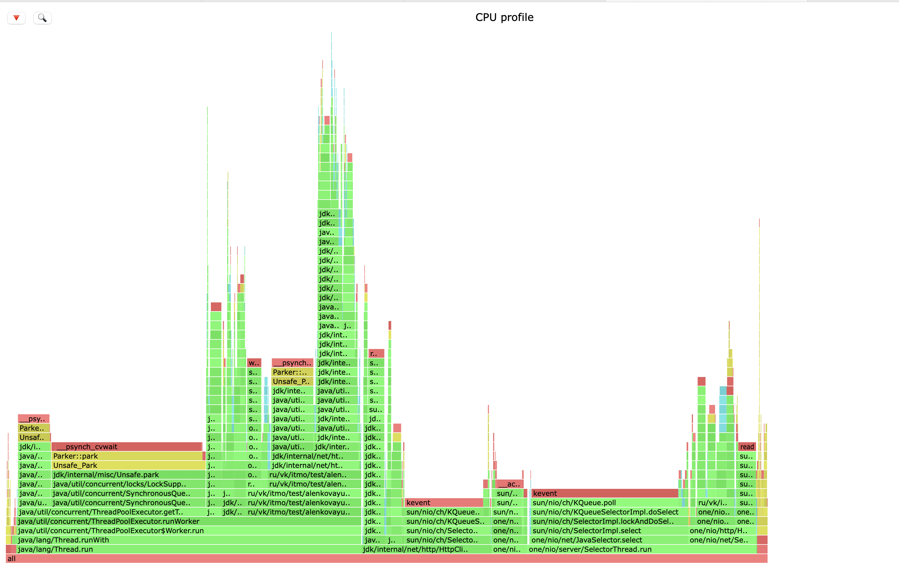
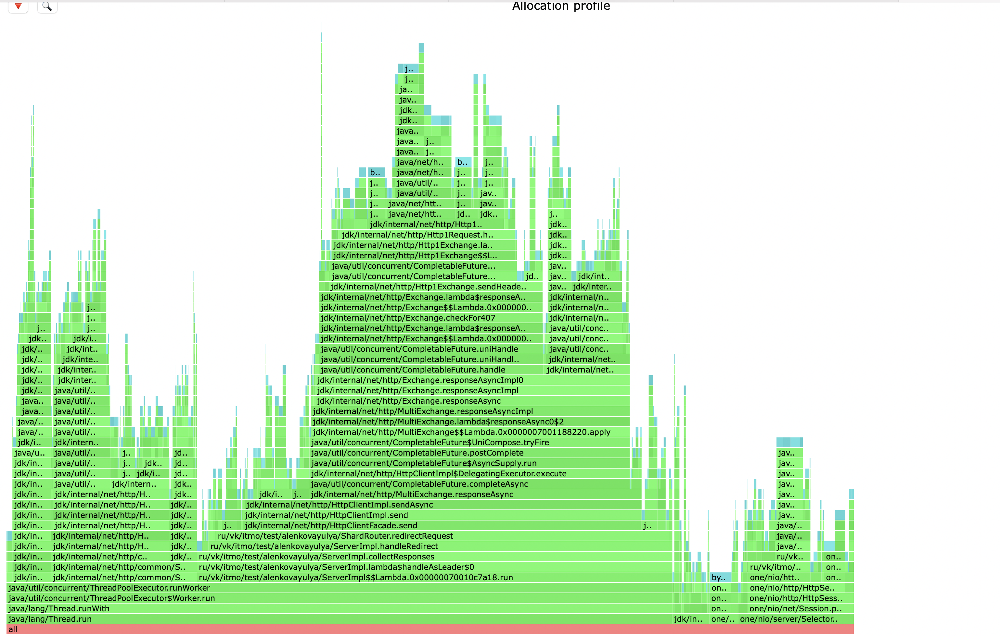
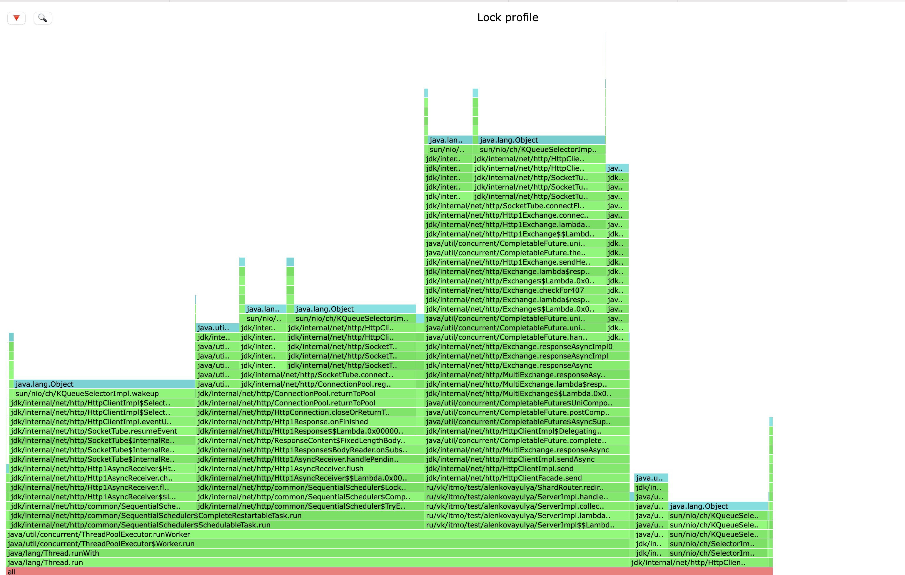
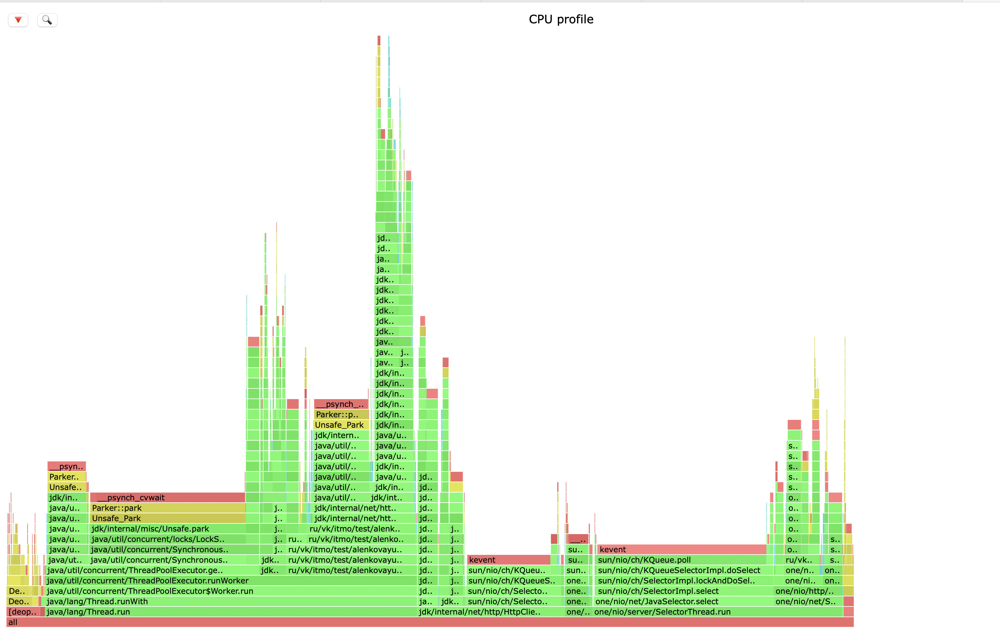
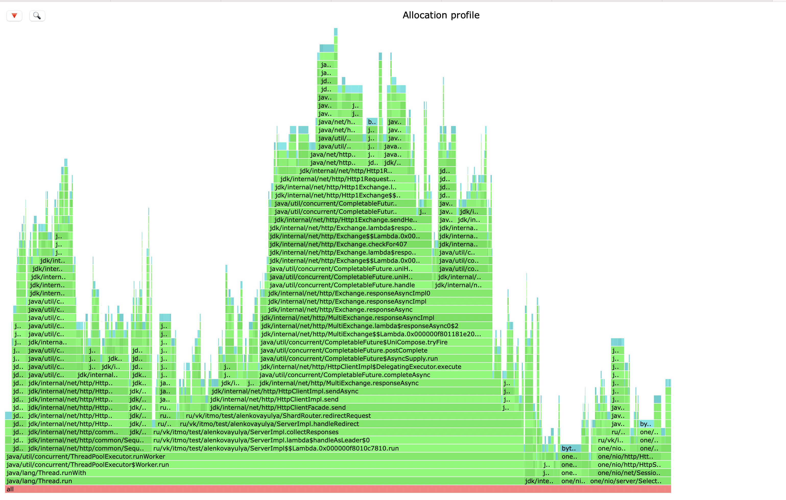
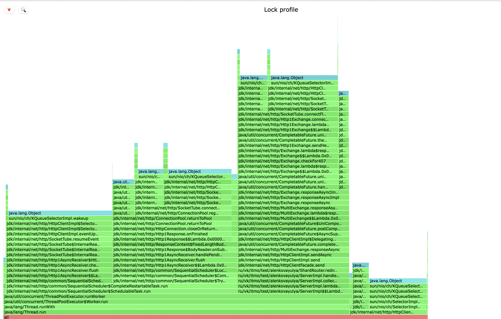

### Репликация

Основная идея данного этапа заключается в повышении отказоустойчивости за счет дублирования данных. 
Чтобы это реализовать, мы ввели новые параметры ack - кол-во необходимых ответов от нод и from - количество нод, на которые мы отправляем запрос. 
Результаты, полученные от нод, мы мержим. При возникновении конфликтов, решаем их, опираясь на timestamp, которую мы теперь тоже храним. 


### Latency

В дальнейших исследованиях будем использовать кластер из 3-ех нод с дефолтными значениями для ack/from равными 2/3 соответсвенно (так как по умолчанию: from - число нод в кластере, ack - кворум от числа нод в кластере)

Последоватльныи регулированием нагрузки была определена точка разладки для PUT-запросов:

```
MacBook-Pro-Ulia:wrk2-arm yulalenk$ ./wrk -c 64 -d 20 -t 1 -L -R 2300 -s /Users/yulalenk/sem2/2024-highload-dht/src/main/java/ru/vk/itmo/test/alenkovayulya/lua/put.lua http://localhost:8080
 50.000%    1.80ms
 75.000%    3.32ms
 90.000%   33.76ms
 99.000%   60.48ms
 99.900%   63.65ms
 99.990%   65.15ms
 99.999%   65.15ms
100.000%   65.15ms
```

Latency нереально сильно просела, теперь точка разладки для PUT запросов составляет всего 2300 rps.

Для GET запросов была найдена следующая точка разладки:

```
./wrk -c 64 -d 30 -t 1 -L -R 2000 -s /Users/yulalenk/sem2/2024-highload-dht/src/main/java/ru/vk/itmo/test/alenkovayulya/lua/get.lua http://localhost:8080
Running 30s test @ http://localhost:8080
  1 threads and 64 connections
  Thread calibration: mean lat.: 2.364ms, rate sampling interval: 10ms
  Thread Stats   Avg      Stdev     Max   +/- Stdev
    Latency     3.88ms    8.30ms  60.22ms   92.92%
    Req/Sec   242.83    724.12     6.70k    89.10%
  Latency Distribution (HdrHistogram - Recorded Latency)
 50.000%    1.61ms
 75.000%    2.31ms
 90.000%    4.50ms
 99.000%   45.50ms
 99.900%   55.20ms
 99.990%   60.26ms
 99.999%   60.26ms
100.000%   60.26ms
```

Из-за добавления реаликации производительность отностительно предыдущего этапа просела больше, чем в 10 раз.
При этом, чем больше в кластере будет нод, тем сильнее будет снижаться пропускная способность.


### Профилирование


#### PUT, cpu



В целом, сильных отличий от профиля без реплицирования нет.
В процентном соотношении практически ничего не поменялось.
Добавились новые методы, но они встречаются в совсем небольшом количестве семплов, например:

- checkReplicasResponsesNumber - 2.11%

Стоит отметить, что обработка запроса на шарде, которая хранит нужные данные, занимает всего лишь 0.83%(handleInternalRequest), в то время как redirect на другую шарду съедает 12.28%(handleRedirect)


#### PUT, alloc



Сравнивая данный профиль с версией без репликации, можно заметить следующее:
в SelectorThread процент аллокаций увеличился. Это произошло из-за нового метода
resolveTimestamp (4.19%) для того, чтобы из заголовка ответа достать timestamp и далее производить сравнения
ответов разных нод.
Незначительные аллокации для методов:
checkReplicasResponsesNumber - 0.19%
handleInternalRequest - 0.61% , 
handleRedirect - 54.38%


#### PUT, lock



Заметно, что в новой версии с репликаций заметно увеличилось число локов при обработке запроса.
Можно попробовать от них избавиться, сделав сетевое взаимодействие узлов сделать асинхронным.


#### GET, cpu



В данном профиле отмечу, что процент сэмплов на проксированию увеличился на 2%, что, как мне кажется, связано с заполнением заголовка и проставления таймстемпа.

Вновь появившиеся методы снова встречаются в совсем небольшом значении сэмлов. 

checkReplicasResponsesNumber - 2.39% 
getResponseWithMaxTimestamp - 0.94%


#### GET, alloc



С точки зрения аллокаций, все абсолютно аналогично PUT-запросам.
checkReplicasResponsesNumber - 2.96%
getResponseWithMaxTimestamp - 2.63%

Кроме того заметно, что увеличились аллокации в пуле воркеров, что связано с общением с другими нодами. 


#### GET, lock



По сравнения с предыдущей реализацией, появилось больше локов, связанных с общением нод.

### Итог 

## Выводы и возможные улучшения

С одной стороны, репликация позволяет нам быть готовым к отказам какой-либо ноды, так как благодаря дубликации мы не теряем доступ к данным, что хорошо.
С другой стороны, ради такой доступности мы очень сильно просядаем в производительности.

Есть вариант попробовать сделать сетевое взаимодействие асинхронным и непоследовательным, так как сейчас нам приходится
ждать, когда каждая из нод получит,обработает запрос и ответит, что занимаем немало времени, которое можно было бы использовать с пользой, а не блокироваться.
