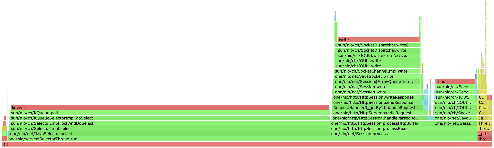
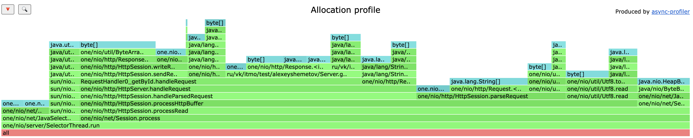

# Отчет 1 (Шеметов Алексей, ИТМО ФИТиП)

## PUT

### Поиск стабильной нагрузки

Данные для создания запросов буду генерировать с помощью [put.lua](./wrk/put.lua).

Каждый раз запуск происходил на пустой БД.

Поймем, какой параметр `-R` нужен, чтобы обеспечить стабильную нагрузку на сервер.

- R = 30000
    - `wrk2 -t1 -c1 -d1m -R30000 -s put.lua -L http://localhost:8080`
    - Avg Latency = `1.32ms`, Requests/sec: `9841.71`

- R = 35000
    - `wrk2 -t1 -c1 -d1m -R35000 -s put.lua -L http://localhost:8080`
    - Avg Latency = `598.65us`, Requests/sec: `12987.46`

- R = 37500
    - `wrk2 -t1 -c1 -d1m -R37500 -s put.lua -L http://localhost:8080`
    - Avg Latency = `1.26ms`, Requests/sec: `17291.63`

- R = 40000
    - `wrk2 -t1 -c1 -d1m -R40000 -s put.lua -L http://localhost:8080`
    - Avg Latency = `54.60ms`, Requests/sec: `18938.06`

__R = 37500__ что-то вроде порогового значения, так как после его увеличения, Avg Latency сильно возрастает и нагрузка перестает быть _стабильной_.

График зависимости Avg Latency от кол-ва запросов:

`87.5%` запросов при __R = 37500__ имеюют latency не превосходящий `1.396ms`, что обеспечивает стабильную нагрузку.

### CPU

#### Общий взгляд

Посмотрим на общую CPU-нагрузку при __R=37500__:

- `93%`: `SelectorThread`, который считывает данные и записыват их обратно
    - `48%`: Selector
    - `44%`: Session process - общее время работы нашей сессии
      - `24,5%`: putById - время работы put
      - `18%`: Session read - время чтения нашего результата
- `7%`: фоновые методы

Если смотреть на работу самого метода, то можно уже заметить, что основное время работы тратиться на сравнение сегментов и их запись на диск

### ALLOC

Посмотрим на выделении памяти при __R=37500__:

- `95%`: `SelectorThread`
    - `38%` уходит на перевод строки в байты при чтении входного запроса `HttpSession` - это особенность HTTP-запросов, и кажется это сложно улучшить, так как HTTP - текстовый протокол, поэтому парсинга не избежать. Однако в нашем случае можно было бы сократить кол-во парсинга, учитывая, что мы кладем именно байты в базу.
    - `12%` уходит каждый раз на создани объекта `Response` вызовом метода `created`. Можно заранее создать статические переменные, но тогда надо не забыть переписать `HttpSession`, в частности метод `sendResponse(response)`, который к каждому ответу дописывает лишние хедера вида `"Connection: Keep-Alive"` or `"Connection: close"`.
    - `16%` уходит на запись в `Dao`
    - 
## GET

Буду искать стабильную нагрузку при наполненной БД примерно `2Gb` с помощью скрипта [get.lua](./wrk/getu.lua).

### Поиск стабильной нагрузки

- R = 10000
    - `wrk2 -t1 -c1 -d1m -R10000 -s get.lua -L http://localhost:8080`
    - Avg Latency = `2.64s`, Requests/sec: `9171.36`
    - Сервер умирает, сокращаю объем

- R = 9000
    - `wrk2 -t1 -c1 -d1m -R9000 -s get.lua -L http://localhost:8080`
    - Avg Latency = `9.91ms`, Requests/sec: `4999.99`

- R = 7000
    - `wrk2 -t1 -c1 -d1m -R7000 -s get.lua -L http://localhost:8080`
    - Avg Latency = `6.70ms`, Requests/sec: `2999.91`

- R = 6000
    - `wrk2 -t1 -c1 -d1m -R6000 -s get.lua -L http://localhost:8080`
    - Avg Latency = `2.73ms`, Requests/sec: `1999.97`

- R = 5000
    - `wrk2 -t1 -c1 -d1m -R5000 -s get.lua -L http://localhost:8080`
    - Avg Latency = `1.19ms`, Requests/sec: `1499.98`

+- нормальная нагрузка получается при __R=5000__.

### CPU

#### Общая нагрузка

Посмотрим на общую CPU-нагрузку при __R=5000__:

нагрузка +- распределена так же как и в случае с `put`, за исключеним того, что теперь у нас увеличелось время чтения. Что ожидаемо!

### ALLOC

снова ситуация аналогичная `put`

## Выводы

Методы `PUT` и `GET` на графиках показали примерно одинаковое поведение, за исключением "эффективности работы". У `PUT` хороший Avg Latency 
достигается при больших кол-во запросах, по сравнению с `GET`. 
С памятью особо проблем не наблюдалось, раз только в создание одних и тех же Response, но в дальнейшем с распаралеливанием сервера, 
нагрузка станет больше и эти аллокации скорее всего не так сильно будут влиять на память, поэтому сейчас это скорее ок.
Да и в общем хочется сказать, что на данном этапе формально все проблемы врезаются в проблемы использования http, 
так как опять же на данном этапе мы не делает ничего сверхестественного