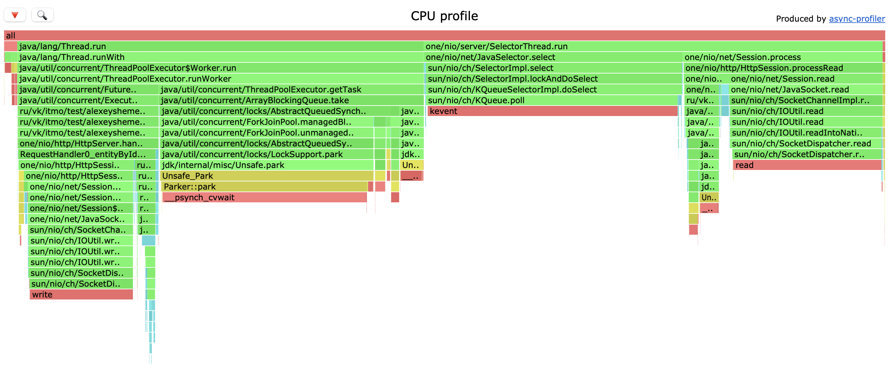
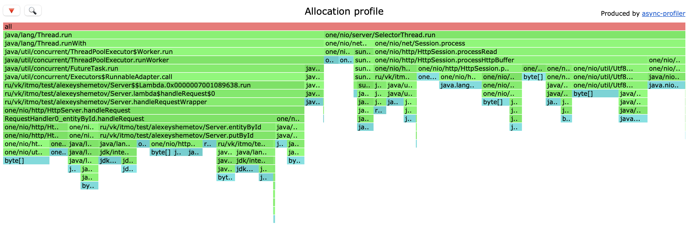
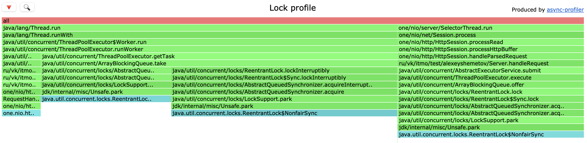
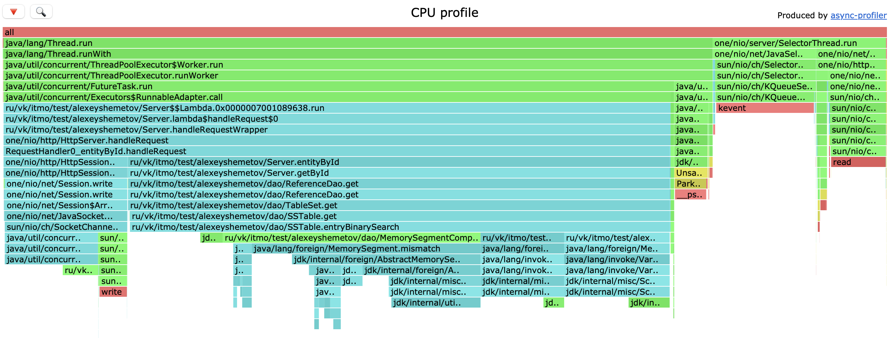
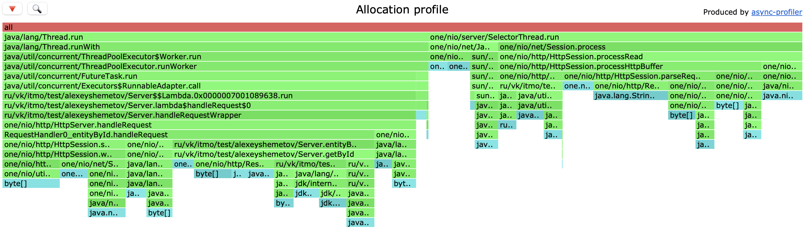
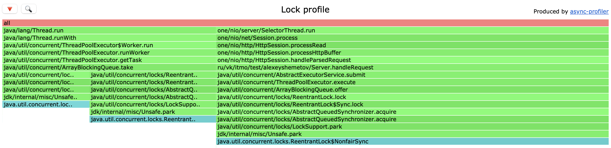

# Отчет 2 (Шеметов Алексей, ИТМО ФИТиП)

## PUT

Данные для создания запросов буду генерировать с помощью [put.lua](./wrk/put.lua).

Проанализируем сервер под следующей нагрузкой:

`wrk -t64 -128 -d1m -R40000 -s put.lua -L http://localhost:8080`

```
Thread Stats   Avg      Stdev     Max   +/- Stdev
Latency     1.07ms  629.59us  16.54ms   80.52%
Req/Sec     2.63k   183.30     5.33k    74.59%
1199297 requests in 30.00s, 76.63MB read
Requests/sec:  39976.01
Transfer/sec:      2.55MB
```

### CPU



- `46%`: `worker`, благодаря ему сняли нагрузку с `selector thread`
  - `23%`: `park`, синхронизация потоков между собой. Возник из-за использования общей очереди с заданиями
  - `12%`: записать ответа
  -  `5%`: время обработки запроса в `Server`
- `52%`: `selector thread`

Ожидаемо получили прирост производительности + улучшили latency. Следовательно, снятие нагрузки - правильный выбр + 
dao работает эффективнее из-за многопоточки

### ALLOC



- `53%`: `SelectorThread`, у которого почти вся память расходуется на парсинг запросов.
Возможно поможет уменьшения парсинга, например `id`.
- `44%`: `workers`
  - `14%`: запись ответа в socket
  - `26%`: обработка запроса в методе `PUT`

По памяти ничего необычного, вроде, все как и ожидалось

### LOCK



- `38%`: синхронизация наших воркеров
- остальная часть: чтение и запись в сокет

## GET

размер БД (`2.4Gb`). Данные получаю с помощью скрипта [get.lua](./wrk/get.lua).

Проанализируем сервер под нагрузкой: `wrk -t64 -c128 -d30 -R20000 -s getu.lua -L http://localhost:8080`

```
  Thread Stats   Avg      Stdev     Max   +/- Stdev
    Latency     1.15ms  490.32us  11.42ms   66.73%
    Req/Sec   330.44     86.81   666.00     59.06%
  599987 requests in 30.00s, 39.48MB read
  Non-2xx or 3xx responses: 599987
Requests/sec:  19998.76
Transfer/sec:      1.32MB
```

### CPU




- `80%`: workers
  - `14%`: запись ответа
  - `61%`: поиск данных в `dao`
    - `29%`: сравнение `MemorySegment`
    - `9%`: получение `entryOffSet`
    - `11%`: получение длины сегмента
    - `0.4%`: поиск в `mem table`
- `10%`: SelectorThread

Распределение нагрузки +- аналогична случаю в первой лабе (только теперь основная нагрузка на воркерах).
-R увеличилась в несколько раз, при этом latency остался хорошим.

### ALLOC



Память поровну распределилась между селектор-тредами и воркерами.
В целом, изменение памяти особо не наблюдается по сравнению с первой лабой

### LOCK



Поведение лока такое же, что и в `PUT` нагрузке, что, скорее всего, ожидаемо,
так как `PUT` и `GET` запросы обрабатывает один пул.

## Выводы

Благодаря созданию своих воркеров и снятия нагрузки с `selector tread` получилось 
стабилизировать нагрузку при большем кол-во запросах у `PUT` и `GET`.
Еще благодаря своему пулл потоков, в методах получили одинаковое выделение памяти
и схожую схему блокировок. Из улучшений недавно заметил, что one-nio поддерживает pipelining,
что наверняка поспособствует улучшению производительности сервера