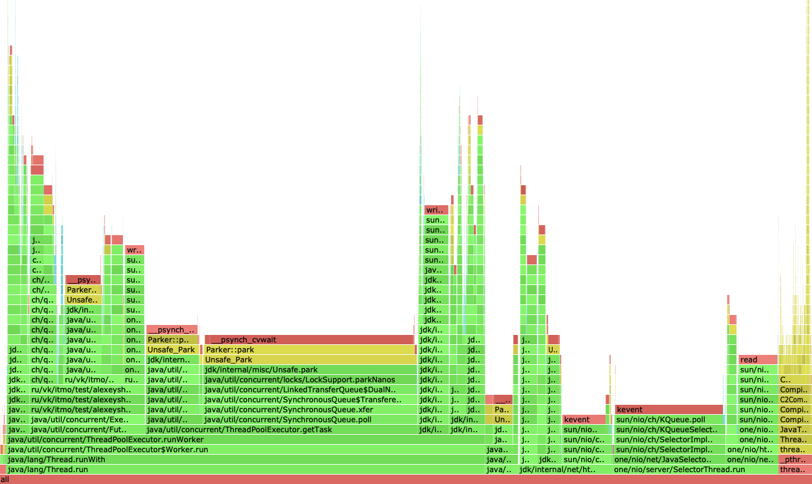
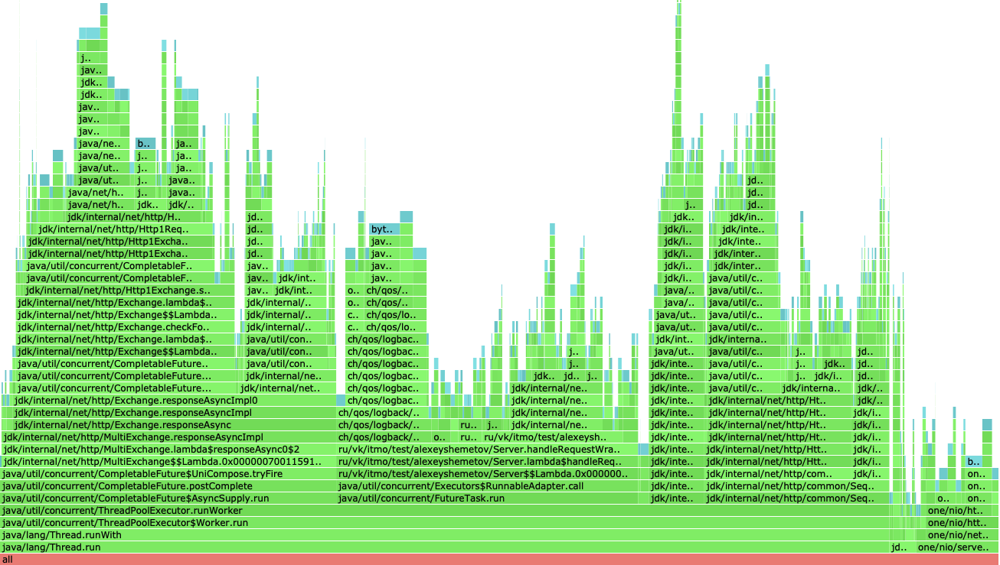
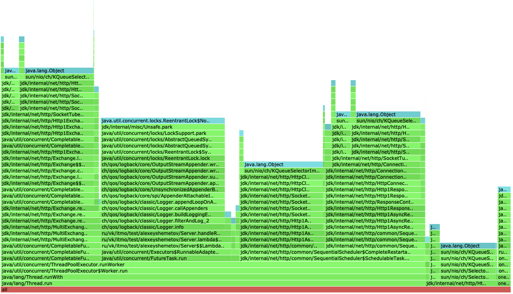
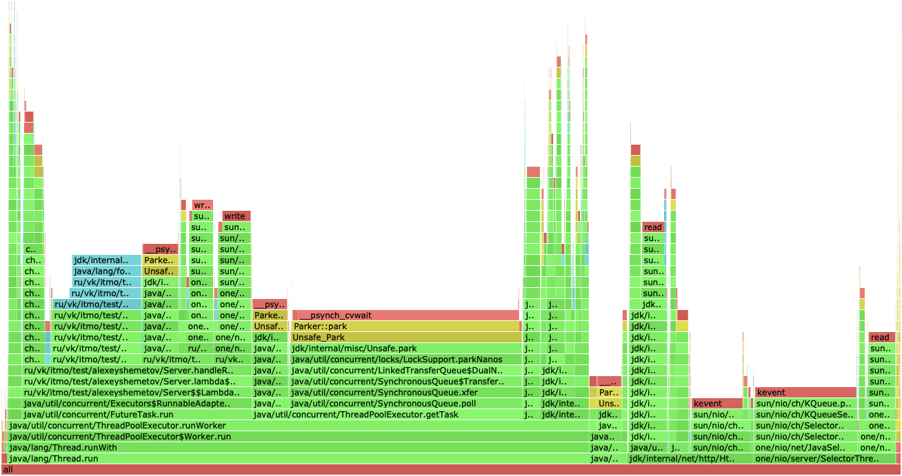
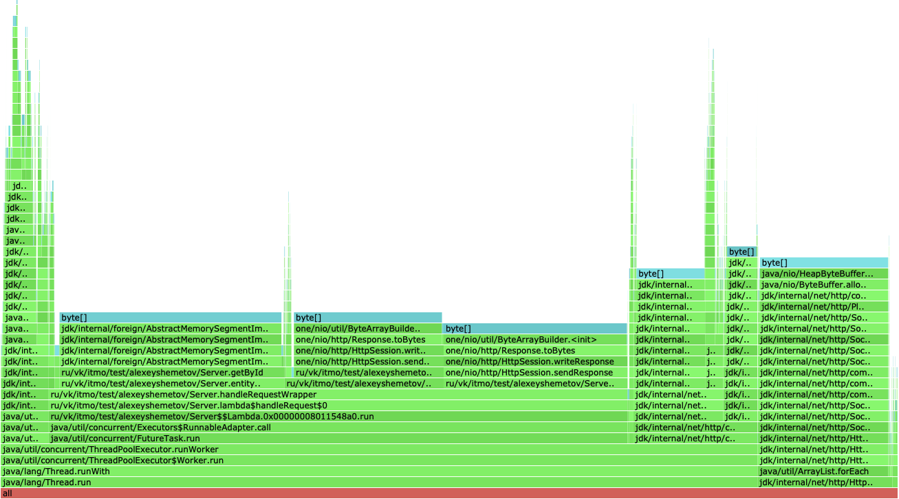
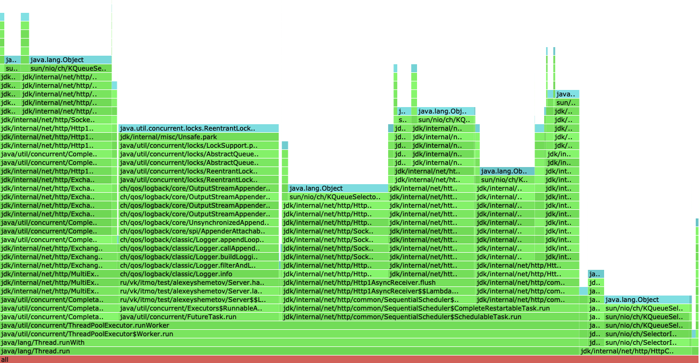

# Отчет 3 (Шеметов Алексей, ИТМО ФИТиП)

# Stage 3

Хочу начать с того, что в начале использования метода [PUT](./wrk/put.lua) 
командой `wrk -d 30 -t 8 -c 64 -s $stage'/wrk/'$method'.lua' -L $localhost -R 15000`, 
вылетала база не справлялась с записью данных (именно dao). Проблема решилась путем уменьшения размера кеша

Чтобы объективно оценить изменения нового этапа с новым объёмом БД (~ 300 МБ), перемерю stage-2 и выявлю новую нагрузку, с которой сервер в состоянии справиться.

## Шардирование

### PUT

```
Thread Stats    Avg      Stdev    Max       +/- Stdev
Latency         8.61ms   16.94ms  99.52ms   88.21%
Req/Sec         1.88k    18.10    1.94k     78.85%
449737 requests in 30.00s, 28.74MB read
Requests/sec: 14991.18
Transfer/sec: 0.96MB
```

#### CPU



Производительно метода упала где-то в 2,5 раза. Скорее всего причиной этому является то,
что теперь еще мы распределяем наши запросы между кластерами

#### ALLOC



С аллокациями особо ничего не поменялось, разве что теперь основная часть приходит
на `handleRequestProxy`, который отвечает сбор результата

#### LOCK



Теперь мы дополнильно берем блокировку, когда ходим по сети

### GET

```
Thread Stats   Avg       Stdev     Max        +/- Stdev
Latency        39.47ms   43.21ms   165.89ms   77.83%
Req/Sec        1.88k     150.50    2.16k      72.03%
448445 requests in 30.00s, 18.57GB read
Non-2xx or 3xx responses: 376
Requests/sec:  14948.13
Transfer/sec:  633.97MB
```

#### CPU



#### ALLOC



#### LOCK



с методом `GET` ситауция выглядит такой же как и в stage 2, кроме блокировок (причина та же, что и в `PUT`)

### Вывод

Из-за того, что теперь приходится ходить по сети, мы вынуждены брать на это дополнительные блокировки,
в следстивие чего получаем спад производительности