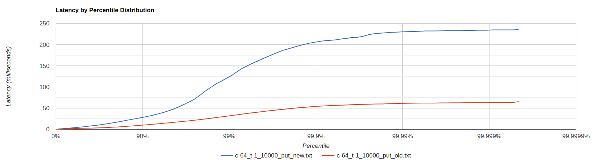

## Параметры системы:
* Treshhold bytes = 128 кБайт
* Количество core потоков = 6
* Максимальное количество потоков = 60
* Размер очереди = 100
* Max heap size = 128m

## Проведем сравнение реализаций на стабильной нагрузке

### Сравним работу при -c 1 -t 1 -d 30
* Get (рандомный выбор id)
	*  -R 2550  Видно, что новая реализация значительно уступает. 

* Put
	* -R 2500  Исходя из графика, видно, что результат практически идентичен.

### Сравним работу при -c 64 -t 1 -d 30 -R 2500
* Get (рандомный выбор id)
	* -R 2550 

* Put
	* -R 2500 

### Постепенно увеличим rps при -c 64 -t 1 -d 30
* Get (рандомный выбор id)
	* -R 10000 
	* -R 20000 
	* -R 25000 
	* -R 30000 
В новой реализации точка разладки при таких параметрах ниже чем в старой реализации.

* Put
	* -R 10000 
	* -R 15000 

Видим, что старая реализация практически не уступает новой, а зачастую даже превосходит.

### Попробуем изменить количество потоков

* Get (рандомный выбор id)
	* Параметры wrk2: -c 64 -t 1 -d 40 -R 21000 
	* Результат: 

Проанализировав работу системы, стало очевидно, что такое неудовлетворительное поведение наблюдаемое раньше действительно связано со слишком большим максимальным размером количества потоков. Исходя из полученного графика видно, что наиболее оптимальное максимальное количество потоков соответствует количеству core потоков. Это поведение можно объяснить тем фактом, что при увеличении количества потоков присутствуют накладные расходы на их обсуживаение (конкуренция за ресурсы процессора). Справеливо заметить, что бывают ситуации, при которых это может быть оправдано. В нашем случае - нет. 

## Далее используем следующие параметры системы:
* Treshhold bytes = 128 кБайт
* Количество core потоков = 6
* Максимальное количество потоков = 6
* Размер очереди = ?
* Max heap size = 128m

## Увеличим количество соединений и количество запросов в секунду для тестирования наиболее оптимального размера очереди.

* Get (рандомный выбор id) 
	* Параметры wrk2: -c 250 -t 1 -d 40 -R 50000 
	* Протестируем изменение размера очереди:
	
	

* Put
	* Параметры wrk2: -c 150 -t 1 -d 60 -R 

## Исследуем зависимость производительности от количества соединений при одном и том же количестве rps.

## Исследуем зависимость производительности от количества потоков, работающих в wrk2.

## Проведем профилирование GET запросов.
### ALLOC
### CPU
### LOCK

## Проведем профилирование PUT запросов.
### ALLOC
### CPU
### LOCK

#  Мысли 
Видно, что в данной конфигурации оптимальный размер очереди примерно составляет 300 элементов. Чем меньше размер очереди, тем меньшее количество задач нужно для того, чтобы ее заполнить, что будет являться сигналом к увеличению числа потоков для пула воркеров. В свою очередь, чем больше очередь, тем медленнее будут создаваться новые воркеры. Полученный результат можно объяснить тем, что очередь с максимальным размером 300 определяет оптимальное состояние системы, при котором существует баланс между нагрузкой и количеством воркеров, которое также тоже должно быть оптимальным, поскольку увеличение их количества несет за собой увеличение накладных расходов на их обслуживание.

Очевиден факт, что при увеличении количества соединений, появляется возможность увеличивать суммарное количество запросов в секунду.

Чем больше соединений, тем больше клиентских сокетов и сессий, к которым они привязаны. А значит, распределив запросы по сокетам мы получаем, что на каждый сокет приходит меньше запросов в секунду. В старой реализации вся пропускная способность упиралась в последовательную обработку запросов SelectorThread'ами. Сейчас же нагрузка распределятся на пул воркеров. Однако текущие параметры системы дают неудовлетворительный результат. Постараемся еще увеличить нагрузку, изменяя значение параметров.