## Параметры системы:
* Treshhold bytes = 128 кБайт
* Количество core потоков = 6
* Максимальное количество потоков = 60
* Размер очереди = 100
* Max heap size = 128m

## Проведем сравнение реализаций на стабильной нагрузке

### Сравним работу при -c 1 -t 1 -d 30
* Get (рандомный выбор id)
    *  -R 2550 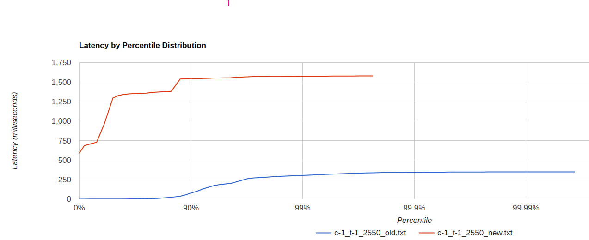 Видно, что новая реализация значительно уступает.

* Put
    * -R 2500 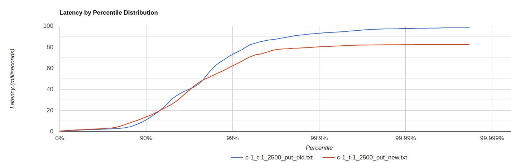 Исходя из графика, видно, что результат практически идентичен.

### Сравним работу при -c 64 -t 1 -d 30 -R 2500
* Get (рандомный выбор id)
    * -R 2550 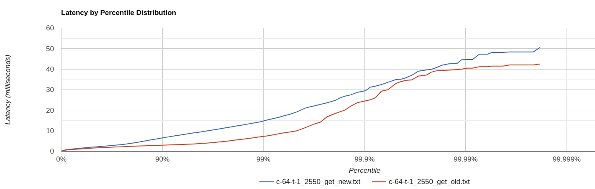

* Put
    * -R 2500 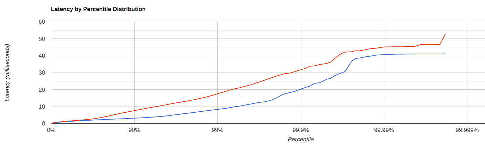

### Постепенно увеличим rps при -c 64 -t 1 -d 30
* Get (рандомный выбор id)
    * -R 10000 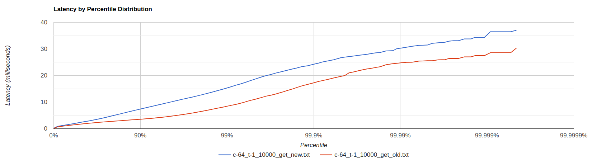
    * -R 20000 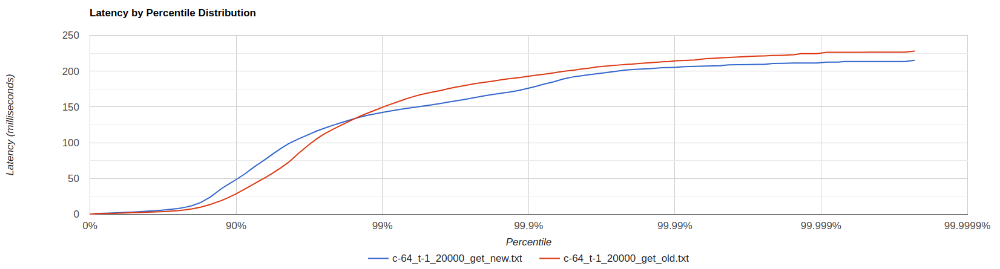
    * -R 25000 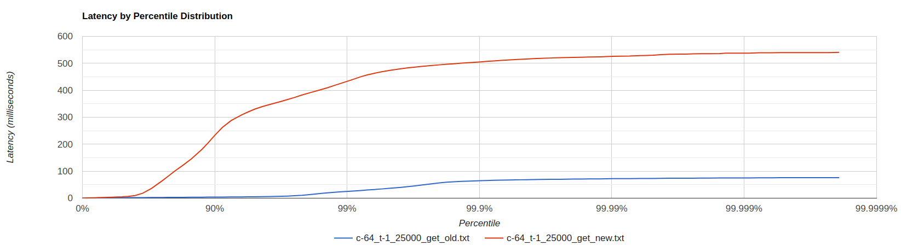
    * -R 30000 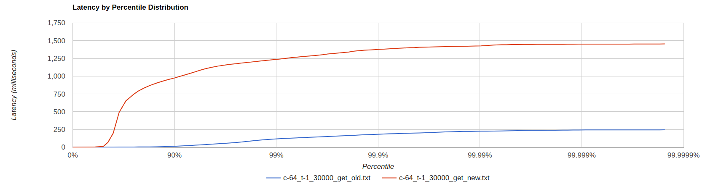
      В новой реализации точка разладки при таких параметрах ниже чем в старой реализации.

* Put
    * -R 10000 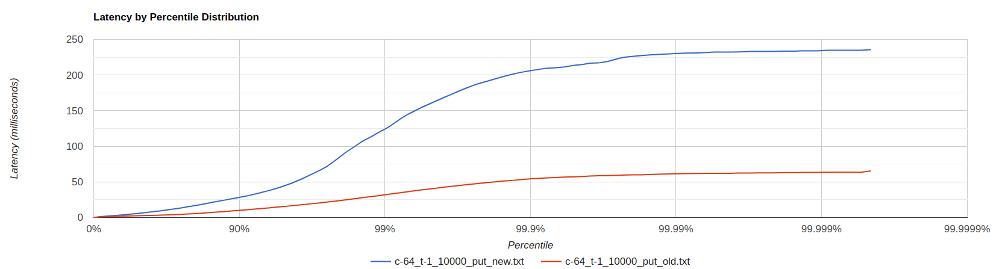
    * -R 15000 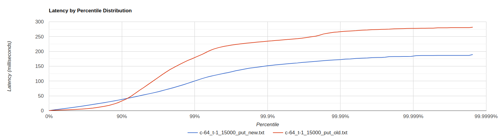

Видим, что старая реализация практически не уступает новой, а зачастую даже превосходит.

### Попробуем изменить количество потоков

* Get (рандомный выбор id)
    * Параметры wrk2: -c 64 -t 1 -d 40 -R 21000
    * Результат: 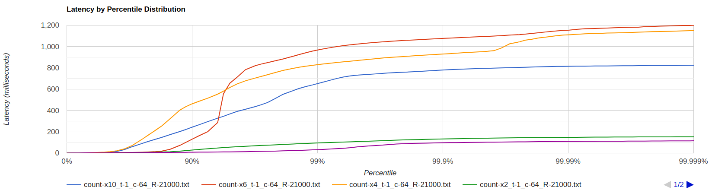

Проанализировав работу системы, стало очевидно, что такое неудовлетворительное поведение наблюдаемое раньше действительно связано со слишком большим максимальным размером количества потоков. Исходя из полученного графика видно, что наиболее оптимальное максимальное количество потоков соответствует количеству core потоков. Это поведение можно объяснить тем фактом, что при увеличении количества потоков присутствуют накладные расходы на их обсуживаение (конкуренция за ресурсы процессора). Справеливо заметить, что бывают ситуации, при которых это может быть оправдано. В нашем случае - нет. 

## Далее будем использовать следующие параметры системы:
* Treshhold bytes = 128 кБайт
* Количество core потоков = 6
* Максимальное количество потоков = 6
* Размер очереди = ?
* Max heap size = 128m

## Определим наиболее оптимальный размер очереди.

* Get (рандомный выбор id) 
	* Параметры wrk2: -c 250 -t 1 -d 40 -R 50000 
	* Результат:
	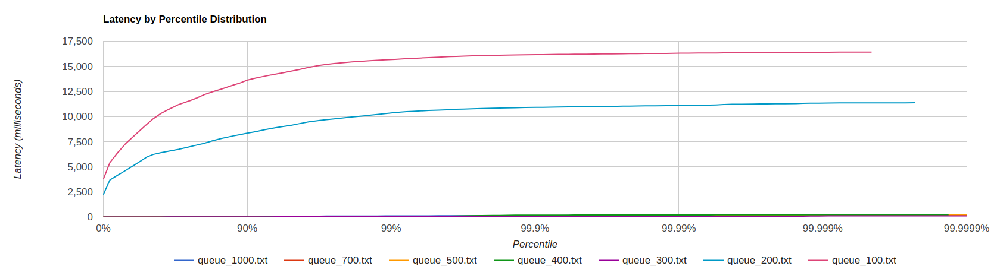
	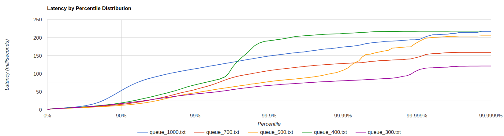
	* При размере очереди в 100 и 200 элементов происходило ее переполнение. Наиболее подходящий размер равен 300м элементам.

* Put
	* Параметры wrk2: -c 150 -t 1 -d 40 -R 20000
	* Результат: 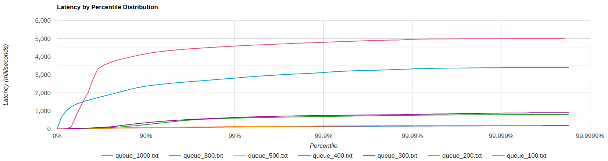
	* При размере очереди в 100 и 200 элементов происходило ее переполнение. Исходя из графика видно, что оптимальный размер примерно 700 элементов, при дальнейшем увеличении прироста производительности не происходило. 

## Исследуем зависимость производительности от количества соединений при одном и том же количестве rps.

* PUT
    * Параметры wrk2: -c ? -t 1 -d 30 -R 20000
    * Результат: 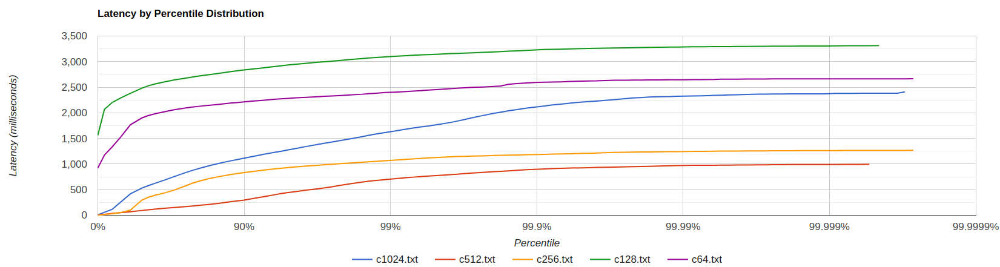
    * В данном случае наиболее подходящее количество равно 512. При меньшем количестве соединения (при одинаковом rps) очевидно, что каждый селектор тред должен быть способен обработать больше запросов через меньшее количество сокетов. Такой результат можно связать с тем, что обрабатывать такое же количество запросов, но через большее количество сокетов эффективнее. 

## Исследуем зависимость производительности от количества потоков, работающих в wrk2.

* PUT
    * Параметры wrk2: -c 512 -t ? -d 30 -R 17000
    * Результат: 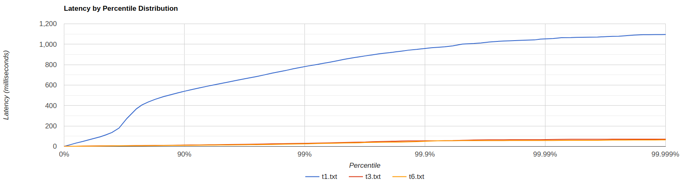
    * Использование большего количества потоков для отправки запросов серверу позволило получить лучшие результаты. В моем случае при использовании 3х и 6и потоков разницы не заметно.

## Проведем профилирование GET запросов.

* Параметры wrk2: -c 250 -t 1 -d 270 -R 50000

### ALLOC
* 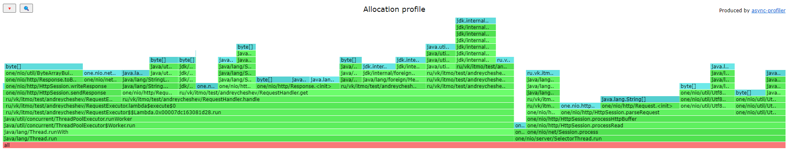
    * Работа на прием запросов и их обработка действительно разделена.
    * Аллокации при разборе запроса такие же как и в прошлой лабораторной. 
### CPU
* Все потоки в одном профиле: 
* По потокам: 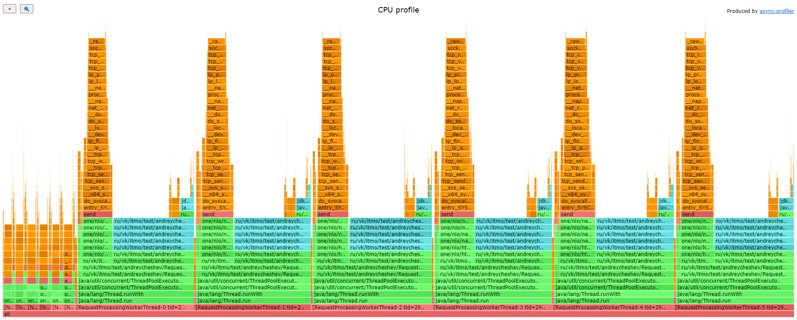
    * Относительно времени работы executor'а:
        * 10% времени executor тратит на то чтобы достать запрос из очереди.
        * 20% процентов суммарно потоки тратят на отправку ответа (запись в сокет).
        * Остальное время в основном задействовано на бинарный поиск для чтения значения из хранилища.
    * Получение запроса и отдача его executor'у занимает примерно 5% процессорного времени. Время на предоставление задачи в очередь (метод offer()) практически не заметно.  
### LOCK
* Все потоки в одном профиле: 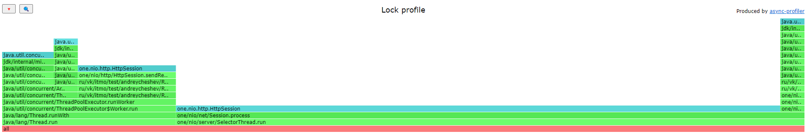
* По потокам: 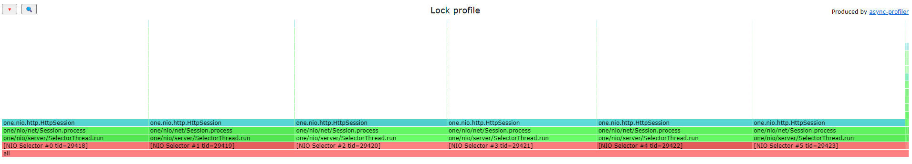
    * 50% времени воркерами тратится на ожидание получения здачи.
    * Остальные блокировки происходят при отправке запроса, его записи в сокет.

## Проведем профилирование PUT запросов.

* Параметры wrk2: -c 150 -t 1 -d 270 -R 20000

### ALLOC
* 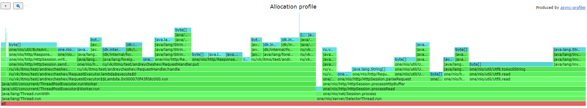
    * Количество аллокаций в потоках executor`а и селектор тредах примерно одинаково.
    * 20% аллокаций при обработке запроса воркерами тратится при записи ответа в сокет, остальные 80% при парсинге запроса, чтения из хранилища и формировании ответа.
### CPU
* Все потоки в одном профиле: 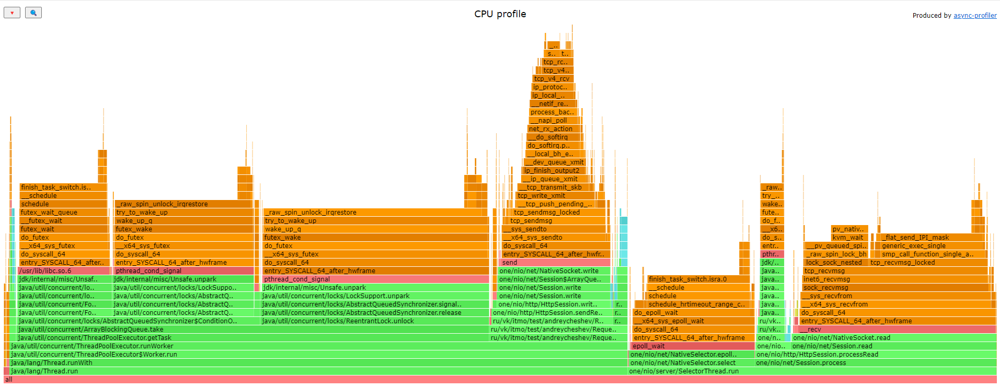
* По потокам: 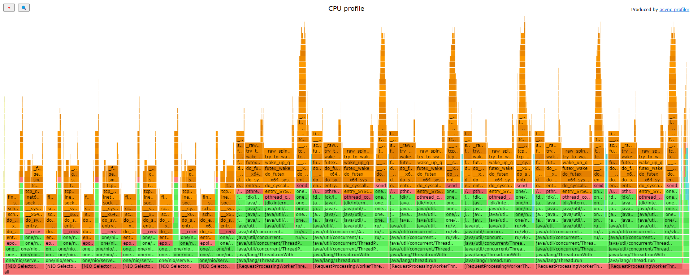
    * Потоки в executor'e тратят 80% процессорного времени на получене задачи из очереди.
    * 15% тратится на отправку ими в сокет.
    * Остальное время тратится на запись в хранилище (in memory).   
### LOCK
* Все потоки в одном профиле: 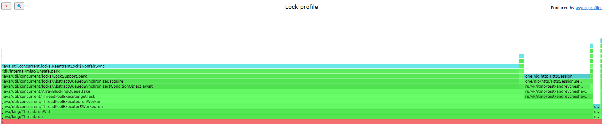
* По потокам: 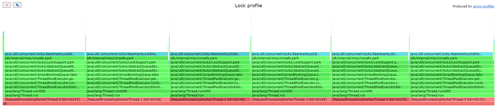
    * 99% процентов всех блокировок используется потоками executor'a. Из которых 90% - ожидание получения задачи из очереди, остальное - отправка результата в сокет.
    * Селектор треды же практически не блокируются, за исключением крайне редких блокировок для предоставления задачи.
