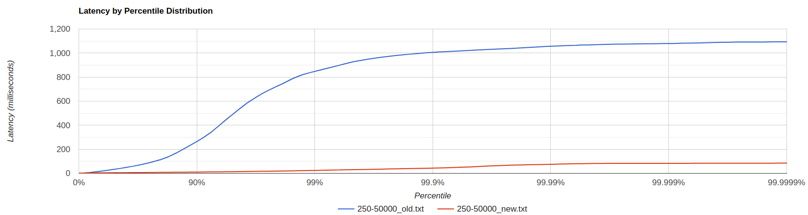
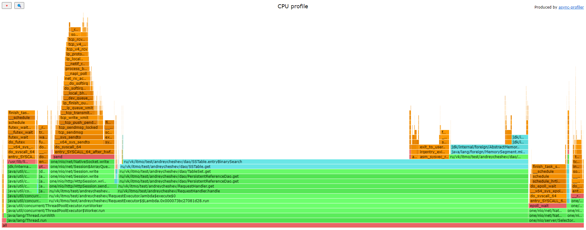

## Изначальные параметры системы:
* Treshhold bytes = 128 кБайт
* Количество core потоков = 6 (процессор 8-ми ядерный, для виртуальной машины, на которой тестируем выделены 6)
* Максимальное количество потоков = 60
* Размер очереди = 100
* Max heap size = 128m

## Проведем сравнение реализаций на стабильной нагрузке
### Точка разладки предыдущего этапа:
* PUT: -t 1 -c 1 -R 3230 (будем тестировать на 0.7 точки разладки)
* GET: -t 1 -c 1 -R 3000 (будем тестировать на 0.85 точки разладки)

### Сравним работу при -c 1 -t 1 -d 30 для сравнения с предыдущим этапом
* Get (рандомный выбор id)
    * -R 2550  Видно, что новая реализация значительно уступает. При 2550 запросов в минуту в новой реализация задержка больше начиная с 0-го персентиля примено в 5000 раз, для 90го - в 20 раз.

* Put
    * -R 2500  Исходя из графика, видно, что результат практически идентичен, а именно до 97 персентиля. Однако, после 97-го персентиля задерка в новой реализации на 10-25% ниже.   

Попробуем протестировать работу системы при большем количестве содинений, оставив такой же rps.

### Сравним работу при -c 64 -t 1 -d 30 -R 2500
* Get (рандомный выбор id)
    * -R 2550 

* Put
    * -R 2500 

Очевидно, что запросы распределились по соединениям (приходилось по 39 GET и PUT запросов в минуту на соединение).
* Задержка ответа в новой реализации для GET запроса для 90-го персентиля больше в 2 раза. При распределении запросов сократили задержку в 10 раз.  
* PUT запрос : при расределении запросов уже на 50-м персентиле появляется разница, на 97-м задержки при новой реализации (красная легенда) уже больше в 2 раза. 

Задержка при 90-м персентиле при новой реализации при распределении запросов по сравнению с тестированием в одно соединение:
* GET: сократилась в 234 раза.
* PUT: сократилась в 1.8 раза. 

Убедились, что, увеличивая количество соединений, происходит распределение запросов и новая реализация начинает работать значительно лучше.

В целях любопытства, не меняя параметры системы, увеличим rps и сравним ее работу при 64-х соединениях.

### Постепенно увеличим rps при -c 64 -t 1 -d 30
* Get (рандомный выбор id)
    * -R 10000 
    * -R 20000 
    * -R 25000 
    * -R 30000 
    На 80-м пересентиле время задержки при rps=25000 увеличивается в 30 раз при новой реализации по сравнению со старой, а при rps=30000 увеличивается уже в 200 раз. Это свидетельствует о том, что для новой реализации при текущих параметрах 30000 rps является точной разладки. Старая же релизация нагрузку держит.

* Put
    * -R 10000 
    * -R 15000 
    При rps=10000 задердка при 99-м персентиле в 4 раза выше в новой реализации, а при rps=15000 также выше, но примерно в 2 раза.

Видим, что старая реализация практически не уступает новой и при GET и при PUT запросах, а зачастую даже превосходит. 
Возникает предположение, что подобраны неоптимальные параметры системы. Рассмотрим изменение количества потоков, а для PUT запросов поэкспериментируем с порогом флаша.

### Изменим количество потоков

* GET (рандомный выбор id)
    * Параметры wrk2: -c 64 -t 1 -d 40 -R 21000
    * Результат: 

* PUT
    * Параметры wrk2: -c 64 -t 1 -d 40 -R 15000
    * Результат: 

Исходя из полученного графика видно, что наиболее оптимальное максимальное количество потоков соответствует количеству core потоков (фиолетовая легента (x1 - 6 потоков)). Это поведение можно объяснить тем фактом, что при увеличении количества потоков присутствуют накладные расходы на их обсуживаение (конкуренция за ресурсы процессора).

### Изменим порог флаша для PUT запросов

* PUT
    * Параметры wrk2: -c 64 -t 1 -d 40 -R 15000
    * Результат: 
Увеличение порога флаша позволило получить лучший результат: при 99.9-м персентиле задержка относительно других экпериментов меньше на 25%.

## Провередем исследование других параметров
### Определим наиболее оптимальный размер очереди.
    Treshhold bytes = 128 кБайт
    Количество core потоков = 6
    Максимальное количество потоков = 6
    Размер очереди = ?
    Max heap size = 128m

* Get (рандомный выбор id) 
	* Параметры wrk2: -c 250 -t 1 -d 40 -R 50000 
	* Результат:
	
	
	* При размере очереди в 100 и 200 элементов происходило ее переполнение. Наиболее подходящий размер - 300 элементов.

* Put
	* Параметры wrk2: -c 150 -t 1 -d 40 -R 20000
	* Результат: 
    
    
	* При размере очереди в 100 и 200 элементов происходило ее переполнение. Исходя из графика видно, что оптимальный размер примерно 700 элементов, при дальнейшем увеличении прироста производительности не происходило. 

### Исследуем зависимость производительности от количества соединений при одном и том же количестве rps.
    Treshhold bytes = 128 кБайт
    Количество core потоков = 6
    Максимальное количество потоков = 6
    Размер очереди: 700
    Max heap size = 128m

* PUT
    * Параметры wrk2: -c ? -t 1 -d 30 -R 20000
    * Результат: 
    * В данном случае наиболее подходящее количество равно 512.

### Исследуем зависимость производительности от количества потоков, работающих в wrk2.
    Treshhold bytes = 128 кБайт
    Количество core потоков = 6
    Максимальное количество потоков = 6
    Размер очереди: 700
    Max heap size = 128m

* PUT
    * Параметры wrk2: -c 512 -t ? -d 30 -R 17000
    * Результат: 
    * Использование большего количества потоков для отправки запросов серверу позволило получить лучшие результаты. В моем случае при использовании 3х и 6и потоков разницы не заметно.

## Сравним еще раз с предыдущей реализацией
    Treshhold bytes = 1mb
    Количество core потоков = 6
    Максимальное количество потоков = 6
    Размер очереди = GET - 300, PUT - 700
    Max heap size = 128mb

* GET
    * Параметры wrk2: -c 64 -t 1 -d 60 -R 25000
    
    По сравнению с предыдущем тестированием при новой реализации задержка при 90-м персентиле сократились в 50 раз, а при 99-м персентиле сократились в 18 раз. Относительно старой реализации задержка при 90-м персентиле задержка ниже в 2 раза, а при 99-м персентиле ниже в 0.17 раз. 
    * Параметры wrk2: -c 250 -t 1 -d 60 -R 50000
    
    Относительно старой реализации задержка при 90-м персентиле задержка ниже в 26 раз, а при 99-м персентиле ниже в 35 раз. 

* PUT
    * Параметры wrk2: -c 64 -t 1 -d 60 -R 15000
    
    По сравнению с предыдущем тестированием при новой реализации задержка при 90-м персентиле увеличилась на 40%, а при 99-м персентиле сократилась на 28%. Относительно старой реализации задержка при 90-м персентиле выше в 2 раза, а при 99-м персентиле ниже на 25%. 
    * Параметры wrk2: -c 512 -t 1 -d 60 -R 20000
    
    Относительно старой реализации задержка при 90-м персентиле ниже на 91%, а при 99-м персентиле ниже на 84%. 

Проанализировав работу системы, можно сказать, что такое неудовлетворительное поведение наблюдаемое раньше в основном связано:
* для get запросов с:
    * максимальным количествоим потоков воркеров
    * максимальным размером очереди. 
* для put запросов с:
    * максимальным количествоим потоков воркеров
    * максимальным размером очереди
    * уровнем порога флаша. 

По полученным результатам видно, что новая реализация действительно намного производительнее старой при использовании большого количества соединений.

## Проведем профилирование GET запросов.

* Параметры wrk2: -c 250 -t 1 -d 270 -R 50000

### ALLOC
* 
    * Работа на прием запросов и их обработка действительно разделена.
    * Аллокации при разборе запроса такие же как и в прошлой лабораторной. 
### CPU
* Все потоки в одном профиле: 
* По потокам: 
    * Относительно времени работы executor'а:
        * 10% времени executor тратит на то чтобы достать запрос из очереди.
        * 20% процентов суммарно потоки тратят на отправку ответа (запись в сокет).
        * Остальное время в основном задействовано на бинарный поиск для чтения значения из хранилища.
    * Получение запроса и отдача его executor'у занимает примерно 5% процессорного времени. Время на предоставление задачи в очередь (метод offer()) практически не заметно.  
### LOCK
* Все потоки в одном профиле: 
* По потокам: 
    * 50% времени воркерами тратится на ожидание получения здачи.
    * Остальные блокировки происходят при отправке запроса, его записи в сокет.

## Проведем профилирование PUT запросов.

* Параметры wrk2: -c 150 -t 1 -d 270 -R 20000

### ALLOC
* 
    * Количество аллокаций в потоках executor`а и селектор тредах примерно одинаково.
    * 20% аллокаций при обработке запроса воркерами тратится при записи ответа в сокет, остальные 80% при парсинге запроса, чтения из хранилища и формировании ответа.
### CPU
* Все потоки в одном профиле: 
* По потокам: 
    * Потоки в executor'e тратят 80% процессорного времени на получене задачи из очереди.
    * 15% тратится на отправку ими в сокет.
    * Остальное время тратится на запись в хранилище (in memory).   
### LOCK
* Все потоки в одном профиле: 
* По потокам: 
    * 99% процентов всех блокировок используется потоками executor'a. Из которых 90% - ожидание получения задачи из очереди, остальное - отправка результата в сокет.
    * Селектор треды же практически не блокируются, за исключением крайне редких блокировок для предоставления задачи.
