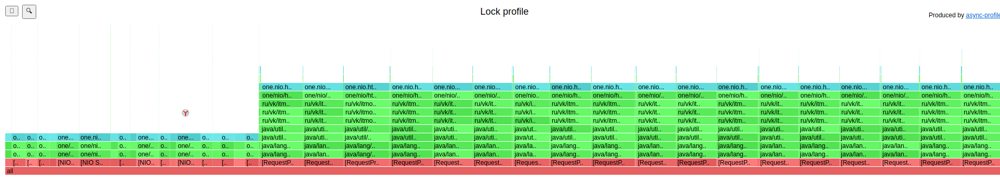

## Параметры системы:
* Treshhold bytes = 1 mb
* Количество core потоков = 6
* Максимальное количество потоков = 6
* Размер очереди = GET - 300, PUT - 700
* Max heap size = 128 mb

## Исследуем заполнение БД
* По мере заполнения БД было проведено отслеживание объема хранилища каждой ноды: 
* На приведенном рисунке видно, что БД действительно заполняется равномерно.

## Проведем сравнение производительности реализации с шардированием и без

* PUT
  * Определим rps для тестирования:
    * Реализация с шардированием при -с 64 
    * Реализация с шардированием при -с 250  
    * Для -c 64 и -с 250 возьмем rps=4500, поскольку при увеличении наблюдается стремительная деградация работы системы.
  * Сравнение при -с 64 
    * Видно, что результаты практически идентичные, значительное различие наблюдается только при 90-м персентиле: задержки при новой больше на примерно 30%. 
  * Сравнение при -с 250 
    * Исходя из представленного графика можно утверждать, что старая реализация при таком количестве соединений значительно превосходит новую: 90-й персентиль - задержки при старой меньше в 3.5 раза. 

* GET
  * Определим rps для тестирования:
    * Реализация с шардированием при -с 64 
    * Реализация с шардированием при -с 250 
    * Для -c 64 и -с 250 возьмем rps=5000, поскольку дальнейшее увеличение rps свидетельствует о стремительной деградации системы.
  * Сравнение при -с 64 
    * Начиная примерно с 90-го персентиля старая реализация показывает худший результат, при 99-м персенитиле задержка больше на 20%. 
  * Сравнение при -с 250 
    * Здесь же наблюдается, что до 99-го персентиля старая реализация показывала лучший результат (при 90м персентиле задержка при новой реализации больше примерно в 2 раза), однако при 99-м и дальше новая реализация значительно превосходит старую (при 99.99-м задержка при старой реализации больше примерно на 80%).

* Можно сделать вывод, что задержки при сравнительно небольшом количестве соединений (-с 64) сопоставимы для обеих реализаций, однако при увеличении количества новая реализация значительно уступает старой. Однако, опыт тестирования GET-запроса показал, что результат не так очевиден, но все же видно, что до примерно 99-го персентиля старая реализация превосходит новую.   

## Проведем профилирование

* PUT
  * ALLOC 
    
    * По сравнению с предыдущей реализацией аллокаций в SelectorThread'ах на 80% меньше.
    * Основная часть аллокаций происходит при выделении массива byte[] для чтения ответа на запрос другой ноде.

  * CPU
    
    
    * 15-20% процессорного времени при обработке запроса (RequestHandler.handle()) тратится на локальную обработку запроса, остальное - на его перенаправление 
    * При этом по сравнению с предыдущей реализацией время выполнения метода RequestHandler.handle() относительно всех трат процессорного времени сократился с 70 до 30%.
    * В свою очередь метод RequestExecutor стал выполняться 12%, а 25%. Этот факт можно объяснить общением нод между собой.
    * Также заметно увеличение время работы SelectorThread'ов c 9% до 28%. 
    * Увеличилось в 2 раза время на получение задачи воркером из очереди. 
  * LOCK
    
    
    * Количество блокировок в случае с воркерами увеличилось с 22% до 70%, 69% из которых происходят при отправке ответа.
    * Количество блокировок при предоставлении задачи SelectorThread'ом методом offer сократилось с 3% до 0.07. Теперь составляет совсем незначительное количество.

* GET
  * ALLOC
    
    
    * Здесь ситуация аналогичная: основная аллокация - массив byte[] при чтении ответа при отправке запроса на другую ноду.

  * CPU
    
    
    
    * Время работы всех воркеров относительно всех SelectorThread'ов практически не изменилось.
    * Ранее на получение задачи из очереди воркер тратил 47% из 62%, теперь тратит 14% из 68%.
    * Остальные 53%: 26% на оправку ответа, 27% на обработку запроса, которая включает в себя, в том числе запись в сокет и чтение из него ответа от перенаправленного запроса.

  * LOCK
    
    
    * Ситуация аналогичная PUT запросам: количество блокировок при получении запросов сократилось с 87% до 1.26%.
    * Количество блокировок отправку запросов воркерами увеличилось с 11% до 72% (обусловлено общением нод внутри кластера).
    * Была замечена новая незначительная блокировка (0.05%) на получение объекта сессии (метод Pool.returnObject()) для перенаправления запроса.

## Итого
Проанализировав полученные результаты очевидно, что реализовав шардирование, максимальный уровень пропускной способности системы снизился. Худший результат связан в основном с появившимися блокировками на ожидание ответа от удаленной ноды, при перенаправлении запроса (блокирующий вызов). Полученный результат очевиден, так как такая тривиальная реализация механизма распределения данных без использования значимых оптимизации несет дополнительные значимые ресурсные затраты. 