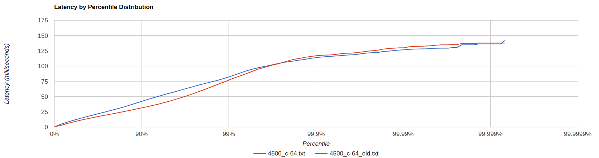
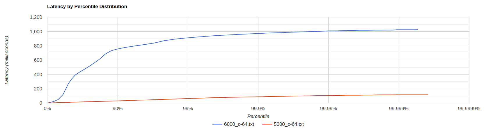

## Параметры системы:
* Treshhold bytes = 1 mb
* Количество core потоков = 6
* Максимальное количество потоков = 6
* Размер очереди = 300
* Max heap size = 128 mb

## Исследуем заполнение БД

* 
    На приведенном рисунке видно, что БД действительно заполняется равномерно.

## Проведем сравнение производительности реализации с шардированием и без

* PUT
  * Сравнение 
  * Сравнение 
  * Сравнение 
  * Сравнение 

* GET
  * Сравнение 
  * Сравнение 
  * Сравнение 
  * Сравнение 

## Проведем профилирование

* PUT
  * ALLOC 
    

  * CPU
    
    

  * LOCK
    
    
  
* GET
  * ALLOC
    
    

  * CPU
    
    
    

  * LOCK
    
    