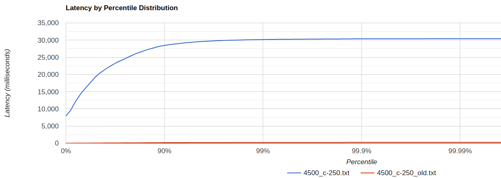

## Параметры системы:
* Treshhold bytes = 1 mb
* Количество core потоков = 6
* Максимальное количество потоков = 6
* Размер очереди = 400
* Max heap size = 128 mb
* Тестируем кластер из 4-х нод
* Параметр ack = 3, from = 4

##### Репликация реализована с последовательными запросами к каждой из нод кластера.

## Сравнение с предыдущей реализацией

* Протестируем с параметрами wrk2 при тестировании системы без репликации из предыдущей лабораторной работы
  
  * GET (-c 250 -t 1 -R 5000)
    
  
  * PUT (-c 250 -t 1 -R 4500)
    

  По полученным результатам видно, что как для GET, так и для PUT запросов задержки при новой реализации значительно превышают старые. При таком rps задержки любая полученная задержка является недопустимой.  

## Определим рабочую нагрузку

  * GET
    
    

  Видно, что корректная работа наблюдается при rps=1100. Это значение в примерно 5 раз ниже, чем в предыдущей лабораторной работе.

  * PUT
    
    

  В случае с PUT запросами приемлемое значение rps=750, что, как и при GET запросах, в 5 раз ниже, чем при реализации без репликации.

## Проведем профилирование

  * GET
    * ALLOC
      
      
      * Как и ранее, самая значительная аллокация это выделение массива byte[] для чтения ответа при пренаправлении запроса на удаленную ноду (77%). Осталась такой же.
      * Появилась новая аллокация при вычислении списка from нод (1.7%).  
      * По полученным результатам видно, что при вычислении ответа локально произошло всего 0.88% аллокацией.
      * В целом, результат очень схож с тем, что был получен в предыдущем этапе.
    * CPU
      
      
      * Пороцессорное время потраченное на отправку ответа как было 25%, так и осталось.
      * Обработка запроса, включая перенаправление, ожидание, локальную обработку составила 32% (ранее было 29%).
      * Картина практически идентичная.
    * LOCK
      
      
      
      * Количество блокировок при ожидания ответа при перенаправлении запроса увеличилось с 69.68% до 79.38%, что ожидаемо, поскольку, если раньше один запрос мог выполниться либо на локальной, либо на удаленной ноде, то теперь для обработки его нужно выполнить значительно больше перенаправлений, а, соответсвенно, в нашем случае и ожиданий.

  * PUT
    * ALLOC
      
      
      * Значительная часть аллокаций - выделение byte[], как и при get запросе.
    * CPU
      
      
      * Процесс обработки запроса (локальная, преренаправление) увеличился с 27.5% до 30.5%.
      * Временные характеристики оставшихся вызовов практически не изменились, разве что время работы SelectorThread'ов уменьшилось с 29% до 24%. Предполагаю, что это можно связать в том числе с тем, что нам не повезло наткнуться на работу GC (2%).
    * LOCK
      
      
      * Блокировка при отправке ответа увеличилась с 71% до 81%.

### Итого

Производительность системы снизилась, а именно, исходя из полученных результатов, поддерживаемый уровень rps уменьшился примерно в 5 раз для get и put запросов. Произошедщее предсказуемо, поскольку при реализации репликации на один запрос теперь приходится намного больше вычислений, пренаправлений запросов. Также сказывается факт последовательного обращения к нодам кластера. Относительно профилирования можно сказать, что результаты по сравнению с предыдущим этапом для аллокаций и ЦПУ практически не изменились. Было замечено на 14-16% больше блокировок, ожидая ответ перенаправив запрос.
