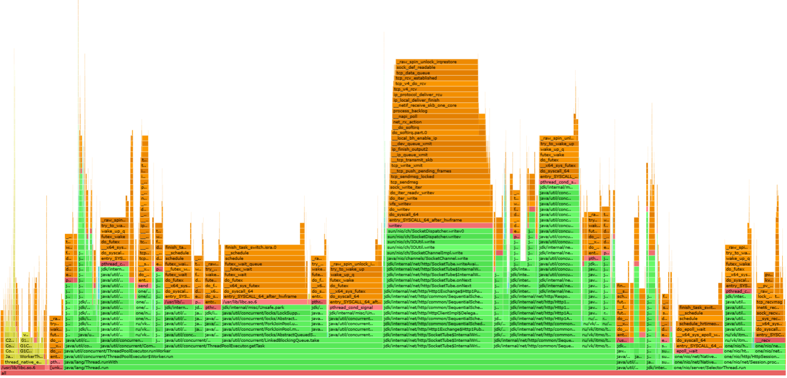

## Параметры системы:
* Treshhold bytes = 1 mb
* Размер очереди = 400
* Max heap size = 128 mb
* Тестируем кластер из 4-х нод
* Параметр ack = 3, from = 4
* Количество потоков = 6

При реализации было использовано 5 экзекьюторов:
  * Distributor - для распределения задач по CompletableFuture (6 потоков core, 6 потоков максимум);
  * Internal - Для обработки ошибок и добавлении результата в сборщик результатов (3 потока);
  * Sender - Для отправки ответа (3 потока);
  * RemoteCall - Для вызова на удаленную ноду и ожидания результата (3 потока);
  * LocalCall - Для локального запроса к dao (3 потока);

## Сравнение с предыдущей реализацией

* GET (-c 250 -t 1 -R 1100)
  
  Видно, что новая реализация по сравнению с предыдущей при 90м персентиле выдает задержку меньше примерно в два раз.
  Однако, в данном эксперименте также видно, что при 99.99м персентиле ситуация получается обратной.

* PUT (-c 250 -t 1 -R 750)
  
  При 90м, 99м, 99.9м персентилях задержка при новой реализация меньше примерно в два раза. Наблюдает значительное улучшение производительности.

И get и put запросы выдали меньшую задержку, чем ранее, но для get запросов после 99го персентиля замечен тренд резкого увеличения задержки.

## Определим рабочую нагрузку

* GET
  
  Видно, что при rps > 1500 задержка начинает расти намного стремительней.
  Так, замечена разница между 99м персентилями при:
  * rps1 = 1100 и rps2 = 1500 : в 2.1 раза;
  * rps2 = 1500 и rps3 = 1800 : в 5.14 раз.

* PUT
  
  Разница при между 99м персентилями при:
  * rps1 = 750 и rps2 = 1500 : в 3,7 раза;
  * rps2 = 1500 и rps3 = 1800 : в 16,59 раз.

Таким образом систему целесообразно тестировать для get запросов при rps=1700, а для put при rps=1600.
По сравнению с предыдущей реализацией уровень рабочего rps увеличился для:
  * GET в 1,5 раза;
  * PUT в 2,1 раза. 

## Проведем профилирование

* ALLOC
  * GET
    
    
  * PUT
    
    
    * Поскольку решение было переведено на использование java.net.HttpClient, то появились сопутствующие аллокации.
* CPU
  * GET
    
    
  * PUT
    
    
    * Нагрузка действительно распределилась по потокам. Наибольшее количество процессорного времени занимает RemoteCall протоки.
    * LocalCall, Distributor потоки занимают в среднем от 0.5 до 1 проценту процессорного времени.

* LOCK
  * GET
    
    
  * PUT
    
    
    * Основные блокировки происходят на RemoteCall потоках в ожидании получения результата с удаленной ноды.
    * Distributor и Sender потоки по блокировкам занимают примерно по одному проценту всех блокировок.
    * Internal и LocalCall потоки по блокировкам занимают меньше одного процента всех блокировок.

### Итого
Текущая асинхронная реализация действительно показала лучший результат, а именно меньшую задержку при как при get, так и при put запросах.
За счет использования CompletableFuture появилось намного больше используемых потоков, обеспечивающих наилучшую производительность системы.
Значительно возросло количество блокировок.