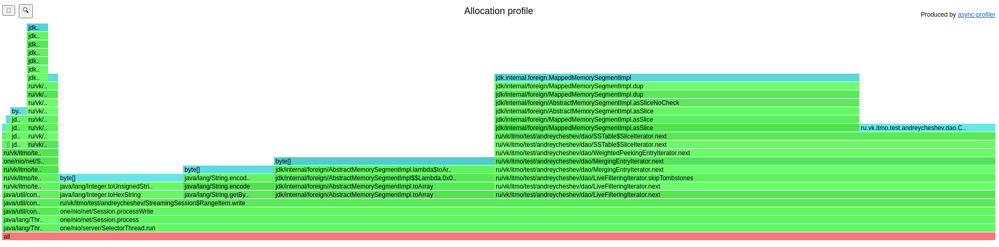
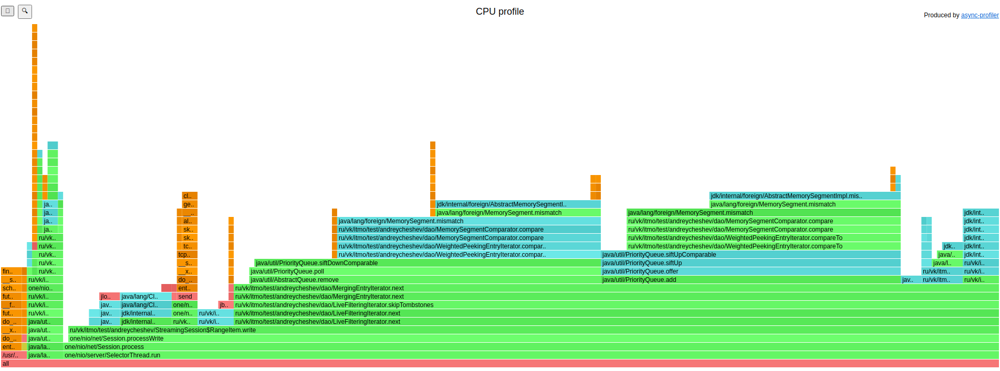

## Параметры системы:
* Treshhold bytes = 1 mb
* Размер очереди = 400
* Max heap size = 128 mb
* Тестируем кластер из 4-х нод
* Параметр ack = 3, from = 4
  
* Использовано 5 экзекьюторов:
  * Distributor - для распределения задач по CompletableFuture (3 потоков core, 3 потоков максимум);
  * Internal - Для обработки ошибок и добавлении результата в сборщик результатов (3 потока);
  * Sender - Для отправки ответа (3 потока);
  * RemoteCall - Для вызова на удаленную ноду и ожидания результата (6 потоков);
  * LocalCall - Для локального запроса к dao (3 потока);
  * StreamingExecutor - Для range запросов к dao (3 потока);

## Проведем профилирование

* GET (range запрос по всей базе)
    * ALLOC
        * 
        * Вычисление длины чанка состоит из двух операций: toHexString (10% аллокаций) и getBytes(10% аллокаций). Место, которое можно было бы оптимизировать.
        * Аллокации Array из MemorySegment занимают 21%.
        * Наибольший процент 54% занимают аллокации при итерации по SsTable (использовании метода `final MemorySegment value = data.asSlice(offset, valueLength)`).
    * CPU
        * 
        * 77% процентов процессорного времени тратится на итерацию по базе данных, где основная операция это работа метода mismatch (36%).
        * Видно, что работа метода append в StreamingBuffer (класс-накопитель запроса) занимает 3.6% времени, что говорит о том, что данный метод вряд ли может стать узким местом при больших нагрузках.
    * LOCK
        * При запросе по всей базе asprof не обнаружил ни одной блокировки.
