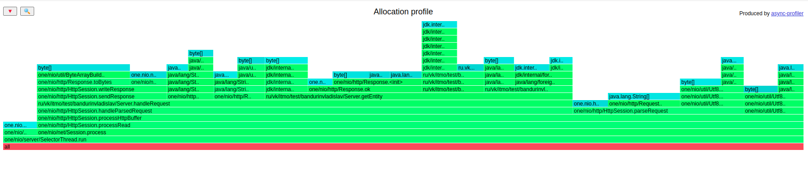
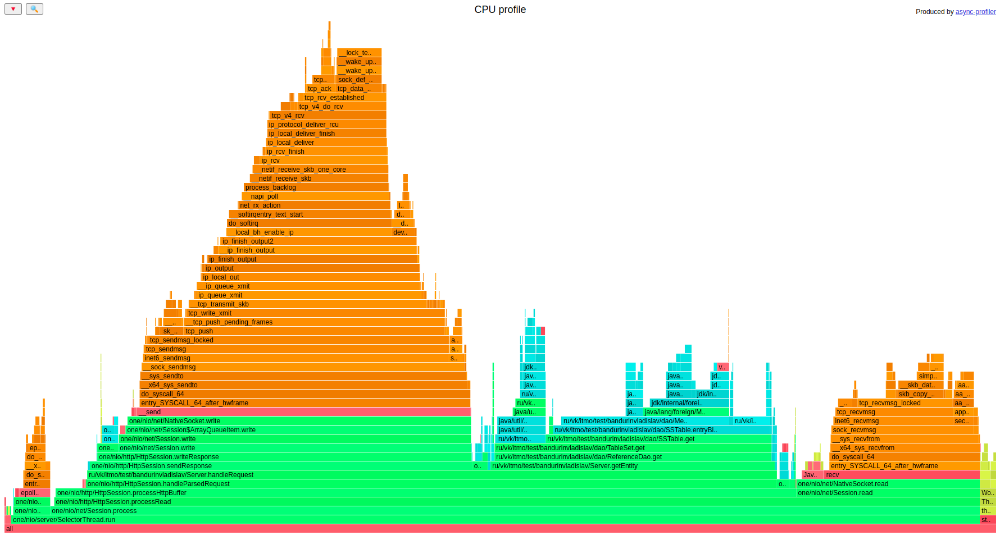
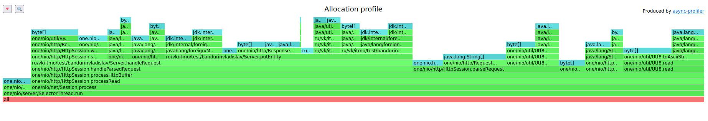
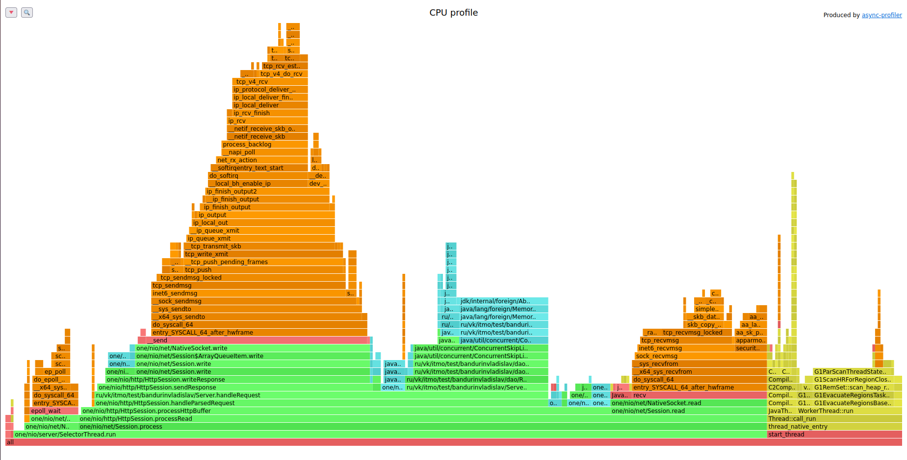

# Stage 1

### Перед началом нагрузочного тестирования и профилирования, я заполнил БД на 840 MB данных с ThresholdBytes = 11 MB. Т.е. в начальном состоянии было 42 SSTable с данными и 42 индекса к ним. Причём для некоторых ключей существовало несколько записей в разных SSTable.
1) Путём экспериментов было выявлено, что для put запросов сервер
   начинает сильно деградировать при `rps = 45000`, для get запросов при `rps=45000`, на latency можно посмотреть в
   [highRPS_latency](profile_wrk/highRPS_latency). Видно, что медиана у Get и 90-ая перцентиль у put начинают довольно сильно проседать.
   Возьму дефолтные значения для профилирования `30000` и `30000` соответственно.

   Команды для запуска нагрузки:

   [GET](../scripts/GetRequest.lua):
   - wrk2:  `wrk -d 60 -t 1 -c 1 -R 45000 -L -s ./scripts/[GetRequest.lua](./scripts/GetRequest.lua) http://localhost:8080`

   [PUT](../scripts/PutRequest.lua):
   - wrk2:  `wrk -d 60 -t 1 -c 1 -R 45000 -L -s ./scripts/[GetRequest.lua](./scripts/PutRequest.lua) http://localhost:8080`

2) При профилировании put можно увидеть, что cpu и аллокации распределены более менее равномерно:
   50% у cpu и 55% аллокаций занимает переопределённый метод handleRequest(), однако мест для оптимизаций
   я не нашёл. 

   Команда для запуска async-profiler:`bin/asprof -e <mode> -d <50> -f ./<ResultFileName.html> ServerLauncher`

   Результаты:
      - для Get - [allocGet](profile_html/allocGet.html) и [cputGet](profile_html/cpuGet.html)
      - для Put - [allocPutNoAnnotation](profile_html/allocPutNoAnnotation.html) и [cpuPutNoAnnotation](profile_html/cpuPutNoAnnotation.html)

3) Так же протестировав PUT с аннотациями `@Path` и `@RequestMethod` и без них, удалось выявить некоторые накладные расходы,
   которые происходят из-за генерации хэндлеров.
   Основные изменения, логично, произошли в методе handleRequest().

        CPU:
        - С аннотациями - 54%
        - Без аннотаций - 50%
         
        alloc:
        - С аннотациями - 60%
        - Без аннотаций - 55%

4) При профилировании get так же основная нагрузка приходится на handleRequest(), внутри которого
   и вызывается getEntity(). Во время поиска записей происходит много
   аллокаций и прыжков по файлам, поэтому при профилировании на CPU и alloc можно увидеть, что handleRequest()
   теперь получает большую нагрузку по сравнению с PUT: 69.5% для CPU и 67% для аллокаций. 
   Посмотрев на код, я не нашёл мест для оптимизаций.

На данный момент единственная оптимизация, которой получилось добиться - написать свой раутинг запросов,
не используя сгенерированные one-nio хэндлеры.

5) Из интереса попробовал запустить put и get с двумя потоками.
   В общем, нагрузка на cpu и количество аллокаций в методе handleRequest() увеличились примерно на 5%.