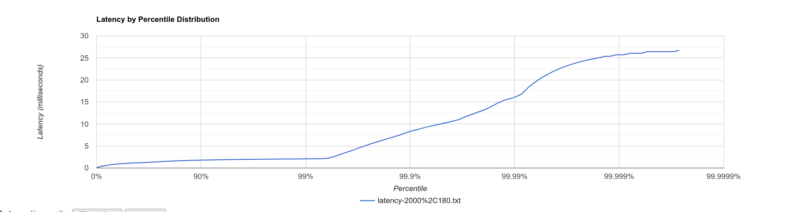

# Отчет

Для наглядности и чистоты измерений сначала я приведу данные о нагрузочном тестировании и профилировании для метода PUT.
За время того, как я проводил эти тесты, я заполнил базу примерно на 2gb, чтобы проверить состояние системы для GET.

## Put

### Lua-script для работы wrk

put_script.lua
```
id = 0
path = "/v0/entity?id="

function generate_random_value(length)
    local res = ""
    for _ = 1, length do
        res = res .. string.char(math.random(97, 122))
    end
    return res
end

function generate_random_key()
    return "key" .. id
end

function request()
    id = id + 1
    url = path .. generate_random_key()
    value = generate_random_value(5)
    headers = {}
    headers["Host"] = "localhost:8080"
    return wrk.format("PUT", url, headers, value)
end
```

Сначала я провел тест для rate 5000, duration 30s
```
wrk -d 30 -L -t 1 -c 1 -R 5000 -s src/main/java/ru/vk/itmo/test/bazhenovkirill/lua_scripts/put_script.lua  http://localhost:8080
Running 30s test @ http://localhost:8080
```

В краткой форме получил такие результаты:


Здесь четко можно заметить разрыв между 90 и 99, а также 99 и 99.9

Поэтому я решил взять, как и говорилось на лекции на 20% поменьше и увеличить duration до 3 минут.

[Нагрузочное тестирование put при 3800 RPS 240 секунд](../data/put/stage_1/latency-3800,240.txt)


Получившаяся гистограмма:


После профилирования получил такую диаграмму для CPU:
[Профилирование - cpu](../data/put/stage_1/cpu.html)

Как мы можем заметить, много процессорного времени мы тратим на обработку запроса.
Так же, как ни странно, метод sendResponse занимает около 47%.

##Get

### Lua-script для работы wrk

get_script.lua
```
id = 0
path = "/v0/entity?id="

function generate_random_key()
    return "key" .. id
end

function request()
    id = id + 1
    url = path .. generate_random_key()
    wrk.headers["Host"] = "localhost:8080"
    return wrk.format("GET", url, headers)
end
```

Здесь я изначально поставил 4000 rps на 180.
[Нагрузочное тестирование get при 4000 RPS 180 секунд](../data/get/latency-4000,180.txt)

После профилирования получил такую диаграмму для CPU:
[Профилирование - cpu](../data/get/cpu.html)

Как можно заметить, метод сравнения двух ключей занимает огромное количество cpu ~ 50%
В скриптах lua я старался генерировать ключи с большим количеством символов.
То есть key + id(1 < id < 1000000), что в пике включает в себя длину ключа - 10 символов.
+ в целом время на поиск ключа по всем sstable занимает ~ 70% cpu

Так же можно заметить, что мы тратим больше 90% на то, чтобы на парсинг и обработку запроса.
Скорее всего это происходит из-за использования аннотации, однако к дедлайну я, к сожалению, не успею поглубже
покопаться в one-nio.

Только, уменьшив rpc в 2 раза я получаю более-менее адекватные цифры
[Нагрузочное тестирование get при 2000 RPS 180 секунд](../data/get/latency-2000,180.txt)

Получившаяся гистограмма:


С 99 до 99.9 виден явный скачок.