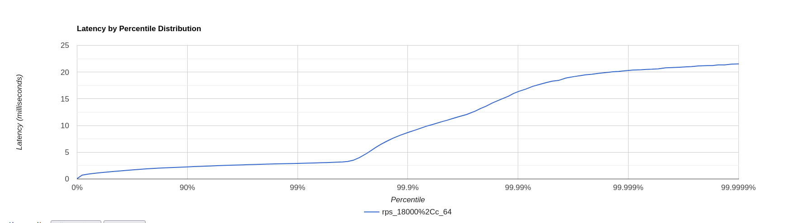
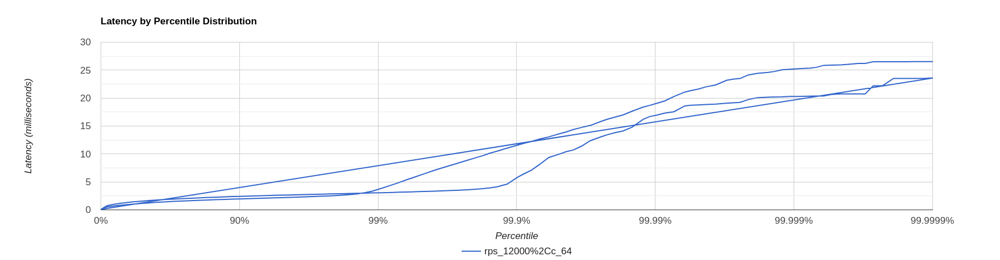

# Отчет
## PUT

+ Найдем точку разладки для обновленной версии сервера  
Проверим для rate 7500 с 64 соединениями
```
wrk -d 180 -L -t 1 -c 64 -R 7500 -s src/main/java/ru/vk/itmo/test/bazhenovkirill/lua_scripts/put_script.lua  http://localhost:8080
```
[Нагрузочное тестирование для put при 7500 rps, 64 соединения](../data/put/stage_2/rps_7500,c_64)

Можем заметить, что есть не 200 и 300 ответы.Это объясняется тем, что возможна генерация   
ключа, значение которого совпадает с уже имеющимся в таблице.  
Из полученных данных видим, что 99.9% запросов обрабатываются менее чем за 10 ms,  
что говорит нам о том, что сервис спокойно выдерживает подаваемую нагрузку.  

Проведя тест для 10000 rps, мы также можем заметить, что сервис практически не просел

[Нагрузочное тестирование для put при 10000 rps, 64 соединения](../data/put/stage_2/rps_10000,c_64)

Тогда попробуем увеличить нагрузку еще в два раза, чтобы точно увидеть нестабильную работу.

И здесь мы все равно можем видеть, что 99% успешно обрабатываются, однако далее большие просадки.

[Нагрузочное тестирование для put при 20000 rps, 64 соединения](../data/put/stage_2/rps_20000,c_64)

Таким образом, сервис может спокойно выдержать 18K RPS

[Нагрузочное тестирование для put при 18000 rps, 64 соединения](../data/put/stage_2/rps_18000,c_64)



Такое увеличение RPS можно легко объяснить увеличением соединений, так как все запросы  
равномерно распределяются между сокетами, а значит на каждый в отдельности приходится  
меньше соединений.

[CPU](../data/put/stage_2/profile.html)

Как мы можем заметить, занимаемое селекторами процессорное время снизилось, что очевидно, так как 
теперь мы добавили для этого executor service, чтобы выполнять обработку запросов параллельно.

[ALLOCATION](../data/put/stage_2/alloc.html)

Из аллокаций видно, что обработка соединений происходит более эффективно + эта работа равномерно распределеяется
по нашему executable service. Также видно, что значительная часть аллокаций требуется для конвертации
запроса в MemorySegment 

[LOCK](../data/put/stage_2/lock.html)

## GET

+ Аналогично проверим для GET-запросов

Попробуем сразу 18000.Такой rps моя машина не потянула и, к сожалению, все легло(и не только сервер)

[Нагрузочное тестирование для GET при 9000 rps, 64 соединения](../data/get/stage_2/rps_9000,c_64)
[Нагрузочное тестирование для GET при 12000 rps, 64 соединения](../data/get/stage_2/rps_12000,c_64)
[Нагрузочное тестирование для GET при 15000 rps, 64 соединения](../data/get/stage_2/rps_15000,c_64)

При 15000 уже идут очень неплохие просадки, поэтому если отнять 20% - получим около 12000 rps.



[CPU](../data/get/stage_2/cpu.html)

[ALLOCATION](../data/get/stage_2/alloc.html)
Здесь, в плане аллокаций и CPU, тоже самое, что и при put практически.

Вывод:получилось добиться увеличения RPS за счет разгрузки селекторов.Безусловно, мы тратим больше памяти, однако скорость 
обработка запросов важнее в данном случае.


