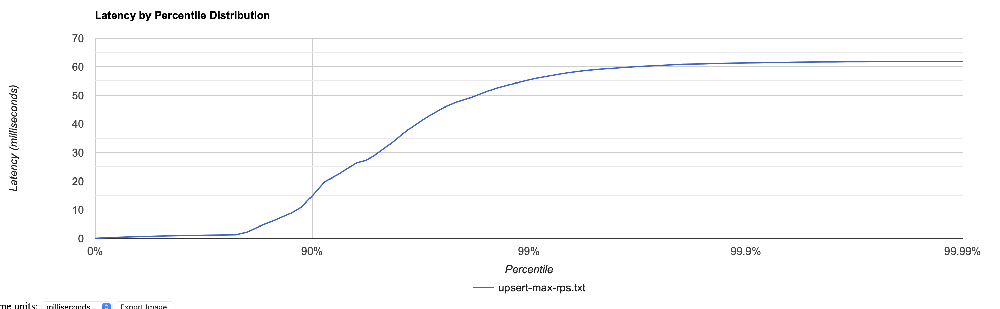
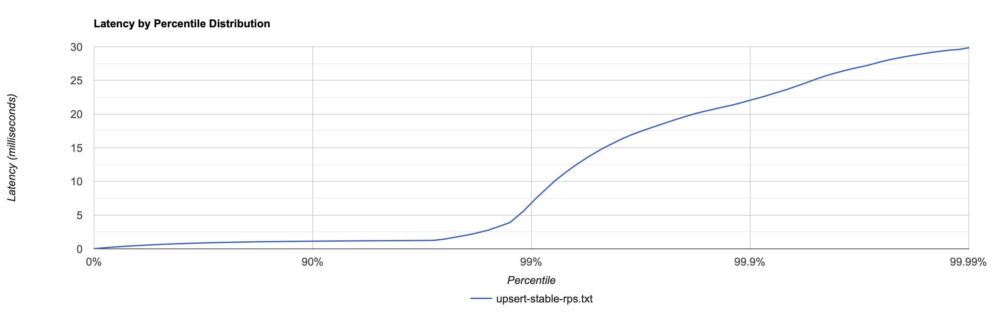
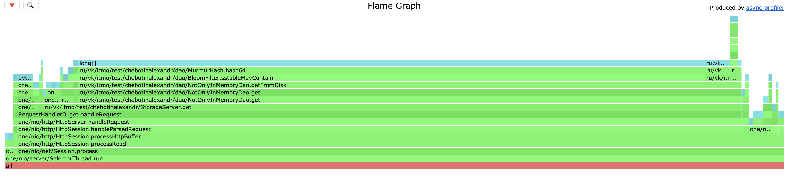
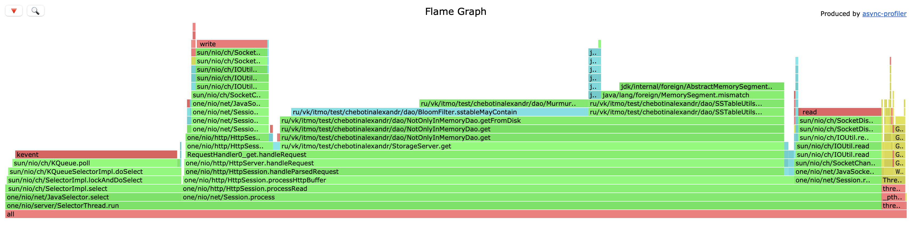
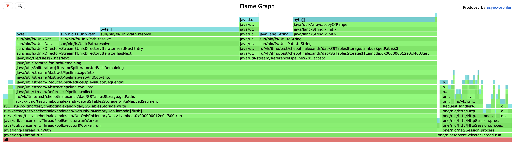
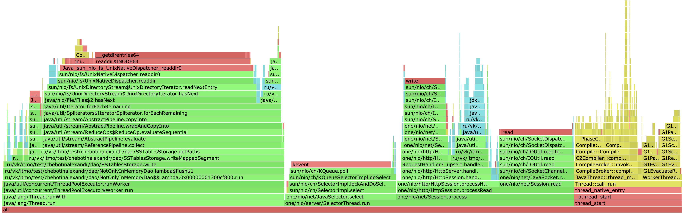

# Отчёт по "Этап 1. HTTP + storage"

## UPSERT

Был создан скрипт на Lua для того, чтобы наполнять изначально пустую базу key-value, ключи генерируются уникальные.
В данном исследовании была определена, первым делом, точка разладки при PUT запросах при помощи нагрузочного тестирования. Она составляет ±45 000 rps. Нагрузим наш Server:

```
./wrk -c 1 -d 30 -t 1 -L -R 42500 -s upsert-script.lua http://localhost:8080

Running 30s test @ http://localhost:8080
  1 threads and 1 connections
  Thread calibration: mean lat.: 357.303ms, rate sampling interval: 759ms
  Thread Stats   Avg      Stdev     Max   +/- Stdev
    Latency   468.35ms   71.67ms 584.19ms   51.36%
    Req/Sec    42.12k   840.37    43.32k    69.23%
  Latency Distribution (HdrHistogram - Recorded Latency)
----------------------------------------------------------
  1250617 requests in 30.00s, 79.91MB read
Requests/sec:  41687.74
```


В этом случае сервер почти моментально падает. Немного уменьшим rps, чтобы увидеть деградацию нашего сервиса.

```
./wrk -c 1 -d 30 -t 1 -L -R 40000 -s upsert-script.lua http://localhost:8080

Running 30s test @ http://localhost:8080
  1 threads and 1 connections
  Thread calibration: mean lat.: 94.909ms, rate sampling interval: 528ms
  Thread Stats   Avg      Stdev     Max   +/- Stdev
    Latency     4.61ms   10.91ms  61.95ms   90.11%
    Req/Sec    40.05k   663.79    42.59k    86.49%
  Latency Distribution (HdrHistogram - Recorded Latency)
 50.000%  804.00us
 75.000%    1.20ms
 90.000%   14.79ms
 99.000%   55.39ms
 99.900%   61.38ms
 99.990%   61.92ms
 99.999%   61.98ms
100.000%   61.98ms

  Detailed Percentile spectrum:
       Value   Percentile   TotalCount 1/(1-Percentile)

       0.014     0.000000            1         1.00
       0.191     0.100000        80074         1.11
       0.344     0.200000       160024         1.25
       0.495     0.300000       240162         1.43
       0.648     0.400000       319965         1.67
       0.804     0.500000       399957         2.00
       0.882     0.550000       440310         2.22
       0.961     0.600000       480280         2.50
       1.037     0.650000       520205         2.86
       1.115     0.700000       560110         3.33
       1.195     0.750000       599900         4.00
       1.253     0.775000       620037         4.44
       2.149     0.800000       639810         5.00
       4.191     0.825000       659836         5.71
       6.235     0.850000       679812         6.67
       8.831     0.875000       699797         8.00
      10.879     0.887500       709800         8.89
      14.791     0.900000       719777        10.00
      19.807     0.912500       729795        11.43
      22.559     0.925000       739798        13.33
      26.399     0.937500       749777        16.00
      27.327     0.943750       754775        17.78
      29.743     0.950000       759774        20.00
      32.895     0.956250       764769        22.86
      37.055     0.962500       769794        26.67
      41.151     0.968750       774812        32.00
      43.359     0.971875       777285        35.56
      45.535     0.975000       779794        40.00
      47.487     0.978125       782267        45.71
      49.087     0.981250       784770        53.33
      51.391     0.984375       787256        64.00
      52.575     0.985938       788565        71.11
      53.631     0.987500       789762        80.00
      54.687     0.989062       791034        91.43
      55.903     0.990625       792286       106.67
      56.991     0.992188       793513       128.00
      57.599     0.992969       794168       142.22
      58.175     0.993750       794767       160.00
      58.719     0.994531       795416       182.86
      59.199     0.995313       796006       213.33
      59.615     0.996094       796647       256.00
      59.871     0.996484       796947       284.44
      60.127     0.996875       797296       320.00
      60.351     0.997266       797567       365.71
      60.607     0.997656       797877       426.67
      60.927     0.998047       798211       512.00
      60.991     0.998242       798348       568.89
      61.055     0.998437       798503       640.00
      61.215     0.998633       798679       731.43
      61.311     0.998828       798849       853.33
      61.407     0.999023       799035      1024.00
      61.439     0.999121       799078      1137.78
      61.535     0.999219       799168      1280.00
      61.567     0.999316       799208      1462.86
      61.663     0.999414       799294      1706.67
      61.727     0.999512       799384      2048.00
      61.759     0.999561       799450      2275.56
      61.759     0.999609       799450      2560.00
      61.823     0.999658       799541      2925.71
      61.823     0.999707       799541      3413.33
      61.855     0.999756       799597      4096.00
      61.855     0.999780       799597      4551.11
      61.855     0.999805       799597      5120.00
      61.887     0.999829       799636      5851.43
      61.887     0.999854       799636      6826.67
      61.919     0.999878       799688      8192.00
      61.919     0.999890       799688      9102.22
      61.919     0.999902       799688     10240.00
      61.919     0.999915       799688     11702.86
      61.951     0.999927       799722     13653.33
      61.951     0.999939       799722     16384.00
      61.951     0.999945       799722     18204.44
      61.951     0.999951       799722     20480.00
      61.951     0.999957       799722     23405.71
      61.951     0.999963       799722     27306.67
      61.983     0.999969       799751     32768.00
      61.983     1.000000       799751          inf
#[Mean    =        4.605, StdDeviation   =       10.905]
#[Max     =       61.952, Total count    =       799751]
#[Buckets =           27, SubBuckets     =         2048]
----------------------------------------------------------
  1199929 requests in 30.00s, 76.67MB read
Requests/sec:  39997.94
Transfer/sec:      2.56MB

```

Гистограмма, на которой видна деградация с течением времени:



Таким образом, будем считать в данном исследовании стабильной нагрузку около 30 000 rps. Нагрузим стабильно в течение 120 секунд:

```
./wrk -c 1 -d 120 -t 1 -L -R 30000 -s upsert-script.lua http://localhost:8080
Running 2m test @ http://localhost:8080
  1 threads and 1 connections
  Thread calibration: mean lat.: 6.288ms, rate sampling interval: 10ms
  Thread Stats   Avg      Stdev     Max   +/- Stdev
    Latency   810.24us    1.59ms  32.05ms   98.27%
    Req/Sec    31.68k     3.20k   52.89k    80.15%
----------------------------------------------------------
  3599976 requests in 2.00m, 230.02MB read
Requests/sec:  29999.85
Transfer/sec:      1.92MB

```


Видим что среднее Latency - 0.81 ms.


## GET

В данном исследовании проведем нагрузочное тестирование GET запросами. Наполнять БД можно следующим образом:

1) Заполнить только Memtable;
2) Заполнить Memtable и сделать flush в один SSTable;
3) Сделать множественный flush, создав таким образом несколько SSTable.

Интерес представляет из себя последний вариант. Для данного исследования был написан код, который заполняет Dao ключами и значениями с фиксированным количеством SSTable. Пусть будет 100 таблиц на диске. Ключи распределены по таблицам в совершенно случайном порядке. Такое количество таблиц позволит увидеть влияние перебора таблиц для поиска нужного entry в нашем LSM.

А теперь представим, что у нас нет фильтра Блюма. Таблиц на диске может быть очень много, в нашем случае их 100, а перебирать последовательно таблицы для каждого GET и в каждом производить бинарный поиск - как-то не привлекательно. Получается, мы в худшем случае сделаем 100 бинарных поисков!

Оценим, как работает наша база данных без фильтра Блюма на SSTable-ах. В LSM чтение медленее upsert-а, для приличия возьмем нагрузку в 20k rps на 20 секунд:

```
./wrk -c 1 -d 20 -t 1 -L -R 20000 -s get-script.lua http://localhost:8080

Running 20s test @ http://localhost:8080
  1 threads and 1 connections
  Thread calibration: mean lat.: 3414.116ms, rate sampling interval: 11698ms
  Thread Stats   Avg      Stdev     Max   +/- Stdev
    Latency     9.52s     1.83s   12.71s    57.64%
    Req/Sec        nan       nan   0.00      0.00%
----------------------------------------------------------
  145772 requests in 20.00s, 9.49MB read
Requests/sec:   7288.58
Transfer/sec:    485.70KB
```

Detailed Percentile spectrum тут не нужен, и так видно, что база просто моментально захлебнулась таким количеством бинарных поисков.

Снижением rps была определена точка разладки, в этом случае она составляет 10k rps. Возьмем стабильную 7.5k rps:

```
./wrk -c 1 -d 20 -t 1 -L -R 7500 -s get-script.lua http://localhost:8080

Running 20s test @ http://localhost:8080
  1 threads and 1 connections
  Thread calibration: mean lat.: 153.675ms, rate sampling interval: 507ms
  Thread Stats   Avg      Stdev     Max   +/- Stdev
    Latency     2.87ms    2.82ms  16.24ms   86.19%
    Req/Sec     7.51k    66.42     7.68k    73.68%
----------------------------------------------------------
  149989 requests in 20.00s, 9.76MB read
Requests/sec:   7499.49
Transfer/sec:    499.91KB
```

Сервис стабильно обрабатывает запросы, максимальный latency составил 16.24ms, средний - 2.87ms. Вроде хорошо - но выше rps то он не удерживает.

И тут вступает в силу фильтр Блума!

```
./wrk -c 1 -d 20 -t 1 -L -R 20000 -s get-script.lua http://localhost:8080

Running 20s test @ http://localhost:8080
  1 threads and 1 connections
  Thread calibration: mean lat.: 25.067ms, rate sampling interval: 257ms
  Thread Stats   Avg      Stdev     Max   +/- Stdev
    Latency   684.14us  384.73us   4.10ms   61.93%
    Req/Sec    20.04k    53.91    20.16k    63.16%
  Latency Distribution (HdrHistogram - Recorded Latency)
 50.000%  677.00us
 75.000%    0.99ms
 90.000%    1.17ms
 99.000%    1.63ms
 99.900%    2.25ms
 99.990%    3.83ms
 99.999%    4.10ms
100.000%    4.11ms

  Detailed Percentile spectrum:
       Value   Percentile   TotalCount 1/(1-Percentile)

       0.018     0.000000            1         1.00
       0.174     0.100000        20017         1.11
       0.301     0.200000        40020         1.25
       0.427     0.300000        60094         1.43
       0.552     0.400000        80041         1.67
       0.677     0.500000       100047         2.00
       0.739     0.550000       110075         2.22
       0.802     0.600000       120003         2.50
       0.865     0.650000       130015         2.86
       0.927     0.700000       139984         3.33
       0.988     0.750000       150061         4.00
       1.019     0.775000       155082         4.44
       1.049     0.800000       160051         5.00
       1.079     0.825000       165021         5.71
       1.108     0.850000       169965         6.67
       1.137     0.875000       174930         8.00
       1.152     0.887500       177582         8.89
       1.165     0.900000       179934        10.00
       1.182     0.912500       182543        11.43
       1.200     0.925000       185059        13.33
       1.218     0.937500       187440        16.00
       1.228     0.943750       188729        17.78
       1.238     0.950000       189931        20.00
       1.250     0.956250       191184        22.86
       1.268     0.962500       192452        26.67
       1.293     0.968750       193675        32.00
       1.309     0.971875       194306        35.56
       1.330     0.975000       194932        40.00
       1.361     0.978125       195544        45.71
       1.410     0.981250       196172        53.33
       1.479     0.984375       196794        64.00
       1.520     0.985938       197108        71.11
       1.558     0.987500       197426        80.00
       1.600     0.989062       197736        91.43
       1.642     0.990625       198050       106.67
       1.679     0.992188       198362       128.00
       1.701     0.992969       198514       142.22
       1.725     0.993750       198673       160.00
       1.750     0.994531       198830       182.86
       1.791     0.995313       198984       213.33
       1.843     0.996094       199137       256.00
       1.872     0.996484       199216       284.44
       1.905     0.996875       199293       320.00
       1.936     0.997266       199371       365.71
       1.993     0.997656       199451       426.67
       2.057     0.998047       199528       512.00
       2.099     0.998242       199569       568.89
       2.147     0.998437       199605       640.00
       2.171     0.998633       199644       731.43
       2.207     0.998828       199683       853.33
       2.257     0.999023       199724      1024.00
       2.303     0.999121       199743      1137.78
       2.339     0.999219       199761      1280.00
       2.491     0.999316       199781      1462.86
       2.743     0.999414       199800      1706.67
       2.919     0.999512       199820      2048.00
       3.079     0.999561       199830      2275.56
       3.217     0.999609       199839      2560.00
       3.383     0.999658       199849      2925.71
       3.513     0.999707       199859      3413.33
       3.657     0.999756       199870      4096.00
       3.691     0.999780       199874      4551.11
       3.705     0.999805       199878      5120.00
       3.759     0.999829       199883      5851.43
       3.783     0.999854       199888      6826.67
       3.807     0.999878       199893      8192.00
       3.827     0.999890       199896      9102.22
       3.833     0.999902       199898     10240.00
       3.853     0.999915       199900     11702.86
       3.873     0.999927       199903     13653.33
       3.913     0.999939       199905     16384.00
       3.955     0.999945       199907     18204.44
       3.979     0.999951       199909     20480.00
       3.979     0.999957       199909     23405.71
       4.001     0.999963       199910     27306.67
       4.023     0.999969       199911     32768.00
       4.045     0.999973       199912     36408.89
       4.057     0.999976       199913     40960.00
       4.057     0.999979       199913     46811.43
       4.073     0.999982       199914     54613.33
       4.073     0.999985       199914     65536.00
       4.099     0.999986       199916     72817.78
       4.099     0.999988       199916     81920.00
       4.099     0.999989       199916     93622.86
       4.099     0.999991       199916    109226.67
       4.099     0.999992       199916    131072.00
       4.099     0.999993       199916    145635.56
       4.099     0.999994       199916    163840.00
       4.099     0.999995       199916    187245.71
       4.107     0.999995       199917    218453.33
       4.107     1.000000       199917          inf
#[Mean    =        0.684, StdDeviation   =        0.385]
#[Max     =        4.104, Total count    =       199917]
#[Buckets =           27, SubBuckets     =         2048]
----------------------------------------------------------
  399988 requests in 20.00s, 26.21MB read
Requests/sec:  19999.69
Transfer/sec:      1.31MB
```

Выше видим детализированный вывод wrk2. Все прекрасно. Получается, при большом количестве SSTable без фильтра Блума никак. Он позволяет пропустить таблицы, в которых гарантированно нет ключа. Фильтр вероятностный, реализован в рамках бонусной фичи курса NoSQL. А выше мы видели, как 20k без фильтра сервис просто падал.

Фильтр вероятностный, не вдаваясь в детали, у него есть настраиваемый параметр false-positive probability. В тестах выше он составлял 0.03. То есть только в 3% запросов мы могли сделать лишний бинарный поиск. Получили хорошую оптимизацию (но не бесплатно, конечно же).

Попробуем изменить fpp фильтра на более высокий, чтобы наглядно убедиться как он работает. Зададим fpp = 0.5. Таким образом, в 50% случаев мы сделаем лишний бинарный поиск.

```
./wrk -c 1 -d 20 -t 1 -L -R 20000 -s get-script.lua http://localhost:8080

Running 20s test @ http://localhost:8080
  1 threads and 1 connections
  Thread calibration: mean lat.: 2298.445ms, rate sampling interval: 6889ms
  Thread Stats   Avg      Stdev     Max   +/- Stdev
    Latency     5.61s     1.05s    7.45s    56.39%
    Req/Sec    12.89k     0.00    12.89k     0.00%
----------------------------------------------------------
  250860 requests in 20.00s, 16.40MB read
Requests/sec:  12543.02
Transfer/sec:    839.76KB
```

Видим, что сервис снова упал. Максимальный latency составил 7.45s с фильтром Блума fpp = 0.5. Без фильтра блума он составил примерно в два раза больше - 12.71s. Нетрудно сделать вывод, что фильтр работает. Снижая количество лишних бинарных поисков по таблицам, мы снижаем max latency.

Осталось определить точку разладки с фильтром Блума. Вернем fpp к значению 0.03. Пусть 30k rps:

```
./wrk -c 1 -d 20 -t 1 -L -R 30000 -s get-script.lua http://localhost:8080 

Running 20s test @ http://localhost:8080
  1 threads and 1 connections
  Thread calibration: mean lat.: 944.388ms, rate sampling interval: 2680ms
  Thread Stats   Avg      Stdev     Max   +/- Stdev
    Latency     1.91s   273.73ms   2.37s    57.52%
    Req/Sec    27.15k     7.54    27.16k    33.33%
----------------------------------------------------------
  529025 requests in 20.00s, 34.71MB read
Requests/sec:  26451.53
Transfer/sec:      1.74MB
```

Сервер захлебнулся. Пусть 25k rps:

```
./wrk -c 1 -d 20 -t 1 -L -R 25000 -s get-script.lua http://localhost:8080 

Running 20s test @ http://localhost:8080
  1 threads and 1 connections
  Thread calibration: mean lat.: 78.520ms, rate sampling interval: 555ms
  Thread Stats   Avg      Stdev     Max   +/- Stdev
    Latency   724.05us  418.22us   4.20ms   68.23%
    Req/Sec    25.02k    31.21    25.09k    72.22%
----------------------------------------------------------
  499981 requests in 20.00s, 32.79MB read
Requests/sec:  24999.19
Transfer/sec:      1.64MB
```

Сервис стабильно работает.

Итак, фильтр Блума с false-positive-probability, равным 0.03, позволил повысить rps с ±7500 до ±25000 для базы с 100 SSTable-ов.

## Профилирование с помощью async-profiler и анализ

# GET

Рассмотрим геты.

# 1) ALLOC



Около 80% аллокаций приходится на метод getFromDisk(), а он содержит в себе метод вычисления хеш-функции Murmur3 Hash для ключей. Это используется в фильтре Блума, чтобы определить, лежит ли в данном SSTable такой ключ или нет, для этого вычисляется хеш.

# 2) CPU



Из этого результата профилирования видно что много ресурсов cpu тратится на работу селекторов. На уровне базы данных - все тот же метод getFromDisk() является труднозатратным.

# UPSERT

Рассмотрим вставку-обновление.

# 1) ALLOC



Видно что много аллокаций приходится на SSTablesStorage.write - это как раз сброс данных с memtable на диск.

# 2) CPU



Ярко выраженная затрата времени на JIT-компиляцию, что вызывает задержку. Также видим задержку увеличивает также flush (метод SSTablesStorage.write). 


