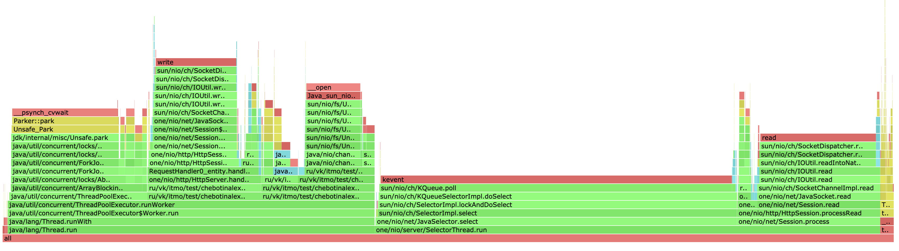
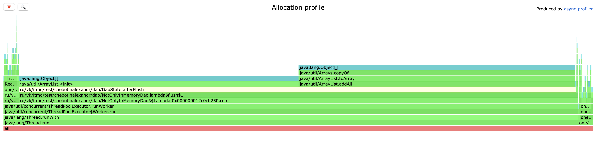
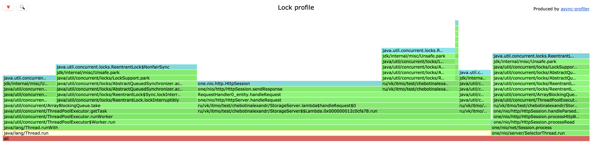
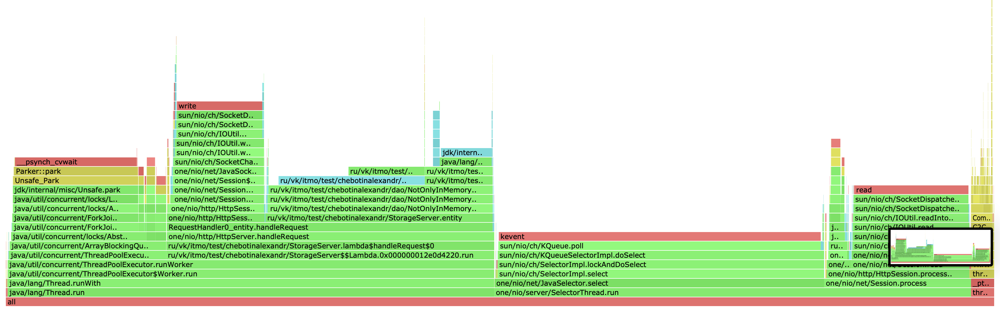
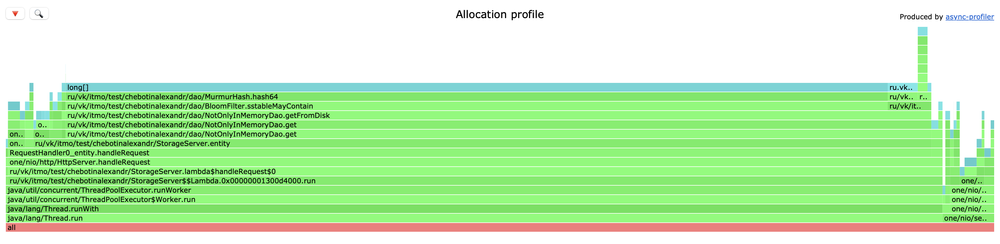
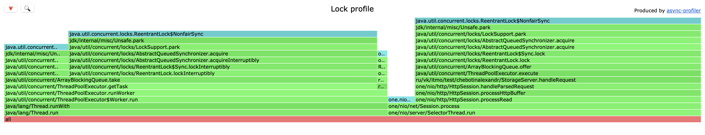

# Отчёт по "Этап 2. Асинхронный сервер"

### Количество потоков в пуле

Для начала выберем количество потоков в пуле воркеров и подходящий размер очереди - эти параметры будем подбирать путем нагрузочного тестирования GET-запросами на поиск случайных ключей в LSM-DAO.

Если сравнивать ArrayBlockingQueue и LinkedBlockingQueue, то просматривая исходный код LinkedBlockingQueue можно сказать, что он использует 2 отдельных лока: для put/offer и для take. ArrayBlockingQueue использует один лок для вставки и удаления и просто не допускает возможности двойного лока. Но в LinkedBlockingQueue связанный список, соответственно операции с этой очередью, скорее всего, будут медленнее чем с ArrayBlockingQueue. Таким образом, динамическое создание узлов при каждой вставке в LinkedBlockingQueue подталкивает меня к использованию ArrayBlockingQueue.

Количество рабочей очереди и размер пула потоков должны соответствовать друг другу. Можно, например, подобрать наиболее оптимальное их отношение.

Подберем сначала размер пула. Можно просто протестировать под нагрузкой с помощью wrk2 - регулировать размер пула, выполняя запросы, понаблюдать за задействованностью процессоров. В общем, размер пула потоков - оценочная величина, и примерное значение может быть подобрано путем профилирования.

Есть одна формула:

N_потоков = N_cpu * U_cpu * (1 + W/C),

где N_cpu - Runtime.getRuntime().availableProcessors(), U_cpu - целевая задействованность процессоров (0 <= U_cpu <= 1), W/C - отношение времени ожидания ко времени вычисления. Чем больше W/C - тем дольше потоки будут ждать чтения sstable.

W в нашем случае - это обращение к диску для чтения файла SSTable. Тут уже зависит от того, есть ли фильтр Блума или нет, ожидание чтения может быть долгим. В моей реализации dao имеется фильтр Блума, поэтому чтение с диска максимально быстрое в связи с сокращением операций бинарного поиска. Можно взять примерно равным 10ms. Это все измеряется.

Будем регулировать как угодно, лишь бы оптимальное значение подобрать, в моем случае для целевой задействованности процессоров на 80% оценка размер пула будет:

N_потоков = 8 * 0.8 * (1 + 10/5) = 19,2 то есть 20 потоков. Начнем именно с этого значения.

База данных предварительно заполнена случайными значениями, количество SSTable в LSM равняется 100. Возьмем нагрузку 100k rps в 4 потока и 64 соединения в wrk2 get-запросами со случайными ключами. Составим таблицу с максимальным latency, средним latency, 90-ым и 99-ым перцентилями.

| POOL SIZE | MAX LATENCY, ms | AVG LATENCY, ms | 90p LATENCY, ms | 99p LATENCY, ms |
|-----------|-----------------|-----------------|-----------------|-----------------|
| 8         | 44.29 | 1.71             | 3.38 | 7.46           |
| 10        | 39.81 | 1.65             | 3.23 | 7.85           |
| 12        | 26.91 | 1.76             | 3.63 | 8.96           |
| 14        | 38.08 | 1.83             | 3.79 | 9.78           |
| 16        | 32.40 | 1.75             | 3.56 | 9.42           |
| 18        | 22.22 | 1.90             | 4.12 | 10.32          |
| 20        | 31.84 | 2.11      <br/>       | 4.66 | 13.50          |
| 22        | 28.98 | 1.80             | 3.67 | 9.72           |
| 24        | 34.94 | 1.81             | 3.69 | 9.51           |
| 32        | 122.62 | 2.95             | 6.02 | 31.97         |
| 64        | 1560 | 20.06             | 8.03 | 755.71         |

Построим график зависимости latency от pool size. В

.png)

Тот же график, только с исключением значения 64 по оси x для более детальной визуализации.

2.png)

Отсюда вывод, что значение количества потоков, рассчитаное нами по приближенной формуле дает хороший результ. После нагрузочного тестирования было определено оценочное значения для размера пула потоков и оно равняется 20. Исключим из графика кривую MAX LATENCY, чтобы более подробно рассмотреть кривые перцентилей.

3.png)

Теперь кривые перцентилей видно лучше.


### Размер очереди пула потоков

Имеет смысл сделать аналогичные замеры и для размера очереди. Предыдущее исследование проводилось для очереди размером 256. Зафиксируем пул из 20 потоков и будем менять размер очереди. Снова проведем нагрузочное тестирование

| QUEUE CAPACITY | MAX LATENCY, ms | AVG LATENCY, ms | 90p LATENCY, ms | 99p LATENCY, ms |
|----------------|-----------------|-----------------|-----------------|-----------------|
| 512            | 3740            | 787.75          | 2090            | 3650            |
| 256            | 27.97           | 1.96            | 4.33            | 11.33           |
| 128            | 75.26           | 1.90            | 3.47            | 13.86           |
| 64             | 21.58           | 1.89            | 3.63            | 8.96            |
| 32             | 8500            | 3050            | 5780            | 7820            |

Из результатов тестирования видно, что слишком маленькая очередь (32) и слишком большая (512) приводят к тому, что сервер захлебывается.

.png)

Тот же график, только в логарифмическом масштабе


2.png)

Таким образом, приемлемой будет для нас значит очередь размера 128-256. Ниже вывод wrk2 при нагрузке в 100k rps в 64 соединения и 4 треда на сервер с пулом потоков 20 и очередью 128:

```

./wrk -c 64 -d 20 -t 4 -L -R 100000 -s get-script.lua http://localhost:8080
Running 20s test @ http://localhost:8080
4 threads and 64 connections
Thread calibration: mean lat.: 423.851ms, rate sampling interval: 1651ms
Thread calibration: mean lat.: 515.075ms, rate sampling interval: 1926ms
Thread calibration: mean lat.: 450.551ms, rate sampling interval: 1750ms
Thread calibration: mean lat.: 391.568ms, rate sampling interval: 1662ms
Thread Stats   Avg      Stdev     Max   +/- Stdev
Latency     1.64ms    1.59ms  45.60ms   89.97%
Req/Sec    25.01k    26.85    25.06k    57.14%
Latency Distribution (HdrHistogram - Recorded Latency)
50.000%    1.20ms
75.000%    1.98ms
90.000%    3.23ms
99.000%    7.67ms
99.900%   13.94ms
99.990%   36.64ms
99.999%   44.80ms
100.000%   45.63ms

Detailed Percentile spectrum:
Value   Percentile   TotalCount 1/(1-Percentile)

       0.027     0.000000            2         1.00
       0.458     0.100000        99435         1.11
       0.644     0.200000       198508         1.25
       0.822     0.300000       297629         1.43
       1.003     0.400000       396975         1.67
       1.200     0.500000       496041         2.00
       1.310     0.550000       545932         2.22
       1.434     0.600000       595412         2.50
       1.582     0.650000       644987         2.86
       1.760     0.700000       694430         3.33
       1.977     0.750000       744165         4.00
       2.103     0.775000       768801         4.44
       2.247     0.800000       793754         5.00
       2.415     0.825000       818622         5.71
       2.621     0.850000       843194         6.67
       2.885     0.875000       868062         8.00
       3.045     0.887500       880448         8.89
       3.235     0.900000       892850        10.00
       3.455     0.912500       905179        11.43
       3.723     0.925000       917597        13.33
       4.049     0.937500       930024        16.00
       4.243     0.943750       936171        17.78
       4.459     0.950000       942418        20.00
       4.715     0.956250       948618        22.86
       5.007     0.962500       954789        26.67
       5.363     0.968750       961008        32.00
       5.567     0.971875       964084        35.56
       5.799     0.975000       967197        40.00
       6.055     0.978125       970266        45.71
       6.363     0.981250       973379        53.33
       6.735     0.984375       976485        64.00
       6.947     0.985938       978016        71.11
       7.203     0.987500       979578        80.00
       7.483     0.989062       981124        91.43
       7.815     0.990625       982679       106.67
       8.223     0.992188       984215       128.00
       8.455     0.992969       984994       142.22
       8.711     0.993750       985780       160.00
       8.999     0.994531       986553       182.86
       9.327     0.995313       987314       213.33
       9.743     0.996094       988096       256.00
       9.967     0.996484       988481       284.44
      10.255     0.996875       988864       320.00
      10.591     0.997266       989252       365.71
      11.023     0.997656       989641       426.67
      11.655     0.998047       990028       512.00
      12.031     0.998242       990225       568.89
      12.407     0.998437       990413       640.00
      12.895     0.998633       990611       731.43
      13.479     0.998828       990803       853.33
      13.991     0.999023       990997      1024.00
      14.271     0.999121       991093      1137.78
      14.687     0.999219       991188      1280.00
      15.351     0.999316       991285      1462.86
      16.263     0.999414       991381      1706.67
      17.295     0.999512       991479      2048.00
      18.207     0.999561       991528      2275.56
      19.407     0.999609       991576      2560.00
      21.919     0.999658       991623      2925.71
      24.831     0.999707       991672      3413.33
      27.919     0.999756       991720      4096.00
      29.503     0.999780       991745      4551.11
      31.039     0.999805       991769      5120.00
      32.591     0.999829       991793      5851.43
      34.047     0.999854       991818      6826.67
      35.519     0.999878       991841      8192.00
      36.319     0.999890       991855      9102.22
      36.799     0.999902       991866     10240.00
      37.439     0.999915       991878     11702.86
      38.079     0.999927       991890     13653.33
      38.815     0.999939       991902     16384.00
      39.359     0.999945       991908     18204.44
      39.807     0.999951       991914     20480.00
      40.479     0.999957       991920     23405.71
      41.311     0.999963       991926     27306.67
      41.983     0.999969       991932     32768.00
      42.335     0.999973       991935     36408.89
      42.495     0.999976       991939     40960.00
      42.751     0.999979       991941     46811.43
      43.359     0.999982       991944     54613.33
      43.871     0.999985       991947     65536.00
      44.287     0.999986       991949     72817.78
      44.511     0.999988       991950     81920.00
      44.799     0.999989       991952     93622.86
      44.959     0.999991       991953    109226.67
      44.991     0.999992       991955    131072.00
      45.023     0.999993       991956    145635.56
      45.023     0.999994       991956    163840.00
      45.151     0.999995       991957    187245.71
      45.279     0.999995       991958    218453.33
      45.439     0.999996       991960    262144.00
      45.439     0.999997       991960    291271.11
      45.439     0.999997       991960    327680.00
      45.439     0.999997       991960    374491.43
      45.439     0.999998       991960    436906.67
      45.471     0.999998       991961    524288.00
      45.471     0.999998       991961    582542.22
      45.471     0.999998       991961    655360.00
      45.471     0.999999       991961    748982.86
      45.471     0.999999       991961    873813.33
      45.631     0.999999       991962   1048576.00
      45.631     1.000000       991962          inf
#[Mean    =        1.637, StdDeviation   =        1.591]
#[Max     =       45.600, Total count    =       991962]
#[Buckets =           27, SubBuckets     =         2048]
----------------------------------------------------------
1996022 requests in 20.00s, 130.92MB read
Requests/sec:  99803.54
Transfer/sec:      6.55MB

```

Сервер выдержал нагрузку PUT-запросами 100k rps. Дальнейшем тестированием была определена точка разладки (130k rps), а в целом сервер выдерживает и 120k rps. Если сравнивать с синхронной реализацией, то пул воркеров помог значительно увеличить предельный rps (порог на флаш использовался тот же - 4 MB). Насчет GET-запросов - ситуация аналогичная, асинхронный сервер дает гораздо больший rps.

### Сравнение синхронной и асинхронной реализации сервера


| | SYNCHRONOUS |  ASYNCHRONOUS    | 
|--|----------------|-----------------|
| PUT MAX RPS            | 40k            | 130k |
| GET MAX RPS            | 30k            |  100k |


### Профилирование

#### PUT, cpu



Если смотреть на профиль CPU, то видно что ресурсы процессора тратятся на работу ThreadPoolExecutor. Если смотреть дальше - то видно, что ресурсы процессора тратятся на ArrayBlockingQueue take() (~15%) для взятия задачи. Но это мало по сравнению с тем, какую пропускную способность дает ThreadPoolExecutor. Все точно также на профиле виден затрат ресурсов процессора на флаш, как и в прошлом этапе.

#### PUT, alloc



Сравнивая профиль с прошлым этапом, здесь мало что изменилось. Также на этом этапе были пофикшены аллокации в одном месте, где использовались стримы во время флаша для подсчета количества имеющихся sstable на диске. Теперь стримов нет и аллокаций соответственно тоже.

#### PUT, lock



Видно, что локи возникают в ArrayBlockingQueue (а также есть еще ReentrantReadWriteLock при upsert в dao - он был и в синхронной реализации). 
ThreadPoolExecutor - 83.19% локов, SelectorThread - 16.81% локов. 


#### GET, cpu



Снова видна работа ThreadPoolExecutor появившегося в асинхронной реализации.

#### GET, alloc



Визуально - на профилей отличий нет, если сравнивать с синхронной реализацией.

#### GET, lock



Здесь локов у ThreadPoolExecutor и SelectorThread 55 на 45. 

