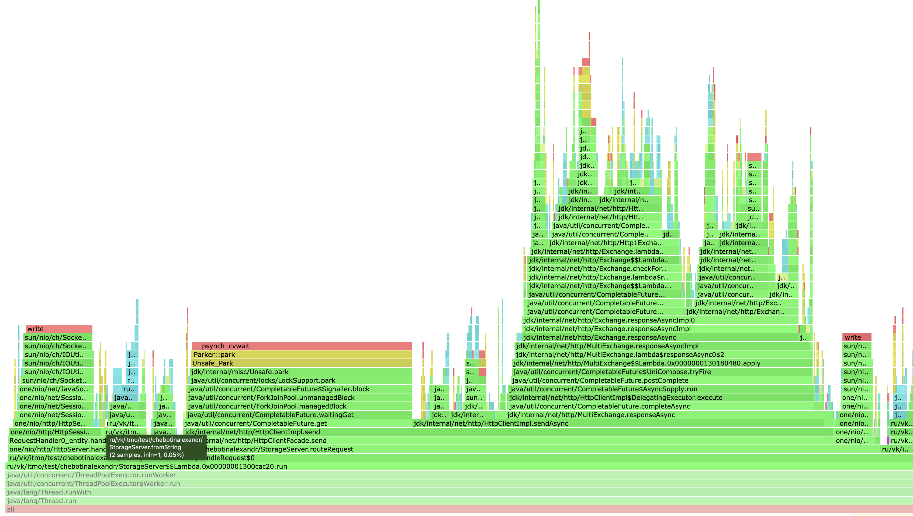
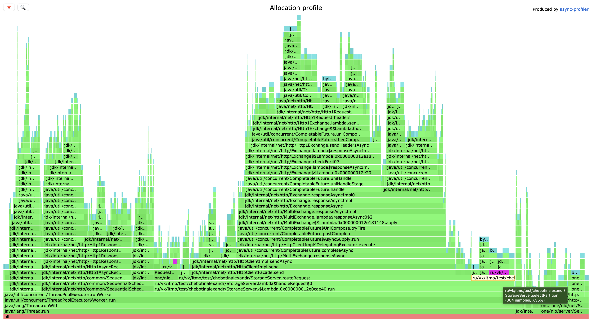
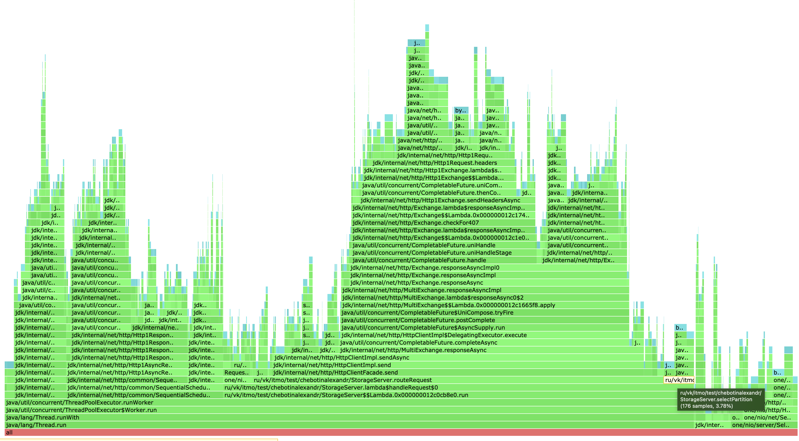
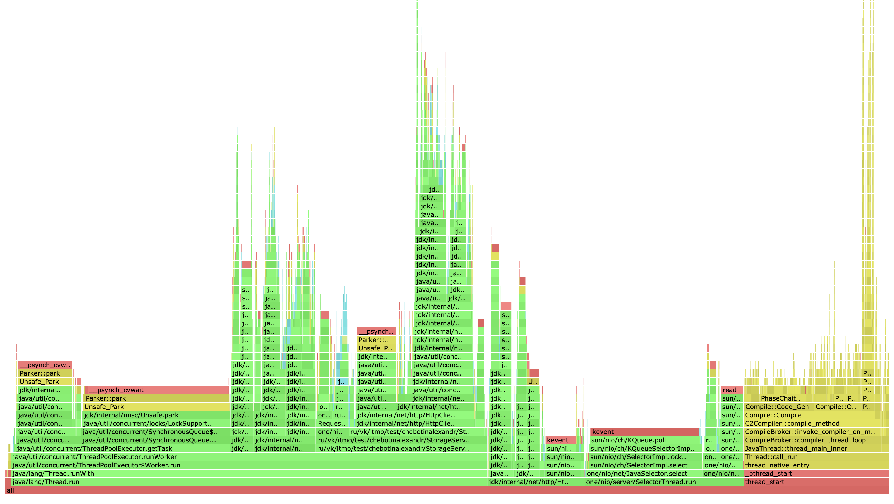
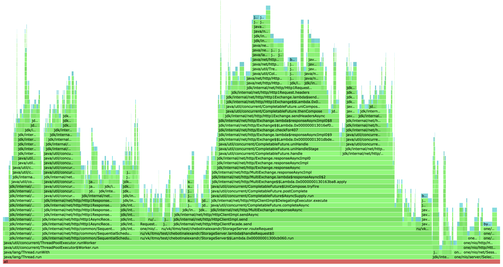
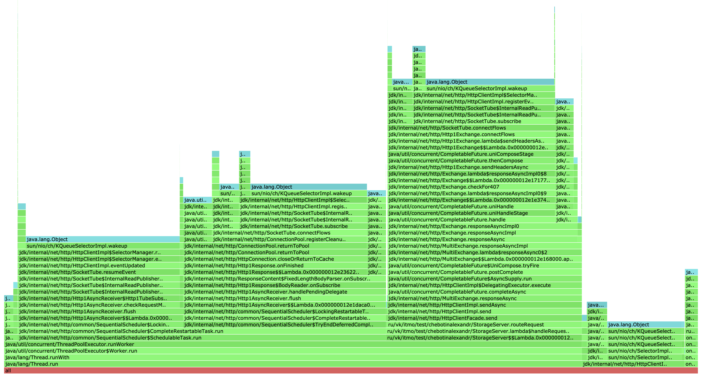
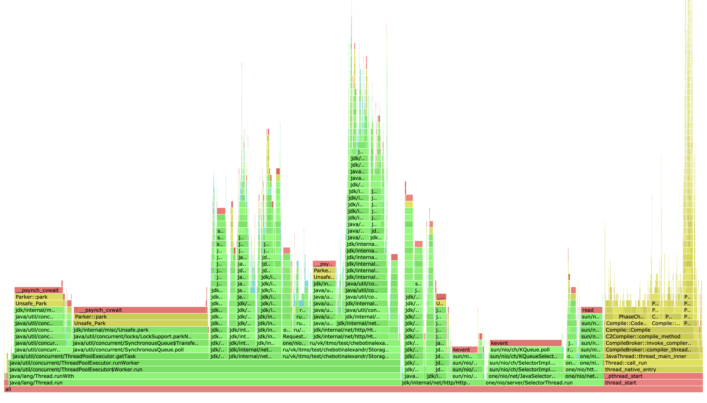
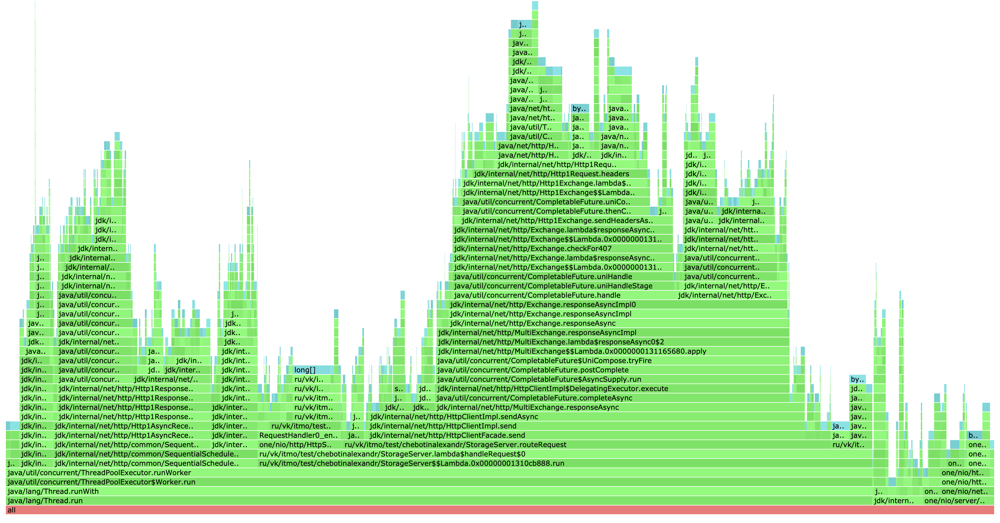
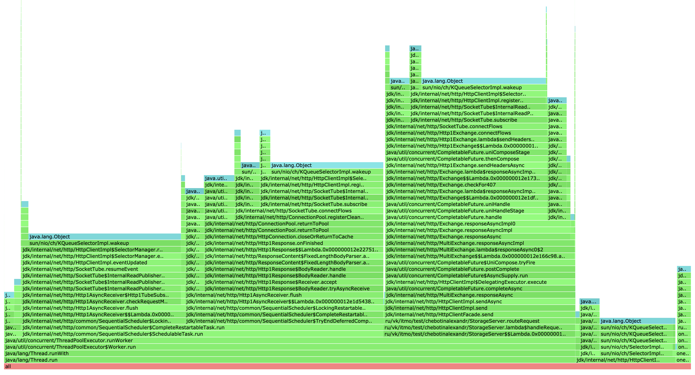

# Отчёт по "Этап 3. Шардирование"

### Хеш-функция: насколько данные распределяются равномерно?

В качестве хеш-функции для распределения по нодам была выбрана Murmur3, реализация взята из Cassandra и немного переделана. Обеспечивает более-менее равномерное распределение.

Протестируем равномерность распределения. При помощи wrk2 нагрузим нашу базу PUT-запросами. Будем использовать 10 нод, чтобы лучше увидеть как данные распределяются между нодами. После нагрузки вычислим размер занимаемых SSTable каждой ноды. Ключи, генерируемые Lua скриптом, случайные.

```
du -sh *

80M	tmp.8080
80M	tmp.8081
80M	tmp.8082
79M	tmp.8083
79M	tmp.8084
80M	tmp.8085
79M	tmp.8086
79M	tmp.8087
79M	tmp.8088
81M	tmp.8089
```

Вывод: исходя из размера файлов на диске, распределение достаточно равномерно. 


### Latency: что с ним стало?

В дальнейших исследованиях будем использовать кластер из 3-ех нод. Порог на flush тот же самый - 4 МБ. На прошлом этапе база без шардирования давала следующие показатели (точки разладки):


| | SYNCHRONOUS |  ASYNCHRONOUS    | 
|--|----------------|-----------------|
| PUT MAX RPS            | 40k            | 130k |
| GET MAX RPS            | 30k            |  100k |


В случае с добавлением шардирования мы должны ожидать снижение RPS который может выдерживать сервер, связанное с необходимостью сервера проксировать запросы другим нодам по HTTP. Кроме того, если в кластере будет большое количество нод, то вероятность попасть сразу в нужную ноду снижается. (1/N вероятность попасть сразу в нужную ноду в предположении что ключи там распределены равномерно). 

Много общаться с другими нодами мы не хотим поэтому пусть их число будет 3.

Детательным регулированием нагрузки с шагом в 500 rps была определена точка разладки для PUT-запросов - где-то в окрестности значения 18 500 rps:

```
./wrk -c 64 -d 20 -t 4 -L -R 18500 -s upsert-script.lua http://localhost:8080


Thread Stats   Avg      Stdev     Max   +/- Stdev
Latency    10.31ms   45.81ms 712.70ms   95.95%
Req/Sec     4.85k    13.38     4.87k    50.00%

Latency Distribution (HdrHistogram - Recorded Latency)
90.000%    3.09ms
99.000%  266.24ms
99.900%  509.18ms
99.990%  672.77ms
99.999%  709.63ms
100.000%  713.22ms
```

Точно таким же образом была определена точка разладки и для GET-запросов: где-то в окрестности 17 000 rps:

```
./wrk -c 64 -d 20 -t 4 -L -R 17000 -s get-script.lua http://localhost:8080


Thread Stats   Avg      Stdev     Max   +/- Stdev
Latency     2.10ms    3.68ms  42.85ms   94.45%
Req/Sec     4.25k     0.00     4.25k
     0.00%
Latency Distribution (HdrHistogram - Recorded Latency)
90.000%    2.52ms
99.000%   22.16ms
99.900%   34.62ms
99.990%   39.30ms
99.999%   41.02ms
100.000%   42.88ms
```

*Замечание*. Для GET-запросов база данных наполнялась почти таким же образом, как и в прошлых этапах:

1) Генерировался случайный и уникальный набор ключей и значений (k,v).
2) Фиксировалось заранее количество SSTable в каждой ноде.
3) База наполняется этими (k,v) с учетом хеширования, при этом происходят флаши в каждой ноде

Таким образом, после инициализации мы имеем заполненную базу данных с тремя нодами, а количество таблиц на диске у каждой ноды примерно равно заданному (в моем случае я выбрал по 100 таблиц на ноду). База наполняется программно. Далее ее можно тестировать GET-запросами. Такое наполнение базы является "честным". 

Обработка GET-запросов опять же не сильно отстает от PUT-запросов, поскольку в мои SSTable встроен фильтр Блума. Итого:

| | SYNCHRONOUS |  ASYNCHRONOUS    | ASYNCHRONOUS + SHARDING |
|--|----------------|-----------------|-------------------------|
| PUT MAX RPS            | 40k            | 130k | 18 500                  |
| GET MAX RPS            | 30k            |  100k | 17 000               |   


### Оптимизации

Попробуем применить некоторые оптимизации.
Рассмотрим профили под нагрузкой. Посмотрим что можно соптимизировать а в конце проведем итоговый анализ. 

Профиль приложения под PUT-нагрузкой, CPU:



Профиль приложения под PUT-нагрузкой, alloc:



Из профилей выше видно, что в методе `selectPartition()` есть аллокации (7.35%), где в методе `fromString()` происходит 3.33% из них. Это метод, который из строки получает MemorySegment а далее хеширует сегмент:

```
    private static MemorySegment fromString(String data) {
        return MemorySegment.ofArray(data.getBytes(StandardCharsets.UTF_8));
    }
```

Избавимся от него, таким образом будем хешировать сразу строку вместо MemorySegment. Отпрофилируем заново в аналогичных условиях:



Таким образом, после оптимизации я сократил аллокации возникающие в алгоритме хеширования с 7.35% до 3.78%. 

Еще насчет оптимизаций - можно было бы не считать хеш два раза, а например сразу класть в ноду entry когда она прилетает от мастер ноды.


### Анализ профилирования


#### PUT, cpu



Сравнивая данный профиль с нераспределенной версией, к тред пулу и селектор тредам добавляется `HttpClientImpl$SelectorManager`, достающий из очереди задачи клиента. Также добавляются `InternalWriteSubscriber` и `SequentialScheduler.SchedulableTask` из пакета `jdk.http`. 

#### PUT, alloc



Сравнивая данный профиль с нераспределенной версией, очевидно появились аллокации в селектор треде связанные с проксированием запроса другой ноде.

#### PUT, lock



Сравнивая данный профиль с нераспределенной версией, где в SelectorThread было 16.81% локов, сейчас их там всего 1.94%. Но добавилось 14.79% локов в `HttpClientImpl$SelectorManager`. 

#### GET, cpu



Сравнивая данный профиль с нераспределенной версией, как и в PUT-запросал появился `HttpClientImpl$SelectorManager`. 

#### GET, alloc




#### GET, lock




