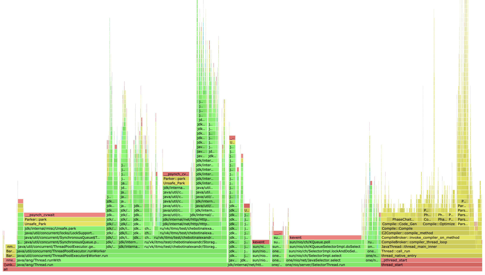
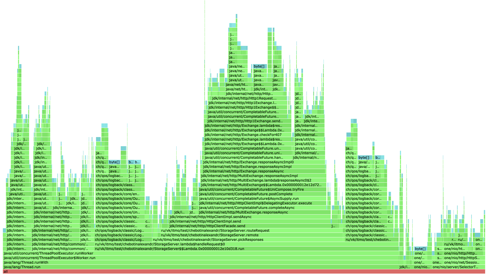
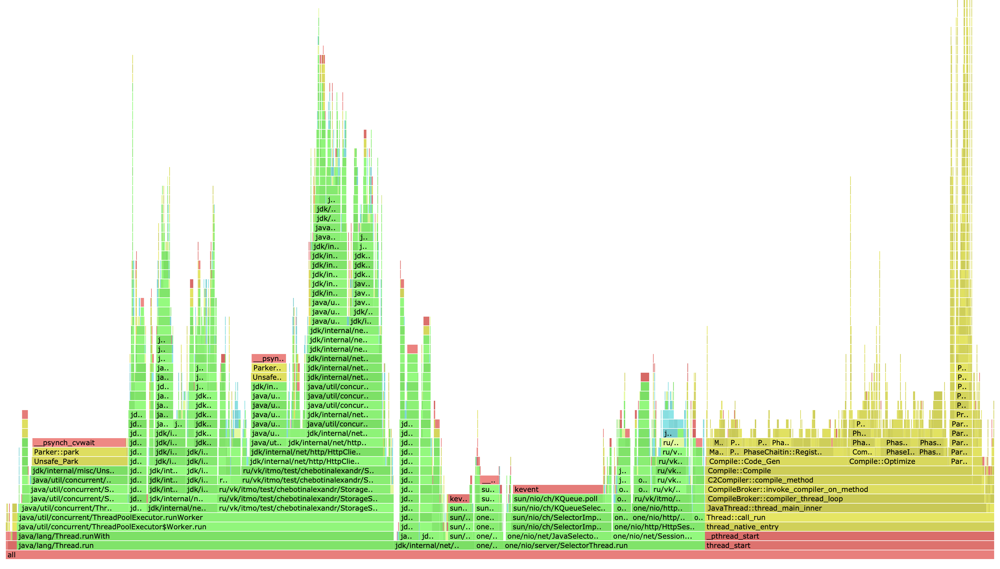
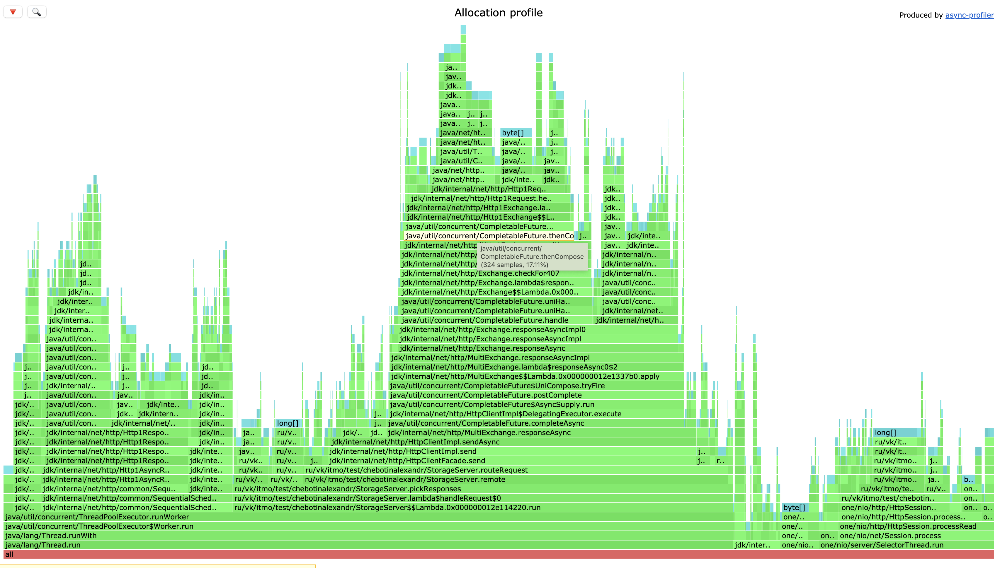
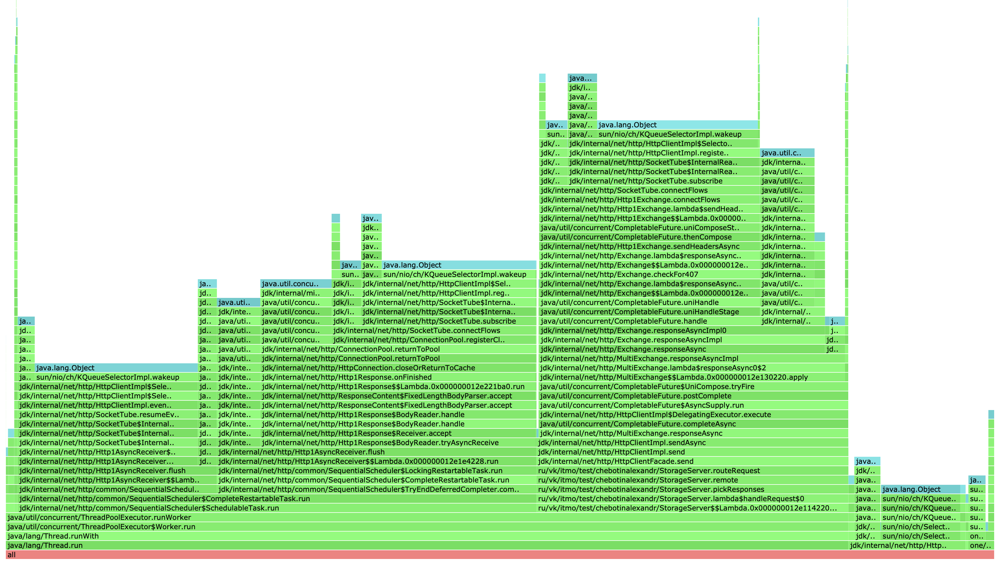

# Отчёт по "Этап 4. Репликация"

### Формат SSTable

В случае конфликтов, когда ноды возвращают разные ответы, был использован timestamp, таким образом
реализован last write wins. Формат SSTable был изменен для хранения timestamp.

SStable Header следующего формата:

| 8                     | 8                      | 8               |
|-----------------------|------------------------|-----------------|
| `Bloom filter length` | `Hash functions count` | `entries count` |

SStable Bloom filter следующего формата:

| 8      | 8      | ...       | 8      |
|--------|--------|-----------|--------|
| `hash_0` | `hash_1` | `hash_i...` | `hash_n` |

где `n` - размер фильтра Блума (`Bloom filter length`)

| 8 x entries count    | 8         | key size | 8           | value size | 8         |
|----------------------|-----------|----------|-------------|------------|-----------|
| `key_i offset` | `key size` | `key`      | `value size` | `value`      | `timestamp` |

где `i = 0, 1, ..., entries count`

Если же наша `entry` это `tombstone`, то `entry` записывается в следующем формате:

| 8         | key size | 8   | 8           |
|-----------|----------|-----|-------------|
| `key size` | key      | `-1` | `timestamp` |

где `-1` это tombstone tag. Таким образом в случае могилки, value не сохранится при `flush`, а `-1` подставляется на место value size.

Timestamp всегда фиксируется в мастер ноде и далее в случае proxy запроса передается вместе с proxy запросом другой ноде. 


### Latency: что с ним стало?

В дальнейших исследованиях будем использовать кластер из 3-ех нод, `ack/from = 2/3`. Порог на flush тот же самый - `4 МБ`. На прошлом этапе база без репликации давала следующие показатели (точки разладки):

|             | SYNCHRONOUS | ASYNCHRONOUS | ASYNCHRONOUS + SHARDING |
|-------------|-------------|--------------|-------------------------|
| PUT MAX RPS | 40k         | 130k         | 18 500                  |
| GET MAX RPS | 30k         | 100k         | 17 000                  |   


Детательным регулированием нагрузки с шагом в 500 rps была определена точка разладки для PUT-запросов:

```
./wrk -c 64 -d 20 -t 4 -L -R 1200 -s upsert-script.lua http://localhost:8080


  Thread Stats   Avg      Stdev     Max   +/- Stdev
    Latency     3.66ms    6.57ms  64.35ms   94.33%
    Req/Sec   308.50    129.79   380.00     83.33%
  Latency Distribution (HdrHistogram - Recorded Latency)
 90.000%    5.54ms
 99.000%   38.02ms
 99.900%   60.45ms
 99.990%   64.32ms
 99.999%   64.38ms
100.000%   64.38ms
```

Latency сильно просел, теперь точка разладки для PUT запросов составляет всего 1200 rps. 

Точно таким же образом была определена точка разладки и для GET-запросов:

```
./wrk -c 64 -d 20 -t 4 -L -R 400 -s get-script.lua http://localhost:8080


  Thread Stats   Avg      Stdev     Max   +/- Stdev
    Latency     6.43ms   10.05ms  80.77ms   92.93%
    Req/Sec    73.22     57.87   129.00     62.50%
  Latency Distribution (HdrHistogram - Recorded Latency)
 90.000%   11.86ms
 99.000%   57.66ms
 99.900%   78.46ms
 99.990%   80.83ms
 99.999%   80.83ms
100.000%   80.83ms
```

У нас в несколько раз просел rps, таким образом имеем следующее:

|             | SYNCHRONOUS | ASYNCHRONOUS | ASYNCHRONOUS + SHARDING | ASYNCHRONOUS + SHARDING + REPLICATION |
|-------------|-------------|--------------|-------------------------|---------------------------------------|
| PUT MAX RPS | 40k         | 130k         | 18 500                  | 1200                                  |
| GET MAX RPS | 30k         | 100k         | 17 000                  | 400                                   |

Добавление репликации сыграло критическую роль. Если в кластере будет еще больше нод - rps соответственно снизится. 
При дефолтных значениях параметров ack/from мы больше общаемся с другими нодами - возрастают затраты времени на 
отправку запросов и получение ответов. В случае GET запросов серверу необходимо в `ack` раз больше общаться по HTTP с другими нодами. 


### Анализ профилирования


#### PUT, cpu



Сравнивая данный профиль с версией без репликации, особых отличий нет, единственное, на профиле cpu реплицированной
версии видно, что ThreadPoolExecutor выполняет еще и отправку запросов другим нодам, помимо локальной обработки запроса. 


#### PUT, alloc



Сравнивая данный профиль с версией без репликации, особых отличий не наблюдается. 
Заметно, что в SelectorThread аллокации увеличились примерно на 2%. Это связано с методом
`parseTimestamp` для того, чтобы из заголовка ответа достать timestamp и далее производить сравнения
ответов разных нод. 

#### PUT, lock


Видно что в версии с репликацией значительно добавились локи при обработке запроса.
Можно улучшить данное решение, если внутреннее сетевое взаимодействие узлов сделать асинхронным, 
таким образом, если потоки не будут блокироваться, данный профиль изменится.

А сейчас, чем больше задач приходит воркерам, тем больше локов. 

#### GET, cpu



Особых изменений не наблюдается. 

#### GET, alloc



Здесь хорошо заметно что увеличились аллокации в пуле воркеров, связано это с общением с другими нодами.
Касательно того что под капотом Dao: во время профилирования база нагружалась 
GET-запросами с `ack/from = 2/3`, соответственно здесь немного больше работы по поиску на диске. Но все же эти аллокации не увеличились так, как аллокации во время работы по сети. 

#### GET, lock



Опять же появилось больше локов, связанных с общением нод. 


Подытоживая, имеем заметное ухудшение производительности, но теперь мы данные храним сразу на нескольких нодах, получив большую
отказоустойчивость. Можно поменять протокол на более эффективный,
можно переключить сетевое взаимодействие на асинхронное, чтобы избавиться
от блокировки потоков. 