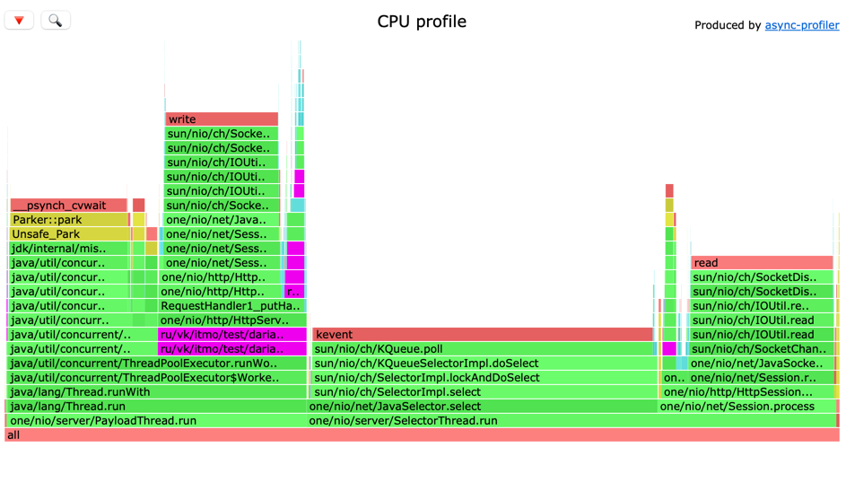
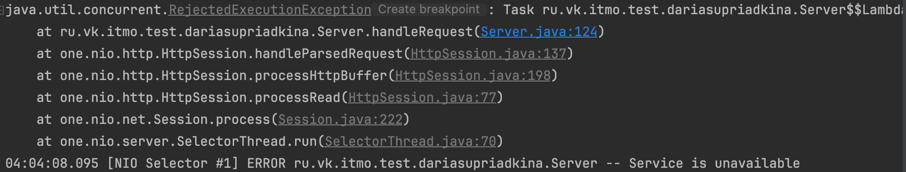

# Исследование и анализ нагрузочного тестирования и профилированя фсинхронного серверв

Количесиво ядер на машине: 8

Идея этого этапа сводится к тому, что мы виделяем обработку запросов в отдельный пул, освобождая таким образом SelectorThread от ряда 
работ 

Так как в прошлом этапе мои lua-скрипты были завязаны на глобальный каунтер, чтобы результаты данных исследований при условии использования нескольких рабочих тредов были 
максимально валидны, было решено переписать get-скрипты на доступ по рандомным айдишникам 
## Сервер из первого этапа
Для чистоты эксперемента снова определим точку разладки для get-запросов по рандомному ключу

Точка разладки с 12000 резко упала до ≈4800...


```
wrk -d 10 -t 1 -c 1 -R 4800  -L -s /Users/dariasupriadkina/IdeaProjects/2024-highload-dht/src/main/java/ru/vk/itmo/test/dariasupriadkina/scripts/getrand.lua http://localhost:8081
Running 10s test @ http://localhost:8081
  1 threads and 1 connections
  Thread Stats   Avg      Stdev     Max   +/- Stdev
    Latency   127.88ms   52.72ms 216.06ms   63.85%
    Req/Sec        nan       nan   0.00      0.00%
  Latency Distribution (HdrHistogram - Recorded Latency)
 50.000%  138.88ms
 75.000%  172.03ms
 90.000%  195.58ms
 99.000%  214.66ms
 99.900%  215.94ms
 99.990%  216.19ms
 99.999%  216.19ms
100.000%  216.19ms
```

Но это, пожалуй, для меня была не самая шокирующая новость. Оказалось, что мой усовершенствованный сервер, который 
выделяет от селектор-тредов выиграл в возможной нагрузке совсем немного

Его точка разладки равнялась ≈5100

```
wrk -d 10 -t 1 -c 1 -R 5200  -L -s /Users/dariasupriadkina/IdeaProjects/2024-highload-dht/src/main/java/ru/vk/itmo/test/dariasupriadkina/scripts/getrand.lua http://localhost:8080
Running 10s test @ http://localhost:8080
  1 threads and 1 connections
  Thread Stats   Avg      Stdev     Max   +/- Stdev
    Latency    68.81ms   39.35ms 144.38ms   59.73%
    Req/Sec        nan       nan   0.00      0.00%
  Latency Distribution (HdrHistogram - Recorded Latency)
 50.000%   71.68ms
 75.000%   97.98ms
 90.000%  124.80ms
 99.000%  142.21ms
 99.900%  144.25ms
 99.990%  144.51ms
 99.999%  144.51ms
100.000%  144.51ms
```

На 4800 он при этом работал прекрасено 

```
wrk -d 10 -t 1 -c 1 -R 4800  -L -s /Users/dariasupriadkina/IdeaProjects/2024-highload-dht/src/main/java/ru/vk/itmo/test/dariasupriadkina/scripts/getrand.lua http://localhost:8080
        Running 10s test @ http://localhost:8080
        1 threads and 1 connections
        Thread Stats   Avg      Stdev     Max   +/- Stdev
        Latency     2.22ms    3.54ms  25.14ms   93.55%
        Req/Sec        nan       nan   0.00      0.00%
        Latency Distribution (HdrHistogram - Recorded Latency)
        50.000%    1.22ms
        75.000%    2.02ms
        90.000%    4.09ms
        99.000%   21.45ms
        99.900%   24.66ms
        99.990%   25.05ms
        99.999%   25.15ms
        100.000%   25.15ms
```


Сначала это показалось странным, однако потом стало ясно, что возможно это завязано на том факте, что количество 
селектор-тредов по умолчанию создается по количеству процессоров на машине. Точно такое же значение я задала для количество 
тредов в пуле воркеров. То есть, фактически, у нас как было 8 потоков, в которых исполнялась бизнес-логика, так и осталось 8 
потоков, в которых выполняется бизнес-логика. Так как в случае с рандомными get-запросами без блум-фильтра и каких-либо еще оптимизаций обеспечения 
рандомного чтения сама бизнес логика может составлять большой процент времени и cpu, то вероятнее всего в этом случае мы на это и нраткнулись. 
Ограничение крылось в ограничении возможностей модуля, отвечающего за логику

Об этом вероятно, может свидеельствовать и то, что никакие и зменения с точки зрения параметров запуска wrk -t (треды) и -c (connections)
не меняли ситуацию (пробовала и на 64 конекшена, как укакзано в тз и много чего другого, но везде отличия в максимум 500rps)


Как видно на скрене, большую часть ресурсов отъедала именно работа worker'ов
Сразу захотелось предположить, что, если мы немного увеличим количество потоков в тред-пуле, то ситуация может изменитьбся в лучшую сторону

попробуем количество тредов в пуле worker'ов с 8 на, допустим, 12

```
wrk -d 10 -t 1 -c 1 -R 4700  -L -s /Users/dariasupriadkina/IdeaProjects/2024-highload-dht/src/main/java/ru/vk/itmo/test/dariasupriadkina/scripts/getrand.lua http://localhost:8080
Running 10s test @ http://localhost:8080
  1 threads and 1 connections
  Thread Stats   Avg      Stdev     Max   +/- Stdev
    Latency    48.99ms   36.73ms 128.32ms   60.81%
    Req/Sec        nan       nan   0.00      0.00%
  Latency Distribution (HdrHistogram - Recorded Latency)
 50.000%   43.20ms
 75.000%   74.62ms
 90.000%  106.94ms
 99.000%  124.35ms
 99.900%  127.87ms
 99.990%  128.25ms
 99.999%  128.38ms
100.000%  128.38ms
```
Результат - так себе... 
Но этого, вероятно, следовало ожидать, так как одномоментно в системе может выполняться только то количетво потоков, сколько ядер имеется в системе

(P.S. возможно, утверждение не совсем справедливо для intel, котороый обладает технологией hyper-threading, но у меня arm и, насколько я поняла, здесь такого нет, здесь большое количество ядер)

В данном случае, вероятнее всего, ресурсы тратятся на переключение между потоками исполнения, что уменьшает производительность


Попробуем проделать аналогичные действия для put-запросов. Будем совершать upsert с 64 тредами wrk и с 64 connections на пустой базе


Сервер из 2го этапа - максимальный rps - 108000
```
wrk -d 10 -t 8 -c 64 -R 108000  -L -s /Users/dariasupriadkina/IdeaProjects/2024-highload-dht/src/main/java/ru/vk/itmo/test/dariasupriadkina/scripts/upsert.lua http://localhost:8080
Running 10s test @ http://localhost:8080
  8 threads and 64 connections
  Thread Stats   Avg      Stdev     Max   +/- Stdev
    Latency    51.51ms   91.59ms 871.42ms   90.91%
    Req/Sec        nan       nan   0.00      0.00%
  Latency Distribution (HdrHistogram - Recorded Latency)
 50.000%   22.70ms
 75.000%   50.21ms
 90.000%  132.86ms
 99.000%  467.71ms
 99.900%  766.98ms
 99.990%  818.17ms
 99.999%  870.91ms
100.000%  871.93ms

```

Сервер из 1го этапа - 110000rps

```
wrk -d 10 -t 8 -c 64 -R 110000  -L -s /Users/dariasupriadkina/IdeaProjects/2024-highload-dht/src/main/java/ru/vk/itmo/test/dariasupriadkina/scripts/upsert.lua http://localhost:8081
Running 10s test @ http://localhost:8081
  8 threads and 64 connections
  Thread Stats   Avg      Stdev     Max   +/- Stdev
    Latency    22.01ms   39.77ms 294.66ms   88.20%
    Req/Sec        nan       nan   0.00      0.00%
  Latency Distribution (HdrHistogram - Recorded Latency)
 50.000%    3.40ms
 75.000%   23.39ms
 90.000%   71.42ms
 99.000%  190.08ms
 99.900%  262.91ms
 99.990%  279.55ms
 99.999%  293.38ms
100.000%  294.91ms

```

При этом асинхронный сервер прям вообще не держит нагрузку в 110rps...

```
wrk -d 10 -t 8 -c 64 -R 110000  -L -s /Users/dariasupriadkina/IdeaProjects/2024-highload-dht/src/main/java/ru/vk/itmo/test/dariasupriadkina/scripts/upsert.lua http://localhost:8080
Running 10s test @ http://localhost:8080
  8 threads and 64 connections
  Thread Stats   Avg      Stdev     Max   +/- Stdev
    Latency   117.98ms  131.08ms   1.02s    85.08%
    Req/Sec        nan       nan   0.00      0.00%
  Latency Distribution (HdrHistogram - Recorded Latency)
 50.000%   69.82ms
 75.000%  165.63ms
 90.000%  304.89ms
 99.000%  554.50ms
 99.900%  927.74ms
 99.990%    1.02s 
 99.999%    1.02s 
100.000%    1.02s 
Requests/sec: 107853.16
```

Снимем профили для локов и для cpu

## Сервер 1 этапа - СPU


Фиолетовым выделена бизнес-логика, она занимает параядка 3% (upsert, handler…)
Все остальное - работа one-nio (select, session.process)

## Сервер 1 этапа - LOCK


90% локов приходится на upsert (из селектор-тредов) и 10% - flush (отдельный поток)

## Сервер 2 этапа - СPU



Фиолетовым выделена часть, отеосящаяся непосредмственно к разработанному в рамках данного этар па кода:

requestHandler занимает 18%

бизнес-логика занимает также параядка 3% (upsert)

Можно заметить, что немало ресурсов тратится на ThreadPoolExecutor.getTask() и 
соответственно другие сопутствующие методы по сопровождению работы с пулами потоков и непосредственно потоков 
(ArrayBlockingQueue.take, managedBlock...)- 18%

Здесь работа внутри воркеров 
## Сервер 2 этапа - LOCK


Здесь видно, что handleRequest() забирает 40% локов

Исходя из профилирования, можно попробовать сделать вывод, что всему виной могут быть ресурсы, требуемые для работы с 
потоками и пулами потоков

Также можно обвинить wrk в том, что он отжероает часть ресурсов (особенно это касается потоков)

Теперь попробуем поманипулировать данными, чтобы понять, как такие параметры ExecutorService, как размер очереди и 
количество тредов влияют на работу системы

Будем разбираться на get-запросах 

## Количество тредов 

Найдем максимальную пропускную способность на get-запросах для 64 соединений и 8 тредов

Сервер начинает терять запросы на ≈62000rps

```
wrk -d 10 -t 8 -c 64 -R 62000  -L -s /Users/dariasupriadkina/IdeaProjects/2024-highload-dht/src/main/java/ru/vk/itmo/test/dariasupriadkina/scripts/getrand.lua http://localhost:8080
Running 10s test @ http://localhost:8080
  8 threads and 64 connections
  Thread Stats   Avg      Stdev     Max   +/- Stdev
    Latency     1.42ms    1.30ms  69.18ms   95.15%
    Req/Sec        nan       nan   0.00      0.00%
  Latency Distribution (HdrHistogram - Recorded Latency)
 50.000%    1.23ms
 75.000%    1.69ms
 90.000%    2.23ms
 99.000%    5.41ms
 99.900%   16.77ms
 99.990%   42.37ms
 99.999%   64.99ms
100.000%   69.25ms
```


О количеством потоков в тред-пуле, превышающем количество ядер уже размышлялось выше
Теперь попробуем сильно уменьшить количество потоков. Оставим только 2 потока. RPS - 47000. 
Значительно уменьшилась

```
wrk -d 10 -t 8 -c 64 -R 47000  -L -s /Users/dariasupriadkina/IdeaProjects/2024-highload-dht/src/main/java/ru/vk/itmo/test/dariasupriadkina/scripts/getrand.lua http://localhost:8080
Running 10s test @ http://localhost:8080
  8 threads and 64 connections
  Thread Stats   Avg      Stdev     Max   +/- Stdev
    Latency    65.25ms   39.65ms 147.33ms   55.78%
    Req/Sec        nan       nan   0.00      0.00%
  Latency Distribution (HdrHistogram - Recorded Latency)
 50.000%   65.92ms
 75.000%  101.95ms
 90.000%  117.63ms
 99.000%  131.58ms
 99.900%  142.85ms
 99.990%  146.69ms
 99.999%  147.33ms
100.000%  147.46ms

```

### CPU


## Размер очереди 

Сепйчас очередь установлена в 1024, посмотрим, что произойдет, если ее значительно уменьшить, оставив все характеристики предыдущих замеров на 8 потоков thread-pool с пиковой нагрузкуой в 62000rps.
Сделаем равной 10

### LOCK


Как видно, много лочек взял на себя логгер

Очередь быстро переполняется и выбрасывается исключение RejectedException



#### FunFact

При попытке запустить upsert на ресурсах wrk равных: -t 64 -c 64 лично у меня ни одна таблица не сфлашилась :(

По профилям нагрузки было заметно, что при увеличении коннектов и тредов wrk страдаеь flush.

Его %CPU варьировался от 2% до 0% (полного отсутствия)


