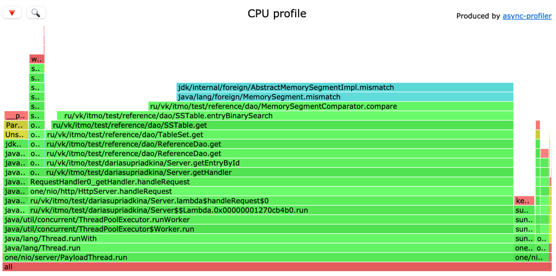

# Исследование нагрузочного тестирования и профилирования шардированного распределенного кластера

Количество ядер на машине: 8

Шардирование может производиться с целью:
1. Распределить нагрузку на разные машины - доступ к разным данным означает обращение к разным машинам (в случае, если 
шарды разнесены на разные физические узлы), что означает и использование разных дисков и т.п.  
2. Повысить надежность (в случае, если данные хранятся не на одной физической машине, отказ одного узла не приводит 
к сбою работы в остальных)
3. Увеличить скорость доступа к данным (?) - казалось бы логично, вместо того, чтобы последовательно осуществлять бин-поиск 
по всем sstable, начиная от самых новых записей, заканчивая самыми старыми. Мы будем совершать расчет значения 
hash-функции по ключу, после чего идти на конкретную ноду, где в случае обеспечения равномерного соединения, данных будет 
≈ Общее количество данных / количество нод, что может уменьшить бин-поиск в разы. Однако это утверждение езе предстоит проверить 
с помощью нагрузочного тестирования и анализа профилирования. 

## Наполнение базы данных

Во время наполнения базы данных для проведения нагрузочного тестирования на get-запросах был мгновенно обнаружен дефект.

Данные распределялись неравномерно по нодам кластера. Если быть точнее, то все данные уходили на одну единственную ноду - 
первую. 


При дальнейшем рассмотрении проблемы, было выяснено, что корень крылся в используемой функции хеширования.

Изначально в реализации использовался обычный hashCode(), а при изменении функции на murmurhash3, распределение сразу стало 
в достаточной степени равномерным:


Так произошло потому что, судя по функции встроенного hashCode() для строки, он должен сгенерировать близкие друг к другу по значению
хеш-коды

Выведя эти самые коды на экран во время выполнения программы, я в этом убедилась 

```
1826280870
1826280871
1826282784
1826282785
1826282786
1826282787
1826282788
1826282789
1826282790
1826282791
1826282792
1826282793
1826259720
1826259721
1826259722
1826259723
1826259724
1826259725
1826259726
1826259727
1826259728
1826259729
1826281823
1826281824
1826281825
1826281826
1826281827
1826281828
1826281829
1826281830
1826281831
1826281832
```
Такое поведение в совокупности с алгоритмом ConsistentHash, дает некоторую "скученность" нод: они все сконцентрированы на относительно небольшом промежутке и находятся достаточно "плотно" 
друг к другу, из-за чего, когда к нам прилетает рандомный ключ, то с сильно-большей вероятностью он попадет в промежуток вне 
отрезка сгенерированных хеш-кодов и по алгоритму пойдет на ближайшую ноду по часовой стрелке, которая всегда одна и та же

Как показано на картинке:


## Нагрузочное тестирование
### PUT-запросы по рандомным ключам
Наученные предыдущим опытом, тестировать будем на одном потоке wrk в 64 конекшена

Точка разладки при таких параметрах ≈25000rps

60s
```
wrk -d 60 -t 1 -c 64 -R 25000 -L -s /Users/dariasupriadkina/IdeaProjects/2024-highload-dht/src/main/java/ru/vk/itmo/test/dariasupriadkina/scripts/upsert.lua http://localhost:8080
  Latency Distribution (HdrHistogram - Recorded Latency)
 50.000%   23.71ms
 75.000%   73.34ms
 90.000%  102.27ms
 99.000%  145.66ms
 99.900%  182.01ms
 99.990%  190.21ms
 99.999%  196.48ms
100.000%  199.42ms
```

120s
```
wrk -d 120 -t 1 -c 64 -R 25000 -L -s /Users/dariasupriadkina/IdeaProjects/2024-highload-dht/src/main/java/ru/vk/itmo/test/dariasupriadkina/scripts/upsert.lua http://localhost:8080
Latency Distribution (HdrHistogram - Recorded Latency)
 50.000%   24.16ms
 75.000%   71.55ms
 90.000%   99.26ms
 99.000%  147.84ms
 99.900%  186.24ms
 99.990%  203.65ms
 99.999%  238.59ms
100.000%  256.25ms
```
180s
```
wrk -d 180 -t 1 -c 64 -R 25000 -L -s /Users/dariasupriadkina/IdeaProjects/2024-highload-dht/src/main/java/ru/vk/itmo/test/dariasupriadkina/scripts/upsert.lua http://localhost:8080
Latency Distribution (HdrHistogram - Recorded Latency)
 50.000%   16.94ms
 75.000%   68.48ms
 90.000%   96.77ms
 99.000%  132.22ms
 99.900%  170.75ms
 99.990%  195.46ms
 99.999%  207.10ms
100.000%  215.29ms
```
При таких параметрах сервер с течением времени не деградирует,
чего нельзя сказать о нагрузке в 26000rps

120s
```
wrk -d 120 -t 1 -c 64 -R 26000 -L -s /Users/dariasupriadkina/IdeaProjects/2024-highload-dht/src/main/java/ru/vk/itmo/test/dariasupriadkina/scripts/upsert.lua http://localhost:8080
  Latency Distribution (HdrHistogram - Recorded Latency)
 50.000%  120.13ms
 75.000%  912.38ms
 90.000%    1.30s
 99.000%    1.45s
 99.900%    1.51s
 99.990%    1.55s
 99.999%    1.57s
100.000%    1.59s
```


### GET-запросы по рандомным ключам

Проведем нагрузочное тестирование на get-запросах на предварительно заполненной бд


Точка разладки: ≈33000rps

30s
```
wrk -d 30 -t 1 -c 64 -R 33000 -L -s /Users/dariasupriadkina/IdeaProjects/2024-highload-dht/src/main/java/ru/vk/itmo/test/dariasupriadkina/scripts/getrand.lua http://localhost:8080
  Latency Distribution (HdrHistogram - Recorded Latency)
 50.000%    4.38ms
 75.000%    8.67ms
 90.000%   11.61ms
 99.000%   15.96ms
 99.900%   26.09ms
 99.990%   29.26ms
 99.999%   38.49ms
100.000%   42.69ms
```

120s
```
wrk -d 120 -t 1 -c 64 -R 33000 -L -s /Users/dariasupriadkina/IdeaProjects/2024-highload-dht/src/main/java/ru/vk/itmo/test/dariasupriadkina/scripts/getrand.lua http://localhost:8080
  Latency Distribution (HdrHistogram - Recorded Latency)
 50.000%    4.25ms
 75.000%    8.65ms
 90.000%   11.57ms
 99.000%   17.26ms
 99.900%   26.98ms
 99.990%   35.30ms
 99.999%   42.91ms
100.000%   56.67ms
```

При таких параметрах, как видно в таблицах, сервер не деградирует, чего нельзя сказать о нагрузке в 34000rps

30s
```
Latency Distribution (HdrHistogram - Recorded Latency)
 50.000%    7.40ms
 75.000%   11.14ms
 90.000%   14.46ms
 99.000%   25.74ms
 99.900%   33.05ms
 99.990%   45.82ms
 99.999%   49.12ms
100.000%   50.17ms

```

120s
```
Latency Distribution (HdrHistogram - Recorded Latency)
 50.000%    8.72ms
 75.000%   15.05ms
 90.000%   87.68ms
 99.000%  150.14ms
 99.900%  198.53ms
 99.990%  217.22ms
 99.999%  223.49ms
100.000%  226.81ms
```
### Сравнение с предыдущей версией

На одинаково заполненных базах данных (одинаковое количество записей) результаты следующие:

|            | Метод      | Выдерживает rps | latency (99.99) |
|------------|------------|-----------------|-----------------|
| Сервер HW2 | PUT        | 70000rps        |195.46ms         |
| Сервер HW3 | PUT        | 25000rps        |10.29ms          |
| Сервер HW2 | GET-random | 40000rps        |8.78ms           |
| Сервер HW3 | GET-random | 33000rps        |35ms             |

Как видно из сравнительной таблицы, с точки зрения задержек и максимального rps 
в третьей лабораторной работе не удалось выйграть по сравнению со второй

Выглядит вообще так, что мы значительно во всем проиграли с точки зрения перфоманса,
причины должны будут стать понятны при проведении профилирования


## Профилирование - PUT
Первое, в чем будем разбираться - что случилось с PUT? 
Почему latency значительно увеличилось, а rps уменьшился

### CPU


Новые накладные расходы:
* Новый метод handleProxy, отвечающий за редирект запроса на другую ноду, занимает ≈12%
  (внутри этого метода методы HttpClient - sendAsync, также CompletableFuture.get и одновременно с этим видно, как мы 
  вызывваем блокировки)
* Работа HttpClient
  * SelectorManager - ≈8%
  * DelegatingExecutor (внутри которого исполняется SchadulableTask) ≈4%
  * AsyncSupply ≈8% (внутри которого responseAsync)
* ArrayBlockingQueue.take ≈20%, внутри которого у нас также вызываются блокировки ё
(с учетом работы http-клиента, блокировки на очереди у нас не только у worker-тредов, но и у executor'а самого http-клиента)

Бизнес-логика здесь занимает немного - Memtable.upsert - 0,63%, flush, запись в SSTable и
получение ноды по id (где мы применяем ConsistentHashing) также менее 1%

В самом низу мы видим, что огромная доля работы у нас приходится именно на поддержание работы тредов
Worker.run (58,35%) в нашем случае объединяет в себе 2 executor'а: worker-executor и node-executor (http-клиента)
Точнее даже больше - все 6, так как у нас в приложении 3 ноды кластера, где каждая - отдельный инстанс сервера
со своими пулами тредов

Большое количество тредов также, вероятно может влиять на производительность системы. Одномоментно на мошине может 
исполняться столько потоков, сколько в ней ядер. На моей машине их 8 => 8 потоков. Все остальное - переключение между исполняемыми потоками

### Alloc


С аллокациями дело обстоит весьма похожим образом, что и в CPU, образом

Здесь лишь меньше выражен SelectorManager, а затраты на треды-исполнители (worker-executor'ы и node-executor'ы) 
занимают почти 90%
### Lock 


89% локов уходит на работу с сетью (опять победа в ожидании получения блокировок у методов, связанных с сетью)
8% - ThreadPoolExecutor.getTask()


## Профилирование - GET-random
У Get-запросов все происходит аналогичным образом, как и у PUT, что вполне логично. Ведь все, чем они отличаются - это бизнес-логикой.
У Get-random благодаря бин-поискам она более затратна, но ничем больше они не отличаются. 

Так как в самом начале было предположение, что шардирование вполне могло бы помочь нам увеличить performance get-запросов, 
то имеет смысл поподробнее остановиться лишь на профиле CPU

### CPU


Основной метод бизнес-логики, с помощью которого мы получаем значение сущности по ключу занимае ≈10.5% (903 samples)

В прошлой лабораторной работе это занимало намного больше:


Вероятно, сам поиск сущности по ключу и оптимизировался таким образом, но из-за затрат на работу с http, общего выиграша - не получилось 

Хотя, нужно конечно отметить, что из-за получившейся оптимизации метода получения сущности, сам
performance get-запроса пострадал не так сильно, как PUT

Если нагрузка, которую сервис может держать при PUT-запросах уменьшилась в несколько раз,
то при GET-запросах всего на 17,5%

*Во всех профилях фиолетовым отмечен пользовательский код

## Выводы

С помощью шардирования мы можем:
1. Достичь большей доступности сервиса - так как, если одна из машин, на которой работает экземпляр сервера недоступна, то недоступна только часть данных,
остальные ноды это никак не затрагивает *в идеале конечно, но не в случае, когда все ноды расположены на одной машине, как в этой лабе*
2. Горизонтального масштабирования - так как мы распределяем ресурсы между несколькими машинами *в идеале конечно, но не в данной лабе*. 

Здесь мы завязаны на возможности одной конкретной машине и можем распоряжаться только ее ресурсами. 
Даже число используемых потоков у нас изменяется как _число_нод_ * _число_потоков_в_одной_ноде_. 

Возможно, можно добиться некоторых оптимизаций, если попытаться поиграться количеством создаваемых worker-threads, node-threads, selector_threads...


Из скриншотов visualVM видно, что некоторые треды http-клиента вообще не получили процессорное время. То же можно сказать и про worker'ов, отвечающих за бизнес-логику.

3. Неправильно выбранная хеш-функция может сломать всю суть шардирования и в таком случае все, что мы получим - накладные расходы на сеть, если будем обращаться не к той ноде
