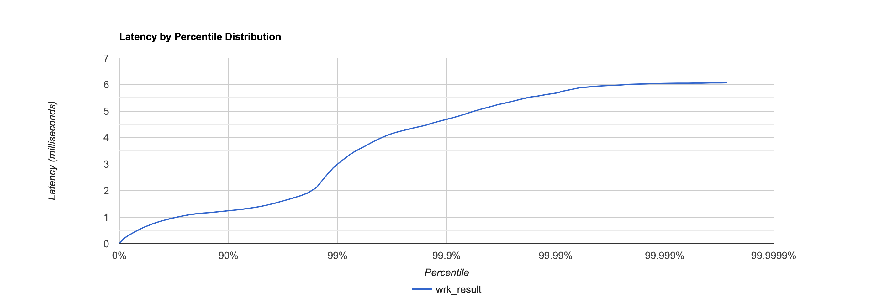
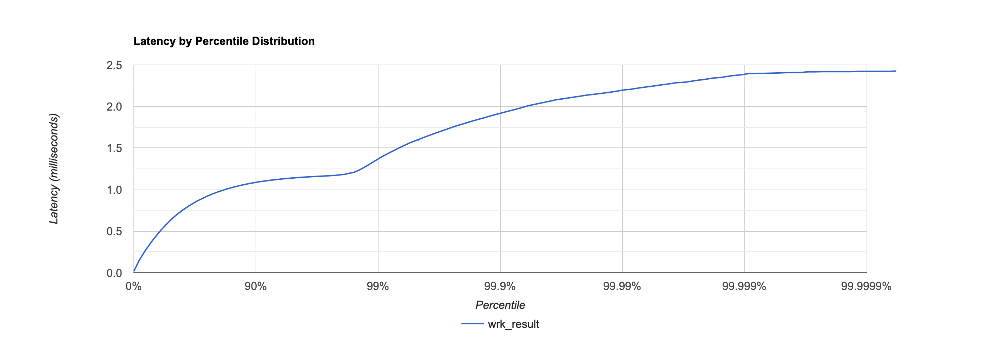

# Этап 1. HTTP + storage

## Нагрузочное тестирование с использлванием wrk2

### PUT
Опытным путем найдем точку разладки для PUT запроса, чтобы положить сервер   

```
wrk2 -d 30 -t 1 -c 1 -R 38000 -L -s /Users/lena/2024-highload-dht/src/main/java/ru/vk/itmo/test/elenakhodosova/lua_scripts/put.lua http://127.0.0.1:8080
Running 30s test @ http://127.0.0.1:8080
  1 threads and 1 connections
  Thread calibration: mean lat.: 23.636ms, rate sampling interval: 61ms
  Thread Stats   Avg      Stdev     Max   +/- Stdev
    Latency   115.19ms   70.08ms 274.18ms   62.20%
    Req/Sec    37.88k     1.96k   43.93k    79.51%
  Latency Distribution (HdrHistogram - Recorded Latency)
 50.000%  106.30ms
 75.000%  167.42ms
 90.000%  223.49ms
 99.000%  266.49ms
 99.900%  273.92ms
 99.990%  274.43ms
 99.999%  274.43ms
100.000%  274.43ms

#[Mean    =      115.187, StdDeviation   =       70.082]
#[Max     =      274.176, Total count    =       749908]
#[Buckets =           27, SubBuckets     =         2048]
----------------------------------------------------------
  1129565 requests in 30.00s, 72.17MB read
Requests/sec:  37652.46
Transfer/sec:      2.41MB


```
Примерно при 38000 RPS сервер перестает справляться с нагрузкой.

Проанализируем работу сервера при 32000 RPS в течение 60 секунд:
```
wrk2 -d 60 -t 1 -c 1 -R 32000 -L -s /Users/lena/2024-highload-dht/src/main/java/ru/vk/itmo/test/elenakhodosova/lua_scripts/put.lua http://127.0.0.1:8080
Running 1m test @ http://127.0.0.1:8080
  1 threads and 1 connections
  Thread calibration: mean lat.: 0.909ms, rate sampling interval: 10ms
  Thread Stats   Avg      Stdev     Max   +/- Stdev
    Latency   658.18us  450.89us   5.60ms   77.13%
    Req/Sec    33.87k     2.74k   49.44k    72.83%
  Latency Distribution (HdrHistogram - Recorded Latency)
 50.000%  656.00us
 75.000%    0.94ms
 90.000%    1.09ms
 99.000%    2.15ms
 99.900%    4.56ms
 99.990%    5.10ms
 99.999%    5.52ms
100.000%    5.60ms

  Detailed Percentile spectrum:
       Value   Percentile   TotalCount 1/(1-Percentile)

       0.017     0.000000            3         1.00
       0.145     0.100000       160339         1.11
       0.263     0.200000       321183         1.25
       0.388     0.300000       480077         1.43
       0.523     0.400000       640002         1.67
       0.656     0.500000       800090         2.00
       0.720     0.550000       880991         2.22
       0.779     0.600000       960201         2.50
       0.837     0.650000      1041291         2.86
       0.891     0.700000      1120839         3.33
       0.943     0.750000      1200404         4.00
       0.968     0.775000      1240304         4.44
       0.993     0.800000      1280751         5.00
       1.017     0.825000      1320910         5.71
       1.041     0.850000      1361011         6.67
       1.065     0.875000      1401223         8.00
       1.076     0.887500      1420085         8.89
       1.088     0.900000      1440344        10.00
       1.100     0.912500      1461398        11.43
       1.111     0.925000      1480485        13.33
       1.123     0.937500      1500972        16.00
       1.129     0.943750      1511413        17.78
       1.134     0.950000      1520303        20.00
       1.140     0.956250      1530649        22.86
       1.146     0.962500      1540548        26.67
       1.152     0.968750      1550630        32.00
       1.155     0.971875      1555238        35.56
       1.159     0.975000      1560724        40.00
       1.163     0.978125      1564875        45.71
       1.172     0.981250      1570206        53.33
       1.195     0.984375      1574941        64.00
       1.271     0.985938      1577350        71.11
       1.588     0.987500      1579849        80.00
       1.945     0.989062      1582349        91.43
       2.291     0.990625      1584853       106.67
       2.671     0.992188      1587349       128.00
       2.865     0.992969      1588602       142.22
       3.067     0.993750      1589854       160.00
       3.261     0.994531      1591103       182.86
       3.461     0.995313      1592348       213.33
       3.667     0.996094      1593597       256.00
       3.773     0.996484      1594222       284.44
       3.871     0.996875      1594852       320.00
       3.971     0.997266      1595476       365.71
       4.067     0.997656      1596099       426.67
       4.195     0.998047      1596743       512.00
       4.263     0.998242      1597040       568.89
       4.339     0.998437      1597354       640.00
       4.407     0.998633      1597668       731.43
       4.487     0.998828      1597970       853.33
       4.575     0.999023      1598291      1024.00
       4.619     0.999121      1598451      1137.78
       4.663     0.999219      1598602      1280.00
       4.707     0.999316      1598758      1462.86
       4.751     0.999414      1598909      1706.67
       4.799     0.999512      1599068      2048.00
       4.827     0.999561      1599150      2275.56
       4.851     0.999609      1599220      2560.00
       4.883     0.999658      1599308      2925.71
       4.919     0.999707      1599382      3413.33
       4.959     0.999756      1599460      4096.00
       4.983     0.999780      1599500      4551.11
       5.003     0.999805      1599532      5120.00
       5.027     0.999829      1599574      5851.43
       5.055     0.999854      1599611      6826.67
       5.079     0.999878      1599651      8192.00
       5.095     0.999890      1599669      9102.22
       5.107     0.999902      1599689     10240.00
       5.135     0.999915      1599710     11702.86
       5.167     0.999927      1599727     13653.33
       5.199     0.999939      1599747     16384.00
       5.219     0.999945      1599759     18204.44
       5.235     0.999951      1599767     20480.00
       5.251     0.999957      1599777     23405.71
       5.271     0.999963      1599787     27306.67
       5.311     0.999969      1599796     32768.00
       5.331     0.999973      1599801     36408.89
       5.339     0.999976      1599805     40960.00
       5.363     0.999979      1599810     46811.43
       5.403     0.999982      1599815     54613.33
       5.443     0.999985      1599820     65536.00
       5.471     0.999986      1599823     72817.78
       5.491     0.999988      1599825     81920.00
       5.511     0.999989      1599827     93622.86
       5.535     0.999991      1599830    109226.67
       5.551     0.999992      1599832    131072.00
       5.571     0.999993      1599834    145635.56
       5.579     0.999994      1599835    163840.00
       5.583     0.999995      1599838    187245.71
       5.583     0.999995      1599838    218453.33
       5.583     0.999996      1599838    262144.00
       5.587     0.999997      1599839    291271.11
       5.591     0.999997      1599841    327680.00
       5.591     0.999997      1599841    374491.43
       5.591     0.999998      1599841    436906.67
       5.591     0.999998      1599841    524288.00
       5.599     0.999998      1599843    582542.22
       5.599     0.999998      1599843    655360.00
       5.599     0.999999      1599843    748982.86
       5.599     0.999999      1599843    873813.33
       5.599     0.999999      1599843   1048576.00
       5.599     0.999999      1599843   1165084.44
       5.599     0.999999      1599843   1310720.00
       5.599     0.999999      1599843   1497965.71
       5.603     0.999999      1599844   1747626.67
       5.603     1.000000      1599844          inf
#[Mean    =        0.658, StdDeviation   =        0.451]
#[Max     =        5.600, Total count    =      1599844]
#[Buckets =           27, SubBuckets     =         2048]
----------------------------------------------------------
  1919959 requests in 1.00m, 122.68MB read
Requests/sec:  31999.45
Transfer/sec:      2.04MB
```


[CPU flame graph](data/profile-put-32000.html)

По графу видно, что чуть больше 30% времени тратится на poll(), и примерно по 20%
занимают операции чтения и записи в сокет. Из операций, отосящихся к "бизнес-логике" самым затратным оказался 
put в коллекцию (метод upsert), что выглядит вполне логично.

[Alloc flame graph](data/profile-put-32000-alloc.html)

Ожидаемо, основная часть аллокаций приходится на putEntity. Около 30% суммарно занимают
аллокации при чтении и отправке запроса, так как необходимо конвертировать строки в массивы байт
и наоборот.


### GET
Для GET запроса нагрузка в 35000 RPS за 30 секунд убивает сервер, но с 30000 RPS железо уже справляется и может держать стабильно 60 секунд.
```
 wrk2 -d 30 -t 1 -c 1 -R 35000 -L -s /Users/lena/2024-highload-dht/src/main/java/ru/vk/itmo/test/elenakhodosova/lua_scripts/get.lua http://127.0.0.1:8080
Running 30s test @ http://127.0.0.1:8080
  1 threads and 1 connections
  Thread calibration: mean lat.: 2.399ms, rate sampling interval: 10ms
  Thread Stats   Avg      Stdev     Max   +/- Stdev
    Latency    15.63ms   36.53ms 198.40ms   91.31%
    Req/Sec    36.71k     2.88k   45.67k    63.56%
  Latency Distribution (HdrHistogram - Recorded Latency)
 50.000%    1.36ms
 75.000%   11.57ms
 90.000%   32.96ms
 99.000%  182.78ms
 99.900%  197.25ms
 99.990%  198.53ms
 99.999%  198.53ms
100.000%  198.53ms

#[Mean    =       15.628, StdDeviation   =       36.533]
#[Max     =      198.400, Total count    =       692966]
#[Buckets =           27, SubBuckets     =         2048]
----------------------------------------------------------
  1043030 requests in 30.00s, 115.28MB read
Requests/sec:  34767.93
Transfer/sec:      3.84MB
```
```
wrk2 -d 60 -t 1 -c 1 -R 30000 -L -s /Users/lena/2024-highload-dht/src/main/java/ru/vk/itmo/test/elenakhodosova/lua_scripts/get.lua http://127.0.0.1:8080
Running 1m test @ http://127.0.0.1:8080
  1 threads and 1 connections
  Thread calibration: mean lat.: 0.930ms, rate sampling interval: 10ms
  Thread Stats   Avg      Stdev     Max   +/- Stdev
    Latency   631.19us  349.92us   2.43ms   59.73%
    Req/Sec    31.68k     2.29k   38.89k    65.21%
  Latency Distribution (HdrHistogram - Recorded Latency)
 50.000%  634.00us
 75.000%    0.92ms
 90.000%    1.09ms
 99.000%    1.37ms
 99.900%    1.92ms
 99.990%    2.19ms
 99.999%    2.38ms
100.000%    2.43ms

  Detailed Percentile spectrum:
       Value   Percentile   TotalCount 1/(1-Percentile)

       0.017     0.000000            4         1.00
       0.152     0.100000       151062         1.11
       0.273     0.200000       300838         1.25
       0.393     0.300000       449988         1.43
       0.514     0.400000       600216         1.67
       0.634     0.500000       750736         2.00
       0.693     0.550000       825331         2.22
       0.751     0.600000       899926         2.50
       0.809     0.650000       974991         2.86
       0.866     0.700000      1050997         3.33
       0.922     0.750000      1125442         4.00
       0.950     0.775000      1162643         4.44
       0.978     0.800000      1200078         5.00
       1.006     0.825000      1238174         5.71
       1.033     0.850000      1275432         6.67
       1.061     0.875000      1313594         8.00
       1.074     0.887500      1331676         8.89
       1.088     0.900000      1351159        10.00
       1.101     0.912500      1369244        11.43
       1.114     0.925000      1387629        13.33
       1.127     0.937500      1406312        16.00
       1.134     0.943750      1416260        17.78
       1.140     0.950000      1424966        20.00
       1.147     0.956250      1435250        22.86
       1.153     0.962500      1444138        26.67
       1.160     0.968750      1454158        32.00
       1.163     0.971875      1458013        35.56
       1.167     0.975000      1462467        40.00
       1.173     0.978125      1467331        45.71
       1.184     0.981250      1471978        53.33
       1.210     0.984375      1476504        64.00
       1.240     0.985938      1478800        71.11
       1.282     0.987500      1481148        80.00
       1.334     0.989062      1483503        91.43
       1.393     0.990625      1485836       106.67
       1.454     0.992188      1488173       128.00
       1.488     0.992969      1489344       142.22
       1.525     0.993750      1490519       160.00
       1.564     0.994531      1491691       182.86
       1.602     0.995313      1492850       213.33
       1.647     0.996094      1494030       256.00
       1.671     0.996484      1494611       284.44
       1.698     0.996875      1495200       320.00
       1.727     0.997266      1495776       365.71
       1.762     0.997656      1496368       426.67
       1.797     0.998047      1496948       512.00
       1.818     0.998242      1497237       568.89
       1.839     0.998437      1497529       640.00
       1.863     0.998633      1497822       731.43
       1.891     0.998828      1498115       853.33
       1.922     0.999023      1498412      1024.00
       1.940     0.999121      1498558      1137.78
       1.959     0.999219      1498706      1280.00
       1.982     0.999316      1498846      1462.86
       2.010     0.999414      1499001      1706.67
       2.035     0.999512      1499144      2048.00
       2.049     0.999561      1499213      2275.56
       2.065     0.999609      1499290      2560.00
       2.083     0.999658      1499366      2925.71
       2.097     0.999707      1499436      3413.33
       2.115     0.999756      1499505      4096.00
       2.125     0.999780      1499544      4551.11
       2.137     0.999805      1499588      5120.00
       2.147     0.999829      1499621      5851.43
       2.159     0.999854      1499654      6826.67
       2.175     0.999878      1499689      8192.00
       2.185     0.999890      1499707      9102.22
       2.199     0.999902      1499729     10240.00
       2.207     0.999915      1499743     11702.86
       2.223     0.999927      1499762     13653.33
       2.239     0.999939      1499781     16384.00
       2.247     0.999945      1499789     18204.44
       2.259     0.999951      1499799     20480.00
       2.269     0.999957      1499808     23405.71
       2.285     0.999963      1499818     27306.67
       2.293     0.999969      1499826     32768.00
       2.303     0.999973      1499830     36408.89
       2.315     0.999976      1499835     40960.00
       2.325     0.999979      1499839     46811.43
       2.341     0.999982      1499845     54613.33
       2.351     0.999985      1499849     65536.00
       2.363     0.999986      1499851     72817.78
       2.373     0.999988      1499853     81920.00
       2.381     0.999989      1499855     93622.86
       2.397     0.999991      1499859    109226.67
       2.399     0.999992      1499861    131072.00
       2.399     0.999993      1499861    145635.56
       2.401     0.999994      1499862    163840.00
       2.403     0.999995      1499863    187245.71
       2.407     0.999995      1499865    218453.33
       2.409     0.999996      1499866    262144.00
       2.409     0.999997      1499866    291271.11
       2.417     0.999997      1499867    327680.00
       2.417     0.999997      1499867    374491.43
       2.419     0.999998      1499869    436906.67
       2.419     0.999998      1499869    524288.00
       2.419     0.999998      1499869    582542.22
       2.419     0.999998      1499869    655360.00
       2.419     0.999999      1499869    748982.86
       2.423     0.999999      1499870    873813.33
       2.423     0.999999      1499870   1048576.00
       2.423     0.999999      1499870   1165084.44
       2.423     0.999999      1499870   1310720.00
       2.423     0.999999      1499870   1497965.71
       2.427     0.999999      1499871   1747626.67
       2.427     1.000000      1499871          inf
#[Mean    =        0.631, StdDeviation   =        0.350]
#[Max     =        2.426, Total count    =      1499871]
#[Buckets =           27, SubBuckets     =         2048]
----------------------------------------------------------
  1799976 requests in 1.00m, 198.93MB read
Requests/sec:  29999.71
Transfer/sec:      3.32MB
```


[CPU flame graph](data/profile-get-30000.html)

По сравнению с PUT в процентном соотношении операции one-nio занимаютменьше времени -
poll() меньше 20%, чтение и запись в сокет по 9% и 5% соответственно.
Основная часть времени уходит на бинарный поиск.

[Alloc flame graph](data/profile-get-30000-alloc.html)

Наибольшее количество аллокаций приходится на метод getEntity - выделение места под массив байт и конвертация в строку, чуть меньше на парсинг и отправку запроса
методами библиотеки one-nio.
