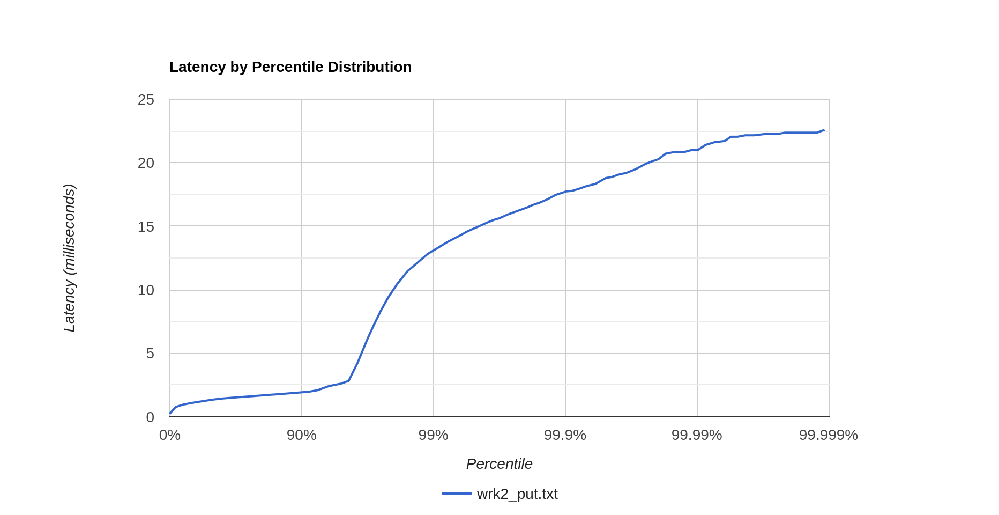
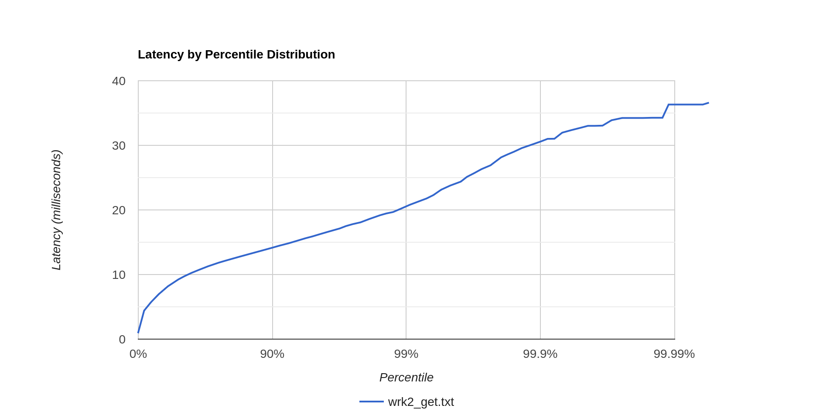

# 4 этап, отчет, Емельянов Виталий
## Запись
Профилирование проводилось под нагрузкой 
20'000 RPS (точка разладки ~22'000 RPS)
скриптом, аналогичным использовавшемуся ранее 
(т.е. необходимо собрать кворум 2/3).

[Логи wrk2](wrk2_put.txt)

Виден качественный переход после ~95.6%, выяснить его природу не удалось.

### ЦПУ
[Профиль](put_cpu.html)

По ЦПУ наиболее ощутим резкий рост работы, связанной с HttpClient, ожидаемый,
так как теперь требуется 1-2 Http запроса на одну запись вместо старых 0-1.
В процессе анализа профилей было замечено, что хэш ключа вычисляется для каждой ноды,
хотя это и не необходимо. Это было исправлено, но это составляет очень малую долю работы,
из-за чего сильного падения замечено не было.

### Аллокации
[Профиль](put_alloc.html)
Видимых изменений нет

### Локи 
[Профиль](put_lock.html)
Видимых изменений нет

## Чтение 

Профилирование на чтение производилось под нагрузкой 50'000 RPS 
(точка разладки ~55'000 RPS) скриптом, аналогичным использовавшемуся ранее
(т.е. необходимо собрать кворум 2/3).

[Логи wrk2](wrk2_get.txt)

### ЦПУ
[Профиль](get_cpu.html)

Судить о росте работы HttpClient, поскольку она составляет очень малую
долю по сравнению с работой Dao (в каждой ноде SSTable'ов на 1.4 ГиБ)

### Аллокации
[Профиль](get_alloc.html)

Заметен рост аллокаций на TimestampedEntry (ранее - BaseEntry)
с 0.13% сэмплов до ~1%. 

### Локи
[Профиль](get_lock.html)

При том, что сами блокировки полностью идентичны, 
распределение времени между ними теперь качественно другое.
Если ранее блокировки на selector потоках составляли лишь 30% сэмплов, то
теперь - все 95%. Вероятнее всего, это связано с тем, что в этот 
раз профилирование проходит ближе к точке разладки, из-за чего
ThreadPoolExecutor'ы теперь блокируют работу куда заметнее