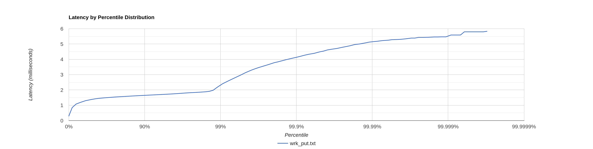
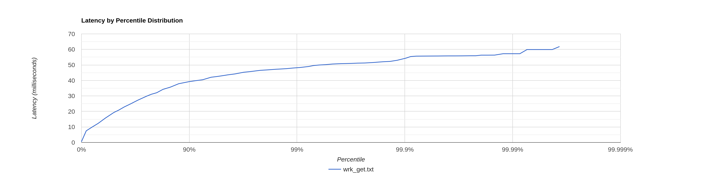

# Емельянов Виталий, 5 этап

## Запись

### Совершенные в процессе исследования работы:
* все нагрузки, которые по каким-то причинам уходили на ForkJoinPool,
были вынесены в предназначенные для нее executor'ы
* исправлена проблема с закрытием HttpClient в случае RejectedExecutionException
* для каждой удаленной ноды создается свой клиент (предположение, влияния на эффективность не оказало,
но потоки SelectorManager подразгрузились).

Тестирование при работе на запись производилось под нагрузкой
в 32'000 RPS (точка разладки ~35'000 RPS)

[Логи wrk2 на запись](wrk_put.txt)

Перелом примерно на 98%, скорее всего, 
связан с работой gc, которая, судя по логам программы,
и блокирует потоки на время до 3 мс.

### Профили ЦПУ

[ЦПУ на запись](put_cpu.html)

На профилях можно заметить ForkJoinPool,
который явно в коде не создавался.
При этом этот пул не совершает полезной работы,
только задачи по его собственному поддержанию,
задачи на него самого не приходят. Могу лишь предположить, что на
него возлагается задача по перекладыванию задач в ThreadPoolExecutor 
в методах CompletableFuture, для которых указывался executor.

### Профили аллокации
[Аллокации на запись](put_alloc.html)

92% аллокаций происходят в http библиотеке jdk

### Профили блокировок 
[Блокировки на запись](put_lock.html)

Большинство блокировок происходят в очереди executor'а и внутри http клиента
(в основном при взаимодействии с пулом соединений).

## Чтение

Тестирование при работе на чтение производилось
под нагрузкой в 800 RPS (точка разладки ~1'000) RPS.

Такой резкий сдвиг точки разладки связан с тем, что
был сильно сокращен размер SSTable (c 16 МиБ до 1 МиБ),
из-за чего теперь все те же 1.4 ГиБ это ~10'000 SSTable.
Объем SSTable был сокращен, поскольку java HttpClient
более емкий по аллокациям, из-за чего 128 МиБ уже становилось 
тесновато, из-за чего было решено сократить объем MemTable

При этом данный предел четко виден, например, в htop.
Нагрузка на ЦПУ распределяется с большой линейностью, 
где 100% - 1'000 RPS.

[Логи wrk2 на чтение](wrk_get.txt)

Виден (хоть и не так явно) все тот же сдвиг на ~99.8%

### Профили ЦПУ
[ЦПУ на чтение](get_cpu.html)

95% сэмплов уходит на взаимодействие с SSTables.
В данных обстоятельствах может иметь смысл 
выделить взаимодействие с локальной Dao в отдельный
executor, чтобы конкурировать за ресурсы ЦПУ средствами
ОСи.

### Профили аллокации
[Аллокации на чтение](get_alloc.html)

90% TLAB'ов было выделено на нужды http библиотеки.

### Профили блокировок
[Блокировки на чтение](get_lock.html) 

Выводы аналогичны таковым для профиля блокировок на запись.

