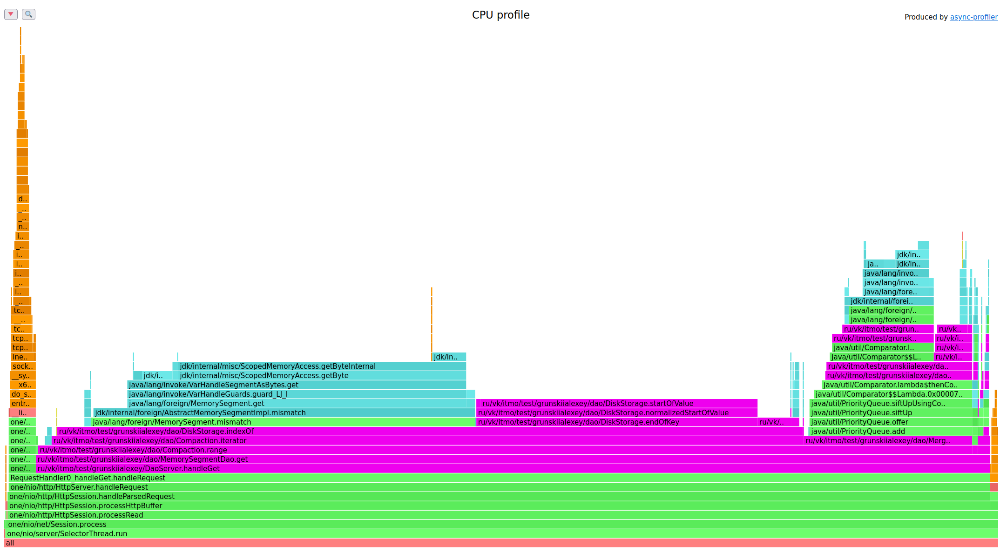
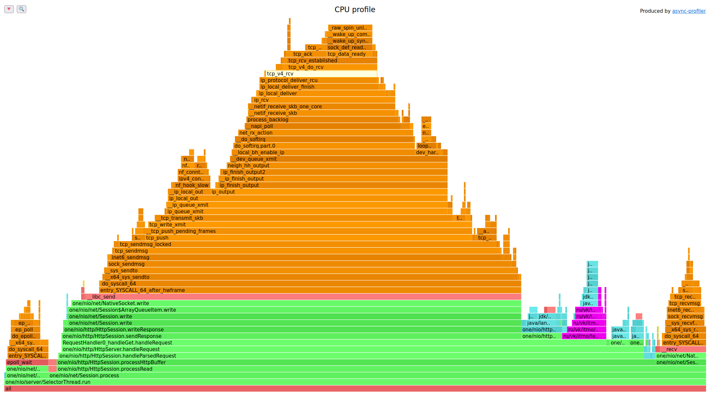

# 1 этап

1. Хочется разобраться, сколько необходимо сделать put'ов

Во время получения максимального кол-ва put'ов было допущено пару ошибок, например, открытый браузер и др. приложения серьёзно так жрут по cpu и памяти
Запуски происходили только с открытой Intellij Idea community через gen_data.sh, где
$1 - lua file
$2 - delay
$3 - connections 
$4 - threads
$5 - rpc
$6 - for repeat

#### Интересные факты. 
1. При большом количестве файлов ~26 тысяч происходят какие-то не совсем ожидаемые latency. 

При малом кол-ве файлов - также unpredictable результаты

Значит 40000 тысяч - слишком большой rpc

2. RPC 38000 - выдерживает достойно на put

3. При измерении get, я встретился с парой проблем, на разное кол-во данных в бд, разный get

#### CPU Changes:
0 files - 38000 rpc

25 files - 24000 rpc

500 files - 2000 rpc

#### Allocate Changes:
0 files - 38000 rpc

25 files - 24000 rpc

500 files - 2000 rpc

#### Какие замечания можно сделать? 
1) В каждом замере CPU существует такая горка*, природа, которой, временно не понятна, но позже в следствие дальнейшего изучения будет понятна

2) При увеличении кол-ва файлов, значительно уменьшается rpc, здесь узкое горлышко - это mapping размер файла, поэтому threshold стоит увеличить
3) Более полезные эксперименты те, где идёт большая нагрузка на созданные своими руками методы, под нагрузкой имеется не только ввиду rpc, а также какие-то другие факторы, например кол-во файлов. 
Например: 2000rpc-500files-alloc - хорошее профилирование
4) Места, которые стоит посмотреть на аллокацию памяти: dao.Compaction.iterator(), в MergeIterator(DiskStorage.slice(), PeekIterator)
5) Места, которые стоит посмотреть из-за нагрузки cpu: comparator (написать блум-фильтр, который оптимизирует работу), startOfValue (берёт с определенным оффсетом значение), DiskStorage.slice()

#### CPU Changes:
##### PUT
25000 rpc

##### GET
1 files - 40000 rpc

37 files - 17000 rpc

646 files - 800rpc

#### Allocate Changes:
##### PUT
25000rpc

##### GET
1 files - 40000 rpc

37 files - 17000 rpc

646 files - 800rpc

