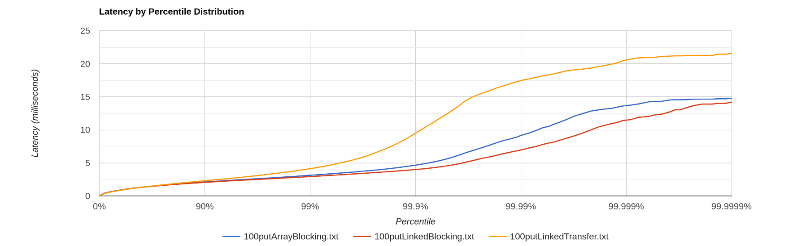
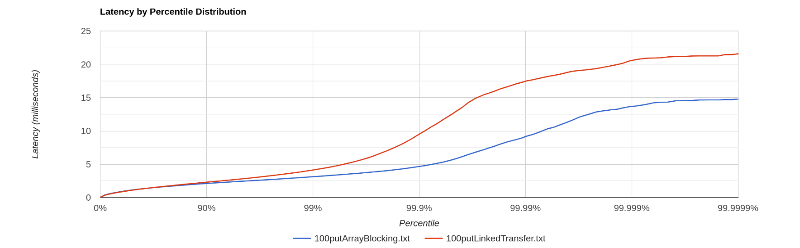
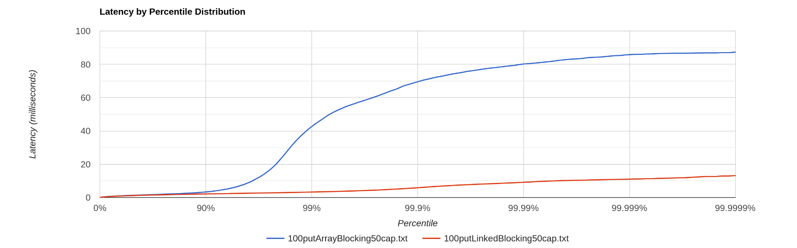
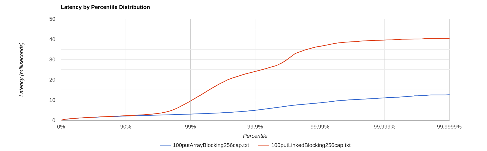
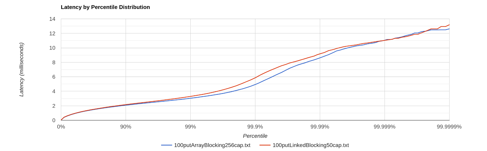

Оглавление:
 - [First stage.](#First-stage.)
 - [Этап Второй](#Этап-Второй.) 

# First stage.

Итак в этом этапе необходимо: 
 - было найти точки разладки для операций put и get.
 - профильнуть для put и get при нагрузке

Компу на котором проводится тестирование уже ~12 лет. 

Точка разладки для put лежит где-то в диапазоне от 8к-11к.
Если обратить внимение на RPC, то в 2х замерах у меня он приближен к тому, который и должен быть.

[первый замер](./results/loading_with_put_good.txt)
[второй замер](./results/loading_with_put_bad1.txt)

Но вот если посмотреть на время отклика, на 95 персентиль, к примеру.
Уже будет другая картина.

Ответ от сервера длиной в 611.327ms звучит очень грустно, и уже говорит нам, что что-то пошло не так.
В свою очередь, при втором замере 172ms может и хорошее время, смотря что мы считаем хорошим;)

Поэтому могу сделать вывод, что точка разладки put находится между 2мя приведенными замерами.

Точка разладки для get лежит от в диапазоне от 4к до 6к. Перед get запускал скрипт, чтобы база проинициализировалась.

[первый замер](./results/loading_with_get_good.txt)
[второй замер](./results/loading_with_get_bad.txt)

## Профилирование.
1 - PUT

[ALLOC](./results/allocput.html) - аллокация была при записи SSTable'ов в память. Аж 12%. 
Ну чтож, возможно, стоит рассмотреть другой вид хранения данных. Или как-то сжимать данные перед записью 

Но со сжатием в любом случае надо быть аккуратным, так как по асимптотике можем просесть сильно.

Вторая по частоте(7%) была sendResponse->Response.toBytes.

На мой взгляд это некая сериализация данных перед отправкой, поэтому особо это пофиксить не получиться. Кроме как изменить способ передачи данных и отказаться от http))

[CPU](./results/cpuput.html) - 20% было потрачено на readRequest. То есть cpu простаивал в режиме ожидания новых запросов и чтения их. 


2 - GET

[ALLOC](./results/allocget.html) - сложно выделить место, где однозначно больше всего аллоков, она в среднем занмают по 10%.

[CPU](./results/cpuget.html) - аж 60% происходило сравнение memsegm'ов. Есть смысл, возможно, добавить эвристику для сравния или распаралеллить эту задачу.
 
# Этап Второй.

Для начала разберемся с настройками wrk. Далее особо их менять не буду, кроме latency.

-c 64 - чтобы не было ограничений со стороны отправки пакетов.

-t 4 - представим, что одновременно работают с нашей dao сразу несколько человек. Для очереди полезно будет узнать.

Первое замечание, которое стоит упомянуть, что следует выставлять время жизни idle тредов не супер большим.
Пару замеров wrk при увеличении latency и повторной прогонки дали понять, что увеличение keepAliveTime приведет к незначительной деградации.

### MaxTheadSize

Всего у меня 8 ядер старого процессора. Поэтому попробую подобрать разные максимальные значения потоков для нашего экзекутора.


Особой разницы как видим нет. Обращать внимание на 99.999+ смысла особого нет, наверняка затесались выбросы.

Но есть момент, когда при 8ми идет лучше. Остановимся на этом. Брать выше 8ми не имеет смысла, так как система попросту не сможет позволить себе больше настоящих тредов.
(те 8, скорее всего, были достигнуты Hyper threading'ом).

Теперь дошли до самого интересного - выбора самой блокирующей очереди.

### LinkedBlocking, LinkedTransfer, ArrayBlocking



Был опыт, когда не передал capacity и linkedBlocking улетел в небеса. Поэтому важно понастраивать capacity.
У linkedtransfer его нет, поэтому смысла его рассматривать нет.

Так, теперь более наглядный график.



Ответы сервера происходили не за экстремально большое время, поэтому смысл посравнивать их между собой их есть.


Разные параметры capacity.

capacity == 50.



capacity == 256



видно из графиков, что для arrayblocking нужно увеличивать cap, а c linkedBlocking иначе.

По исходному коду linkedblocking видны места, где написаны условия 

```
c = count.getAndIncrement();

if (c + 1 < capacity)
    notFull.signal();  // <-- lock
```
следовательно, имеем в виду, что нужно под это подстраиваться (нельзя слишком много, иначе время отклика будет бесконечно большим и слишком маленьким, чтобы постоянно срабатывал if) 

Пусть дальше для сравнений по cpu, alloc и lock далее будет использоваться оптимальное capacity, чтобы они выдавали примерно одно и то же.




### CPU, ALLOC, LOCK

#### CPU

[Array](./results/CPUArrayBlocking.html)
[Linked](./results/CPULinked.html)

11% - array, 8% - linked. Как будто разница такая из-за различных форм await(awaitNanos - linked(5%), await - array(8%)). Как раз те самые 3 процента.
Ожиданий в arrayblocking больше.

#### ALLOC
[Array](./results/ALLOCArrayBlocking.html)
[Linked](./results/ALLOCLinked.html)

Особой разницы нет, кроме того, что в linkedblocking встречаются rejectedExecution.
Связано с тем, что в сорс коде екзекутора eсть место с queue.poll(keepAliveTime, elem). Именно тут идет потеря пакетов, видимо связанная с неэффективностью linkedblocking.


#### LOCK
[Array](./results/LOCKArrayBlocking.html)
[Linked](./results/LOCKLinked.html)

Почти одинакового. У Array это метод ArrayBlocking.take, у linked - LinkedBlokingQueue.poll.

Думаю, что связано это как-то с тем, что в исходниках в основном все блокировки брались на все функции целиком, поэтому особой разницы и не видно.
Никакой измеренной логики ни там, ни там не было использовано.


