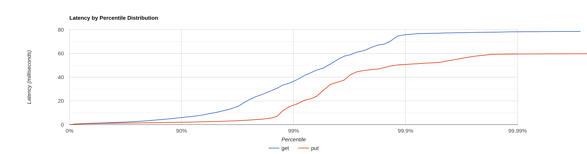
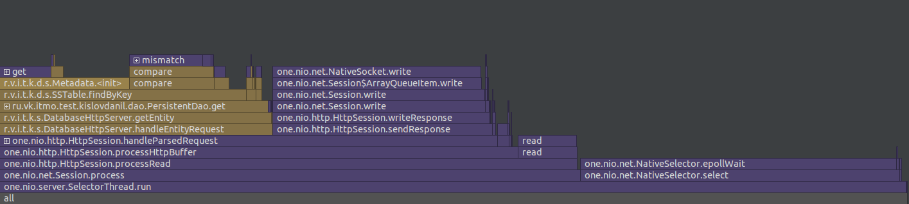
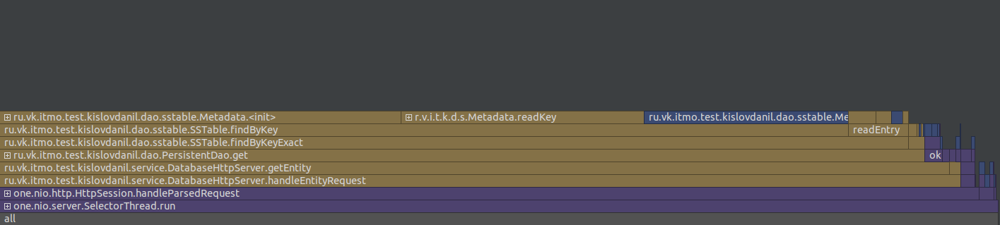
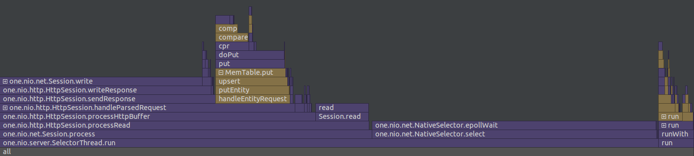
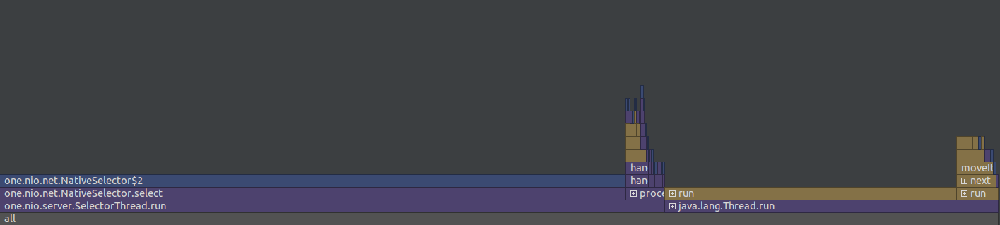

# Отчёт о нагрузочном тестировании
## Этап 1

Опытным путём установлена *точка разладки* ~5.000 RPS.
* Тестирование производилось при 4.000 RPS на одном потоке с одним соединением.
* База заполнена на 65 Mb всеми ключами от 0 до 100000.
* Для тестирования была использована утилита wrk2.
* Для профилирования был использован async-profiler внутри IntelliJ IDEA

### Запросы

PUT запросы
> ./wrk -t1 -c1 -d1m -R4000 -s put.lua -L http://localhost:8080

GET запросы
> ./wrk -t1 -c1 -d1m -R4000 -s get.lua -L http://localhost:8080

### Скрипты
* [get.lua](../scripts/get.lua)
* [put.lua](../scripts/put.lua)

### Результаты
[Вывод wrk2 для GET](get4000.txt)

[Вывод wrk2 для PUT](put4000.txt)

#### Флеймграфы для GET запросов
##### CPU

##### Allocations

#### Флеймграфы для PUT запросов
##### CPU

##### Allocations

### Вывод
Большую часть времени занимает обработка HTTP запросов,
а не работа самой базы данных. 
Конкретно чтение запроса из сессии (NativeSocket.read)
и ожидание селектора (NativeSelector.epollWait).

Значительную часть времени занимают чтения с диска (get, mismatch).

Много памяти уходит на операции с диском, а также на хранение
метаданных при чтении (Metadata и Range).

Повысить скорость можно:
* Более тонкой настройкой HTTP сервера
* Выделением большего количества ресурсов
* Уменьшением количества чтений с диска за счёт более
оптимальной организации данных на диске

