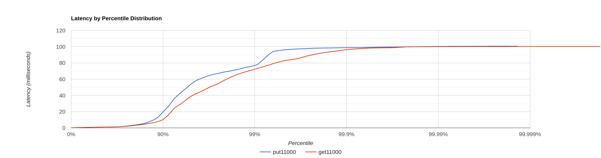
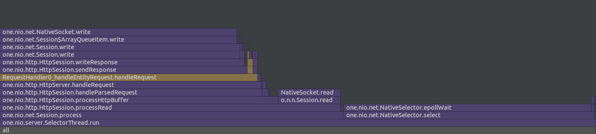
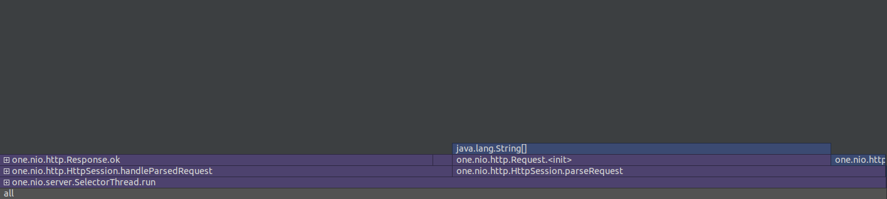
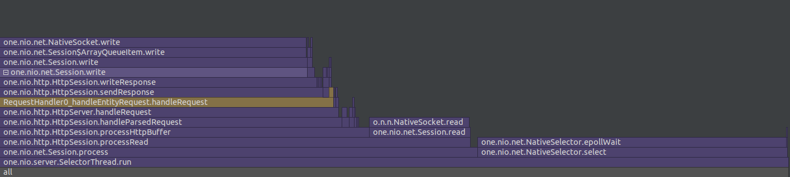
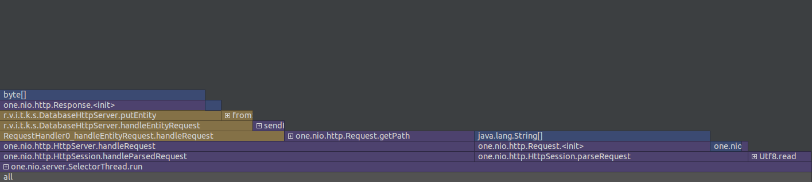

# Отчёт о нагрузочном тестировании
## Этап 1

Опытным путём установлена *точка разладки* ~12.000 RPS.
Тестирование производилось при 11.000 RPS на одном потоке с одним соединением.
Для тестирования была использована утилита wrk2.
Для профилирования был использован async-profiler внутри IntelliJ IDEA

### Запросы

PUT запросы
> curl -XPUT -d "hello" http://localhost:8080/v0/entity?id=1

GET запросы
> curl http://localhost:8080/v0/entity?id=1

### Результаты
[Вывод wrk2 для GET](get11000full)

[Вывод wrk2 для PUT](put11000full)

#### Флеймграфы для GET запросов
##### CPU

##### Allocations

#### Флеймграфы для PUT запросов
##### CPU

##### Allocations

### Вывод
Большую часть ресурсов занимает обработка HTTP запросов,
а не работа самой базы данных. 
Конкретно чтение запроса из сессии (NativeSocket.read)
и ожидание селектора (NativeSelector.epollWait).
Повысить производительность можно:
* Более тонкой настройкой HTTP сервера
* Выделением большего количества ресурсов
