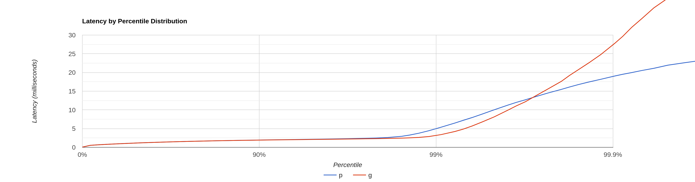
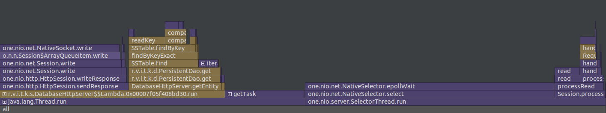
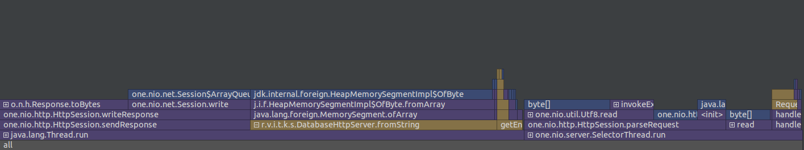
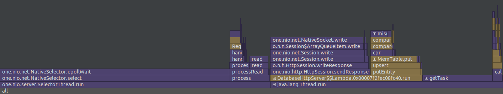
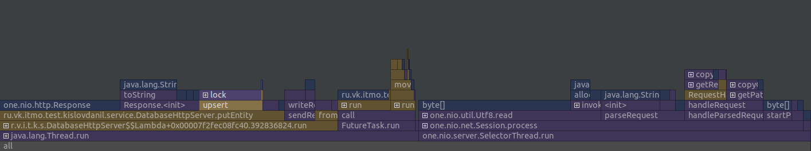

# Отчёт о нагрузочном тестировании
## Этап 1

* Тестирование производилось при 10.000 RPS(GET) и 10.000 RPS(PUT) на 4 потока с одним 64 соединяниями.
* flushThresholdBytes 10Mb
* База заполнена на 65 Mb всеми ключами от 0 до 100000.
* Уменьшил число выделений в памяти для чтения после первого этапа
* Обработкой запросов занимется ThreadPoolExecutor с очередью на 100000 задач, 
пулом от 4 до 12 потоков
* Для тестирования была использована утилита wrk2.
* Для профилирования был использован async-profiler внутри IntelliJ IDEA

### Скрипты
* [get.lua](../scripts/get.lua)
* [put.lua](../scripts/put.lua)

### Результаты
[Вывод wrk2 для GET](get.txt)

[Вывод wrk2 для PUT](put.txt)

#### Флеймграфы для GET запросов
##### CPU

##### Allocations

#### Флеймграфы для PUT запросов
##### CPU

##### Allocations

### Вывод
Удалось значительно RPS по сравнению с прошлым этапом.
Большую часть времени и памяти всё так же потребляет http сервер.
Есть очевидная проблема с PUT, т.к. он работает медленнее GET, что по логике LSM должно быть наоборот;
предположительно из-за неэффективного копирования данных при flush.
Заметил, что текущий алгоритм компакшена небезопасен т.к. читает в память все данные.

