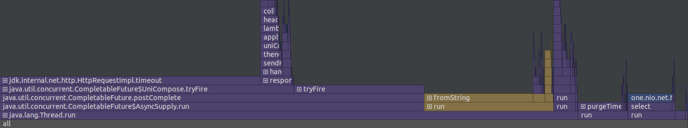
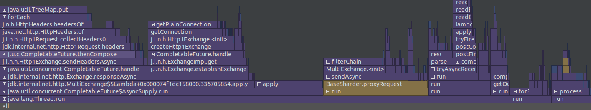

# Отчёт о нагрузочном тестировании
## Этап 3

* Тестирование производилось при 10.000 RPS(GET) и 10.000 RPS(PUT) на 4 потока с одним 64 соединяниями.
* Кластер из двух баз данных (localhost:8080 и localhost:8081)
* flushThresholdBytes 10Mb
* База заполнена на 65 Mb всеми ключами от 0 до 100000.
* Обработкой запросов занимется ThreadPoolExecutor с очередью на 100000 задач,
  пулом от 1 до 12 потоков
* Для тестирования была использована утилита wrk2.
* Для профилирования был использован async-profiler внутри IntelliJ IDEA

### Скрипты
* [get.lua](../scripts/get.lua)
* [put.lua](../scripts/put.lua)

### Результаты
[Вывод wrk2 для GET](get.txt)

[Вывод wrk2 для PUT](put.txt)

#### Флеймграфы для GET запросов
##### CPU

##### Allocations

#### Флеймграфы для PUT запросов
##### CPU

##### Allocations

### Вывод
Latency по 99 процентилю уменьшилась в 1.5-2 раза из-за необходимости взаимодействия
баз по HTTP. Большую часть CPU потребляет сетевое взаимодействие, 
опреации с DAO занимают 1-2%. Попытки изменить настройки HTTP клиента
и сервера принципиально не изменили ситуацию.

Не нашёл возможности нагружать одновременно 2 хоста по round robin в
wrk2, но могу предположить что при таком использовании шардирование
может увеличить производительность. Пока такое решение позволяет
скорее масштабировать вместимость базы данных, оставляя производительность
на прежнем уровне

Незначительное количество 500-ок вызвано строгим таймаутом на HTTP клиенте

По ходу тестирования изменил функцию хэширования в Randevouz-Hashing на
более равномерно распределённую