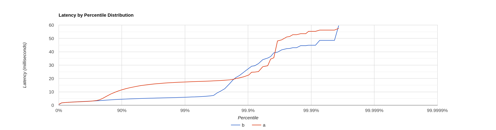
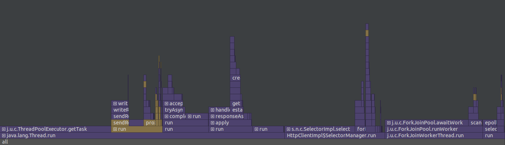
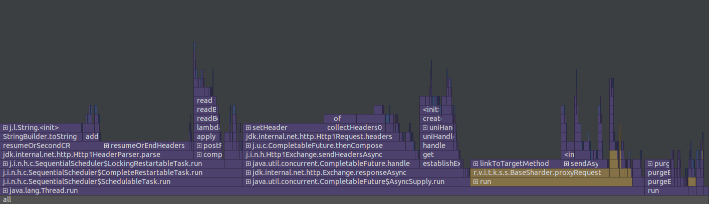
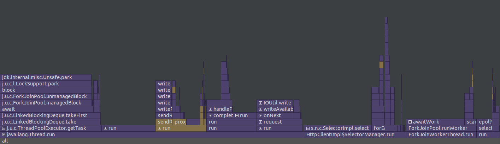
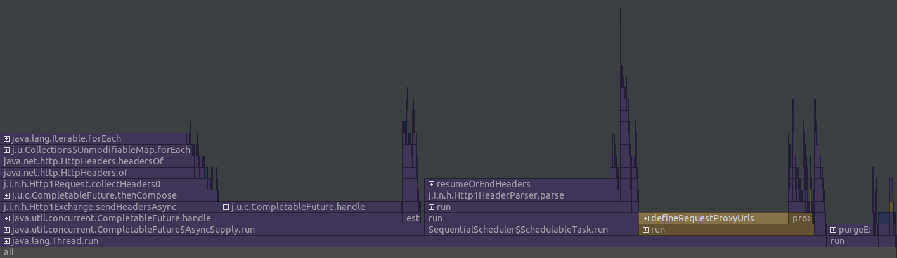

# Отчёт о нагрузочном тестировании
## Этап 4

* Тестирование производилось при 500 RPS(GET) и 500 RPS(PUT) на 4 потока с одним 64 соединяниями.
* Кластер из трёх баз данных (localhost:8080, localhost:8081, localhost:8080)
* ack=2, from=3
* flushThresholdBytes 10Mb
* База заполнена на 65 Mb всеми ключами от 0 до 100000.
* Обработкой запросов занимется ThreadPoolExecutor с очередью на 100000 задач,
  пулом от 1 до 12 потоков
* Для тестирования была использована утилита wrk2.
* Для профилирования был использован async-profiler внутри IntelliJ IDEA

### Скрипты
* [get.lua](../scripts/get.lua)
* [put.lua](../scripts/put.lua)

### Результаты
[Вывод wrk2 для GET](get.txt)

[Вывод wrk2 для PUT](put.txt)

#### Флеймграфы для GET запросов
##### CPU

##### Allocations

#### Флеймграфы для PUT запросов
##### CPU

##### Allocations

### Вывод
Сильно упали RPS - чтобы получить задержки сравнимые с 3 этапом
пришлось уменьшить RPS в 20 раз. Из флеймграфов сложно
понять что именно вызывает такую задержку, предположительно
ожидание ответов от других нод (по сути, время ответа на запрос
равно времени ответа самой медленной ноды; даже в текущей реализации,
где запросы отправляются одновременно это может быть медленно).
Ожидается что модификация на 5 этапе сможет вернуть показатели
к сравнимым с 3 этапом.

При уменьшении количества нод до 2 скорость работы немного увеличивается.
