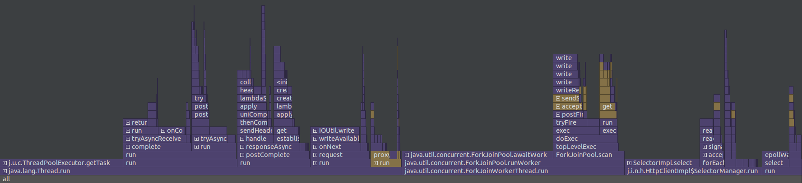

# Отчёт о нагрузочном тестировании
## Этап 5

* Тестирование производилось при 2000 RPS(GET) и 2000 RPS(PUT) на 4 потока с одним 64 соединяниями.
* Кластер из трёх баз данных (localhost:8080, localhost:8081, localhost:8080)
* ack=2, from=3
* flushThresholdBytes 10Mb
* База заполнена на 65 Mb всеми ключами от 0 до 100000.
* Обработкой запросов занимется ThreadPoolExecutor с очередью на 100000 задач,
  пулом от 1 до 12 потоков
* Для тестирования была использована утилита wrk2.
* Для профилирования был использован async-profiler внутри IntelliJ IDEA

### Скрипты
* [get.lua](../scripts/get.lua)
* [put.lua](../scripts/put.lua)

### Результаты
[Вывод wrk2 для GET](get.txt)

[Вывод wrk2 для PUT](put.txt)

#### Флеймграфы для GET запросов
##### CPU

[html](getcpu.html)

##### Allocations

[html](getalloc.html)

##### Lock
[\*тык\*](getLock.html)

#### Флеймграфы для PUT запросов
##### CPU

##### Allocations

##### Lock
[\*тык\*](putLock.html)

### Вывод
Удалось повысить RPS по сравнению с прошлым этапом.
Всё ещё есть значительное ухудшение по сравнению с 3 этапом,
что можно объяснить бОльшим количеством нод и
там что запросы идут на все из них.

Новая реализация не использует блокировки и поэтому в профайлере
никак не отображается.