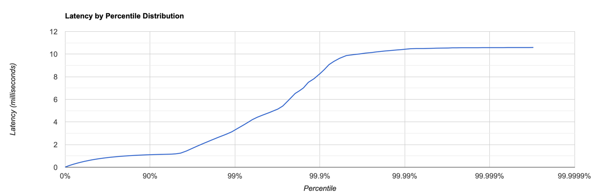
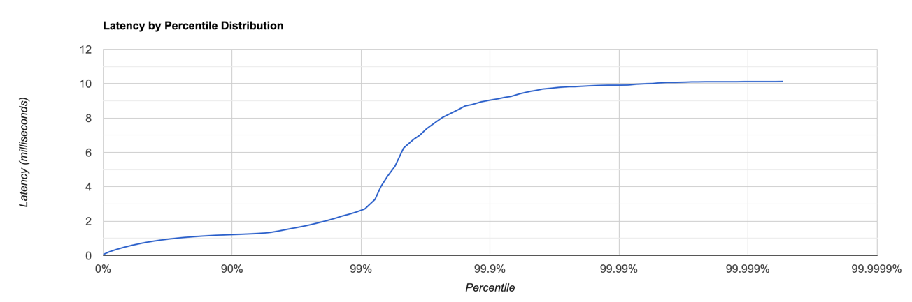

## Нагрузочное тестирование
Тестирование проводилось на macbook m1 pro.

### PUT 32500 RPS
```
Running 30s test @ http://localhost:8080
  1 threads and 1 connections
  Thread calibration: mean lat.: 2.898ms, rate sampling interval: 10ms
  Thread Stats   Avg      Stdev     Max   +/- Stdev
    Latency   696.28us  646.29us  10.58ms   93.82%
    Req/Sec    34.32k     3.18k   51.67k    69.06%
  Latency Distribution (HdrHistogram - Recorded Latency)
 50.000%  633.00us
 75.000%    0.93ms
 90.000%    1.11ms
 99.000%    3.27ms
 99.900%    8.29ms
 99.990%   10.42ms
 99.999%   10.57ms
100.000%   10.59ms

  Detailed Percentile spectrum:
       Value   Percentile   TotalCount 1/(1-Percentile)

       0.014     0.000000            1         1.00
       0.144     0.100000        65327         1.11
       0.266     0.200000       130422         1.25
       0.389     0.300000       195141         1.43
       0.512     0.400000       260191         1.67
       0.633     0.500000       325173         2.00
       0.693     0.550000       357572         2.22
       0.753     0.600000       389972         2.50
       0.813     0.650000       422619         2.86
       0.873     0.700000       455368         3.33
       0.932     0.750000       487627         4.00
       0.961     0.775000       503711         4.44
       0.991     0.800000       520344         5.00
       1.020     0.825000       536475         5.71
       1.049     0.850000       552721         6.67
       1.078     0.875000       569115         8.00
       1.092     0.887500       577009         8.89
       1.106     0.900000       584983        10.00
       1.121     0.912500       593398        11.43
       1.135     0.925000       601371        13.33
       1.149     0.937500       609593        16.00
       1.158     0.943750       613403        17.78
       1.183     0.950000       617405        20.00
       1.247     0.956250       621435        22.86
       1.429     0.962500       625473        26.67
       1.698     0.968750       629533        32.00
       1.852     0.971875       631563        35.56
       2.020     0.975000       633595        40.00
       2.201     0.978125       635633        45.71
       2.411     0.981250       637660        53.33
       2.653     0.984375       639693        64.00
       2.785     0.985938       640717        71.11
       2.937     0.987500       641730        80.00
       3.127     0.989062       642732        91.43
       3.419     0.990625       643749       106.67
       3.761     0.992188       644765       128.00
       3.969     0.992969       645268       142.22
       4.207     0.993750       645785       160.00
       4.419     0.994531       646284       182.86
       4.619     0.995313       646794       213.33
       4.843     0.996094       647304       256.00
       4.987     0.996484       647554       284.44
       5.143     0.996875       647807       320.00
       5.411     0.997266       648061       365.71
       5.915     0.997656       648314       426.67
       6.527     0.998047       648568       512.00
       6.739     0.998242       648697       568.89
       7.011     0.998437       648822       640.00
       7.507     0.998633       648949       731.43
       7.827     0.998828       649081       853.33
       8.335     0.999023       649204      1024.00
       8.663     0.999121       649266      1137.78
       9.071     0.999219       649330      1280.00
       9.359     0.999316       649393      1462.86
       9.631     0.999414       649457      1706.67
       9.871     0.999512       649521      2048.00
       9.919     0.999561       649555      2275.56
       9.967     0.999609       649585      2560.00
      10.015     0.999658       649615      2925.71
      10.087     0.999707       649650      3413.33
      10.143     0.999756       649679      4096.00
      10.191     0.999780       649697      4551.11
      10.231     0.999805       649711      5120.00
      10.279     0.999829       649726      5851.43
      10.319     0.999854       649742      6826.67
      10.375     0.999878       649759      8192.00
      10.399     0.999890       649766      9102.22
      10.439     0.999902       649774     10240.00
      10.479     0.999915       649785     11702.86
      10.495     0.999927       649798     13653.33
      10.495     0.999939       649798     16384.00
      10.503     0.999945       649803     18204.44
      10.511     0.999951       649806     20480.00
      10.527     0.999957       649813     23405.71
      10.535     0.999963       649815     27306.67
      10.543     0.999969       649818     32768.00
      10.559     0.999973       649823     36408.89
      10.559     0.999976       649823     40960.00
      10.567     0.999979       649829     46811.43
      10.567     0.999982       649829     54613.33
      10.567     0.999985       649829     65536.00
      10.567     0.999986       649829     72817.78
      10.575     0.999988       649833     81920.00
      10.575     0.999989       649833     93622.86
      10.575     0.999991       649833    109226.67
      10.575     0.999992       649833    131072.00
      10.575     0.999993       649833    145635.56
      10.583     0.999994       649835    163840.00
      10.583     0.999995       649835    187245.71
      10.583     0.999995       649835    218453.33
      10.583     0.999996       649835    262144.00
      10.583     0.999997       649835    291271.11
      10.591     0.999997       649837    327680.00
      10.591     1.000000       649837          inf
#[Mean    =        0.696, StdDeviation   =        0.646]
#[Max     =       10.584, Total count    =       649837]
#[Buckets =           27, SubBuckets     =         2048]
----------------------------------------------------------
  974967 requests in 30.00s, 62.30MB read
Requests/sec:  32498.61
Transfer/sec:      2.08MB

```

Гистограмма `PUT`:

- Распределение задержек показывает, что 99,9% запросов обслуживаются в пределах 8,29 мс, а 99,999% в пределах 10,57 мс.
- Медианная задержка (50-й процентиль) составляет 633,00 микросекунды.
- Объем прочитанных данных (62.30MB) и скорость передачи данных (2.08MB в секунду)
### GET 20000 RPS
```
klim@192-168-0-103 wrk2-arm % ./wrk -t1 -c1 -d30 -L -R9000 -s /Users/klim/IdeaProjects/2024-highload-dht/src/main/java/ru/vk/itmo/test/klimplyasov/reports/lua/get.lua http://localhost:8080
Running 30s test @ http://localhost:8080
  1 threads and 1 connections
  Thread calibration: mean lat.: 1.048ms, rate sampling interval: 10ms
  Thread Stats   Avg      Stdev     Max   +/- Stdev
    Latency   782.16us  688.50us  10.12ms   95.04%
    Req/Sec     9.51k   752.01    12.89k    68.12%
  Latency Distribution (HdrHistogram - Recorded Latency)
 50.000%  721.00us
 75.000%    1.03ms
 90.000%    1.22ms
 99.000%    2.62ms
 99.900%    9.04ms
 99.990%    9.91ms
 99.999%   10.11ms
100.000%   10.13ms

  Detailed Percentile spectrum:
       Value   Percentile   TotalCount 1/(1-Percentile)

       0.059     0.000000            1         1.00
       0.213     0.100000        18004         1.11
       0.343     0.200000        36146         1.25
       0.469     0.300000        54046         1.43
       0.596     0.400000        72117         1.67
       0.721     0.500000        90060         2.00
       0.784     0.550000        99099         2.22
       0.847     0.600000       108109         2.50
       0.910     0.650000       117092         2.86
       0.972     0.700000       126080         3.33
       1.034     0.750000       135095         4.00
       1.064     0.775000       139471         4.44
       1.095     0.800000       144020         5.00
       1.126     0.825000       148489         5.71
       1.157     0.850000       153009         6.67
       1.187     0.875000       157498         8.00
       1.202     0.887500       159841         8.89
       1.216     0.900000       161978        10.00
       1.233     0.912500       164320        11.43
       1.254     0.925000       166495        13.33
       1.285     0.937500       168757        16.00
       1.307     0.943750       169846        17.78
       1.349     0.950000       170981        20.00
       1.423     0.956250       172105        22.86
       1.523     0.962500       173219        26.67
       1.636     0.968750       174353        32.00
       1.701     0.971875       174900        35.56
       1.785     0.975000       175465        40.00
       1.889     0.978125       176034        45.71
       2.017     0.981250       176589        53.33
       2.185     0.984375       177154        64.00
       2.297     0.985938       177433        71.11
       2.395     0.987500       177713        80.00
       2.527     0.989062       177995        91.43
       2.709     0.990625       178274       106.67
       3.261     0.992188       178556       128.00
       4.011     0.992969       178696       142.22
       4.611     0.993750       178837       160.00
       5.191     0.994531       178977       182.86
       6.255     0.995313       179118       213.33
       6.767     0.996094       179259       256.00
       6.995     0.996484       179329       284.44
       7.363     0.996875       179402       320.00
       7.679     0.997266       179471       365.71
       8.031     0.997656       179540       426.67
       8.327     0.998047       179611       512.00
       8.495     0.998242       179646       568.89
       8.703     0.998437       179685       640.00
       8.791     0.998633       179715       731.43
       8.943     0.998828       179751       853.33
       9.055     0.999023       179786      1024.00
       9.111     0.999121       179804      1137.78
       9.191     0.999219       179823      1280.00
       9.263     0.999316       179838      1462.86
       9.415     0.999414       179857      1706.67
       9.551     0.999512       179874      2048.00
       9.607     0.999561       179882      2275.56
       9.687     0.999609       179893      2560.00
       9.727     0.999658       179900      2925.71
       9.783     0.999707       179909      3413.33
       9.823     0.999756       179922      4096.00
       9.823     0.999780       179922      4551.11
       9.847     0.999805       179926      5120.00
       9.871     0.999829       179932      5851.43
       9.895     0.999854       179935      6826.67
       9.911     0.999878       179944      8192.00
       9.911     0.999890       179944      9102.22
       9.911     0.999902       179944     10240.00
       9.919     0.999915       179946     11702.86
       9.967     0.999927       179948     13653.33
       9.999     0.999939       179951     16384.00
      10.007     0.999945       179952     18204.44
      10.047     0.999951       179953     20480.00
      10.071     0.999957       179955     23405.71
      10.071     0.999963       179955     27306.67
      10.087     0.999969       179956     32768.00
      10.103     0.999973       179957     36408.89
      10.103     0.999976       179957     40960.00
      10.111     0.999979       179959     46811.43
      10.111     0.999982       179959     54613.33
      10.111     0.999985       179959     65536.00
      10.111     0.999986       179959     72817.78
      10.111     0.999988       179959     81920.00
      10.119     0.999989       179960     93622.86
      10.119     0.999991       179960    109226.67
      10.119     0.999992       179960    131072.00
      10.119     0.999993       179960    145635.56
      10.119     0.999994       179960    163840.00
      10.127     0.999995       179961    187245.71
      10.127     1.000000       179961          inf
#[Mean    =        0.782, StdDeviation   =        0.689]
#[Max     =       10.120, Total count    =       179961]
#[Buckets =           27, SubBuckets     =         2048]
----------------------------------------------------------
  269991 requests in 30.00s, 18.94MB read
Requests/sec:   8999.73
Transfer/sec:    646.43KB
```
Гистограмма `GET`:

- 99,9% запросов обслуживаются в пределах 9.04 мс, а 99,999% в пределах 10.11 мс.
- Медианная задержка (50-й процентиль) составляет 721.00 микросекунду.
- Объем прочитанных данных (18.94MB) и скорость передачи данных (646.43KB в секунду)


### async-profiler
#### Вывод профилирования PUT аллокации
- Основная часть аллокаций связана с операциями записи в диск 30%
- Операции flush занимают 6% 
- На сохранение в SSTable 4%
- Оставшиеся аллокации уходят на нужды сервера(парсинг запроса, создание ответа и т.д.)

#### Вывод профилирования PUT CPU
- upsert в SSTable 9%
- сохранение на диск занимало 8%
- Операции flush занимают 6%


#### Вывод профилирования GET аллокации
- конвертация мемори сегментов в байты 34%
- на операции чтения из диска 32%
- Оставшиеся аллокации уходят на нужды сервера

#### Вывод профилирования GET CPU
- ушло на операции сравнения и поиска 63%
- было затрачено на чтение 20%
- сервер 17%
