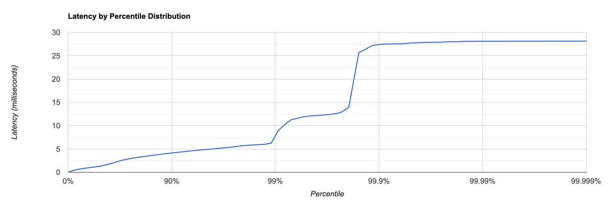
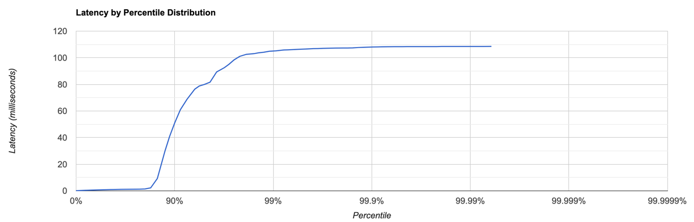

## Нагрузочное тестирование
### PUT 38000 RPS
При превышении порога в 38000 RPS сервис начинает демонстрировать сильное увеличение времени ответа.
```
Running 30s test @ http://localhost:8080
  1 threads and 1 connections
  Thread calibration: mean lat.: 3.172ms, rate sampling interval: 13ms
  Thread Stats   Avg      Stdev     Max   +/- Stdev
    Latency     1.96ms    1.97ms  28.14ms   88.13%
    Req/Sec    38.59k     2.64k   46.33k    72.80%
  Latency Distribution (HdrHistogram - Recorded Latency)
 50.000%    1.28ms
 75.000%    2.94ms
 90.000%    4.14ms
 99.000%    7.05ms
 99.900%   27.44ms
 99.990%   28.11ms
 99.999%   28.14ms
100.000%   28.16ms

  Detailed Percentile spectrum:
       Value   Percentile   TotalCount 1/(1-Percentile)

       0.018     0.000000            4         1.00
       0.365     0.100000        74066         1.11
       0.633     0.200000       148006         1.25
       0.845     0.300000       221941         1.43
       1.048     0.400000       295562         1.67
       1.283     0.500000       369514         2.00
       1.495     0.550000       406426         2.22
       1.786     0.600000       443346         2.50
       2.163     0.650000       480367         2.86
       2.591     0.700000       517258         3.33
       2.941     0.750000       554232         4.00
       3.119     0.775000       572679         4.44
       3.297     0.800000       591222         5.00
       3.461     0.825000       609713         5.71
       3.669     0.850000       628179         6.67
       3.883     0.875000       646603         8.00
       4.001     0.887500       655774         8.89
       4.143     0.900000       665013        10.00
       4.283     0.912500       674226        11.43
       4.451     0.925000       683548        13.33
       4.631     0.937500       692703        16.00
       4.727     0.943750       697418        17.78
       4.827     0.950000       701952        20.00
       4.935     0.956250       706597        22.86
       5.079     0.962500       711199        26.67
       5.259     0.968750       715747        32.00
       5.347     0.971875       718114        35.56
       5.467     0.975000       720369        40.00
       5.651     0.978125       722721        45.71
       5.783     0.981250       725086        53.33
       5.895     0.984375       727289        64.00
       5.959     0.985938       728491        71.11
       6.031     0.987500       729620        80.00
       6.267     0.989062       730751        91.43
       8.959     0.990625       731906       106.67
      10.543     0.992188       733059       128.00
      11.287     0.992969       733643       142.22
      11.535     0.993750       734220       160.00
      11.863     0.994531       734803       182.86
      12.079     0.995313       735391       213.33
      12.199     0.996094       735960       256.00
      12.263     0.996484       736244       284.44
      12.359     0.996875       736528       320.00
      12.519     0.997266       736815       365.71
      12.799     0.997656       737114       426.67
      13.951     0.998047       737387       512.00
      19.535     0.998242       737532       568.89
      25.711     0.998437       737676       640.00
      26.303     0.998633       737830       731.43
      27.183     0.998828       737968       853.33
      27.455     0.999023       738139      1024.00
      27.487     0.999121       738205      1137.78
      27.519     0.999219       738271      1280.00
      27.551     0.999316       738342      1462.86
      27.583     0.999414       738400      1706.67
      27.759     0.999512       738495      2048.00
      27.775     0.999561       738509      2275.56
      27.839     0.999609       738550      2560.00
      27.871     0.999658       738603      2925.71
      27.887     0.999707       738625      3413.33
      27.935     0.999756       738652      4096.00
      27.999     0.999780       738674      4551.11
      28.015     0.999805       738699      5120.00
      28.031     0.999829       738706      5851.43
      28.095     0.999854       738746      6826.67
      28.095     0.999878       738746      8192.00
      28.111     0.999890       738788      9102.22
      28.111     0.999902       738788     10240.00
      28.111     0.999915       738788     11702.86
      28.111     0.999927       738788     13653.33
      28.111     0.999939       738788     16384.00
      28.127     0.999945       738813     18204.44
      28.127     0.999951       738813     20480.00
      28.127     0.999957       738813     23405.71
      28.127     0.999963       738813     27306.67
      28.127     0.999969       738813     32768.00
      28.127     0.999973       738813     36408.89
      28.127     0.999976       738813     40960.00
      28.143     0.999979       738825     46811.43
      28.143     0.999982       738825     54613.33
      28.143     0.999985       738825     65536.00
      28.143     0.999986       738825     72817.78
      28.143     0.999988       738825     81920.00
      28.143     0.999989       738825     93622.86
      28.143     0.999991       738825    109226.67
      28.143     0.999992       738825    131072.00
      28.143     0.999993       738825    145635.56
      28.159     0.999994       738830    163840.00
      28.159     1.000000       738830          inf
#[Mean    =        1.963, StdDeviation   =        1.972]
#[Max     =       28.144, Total count    =       738830]
#[Buckets =           27, SubBuckets     =         2048]
----------------------------------------------------------
  1108945 requests in 30.00s, 70.86MB read
Requests/sec:  36965.09
Transfer/sec:      2.36MB


```

Гистограмма `PUT`:

### GET 8000 RPS
```
Running 30s test @ http://localhost:8080
  1 threads and 1 connections
  Thread calibration: mean lat.: 7.510ms, rate sampling interval: 74ms
  Thread Stats   Avg      Stdev     Max   +/- Stdev
    Latency    10.46ms   25.42ms 108.48ms   88.22%
    Req/Sec     8.05k   294.25     9.00k    87.04%
  Latency Distribution (HdrHistogram - Recorded Latency)
 50.000%    0.87ms
 75.000%    1.24ms
 90.000%   50.91ms
 99.000%  105.15ms
 99.900%  108.09ms
 99.990%  108.48ms
 99.999%  108.54ms
100.000%  108.54ms

  Detailed Percentile spectrum:
       Value   Percentile   TotalCount 1/(1-Percentile)

       0.081     0.000000            3         1.00
       0.260     0.100000        16078         1.11
       0.412     0.200000        32037         1.25
       0.564     0.300000        48048         1.43
       0.717     0.400000        64033         1.67
       0.870     0.500000        80041         2.00
       0.945     0.550000        88107         2.22
       1.018     0.600000        96051         2.50
       1.092     0.650000       104068         2.86
       1.166     0.700000       112051         3.33
       1.236     0.750000       120016         4.00
       1.279     0.775000       124004         4.44
       1.406     0.800000       127970         5.00
       2.219     0.825000       131973         5.71
       9.231     0.850000       135968         6.67
      30.239     0.875000       139969         8.00
      40.927     0.887500       141972         8.89
      50.911     0.900000       143965        10.00
      60.959     0.912500       145965        11.43
      68.735     0.925000       147974        13.33
      76.415     0.937500       149973        16.00
      78.783     0.943750       150992        17.78
      79.935     0.950000       151966        20.00
      81.663     0.956250       152976        22.86
      89.343     0.962500       153971        26.67
      92.607     0.968750       154964        32.00
      95.103     0.971875       155464        35.56
      98.367     0.975000       155964        40.00
     101.055     0.978125       156465        45.71
     102.591     0.981250       157036        53.33
     103.103     0.984375       157498        64.00
     103.743     0.985938       157747        71.11
     104.127     0.987500       157971        80.00
     104.895     0.989062       158219        91.43
     105.215     0.990625       158475       106.67
     105.855     0.992188       158743       128.00
     105.983     0.992969       158874       142.22
     106.175     0.993750       158966       160.00
     106.367     0.994531       159106       182.86
     106.559     0.995313       159246       213.33
     106.879     0.996094       159354       256.00
     106.943     0.996484       159413       284.44
     107.071     0.996875       159489       320.00
     107.199     0.997266       159571       365.71
     107.263     0.997656       159615       426.67
     107.327     0.998047       159688       512.00
     107.327     0.998242       159688       568.89
     107.455     0.998437       159716       640.00
     107.711     0.998633       159748       731.43
     107.903     0.998828       159782       853.33
     108.095     0.999023       159817      1024.00
     108.159     0.999121       159830      1137.78
     108.223     0.999219       159845      1280.00
     108.287     0.999316       159863      1462.86
     108.351     0.999414       159886      1706.67
     108.351     0.999512       159886      2048.00
     108.415     0.999561       159927      2275.56
     108.415     0.999609       159927      2560.00
     108.415     0.999658       159927      2925.71
     108.415     0.999707       159927      3413.33
     108.415     0.999756       159927      4096.00
     108.415     0.999780       159927      4551.11
     108.479     0.999805       159950      5120.00
     108.479     0.999829       159950      5851.43
     108.479     0.999854       159950      6826.67
     108.479     0.999878       159950      8192.00
     108.479     0.999890       159950      9102.22
     108.479     0.999902       159950     10240.00
     108.479     0.999915       159950     11702.86
     108.479     0.999927       159950     13653.33
     108.543     0.999939       159961     16384.00
     108.543     1.000000       159961          inf
#[Mean    =       10.465, StdDeviation   =       25.421]
#[Max     =      108.480, Total count    =       159961]
#[Buckets =           27, SubBuckets     =         2048]
----------------------------------------------------------
  239992 requests in 30.00s, 16.82MB read
Requests/sec:   7999.76
Transfer/sec:    574.17KB

```
Гистограмма `GET`:



### async-profiler
#### Вывод профилирования PUT аллокации

При анализе использования памяти обнаружено, что:

- Примерно **50%** ресурсов занимает обработка запросов через `HttpServer.handleRequest`. В рамках этой обработки распределение следующее:
  - **~11%** уходит на операцию отправки ответа (`one/nio/http/HttpSession.sendResponse`).
  - **~30%** памяти выделяется под операции **put**, включая работу с параметрами и подготовку данных.
  - **~4%** на преобразование параметров запроса (`one/nio/http/Request.getRequiredParameter`).
  - **~5%** на получение пути запроса (`one/nio/http/Request.getPath`).
  - **~3%** на операции upsert.
  - **~9%** на преобразование строки в `MemorySegment`.

- Оставшиеся **~41%** занимают операции в рамках `one/nio/server/SelectorThread.run`:
  - **~7%** из этого объема ушло на выполнение операции select.
  - Остальная часть ресурсов использовалась для обработки запроса.

#### Вывод профилирования PUT CPU
- Основная нагрузка, около **~56%** времени исполнения, приходится на работу с сетью через библиотеку one-nio, в частности, на операцию poll, которая занимает **~25%**.

- Обработка запросов, включая upsert операции, составляет **~21%** времени исполнения. При этом непосредственно upsert занимает всего **~2%**, а основное время **~19%** уходит на handlerequest.

- Заметное время, **~18%**, тратится на операцию ArrayBlockingQueue.take().

#### Вывод профилирования GET аллокации

При профилировании GET-запросов по аллокации памяти было выявлено следующее распределение ресурсов:

- **Обработка запросов через `HttpServer.handleRequest`** занимает **63%** ресурсов. В рамках этой обработки:
  - **18%** выделяется на операцию отправки ответа (`one/nio/http/HttpSession.sendResponse`).
  - **6%** уходит на преобразование параметров запроса (`one/nio/http/Request.getRequiredParameter`).
  - **6%** занимает получение пути запроса (`one/nio/http/Request.getPath`).

- **Чтение данных** представляет собой **6%** использования памяти.

- Операции в контексте **`one/nio/server/SelectorThread.run`** составляют **33%** аллокаций.

Эти результаты подчеркивают, что значительная нагрузка при обработке GET-запросов связана с функциями асинхронной обработки.


#### Вывод профилирования GET CPU

При профилировании GET-запросов на CPU выявлено следующее распределение нагрузки:

- **60%** времени исполнения занимает операция `memorysegment.mismatch`.

- **9%** ресурсов CPU уходит на работу в контексте `selectThread.run`, с **4%** из этого объема, приходящихся на операцию `poll`.

- Операция `ArrayBlockingQueue` вносит **4%** в общую нагрузку.

- **3%** времени CPU расходуется на `sendResponse`.


