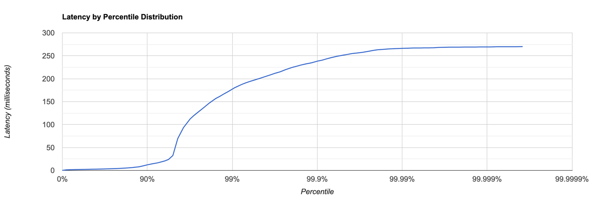
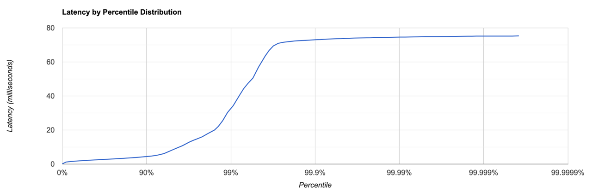

## Нагрузочное тестирование
### PUT 12000 RPS
```
Running 30s test @ http://localhost:8080
  4 threads and 64 connections
  Thread calibration: mean lat.: 967.433ms, rate sampling interval: 2715ms
  Thread calibration: mean lat.: 970.451ms, rate sampling interval: 2717ms
  Thread calibration: mean lat.: 965.740ms, rate sampling interval: 2711ms
  Thread calibration: mean lat.: 971.021ms, rate sampling interval: 2717ms
  Thread Stats   Avg      Stdev     Max   +/- Stdev
    Latency     9.96ms   30.28ms 269.82ms   95.10%
    Req/Sec     3.03k    76.42     3.22k    85.71%
  Latency Distribution (HdrHistogram - Recorded Latency)
 50.000%    2.46ms
 75.000%    3.87ms
 90.000%   12.25ms
 99.000%  177.41ms
 99.900%  238.08ms
 99.990%  266.24ms
 99.999%  269.31ms
100.000%  270.08ms

  Detailed Percentile spectrum:
       Value   Percentile   TotalCount 1/(1-Percentile)

       0.157     0.000000            1         1.00
       1.242     0.100000        24161         1.11
       1.585     0.200000        48322         1.25
       1.872     0.300000        72486         1.43
       2.149     0.400000        96581         1.67
       2.463     0.500000       120778         2.00
       2.635     0.550000       132826         2.22
       2.837     0.600000       144867         2.50
       3.081     0.650000       156999         2.86
       3.389     0.700000       169012         3.33
       3.871     0.750000       181052         4.00
       4.215     0.775000       187088         4.44
       4.671     0.800000       193154         5.00
       5.315     0.825000       199149         5.71
       6.295     0.850000       205195         6.67
       7.959     0.875000       211213         8.00
       9.879     0.887500       214231         8.89
      12.247     0.900000       217250        10.00
      14.415     0.912500       220266        11.43
      16.639     0.925000       223298        13.33
      20.655     0.937500       226300        16.00
      23.983     0.943750       227813        17.78
      32.575     0.950000       229317        20.00
      69.823     0.956250       230829        22.86
      93.439     0.962500       232339        26.67
     112.447     0.968750       233845        32.00
     120.191     0.971875       234604        35.56
     127.743     0.975000       235352        40.00
     136.319     0.978125       236114        45.71
     146.559     0.981250       236868        53.33
     156.927     0.984375       237628        64.00
     161.407     0.985938       237996        71.11
     167.039     0.987500       238375        80.00
     172.927     0.989062       238750        91.43
     180.351     0.990625       239131       106.67
     187.263     0.992188       239509       128.00
     190.591     0.992969       239693       142.22
     193.919     0.993750       239885       160.00
     197.247     0.994531       240067       182.86
     201.087     0.995313       240255       213.33
     205.951     0.996094       240445       256.00
     208.767     0.996484       240541       284.44
     211.967     0.996875       240633       320.00
     215.039     0.997266       240728       365.71
     220.031     0.997656       240821       426.67
     224.895     0.998047       240916       512.00
     227.071     0.998242       240962       568.89
     229.759     0.998437       241012       640.00
     232.191     0.998633       241057       731.43
     234.623     0.998828       241107       853.33
     238.719     0.999023       241152      1024.00
     240.383     0.999121       241174      1137.78
     243.199     0.999219       241198      1280.00
     246.015     0.999316       241221      1462.86
     248.959     0.999414       241245      1706.67
     251.647     0.999512       241269      2048.00
     253.055     0.999561       241281      2275.56
     254.847     0.999609       241293      2560.00
     255.999     0.999658       241304      2925.71
     257.535     0.999707       241316      3413.33
     260.095     0.999756       241328      4096.00
     261.759     0.999780       241333      4551.11
     263.167     0.999805       241339      5120.00
     263.935     0.999829       241345      5851.43
     264.959     0.999854       241351      6826.67
     265.727     0.999878       241357      8192.00
     265.983     0.999890       241361      9102.22
     266.239     0.999902       241365     10240.00
     266.495     0.999915       241368     11702.86
     267.007     0.999927       241372     13653.33
     267.007     0.999939       241372     16384.00
     267.263     0.999945       241375     18204.44
     267.263     0.999951       241375     20480.00
     267.519     0.999957       241376     23405.71
     268.287     0.999963       241378     27306.67
     268.543     0.999969       241379     32768.00
     268.799     0.999973       241381     36408.89
     268.799     0.999976       241381     40960.00
     268.799     0.999979       241381     46811.43
     269.055     0.999982       241383     54613.33
     269.055     0.999985       241383     65536.00
     269.055     0.999986       241383     72817.78
     269.311     0.999988       241384     81920.00
     269.311     0.999989       241384     93622.86
     269.311     0.999991       241384    109226.67
     269.823     0.999992       241385    131072.00
     269.823     0.999993       241385    145635.56
     269.823     0.999994       241385    163840.00
     269.823     0.999995       241385    187245.71
     269.823     0.999995       241385    218453.33
     270.079     0.999996       241386    262144.00
     270.079     1.000000       241386          inf
#[Mean    =        9.955, StdDeviation   =       30.281]
#[Max     =      269.824, Total count    =       241386]
#[Buckets =           27, SubBuckets     =         2048]
----------------------------------------------------------
  359553 requests in 30.00s, 20.23MB read
Requests/sec:  11985.14
Transfer/sec:    690.55KB


```

Гистограмма `PUT`:

### GET 12000 RPS
```
Running 30s test @ http://localhost:8080
  4 threads and 64 connections
  Thread calibration: mean lat.: 17.082ms, rate sampling interval: 107ms
  Thread calibration: mean lat.: 17.162ms, rate sampling interval: 107ms
  Thread calibration: mean lat.: 17.326ms, rate sampling interval: 108ms
  Thread calibration: mean lat.: 17.412ms, rate sampling interval: 109ms
  Thread Stats   Avg      Stdev     Max   +/- Stdev
    Latency     3.37ms    6.12ms  75.26ms   95.67%
    Req/Sec     3.01k   189.51     4.74k    92.41%
  Latency Distribution (HdrHistogram - Recorded Latency)
 50.000%    2.21ms
 75.000%    3.02ms
 90.000%    4.41ms
 99.000%   32.83ms
 99.900%   73.09ms
 99.990%   74.56ms
 99.999%   75.20ms
100.000%   75.33ms

  Detailed Percentile spectrum:
       Value   Percentile   TotalCount 1/(1-Percentile)

       0.133     0.000000            1         1.00
       1.184     0.100000        23953         1.11
       1.487     0.200000        47844         1.25
       1.735     0.300000        71713         1.43
       1.969     0.400000        95696         1.67
       2.211     0.500000       119535         2.00
       2.341     0.550000       131485         2.22
       2.481     0.600000       143485         2.50
       2.637     0.650000       155428         2.86
       2.813     0.700000       167461         3.33
       3.021     0.750000       179357         4.00
       3.145     0.775000       185280         4.44
       3.293     0.800000       191259         5.00
       3.465     0.825000       197255         5.71
       3.685     0.850000       203188         6.67
       3.985     0.875000       209183         8.00
       4.179     0.887500       212177         8.89
       4.411     0.900000       215155        10.00
       4.707     0.912500       218151        11.43
       5.183     0.925000       221121        13.33
       6.111     0.937500       224105        16.00
       7.083     0.943750       225595        17.78
       8.179     0.950000       227091        20.00
       9.399     0.956250       228591        22.86
      10.799     0.962500       230079        26.67
      12.855     0.968750       231575        32.00
      13.863     0.971875       232322        35.56
      14.855     0.975000       233066        40.00
      16.007     0.978125       233815        45.71
      17.903     0.981250       234562        53.33
      19.999     0.984375       235308        64.00
      22.143     0.985938       235677        71.11
      25.471     0.987500       236051        80.00
      30.319     0.989062       236424        91.43
      34.271     0.990625       236799       106.67
      40.735     0.992188       237171       128.00
      44.351     0.992969       237358       142.22
      47.455     0.993750       237547       160.00
      50.527     0.994531       237731       182.86
      56.991     0.995313       237918       213.33
      63.519     0.996094       238105       256.00
      66.751     0.996484       238198       284.44
      69.439     0.996875       238297       320.00
      70.975     0.997266       238392       365.71
      71.615     0.997656       238479       426.67
      72.063     0.998047       238573       512.00
      72.319     0.998242       238629       568.89
      72.511     0.998437       238681       640.00
      72.639     0.998633       238717       731.43
      72.831     0.998828       238763       853.33
      73.087     0.999023       238810      1024.00
      73.151     0.999121       238828      1137.78
      73.343     0.999219       238860      1280.00
      73.471     0.999316       238877      1462.86
      73.599     0.999414       238903      1706.67
      73.727     0.999512       238922      2048.00
      73.855     0.999561       238938      2275.56
      73.919     0.999609       238947      2560.00
      74.047     0.999658       238964      2925.71
      74.111     0.999707       238973      3413.33
      74.175     0.999756       238982      4096.00
      74.239     0.999780       238986      4551.11
      74.367     0.999805       239000      5120.00
      74.367     0.999829       239000      5851.43
      74.431     0.999854       239006      6826.67
      74.495     0.999878       239011      8192.00
      74.559     0.999890       239014      9102.22
      74.623     0.999902       239019     10240.00
      74.623     0.999915       239019     11702.86
      74.687     0.999927       239021     13653.33
      74.751     0.999939       239024     16384.00
      74.815     0.999945       239026     18204.44
      74.879     0.999951       239030     20480.00
      74.879     0.999957       239030     23405.71
      74.879     0.999963       239030     27306.67
      74.943     0.999969       239032     32768.00
      74.943     0.999973       239032     36408.89
      75.007     0.999976       239033     40960.00
      75.007     0.999979       239033     46811.43
      75.071     0.999982       239034     54613.33
      75.135     0.999985       239035     65536.00
      75.135     0.999986       239035     72817.78
      75.199     0.999988       239037     81920.00
      75.199     0.999989       239037     93622.86
      75.199     0.999991       239037    109226.67
      75.199     0.999992       239037    131072.00
      75.199     0.999993       239037    145635.56
      75.199     0.999994       239037    163840.00
      75.199     0.999995       239037    187245.71
      75.199     0.999995       239037    218453.33
      75.327     0.999996       239038    262144.00
      75.327     1.000000       239038          inf
#[Mean    =        3.366, StdDeviation   =        6.123]
#[Max     =       75.264, Total count    =       239038]
#[Buckets =           27, SubBuckets     =         2048]
----------------------------------------------------------
  359563 requests in 30.00s, 23.92MB read
Requests/sec:  11984.82
Transfer/sec:    816.53KB


```
Гистограмма `GET`:



### async-profiler
## Вывод профилирования PUT аллокации

### completebleFuture.completeAsync:

Выделение памяти для выполнения асинхронных операций в CompletableFuture составляет приблизительно 31%

### threadpoolexecutor.run:

Выделение памяти при выполнении задач в пуле потоков составляет приблизительно 30%.
Оставшиеся ~13% занимают операции в рамках one/nio/server/SelectorThread.run.

## Вывод профилирования PUT CPU

### one/nio/server/SelectorThread.run:

Выполнение операций внутри потока селектора занимает приблизительно 20% CPU времени:
- ~12% на one/nio/net/JavaSelector.select
- ~9% на обработку сетевых сессий внутри потока селектора

- Выполнение задач в пуле потоков занимает приблизительно 30% CPU времени:
  - ~12% на выполнение асинхронных операций в рамках CompletableFuture.
  - ~14% на получение и обработка задач в пуле потоков.

## Вывод профилирования GET аллокации


- Обработка операций в CompletableFuture составляет приблизительно 21%.
- Обработка сессий составляет приблизительно 12%.
- Процесс записи составляет приблизительно 4%.
- Выполнение задач воркерами пула потоков занимает более половины всех аллоцированных ресурсов, около 54%.

## Вывод профилирования GET CPU

- Операции с LinkedBlockingQueue занимают около 22% процессорного времени.
- Выполнение операций в CompletableFuture занимает приблизительно 12% процессорного времени.
- Операция select в Java Selector занимает приблизительно 12% процессорного времени.
- Обработка сессий занимает около 10% процессорного времени.
- Операции в SelectorManager занимают приблизительно 14% процессорного времени.
- Выполнение задач в планировщике занимает около 10% процессорного времени.
