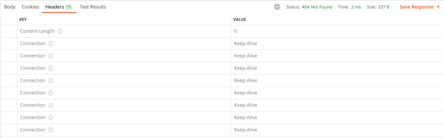

## Факты

На лекции предложили узнать, что происходит при использовании константы в качестве `Response`.

Далеко не уходя, удалось разоблачить суть проблемы.

Имеется сразу несколько проблем:
* Response не **immutable**, чем активно пользуется библиотека
* При каждом запросе добавляется как минимум один заголовок с информацией о текущем подключении (они накапливаются!)
* Только одному богу известно, что произойдет при многопоточном использовании

## Скрипты
В соответствии с заданием были написаны 2 lua скрипта:
* [get_request](scripts/lua/get_request.lua) - отправляет GET запрос на получение **entity** по случайному ключу
* [put_request](scripts/lua/put_request.lua) - отправляет PUT запрос на создание/изменение **entity**
по случайному ключу со значением произвольной длины

*(Еще был написан [bash скрипт](scripts/sh/base.sh) для запуска всего)*

## Нагрузка
### Характеристики
Macbook Pro M1 16GB после перезапуска

### План
Сначала мы запустим на продолжительное время **PUT** запросы для создания достаточно большой базы

*Т.к. новое значение по старому ключу всегда попадает в новый **SSTable** нет необходимости
в каком-то дополнителной проверки обновления старых значений*

*Однако ключи выбираются рандомно, т.к. мы хотим видеть время на сортировку*

Затем запустим **GET** запросы на уже получившуся базу. Посмотрим насколько сильно
влияют запросы по несуществующим значениям

### Реальность
#### PUT-запросы
Изначально мы прощупываем точку разладки для **PUT** запросов

[1](html/put_lower_wrk.txt),
[2](html/put_upper_wrk.txt),
[3](html/put_middle_1.txt),
[4](html/put_middle_2.txt),
[5](html/put_middle_3.txt),
[6](html/put_middle_4.txt)

Можно обратить внимание, что flamegraph'ы при этом не сильно отличаются

[1](html/put_lower_cpu.html),
[2](html/put_upper_cpu.html)

Видимо, это просто может сказать нам о некоем пределе нашей производительности

В итоге остановился на 13000 RPS, т.к. там есть более ощутимый скачок, чем на 11500

[300 секунд по 13000 RPS на пустую базу](html/put_request_wrk.txt)

Если посмотреть на [аллокации](html/put_request_alloc.html),
то наше DAO почти ничего не аллоцирует, все уходит на сервер

На [cpu](html/put_request_cpu.html), к сожалению, не видно какой процент уходит на flush.
Однако, можно заметить, что 30% от времени отправки ответа занимает помещенеие entity в мапу

Судя по ширине колонки приходится достаточно долго ждать, несмотря на то,
что worker'ов всего 2

Какого-то значительного оверхеда от генерируемых методов не заметил

#### GET-запросы

##### Запросы "мимо"
После **PUT**-запросов примерно сгенерировался `1GB` данных

*Как можно заметить после первой же нагрузки, что происходит огромная просадка на существенной части запросов*

*[wrk](html/get_many_misses_wrk.txt)* 

*И это оказывается фейком, потому что одновременно с запросами работал optimizer*

Из-за того, что **PUT** запросы создают записи в слишком большом диапазоне у нас много 400.
Однако, давайте и тут найдем точку разладки

[7000rps](html/get_7000_wrk.txt),
[8000rps](html/get_8000_wrk.txt),
[9000rps](html/get_9000_wrk.txt)
[10000rps](html/get_10000_wrk.txt)

Возьмем 8000, т.к. на мой взгляд наиболее оптимальное падение производительности

[300 секунд по 8000 RPS](html/get_misses_request_wrk.txt)

Как мы видим из [cpu](html/get_misses_request_cpu.html) огромное количество времени уходит на бинарный поиск

*Вероятнее всего, это связано с запросами к несуществующим ключам,
т.к. для для проверки нам будет необходимо обойти все таблицы
*(20 по 45MB)**

Также можно заметить,что теперь у нас присутсвует огромное количество [аллокаций](html/get_misses_request_alloc.html)
для бинарного поиска

Также из интересного можно заметить, что столбик с созданием итератора занимает `3%`,
что говорит о том, насколько мы часто обходим все **SSTable**

##### Теперь заполним базу "нормально"
Возьмем индексы в пределах 3 миллионов

Так 400 будет намного-намного меньше)

[10000_wrk](html/get_n_10000_wrk.txt),
[11000_wrk](html/get_n_11000_wrk.txt),
[13000_wrk](html/get_n_13000_wrk.txt),
[15000_wrk](html/get_n_15000_wrk.txt)

Как мы видим, примерно 25% - это промахи. Возьмем 10000 RPS

[300 секунд по 10000 RPS](html/get_n_request_wrk.txt)

[cpu](html/get_n_request_cpu.html)
Как мы видим время поиска на диске сократилось в процентном соотношении, т.е. 
мы стали чаще попадать в память.

Также мы существенную часть времени занимают локи (`10%`).

Несмотря на то, что код наш нигде не блокируется (берется read блокировка, которая позволяет читать каждому потоку)

Однако, проблема с поиском никуда не делась. Что впринципе видно из графиков

[Аллокации](html/get_n_request_alloc.html) также демонстрируют нам, что искать мы стали существенно меньше, 
т.к. теперь столбик `nio` хотя бы различим 
#### Other

Значительная часть cpu тратится на системные нужды GC, управление многопоточкой

### Вывод
DAO - кринж, бинарный поиск - кринж.

B+-tree - круто, блюм-фитр - респект
