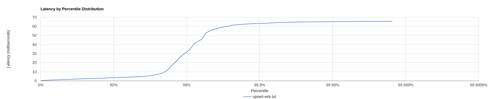
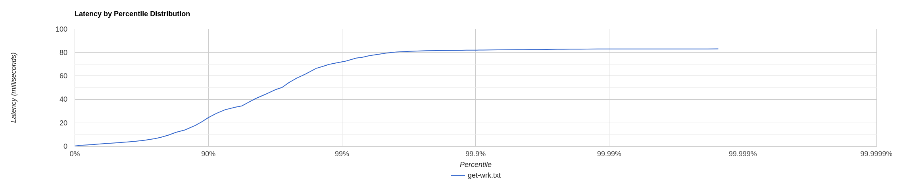

# Отчет по первому этапу

## Поиск точки разладки put-запросы

Был написан скрипт генерирующий напонение пустого хранилища. Скрипт запускался с уникальнымы парами key-value. 
Тестирование проводилось на виртуальной машине linux поверх windows, поэтому rps ниже чем мог бы быть на реальной машине.

```
wrk -c 1 -d 30 -t 1 -R 3200 -s nikitaprokopev/analysis/scripts/upsert.lua http://localhost:8080
Running 30s test @ http://localhost:8080
  1 threads and 1 connections
  Thread calibration: mean lat.: 878.446ms, rate sampling interval: 2922ms
  Thread Stats   Avg      Stdev     Max   +/- Stdev
    Latency     1.53s   165.22ms   1.85s    57.45%
    Req/Sec     3.17k   180.43     3.41k    66.67%
  91114 requests in 30.00s, 5.82MB read
Requests/sec:   3037.18
Transfer/sec:    198.72KB
```

Понизив rps до 2800, добился стабильной работы, получил следующие результаты:

```
wrk -c 1 -d 30 -t 1 -L -R 2800 -s nikitaprokopev/analysis/scripts/upsert.lua http://localhost:8080
Running 30s test @ http://localhost:8080
  1 threads and 1 connections
  Thread calibration: mean lat.: 66.349ms, rate sampling interval: 402ms
  Thread Stats   Avg      Stdev     Max   +/- Stdev
    Latency     2.34ms    5.49ms  65.54ms   97.71%
    Req/Sec     2.80k    43.31     3.01k    93.88%
  Latency Distribution (HdrHistogram - Recorded Latency)
 50.000%    1.33ms
 75.000%    2.35ms
 90.000%    3.43ms
 99.000%   31.47ms
 99.900%   63.20ms
 99.990%   65.09ms
 99.999%   65.50ms
100.000%   65.60ms

  Detailed Percentile spectrum:
       Value   Percentile   TotalCount 1/(1-Percentile)

       0.141     0.000000            2         1.00
       0.486     0.100000         5626         1.11
       0.718     0.200000        11222         1.25
       0.933     0.300000        16808         1.43
       1.136     0.400000        22420         1.67
       1.328     0.500000        28018         2.00
       1.460     0.550000        30802         2.22
       1.667     0.600000        33608         2.50
       1.884     0.650000        36393         2.86
       2.109     0.700000        39200         3.33
       2.349     0.750000        41995         4.00
       2.475     0.775000        43391         4.44
       2.609     0.800000        44805         5.00
       2.759     0.825000        46192         5.71
       2.931     0.850000        47596         6.67
       3.151     0.875000        48989         8.00
       3.283     0.887500        49692         8.89
       3.433     0.900000        50389        10.00
       3.609     0.912500        51092        11.43
       3.811     0.925000        51791        13.33
       4.063     0.937500        52495        16.00
       4.223     0.943750        52841        17.78
       4.419     0.950000        53187        20.00
       4.671     0.956250        53538        22.86
       5.031     0.962500        53888        26.67
       5.743     0.968750        54239        32.00
       6.315     0.971875        54414        35.56
       7.091     0.975000        54587        40.00
       8.319     0.978125        54762        45.71
      11.023     0.981250        54937        53.33
      17.743     0.984375        55112        64.00
      20.767     0.985938        55199        71.11
      25.679     0.987500        55287        80.00
      29.471     0.989062        55375        91.43
      33.247     0.990625        55462       106.67
      41.279     0.992188        55549       128.00
      43.455     0.992969        55593       142.22
      45.599     0.993750        55637       160.00
      52.607     0.994531        55682       182.86
      55.647     0.995313        55724       213.33
      57.631     0.996094        55768       256.00
      58.431     0.996484        55792       284.44
      59.359     0.996875        55813       320.00
      60.063     0.997266        55834       365.71
      61.375     0.997656        55856       426.67
      61.983     0.998047        55878       512.00
      62.239     0.998242        55888       568.89
      62.495     0.998437        55899       640.00
      62.783     0.998633        55910       731.43
      63.007     0.998828        55921       853.33
      63.231     0.999023        55933      1024.00
      63.263     0.999121        55937      1137.78
      63.519     0.999219        55943      1280.00
      63.807     0.999316        55949      1462.86
      64.127     0.999414        55955      1706.67
      64.287     0.999512        55959      2048.00
      64.319     0.999561        55962      2275.56
      64.575     0.999609        55965      2560.00
      64.639     0.999658        55967      2925.71
      64.799     0.999707        55970      3413.33
      64.831     0.999756        55973      4096.00
      64.895     0.999780        55975      4551.11
      64.927     0.999805        55976      5120.00
      64.991     0.999829        55978      5851.43
      64.991     0.999854        55978      6826.67
      65.087     0.999878        55980      8192.00
      65.087     0.999890        55980      9102.22
      65.247     0.999902        55981     10240.00
      65.311     0.999915        55982     11702.86
      65.311     0.999927        55982     13653.33
      65.343     0.999939        55983     16384.00
      65.343     0.999945        55983     18204.44
      65.439     0.999951        55984     20480.00
      65.439     0.999957        55984     23405.71
      65.439     0.999963        55984     27306.67
      65.503     0.999969        55985     32768.00
      65.503     0.999973        55985     36408.89
      65.503     0.999976        55985     40960.00
      65.503     0.999979        55985     46811.43
      65.503     0.999982        55985     54613.33
      65.599     0.999985        55986     65536.00
      65.599     1.000000        55986          inf
#[Mean    =        2.344, StdDeviation   =        5.494]
#[Max     =       65.536, Total count    =        55986]
#[Buckets =           27, SubBuckets     =         2048]
----------------------------------------------------------
  83993 requests in 30.00s, 5.37MB read
Requests/sec:   2799.81
Transfer/sec:    183.19KB
```

Гистограмма данного распределения:



Проверим что наш сервис держит rps долгое время, для этого проведем тестирование 2 минуты с 2800 rps. Видим, что среднее время 4.5 мс, а отклонение 16.25 мс - что вполне рабочее состояние.

```
wrk -c 1 -d 120 -t 1 -R 2800 -s nikitaprokopev/analysis/scripts/upsert.lua http://localhost:8080
Running 2m test @ http://localhost:8080
  1 threads and 1 connections
  Thread calibration: mean lat.: 26.348ms, rate sampling interval: 198ms
  Thread Stats   Avg      Stdev     Max   +/- Stdev
    Latency     4.50ms   16.25ms 180.10ms   96.43%
    Req/Sec     2.81k   163.93     3.77k    94.05%
  335996 requests in 2.00m, 21.47MB read
Requests/sec:   2799.97
Transfer/sec:    183.20KB
```

## Поиск точки разладки get-запросы

Для начала наполним используя скрипт для put запросов, пока не появятся несколько sstables на диске, чтобы поиск проходил не только в оперативной памяти, но и на диске.

```
wrk -c 1 -d 300 -t 1 -R 2800 -s nikitaprokopev/analysis/scripts/upsert.lua http://localhost:8080
```

После чего используя скрипт для get запросов найдем точку разладки для get запросов. Попробуем использовать rps чуть выше чем для put - 3200. Видим, что не справляется с rps понизим до 3000

```
wrk -c 1 -d 10 -t 1 -R 3200 -s nikitaprokopev/analysis/scripts/get.lua http://localhost:8080
Running 10s test @ http://localhost:8080
  1 threads and 1 connections
  Thread Stats   Avg      Stdev     Max   +/- Stdev
    Latency    70.87ms   88.03ms 308.22ms   81.22%
    Req/Sec       -nan      -nan   0.00      0.00%
  31187 requests in 10.00s, 2.19MB read
Requests/sec:   3118.77
Transfer/sec:    224.20KB
```

Видим что также при 3000 rps сервер стабильно работает.

```
wrk -c 1 -d 30 -t 1 -L -R 3000 -s nikitaprokopev/analysis/scripts/get.lua http://localhost:8080
Running 30s test @ http://localhost:8080
  1 threads and 1 connections
  Thread calibration: mean lat.: 6.128ms, rate sampling interval: 21ms
  Thread Stats   Avg      Stdev     Max   +/- Stdev
    Latency     8.02ms   13.76ms  83.01ms   89.15%
    Req/Sec     3.08k   333.65     4.85k    75.92%
  Latency Distribution (HdrHistogram - Recorded Latency)
 50.000%    2.81ms
 75.000%    6.51ms
 90.000%   24.42ms
 99.000%   72.00ms
 99.900%   82.05ms
 99.990%   83.01ms
 99.999%   83.01ms
100.000%   83.07ms

  Detailed Percentile spectrum:
       Value   Percentile   TotalCount 1/(1-Percentile)

       0.136     0.000000            1         1.00
       0.724     0.100000         6029         1.11
       1.138     0.200000        12039         1.25
       1.594     0.300000        18042         1.43
       2.211     0.400000        24066         1.67
       2.813     0.500000        30076         2.00
       3.175     0.550000        33082         2.22
       3.633     0.600000        36077         2.50
       4.227     0.650000        39080         2.86
       5.083     0.700000        42091         3.33
       6.507     0.750000        45092         4.00
       7.691     0.775000        46597         4.44
       9.375     0.800000        48101         5.00
      11.799     0.825000        49603         5.71
      13.863     0.850000        51109         6.67
      17.807     0.875000        52608         8.00
      20.703     0.887500        53356         8.89
      24.415     0.900000        54108        10.00
      27.919     0.912500        54861        11.43
      31.135     0.925000        55611        13.33
      33.375     0.937500        56369        16.00
      34.367     0.943750        56739        17.78
      37.567     0.950000        57114        20.00
      40.959     0.956250        57492        22.86
      44.255     0.962500        57876        26.67
      48.415     0.968750        58246        32.00
      50.175     0.971875        58431        35.56
      54.239     0.975000        58618        40.00
      58.047     0.978125        58804        45.71
      61.631     0.981250        58992        53.33
      66.431     0.984375        59180        64.00
      67.967     0.985938        59275        71.11
      69.823     0.987500        59374        80.00
      71.231     0.989062        59462        91.43
      72.639     0.990625        59557       106.67
      75.263     0.992188        59651       128.00
      75.967     0.992969        59697       142.22
      77.247     0.993750        59744       160.00
      78.271     0.994531        59797       182.86
      79.487     0.995313        59838       213.33
      80.447     0.996094        59885       256.00
      80.703     0.996484        59913       284.44
      81.023     0.996875        59937       320.00
      81.279     0.997266        59955       365.71
      81.471     0.997656        59986       426.67
      81.599     0.998047        60003       512.00
      81.663     0.998242        60021       568.89
      81.791     0.998437        60030       640.00
      81.855     0.998633        60041       731.43
      81.983     0.998828        60056       853.33
      82.047     0.999023        60062      1024.00
      82.111     0.999121        60068      1137.78
      82.175     0.999219        60075      1280.00
      82.303     0.999316        60080      1462.86
      82.367     0.999414        60088      1706.67
      82.431     0.999512        60095      2048.00
      82.431     0.999561        60095      2275.56
      82.495     0.999609        60098      2560.00
      82.559     0.999658        60101      2925.71
      82.623     0.999707        60102      3413.33
      82.751     0.999756        60107      4096.00
      82.751     0.999780        60107      4551.11
      82.815     0.999805        60108      5120.00
      82.879     0.999829        60110      5851.43
      82.943     0.999854        60111      6826.67
      83.007     0.999878        60118      8192.00
      83.007     0.999890        60118      9102.22
      83.007     0.999902        60118     10240.00
      83.007     0.999915        60118     11702.86
      83.007     0.999927        60118     13653.33
      83.007     0.999939        60118     16384.00
      83.007     0.999945        60118     18204.44
      83.007     0.999951        60118     20480.00
      83.007     0.999957        60118     23405.71
      83.007     0.999963        60118     27306.67
      83.007     0.999969        60118     32768.00
      83.007     0.999973        60118     36408.89
      83.007     0.999976        60118     40960.00
      83.007     0.999979        60118     46811.43
      83.007     0.999982        60118     54613.33
      83.071     0.999985        60119     65536.00
      83.071     1.000000        60119          inf
#[Mean    =        8.023, StdDeviation   =       13.759]
#[Max     =       83.008, Total count    =        60119]
#[Buckets =           27, SubBuckets     =         2048]
----------------------------------------------------------
  89996 requests in 30.00s, 6.34MB read
Requests/sec:   2999.89
Transfer/sec:    216.40KB
```

Гистограмма этого распределения:



Среднее время запроса 8 мс при отклонении 13.76 - что хороший показатель. Проверим также на сьтабильность работы при долгой нагрузке. Все в порядке.

```
wrk -c 1 -d 120 -t 1 -R 3000 -s nikitaprokopev/analysis/scripts/get.lua http://localhost:8080
Running 2m test @ http://localhost:8080
  1 threads and 1 connections
  Thread calibration: mean lat.: 12.302ms, rate sampling interval: 76ms
  Thread Stats   Avg      Stdev     Max   +/- Stdev
    Latency     7.90ms   21.03ms 199.81ms   93.47%
    Req/Sec     3.02k   236.78     4.17k    90.74%
  359994 requests in 2.00m, 25.50MB read
  Non-2xx or 3xx responses: 24014
Requests/sec:   2999.96
Transfer/sec:    217.64KB
```
Non-2xx or 3xx responses: 24014 - связано с отсутствием ключей в хранилище.

### Вывод: сервис работает стабильно при get и put запросах при ~3000 rps.

## Профилирование Async Profiler


## Профилирование PUT

Для этого используя скрипт wrk запустим upsert.
```
wrk -c 1 -d 120 -t 1 -R 2800 -s nikitaprokopev/analysis/scripts/upsert.lua http://localhost:8080
```
А при помощи async-profiler запишем профиль для cpu и alloc.

```
asprof -d 30 -e cpu,alloc -f nikitaprokopev/analysis/results/upsert-profiler.jfr <PID>
```

### CPU

- Большу'ю часть (41%) представляет код java - работу JIT компилятор и работу сборщика мусора G1.
- Запиcь SSTables на диск занимает неочень много времени (0.68%), это может быть связано с мальниким размером значений(value).
- 30% времени затратила библиотке one-nio на работку с запросами.
- Из работы базы данных больше всего времени ушло на метод doPut в ConcurrentSkipListMap

### ALLOC

- Видно что большая часть аллокаций приходится на библиотеку one-nio
- В работе моей базы данных большое количество аллокаций приходится на создание MemorySegment

## Профилирование GET

Для этого используя скрипт wrk запустим get.
```
wrk -c 1 -d 120 -t 1 -R 2800 -s nikitaprokopev/analysis/scripts/get.lua http://localhost:8080
```

А при помощи async-profiler запишем профиль для cpu и alloc.

```
asprof -d 30 -e cpu,alloc -f nikitaprokopev/analysis/results/get-profiler.jfr <PID>
```

### CPU

- Из работы моей БД большое время на запросах уходит на метод java/lang/foreign/MemorySegment.mismatch - сравнение ключей

### ALLOC

- Также как и при put - бо'льшую чать аллокаций делает библиотека one-nio
- В работе БД наибольшее количество алокаций происходит в методе MappedMemorySegmentImpl.dup - во время работы с замаплинными таблицами с диска
