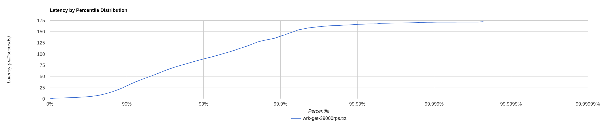
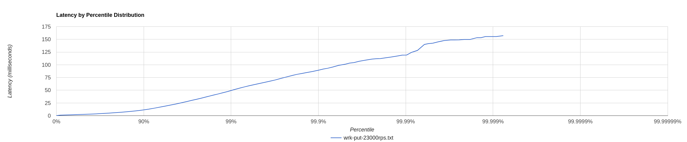

# Отчет по второму этапу

## Зададим количетство потоков:
ассептер тредов - 4
селектер тредов - 4

## В качестве политики переполнения очерени

Испольется AbortPolicy - чтобы отправлять ошибку о большом количестве запросов

## Обработка ошибок

Производится в методе handleRequest где отлавливатся все ошибки и если то это HttpException - бросается 400, иначе 500.

## В качестве очереди были рассмотрены

- ArrayBlockingQueue<> - с указанием длины очереди
- LinkedBlockingQueue<> - c указанием длины очереди
Другие очереди не подходят нам, бытрее оказалась ArrayBlockingQueue использует внутренний массив для хранения элементов, что обеспечивает более эффективный доступ к элементам в памяти.

## Выбор количество тредов обработки запросов к dao
После добавление многопоточной обработки запросов в дао,
используя wrk с параметрами -c 128 -t 128 для создания большого количества get запросов,
поэкспериментирем с количеством потоков для обработки 2, 4, 8, 16, 32 - колчиство ядер у меня 4 с 2 потоками на ядро.

- 2 - 25000 при средней задержке 54ms
- 4 - 33000 при средней задержке 46ms
- 8 - 40000 при средней задержке 79ms
- 16 - 37000 при средней задержке 73ms
- 32 - 32000 при средней задержке 94ms

Делаем вывод оптимальное значение 8 потоков.

## Сделаем замер для точек расладки при put и get

Все замеры проводилис на проретом и наполненом сервере

### get

Значение в 39000 было получено, при более высоких значениях максимальные задержи были очень большими
В файлах в папке results приведены дополнителные все замеры.

```
../wrk2/wrk -c 128 -d 10 -t 128 -L -R 39000 -s ./src/main/java/ru/vk/itmo/test/nikitaprokopev/analysis/stage2/scripts/get.lua http://localhost:8080
Running 10s test @ http://localhost:8080
  128 threads and 128 connections
  Thread Stats   Avg      Stdev     Max   +/- Stdev
    Latency     9.79ms   18.14ms 172.16ms   89.69%
    Req/Sec       -nan      -nan   0.00      0.00%
  Latency Distribution (HdrHistogram - Recorded Latency)
 50.000%    2.87ms
 75.000%    6.93ms
 90.000%   29.04ms
 99.000%   89.09ms
 99.900%  139.77ms
 99.990%  166.27ms
 99.999%  171.01ms
100.000%  172.29ms

  Detailed Percentile spectrum:
       Value   Percentile   TotalCount 1/(1-Percentile)

       0.183     0.000000            1         1.00
       1.221     0.100000        38711         1.11
       1.584     0.200000        77450         1.25
       1.940     0.300000       116149         1.43
       2.347     0.400000       154772         1.67
       2.869     0.500000       193486         2.00
       3.211     0.550000       212786         2.22
       3.653     0.600000       232113         2.50
       4.259     0.650000       251500         2.86
       5.235     0.700000       270860         3.33
       6.931     0.750000       290135         4.00
       8.311     0.775000       299800         4.44
      10.287     0.800000       309463         5.00
      12.951     0.825000       319143         5.71
      16.463     0.850000       328814         6.67
      21.519     0.875000       338486         8.00
      24.927     0.887500       343317         8.89
      29.039     0.900000       348141        10.00
      33.695     0.912500       353008        11.43
      38.559     0.925000       357812        13.33
      43.935     0.937500       362679        16.00
      46.815     0.943750       365084        17.78
      49.919     0.950000       367484        20.00
      53.567     0.956250       369909        22.86
      58.207     0.962500       372317        26.67
      63.647     0.968750       374735        32.00
      66.495     0.971875       375947        35.56
      69.567     0.975000       377150        40.00
      72.703     0.978125       378364        45.71
      76.031     0.981250       379585        53.33
      79.871     0.984375       380787        64.00
      82.175     0.985938       381389        71.11
      84.671     0.987500       381986        80.00
      87.423     0.989062       382604        91.43
      90.495     0.990625       383196       106.67
      93.759     0.992188       383809       128.00
      95.935     0.992969       384106       142.22
      98.431     0.993750       384404       160.00
     101.311     0.994531       384709       182.86
     104.575     0.995313       385007       213.33
     108.799     0.996094       385310       256.00
     111.679     0.996484       385462       284.44
     114.495     0.996875       385613       320.00
     117.759     0.997266       385764       365.71
     122.175     0.997656       385915       426.67
     127.487     0.998047       386067       512.00
     129.343     0.998242       386142       568.89
     131.327     0.998437       386219       640.00
     133.119     0.998633       386292       731.43
     135.679     0.998828       386367       853.33
     140.543     0.999023       386443      1024.00
     142.975     0.999121       386481      1137.78
     146.303     0.999219       386518      1280.00
     149.759     0.999316       386557      1462.86
     153.983     0.999414       386594      1706.67
     156.671     0.999512       386633      2048.00
     158.335     0.999561       386653      2275.56
     159.359     0.999609       386673      2560.00
     160.511     0.999658       386690      2925.71
     161.663     0.999707       386709      3413.33
     162.815     0.999756       386726      4096.00
     163.327     0.999780       386736      4551.11
     163.711     0.999805       386745      5120.00
     164.095     0.999829       386754      5851.43
     164.735     0.999854       386765      6826.67
     165.375     0.999878       386774      8192.00
     165.887     0.999890       386778      9102.22
     166.527     0.999902       386785     10240.00
     166.655     0.999915       386787     11702.86
     167.167     0.999927       386794     13653.33
     167.423     0.999939       386797     16384.00
     167.807     0.999945       386799     18204.44
     168.831     0.999951       386802     20480.00
     168.959     0.999957       386804     23405.71
     169.215     0.999963       386806     27306.67
     169.343     0.999969       386810     32768.00
     169.343     0.999973       386810     36408.89
     169.471     0.999976       386811     40960.00
     169.727     0.999979       386812     46811.43
     170.111     0.999982       386813     54613.33
     170.751     0.999985       386815     65536.00
     170.751     0.999986       386815     72817.78
     171.007     0.999988       386816     81920.00
     171.007     0.999989       386816     93622.86
     171.391     0.999991       386817    109226.67
     171.519     0.999992       386818    131072.00
     171.519     0.999993       386818    145635.56
     171.519     0.999994       386818    163840.00
     171.519     0.999995       386818    187245.71
     171.647     0.999995       386819    218453.33
     171.647     0.999996       386819    262144.00
     171.647     0.999997       386819    291271.11
     171.647     0.999997       386819    327680.00
     171.647     0.999997       386819    374491.43
     172.287     0.999998       386820    436906.67
     172.287     1.000000       386820          inf
#[Mean    =        9.792, StdDeviation   =       18.138]
#[Max     =      172.160, Total count    =       386820]
#[Buckets =           27, SubBuckets     =         2048]
----------------------------------------------------------
  386948 requests in 9.74s, 39.68MB read
Requests/sec:  39710.26
Transfer/sec:      4.07MB

```

График этого распределения:



### put 

Значение в 23000 было получено, при более высоких значениях максимальные задержи были очень большими
В файлах в папке results дополнителные приведены все замеры.

```
 ../wrk2/wrk -c 128 -d 10 -t 128 -L -R 23000 -s ./src/main/java/ru/vk/itmo/test/nikitaprokopev/analysis/stage2/scripts/put.lua http://localhost:8080
Running 10s test @ http://localhost:8080
  128 threads and 128 connections
  Thread calibration: mean lat.: 6.655ms, rate sampling interval: 23ms
  Thread Stats   Avg      Stdev     Max   +/- Stdev
    Latency     5.39ms    9.16ms 157.18ms   92.36%
    Req/Sec       -nan      -nan   0.00      0.00%
  Latency Distribution (HdrHistogram - Recorded Latency)
 50.000%    2.46ms
 75.000%    5.08ms
 90.000%   11.34ms
 99.000%   49.41ms
 99.900%   89.41ms
 99.990%  119.04ms
 99.999%  155.52ms
100.000%  157.31ms

  Detailed Percentile spectrum:
       Value   Percentile   TotalCount 1/(1-Percentile)

       0.213     0.000000            1         1.00
       1.050     0.100000        22754         1.11
       1.357     0.200000        45572         1.25
       1.648     0.300000        68286         1.43
       1.998     0.400000        91026         1.67
       2.463     0.500000       113752         2.00
       2.763     0.550000       125174         2.22
       3.133     0.600000       136508         2.50
       3.607     0.650000       147873         2.86
       4.227     0.700000       159251         3.33
       5.083     0.750000       170669         4.00
       5.615     0.775000       176328         4.44
       6.247     0.800000       182013         5.00
       6.999     0.825000       187695         5.71
       8.007     0.850000       193376         6.67
       9.351     0.875000       199069         8.00
      10.231     0.887500       201922         8.89
      11.343     0.900000       204754        10.00
      12.807     0.912500       207594        11.43
      14.847     0.925000       210436        13.33
      17.391     0.937500       213278        16.00
      18.943     0.943750       214706        17.78
      20.671     0.950000       216134        20.00
      22.623     0.956250       217548        22.86
      25.071     0.962500       218973        26.67
      28.223     0.968750       220397        32.00
      30.111     0.971875       221098        35.56
      32.127     0.975000       221809        40.00
      34.495     0.978125       222525        45.71
      37.407     0.981250       223237        53.33
      40.767     0.984375       223942        64.00
      42.655     0.985938       224300        71.11
      44.895     0.987500       224655        80.00
      47.455     0.989062       225009        91.43
      50.879     0.990625       225366       106.67
      54.559     0.992188       225725       128.00
      56.543     0.992969       225897       142.22
      58.623     0.993750       226075       160.00
      60.863     0.994531       226254       182.86
      63.391     0.995313       226430       213.33
      66.367     0.996094       226611       256.00
      68.095     0.996484       226697       284.44
      70.143     0.996875       226787       320.00
      72.895     0.997266       226877       365.71
      75.903     0.997656       226964       426.67
      79.359     0.998047       227052       512.00
      81.215     0.998242       227098       568.89
      82.815     0.998437       227142       640.00
      84.735     0.998633       227185       731.43
      86.783     0.998828       227230       853.33
      89.727     0.999023       227274      1024.00
      91.583     0.999121       227297      1137.78
      93.183     0.999219       227319      1280.00
      95.679     0.999316       227341      1462.86
      98.879     0.999414       227363      1706.67
     101.247     0.999512       227385      2048.00
     103.295     0.999561       227397      2275.56
     104.319     0.999609       227408      2560.00
     106.815     0.999658       227419      2925.71
     108.927     0.999707       227430      3413.33
     111.167     0.999756       227442      4096.00
     111.871     0.999780       227447      4551.11
     112.127     0.999805       227452      5120.00
     113.663     0.999829       227458      5851.43
     115.263     0.999854       227464      6826.67
     117.567     0.999878       227469      8192.00
     118.975     0.999890       227472      9102.22
     119.167     0.999902       227474     10240.00
     124.479     0.999915       227477     11702.86
     128.255     0.999927       227480     13653.33
     140.031     0.999939       227483     16384.00
     141.567     0.999945       227484     18204.44
     142.463     0.999951       227485     20480.00
     145.023     0.999957       227487     23405.71
     147.455     0.999963       227488     27306.67
     148.863     0.999969       227490     32768.00
     148.863     0.999973       227490     36408.89
     148.991     0.999976       227491     40960.00
     149.759     0.999979       227492     46811.43
     149.759     0.999982       227492     54613.33
     153.343     0.999985       227493     65536.00
     153.343     0.999986       227493     72817.78
     155.519     0.999988       227494     81920.00
     155.519     0.999989       227494     93622.86
     155.519     0.999991       227494    109226.67
     157.311     0.999992       227496    131072.00
     157.311     1.000000       227496          inf
#[Mean    =        5.394, StdDeviation   =        9.161]
#[Max     =      157.184, Total count    =       227496]
#[Buckets =           27, SubBuckets     =         2048]
----------------------------------------------------------
  229421 requests in 9.87s, 14.66MB read
Requests/sec:  23233.33
Transfer/sec:      1.48MB
```

График этого распределения:



### Проведем исследование влини количества соединений на rps и latency

Выполнялось на get запросах на прогретом сервере. Данные замеров приедены в папке results.

- -c 256 -t 256 ---> 36000 со средней задержкой 15ms и отклонением 20ms
- -c 128 -t 128 ---> 39000 со средней задержкой 9ms и отклонением 18ms
- -c 64 -t 64 ---> 36000 со средней задержкой 12ms и отклонением 20ms
- -c 32 -t 32 ---> 30000 со средней задержкой 12ms и отклонением 20ms
- -c 16 -t 16 ---> 18000 со средней задержкой 50ms и отклонением 50ms

Делаем вывод что оптимальное значение 128 потоков.

## Async-profiler

Выполнялось на прогретом сервере.

## get

### cpu

- отправка ответа занимает 50% времени
- чтение запроса занимает 10%
- работа базы данных 10%

### alloc

- отправка ответа занимает 18% выделений памяти
- чтение запроса занимает 30% выделений памяти
- работа базы данных 40% выделений памяти (формирование Response - 14%, преобразование MemorySegment в массив байтов для ответа 7%, преобразование ключа из запроса в MemorySegment - 11%, выделения внутри dao - 7% во время маппинга таблиц с диска)

### lock

- ArrayBlockingQueue в моем новом ThreadPoolExecuter
- httpSession (без уточнений) - 90%
- httpSession.Read - 3%

## put

### cpu

- отправка ответа занимает 48% времени внутри ThreadPoolExecutor - 6%
- чтение запроса занимает 13%
- работа базы данных 11% внутри ThreadPoolExecutor

### alloc

- отправка ответа занимает 13% выделений памяти
- чтение запроса занимает 47% выделений памяти
- работа базы данных 30% выделений памяти (формирование Response - 15%, преобразование MemorySegment в массив байтов для ответа 8%, преобразование ключа из запроса в MemorySegment - 7%

### lock

- ArrayBlockingQueue в моем новом ThreadPoolExecuter - 20%
- httpSession (без уточнений) - 65%
- httpSession.Read - 12%

## Замеры по каждому из потоков

Профили по всем потокам также приведены в папке results.

Потоки работают примерно одинаково по нагрзуке на процесор, выделению памяти и блокировкам.

Дополнительной информации, рассмотрев потоки в работе по отдельности, выявить не удалось.

## Возможные оптимизации
- Основные затраты на выделени памяти во время преобразования при request и response, например, запрос содерит ключ как набор байт, было бы лучше получаеть его как параметр, а не переводить в строку обратно, также с ответом
- На реальной БД можно былобы в зависимости от размера значений подобрать оптимальный размер файлов БД (threshold), что также могло бы оптимизировать поиск
- Также, как обсуждалось на одной из лекций, если мы знаем что у нас есть часто используемые ключи - сделать для них in-memory кэш
- Проводить compaction для оптимизации размера БД, а также ускорение поиска