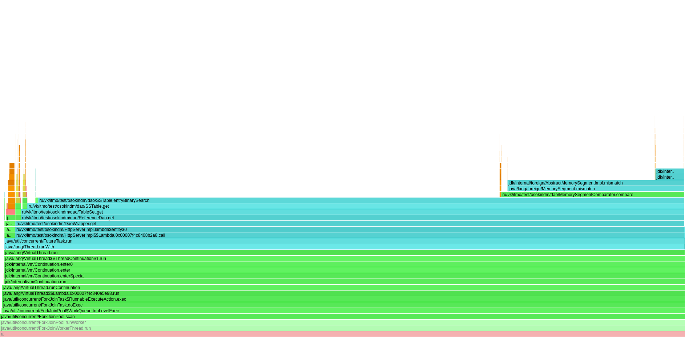
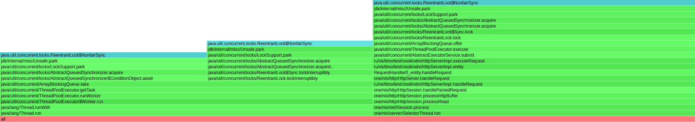

## Подбор конфигурации ThreadPoolExecutor

В качестве основного решения был выбран ThreadPoolExecutor, основанный на ArrayBlockingQueue.
Определим оптимальные параметры размера пула для данного исполнителя. 
Размер очереди пока зафиксируем на уровне 300 задач. Важно найти золотую середину, так как очередь слишком маленького размера может привести к большому количеству 500 ответов, а большая очередь - к отмене задач по таймауту.

1. `corePoolSize` и `maximumPoolSize` равные `Runtime.getRuntime().availableProcessors()`

15'000 rps, -t 64 -c 64, GET

<pre>
`wrk -d 60 -t 64 -c 64 -R 15000 -L  -s ./src/main/java/ru/vk/itmo/test/osokindm/wrk_scripts/get.lua http://localhost:8080/v0/entity`

  Thread Stats   Avg      Stdev     Max   +/- Stdev
    Latency     1.20ms  430.15us  19.26ms   72.13%
    Req/Sec   246.40     51.82   555.00     64.28%
  Latency Distribution (HdrHistogram - Recorded Latency)
 50.000%    1.18ms
 75.000%    1.45ms
 90.000%    1.70ms
 99.000%    2.29ms
 99.900%    3.67ms
 99.990%    8.10ms
 99.999%   14.98ms
100.000%   19.28ms

Detailed Percentile spectrum:
Value   Percentile   TotalCount 1/(1-Percentile)

       0.112     0.000000            1         1.00
       0.690     0.100000        75406         1.11
       0.832     0.200000       150262         1.25
       0.956     0.300000       225353         1.43
       1.071     0.400000       300221         1.67
       1.180     0.500000       375481         2.00
       1.232     0.550000       412470         2.22
       1.286     0.600000       450467         2.50
       1.339     0.650000       487783         2.86
       1.393     0.700000       525078         3.33
       1.449     0.750000       562525         4.00
       1.479     0.775000       581385         4.44
       1.511     0.800000       600251         5.00
       1.546     0.825000       618818         5.71
       1.586     0.850000       637411         6.67
       1.635     0.875000       656494         8.00
       1.663     0.887500       665570         8.89
       1.696     0.900000       674929        10.00
       1.735     0.912500       684376        11.43
       1.780     0.925000       693723        13.33
       1.831     0.937500       703157        16.00
       1.859     0.943750       707800        17.78
       1.890     0.950000       712516        20.00
       1.923     0.956250       717185        22.86
       1.961     0.962500       721848        26.67
       2.004     0.968750       726499        32.00
       2.029     0.971875       728801        35.56
       2.057     0.975000       731172        40.00
       2.089     0.978125       733517        45.71
       2.127     0.981250       735905        53.33
       2.171     0.984375       738173        64.00
       2.197     0.985938       739353        71.11
       2.229     0.987500       740539        80.00
       2.265     0.989062       741695        91.43
       2.307     0.990625       742886       106.67
       2.355     0.992188       744034       128.00
       2.385     0.992969       744609       142.22
       2.417     0.993750       745201       160.00
       2.457     0.994531       745800       182.86
       2.505     0.995313       746379       213.33
       2.563     0.996094       746965       256.00
       2.599     0.996484       747247       284.44
       2.643     0.996875       747539       320.00
       2.699     0.997266       747826       365.71
       2.777     0.997656       748118       426.67
       2.893     0.998047       748410       512.00
       2.987     0.998242       748555       568.89
       3.095     0.998437       748706       640.00
       3.259     0.998633       748848       731.43
       3.439     0.998828       748995       853.33
       3.701     0.999023       749142      1024.00
       3.853     0.999121       749214      1137.78
       4.029     0.999219       749288      1280.00
       4.271     0.999316       749362      1462.86
       4.503     0.999414       749434      1706.67
       4.827     0.999512       749507      2048.00
       5.067     0.999561       749544      2275.56
       5.259     0.999609       749581      2560.00
       5.527     0.999658       749617      2925.71
       5.839     0.999707       749654      3413.33
       6.255     0.999756       749690      4096.00
       6.491     0.999780       749710      4551.11
       6.759     0.999805       749727      5120.00
       7.023     0.999829       749745      5851.43
       7.399     0.999854       749764      6826.67
       7.803     0.999878       749782      8192.00
       7.987     0.999890       749791      9102.22
       8.231     0.999902       749800     10240.00
       8.815     0.999915       749809     11702.86
       9.167     0.999927       749819     13653.33
       9.855     0.999939       749828     16384.00
       9.975     0.999945       749832     18204.44
      10.239     0.999951       749837     20480.00
      10.455     0.999957       749841     23405.71
      10.999     0.999963       749846     27306.67
      11.311     0.999969       749851     32768.00
      11.575     0.999973       749853     36408.89
      12.039     0.999976       749855     40960.00
      12.239     0.999979       749857     46811.43
      12.335     0.999982       749860     54613.33
      14.295     0.999985       749862     65536.00
      14.575     0.999986       749863     72817.78
      14.775     0.999988       749864     81920.00
      14.855     0.999989       749865     93622.86
      15.287     0.999991       749867    109226.67
      16.247     0.999992       749868    131072.00
      16.247     0.999993       749868    145635.56
      16.351     0.999994       749869    163840.00
      16.351     0.999995       749869    187245.71
      16.607     0.999995       749870    218453.33
      18.031     0.999996       749871    262144.00
      18.031     0.999997       749871    291271.11
      18.031     0.999997       749871    327680.00
      18.031     0.999997       749871    374491.43
      18.351     0.999998       749872    436906.67
      18.351     0.999998       749872    524288.00
      18.351     0.999998       749872    582542.22
      18.351     0.999998       749872    655360.00
      18.351     0.999999       749872    748982.86
      19.279     0.999999       749873    873813.33
      19.279     1.000000       749873          inf
#[Mean    =        1.197, StdDeviation   =        0.430]
#[Max     =       19.264, Total count    =       749873]
#[Buckets =           27, SubBuckets     =         2048]
----------------------------------------------------------
900001 requests in 1.00m, 58.26MB read
Requests/sec:  15001.47
Transfer/sec:      0.97MB

</pre>

[Flamegraph cpu](../hw2/profiler/get_15k.png)

[Flamegraph alloc](../hw2/profiler/get_15k_alloc.png)

2. `corePoolSize = Runtime.getRuntime().availableProcessors()`, `maximumPoolSize = 64`

15'000 rps, -t 64 -c 64, GET

<pre>
  Thread Stats   Avg      Stdev     Max   +/- Stdev
    Latency     1.98ms    3.20ms 116.03ms   97.29%
    Req/Sec   247.06     54.31     0.89k    84.43%
  Latency Distribution (HdrHistogram - Recorded Latency)
 50.000%    1.55ms
 75.000%    2.02ms
 90.000%    2.75ms
 99.000%    9.67ms
 99.900%   52.35ms
 99.990%   95.49ms
 99.999%  112.51ms
100.000%  116.10ms

Detailed Percentile spectrum:
Value   Percentile   TotalCount 1/(1-Percentile)

       0.114     0.000000            1         1.00
       0.900     0.100000        75176         1.11
       1.100     0.200000       149972         1.25
       1.264     0.300000       225185         1.43
       1.411     0.400000       300087         1.67
       1.552     0.500000       375354         2.00
       1.624     0.550000       412771         2.22
       1.701     0.600000       450265         2.50
       1.787     0.650000       487517         2.86
       1.891     0.700000       525050         3.33
       2.018     0.750000       562590         4.00
       2.093     0.775000       581444         4.44
       2.177     0.800000       600022         5.00
       2.277     0.825000       618963         5.71
       2.393     0.850000       637438         6.67
       2.547     0.875000       656247         8.00
       2.641     0.887500       665646         8.89
       2.749     0.900000       674883        10.00
       2.883     0.912500       684310        11.43
       3.053     0.925000       693677        13.33
       3.293     0.937500       703001        16.00
       3.463     0.943750       707703        17.78
       3.679     0.950000       712396        20.00
       3.965     0.956250       717050        22.86
       4.335     0.962500       721751        26.67
       4.803     0.968750       726437        32.00
       5.091     0.971875       728786        35.56
       5.407     0.975000       731120        40.00
       5.823     0.978125       733472        45.71
       6.363     0.981250       735803        53.33
       7.087     0.984375       738141        64.00
       7.575     0.985938       739309        71.11
       8.199     0.987500       740481        80.00
       8.991     0.989062       741652        91.43
      10.175     0.990625       742826       106.67
      11.903     0.992188       743998       128.00
      13.063     0.992969       744582       142.22
      14.551     0.993750       745167       160.00
      16.511     0.994531       745760       182.86
      19.119     0.995313       746343       213.33
      22.351     0.996094       746924       256.00
      24.527     0.996484       747217       284.44
      26.879     0.996875       747510       320.00
      29.551     0.997266       747804       365.71
      32.863     0.997656       748098       426.67
      36.479     0.998047       748389       512.00
      38.879     0.998242       748537       568.89
      41.503     0.998437       748684       640.00
      44.767     0.998633       748829       731.43
      48.671     0.998828       748976       853.33
      53.151     0.999023       749121      1024.00
      55.807     0.999121       749194      1137.78
      58.527     0.999219       749270      1280.00
      61.439     0.999316       749342      1462.86
      64.159     0.999414       749414      1706.67
      68.799     0.999512       749487      2048.00
      71.359     0.999561       749525      2275.56
      73.919     0.999609       749562      2560.00
      76.991     0.999658       749597      2925.71
      79.743     0.999707       749635      3413.33
      82.495     0.999756       749670      4096.00
      83.967     0.999780       749689      4551.11
      85.311     0.999805       749708      5120.00
      86.783     0.999829       749725      5851.43
      89.599     0.999854       749744      6826.67
      92.607     0.999878       749762      8192.00
      94.143     0.999890       749771      9102.22
      95.551     0.999902       749780     10240.00
      97.343     0.999915       749789     11702.86
      99.455     0.999927       749799     13653.33
     101.631     0.999939       749809     16384.00
     102.783     0.999945       749813     18204.44
     103.359     0.999951       749817     20480.00
     104.255     0.999957       749821     23405.71
     105.279     0.999963       749826     27306.67
     106.431     0.999969       749831     32768.00
     107.263     0.999973       749833     36408.89
     107.775     0.999976       749835     40960.00
     108.479     0.999979       749837     46811.43
     109.503     0.999982       749840     54613.33
     111.103     0.999985       749842     65536.00
     111.487     0.999986       749843     72817.78
     111.551     0.999988       749844     81920.00
     111.807     0.999989       749845     93622.86
     113.279     0.999991       749847    109226.67
     113.343     0.999992       749848    131072.00
     113.343     0.999993       749848    145635.56
     114.623     0.999994       749849    163840.00
     114.623     0.999995       749849    187245.71
     114.815     0.999995       749851    218453.33
     114.815     0.999996       749851    262144.00
     114.815     0.999997       749851    291271.11
     114.815     0.999997       749851    327680.00
     114.815     0.999997       749851    374491.43
     115.647     0.999998       749852    436906.67
     115.647     0.999998       749852    524288.00
     115.647     0.999998       749852    582542.22
     115.647     0.999998       749852    655360.00
     115.647     0.999999       749852    748982.86
     116.095     0.999999       749853    873813.33
     116.095     1.000000       749853          inf
#[Mean    =        1.983, StdDeviation   =        3.197]
#[Max     =      116.032, Total count    =       749853]
#[Buckets =           27, SubBuckets     =         2048]
----------------------------------------------------------
899978 requests in 1.00m, 58.26MB read
Requests/sec:  15001.35
Transfer/sec:      0.97MB

</pre>

[Flamegraph cpu](../hw2/profiler/get_15k_pool64.png)

[Flamegraph alloc](../hw2/profiler/get_15k_alloc_pool64.png)

Как можно заметить, при увеличении максимального количества потоков в пуле произходит скачок на 99 и 99.9 персентиле. Максимальная задержка при этом увеличивается с 19 до 116 мс. Наиболее интересное отличие, при этом, наблюдается при профилировании cpu: метод `MemorySegment.mismatch` во втором случае занимает на 50% меньше процессорного времени, что, на мой взгляд, кажется контринтуитивным.
Возможно, процессорное время сократилось за счёт параллельной обработки, метод стал выполняться быстрее за счёт меньшего конкурентного доступа к ресурсам или более эффективного использования кешей процессора. 

Увеличение задержки должно быть связано с возросшим количеством переключений контекста, однако я не нашел подтверждения этой идеи при сравенении флеймграфов. 

Что касается анализа аллокаций, то можно отметить метод `java/util/concurrent/locks/AbstractQueuedSynchronizer.acquire`, занимающий 0.11% аллокаций в перовм случае. В остальном графики идентичны.

Оптимальным размером очереди по результатам нагрузочного тестирования является 600 воркеров. Так, например, задерка на сотом персентиле, средняя за три прогона, при уменьшении до 300 воркеров увеличилась на 28%, а при 1000 воркерах увеличилась на 11%.

## Сравнение ExecutorService

Сравним ThreadPoolExecutor, основанный на ArrayBlockingQueue, SyncronousQueue и исполнитель newVirtualThreadPerTaskExecutor

1. SyncronousQueue.
После замены очереди на SyncronousQueue производительность значительно упала (15000 rps против 6000 rps).

wrk script

<pre>
`wrk -d 60 -t 64 -c 64 -R 6000 -L  -s ./src/main/java/ru/vk/itmo/test/osokindm/wrk_scripts/get.lua http://localhost:8080/v0/entity`
</pre>

[Flamegraph cpu html](../hw2/profiler/html/profile_syncronous_cpu.html)

2. ArrayBlockingQueue, рассмотренный ранее.

При анализе нагрузки на cpu через async-profiler заметил следующее: 0.5% процессорного времени тратится на методы AbstractQueuedSynchronizer, а именно signalNext, unpark. В целом, в следствие того, что в при наличии большой очереди добавление и удаление требует сложной синхронизации, особенно когда очередь почти заполнена. В нашем случае больше времени уходит на методы пробуждения потоков, когда освобождается место в очереди.

Но, в целом, замена ArrayBlockingQueue на SyncronousQueue и дальнейшее их сравнение является не очень корректным действием из-за концептуальных различий. В нашем случае требовалась обработка большого колчиества событий и поэтому SyncronousQueue хотя и имеет низкую задержку на передачу одного сообщения, становится менее эффективной при высоких нагрузках из-за отсутствия буферизации и необходимости постоянного ожидания освобождения потоков. 

3. newVirtualThreadPerTaskExecutor 

С добавлением виртуальных потоков очень сильно возрастает нагрузка на процессор. Помимо задач работы с БД можно заметить VirtualThread.run - цикл выполнения виртуального потока, а также работу с ForkJoinPool.  

Таким образом, виртуальные потоки не будут хорошим решением в случае тяжелых задач. Постоянные переключения контекста и использование ForkJoinPool (который уже не в лучшем свете упомянули на лекции) увеличивают максимальную задержку, в нашем случае, почти в 15 раз.  

15'000 rps, -t 64 -c 64, GET

<pre>
  Thread Stats   Avg      Stdev     Max   +/- Stdev
    Latency     3.47ms   19.92ms 613.89ms   98.07%
    Req/Sec   245.94     54.19     1.22k    84.81%
  Latency Distribution (HdrHistogram - Recorded Latency)
 50.000%    1.22ms
 75.000%    1.52ms
 90.000%    1.94ms
 99.000%   70.53ms
 99.900%  286.98ms
 99.990%  561.66ms
 99.999%  611.33ms
100.000%  614.40ms

Detailed Percentile spectrum:
Value   Percentile   TotalCount 1/(1-Percentile)

       0.121     0.000000            1         1.00
       0.703     0.100000       135259         1.11
       0.852     0.200000       270359         1.25
       0.981     0.300000       405810         1.43
       1.100     0.400000       540089         1.67
       1.216     0.500000       675668         2.00
       1.273     0.550000       742364         2.22
       1.331     0.600000       810276         2.50
       1.390     0.650000       877806         2.86
       1.451     0.700000       944994         3.33
       1.519     0.750000      1012904         4.00
       1.558     0.775000      1046608         4.44
       1.603     0.800000      1080096         5.00
       1.658     0.825000      1113880         5.71
       1.728     0.850000      1147588         6.67
       1.819     0.875000      1181304         8.00
       1.875     0.887500      1197972         8.89
       1.944     0.900000      1214979        10.00
       2.031     0.912500      1231728        11.43
       2.159     0.925000      1248528        13.33
       2.397     0.937500      1265400        16.00
       2.595     0.943750      1273857        17.78
       2.911     0.950000      1282274        20.00
       3.463     0.956250      1290700        22.86
       4.531     0.962500      1299126        26.67
       6.795     0.968750      1307557        32.00
       8.895     0.971875      1311780        35.56
      12.183     0.975000      1315985        40.00
      17.375     0.978125      1320206        45.71
      25.039     0.981250      1324421        53.33
      35.871     0.984375      1328648        64.00
      43.103     0.985938      1330750        71.11
      51.807     0.987500      1332863        80.00
      62.527     0.989062      1334971        91.43
      76.415     0.990625      1337080       106.67
      94.079     0.992188      1339185       128.00
     104.383     0.992969      1340242       142.22
     116.415     0.993750      1341294       160.00
     131.007     0.994531      1342349       182.86
     146.303     0.995313      1343404       213.33
     165.375     0.996094      1344461       256.00
     175.871     0.996484      1344989       284.44
     187.647     0.996875      1345521       320.00
     199.039     0.997266      1346043       365.71
     211.711     0.997656      1346565       426.67
     227.327     0.998047      1347094       512.00
     236.543     0.998242      1347356       568.89
     245.503     0.998437      1347626       640.00
     255.231     0.998633      1347884       731.43
     271.871     0.998828      1348150       853.33
     290.559     0.999023      1348410      1024.00
     305.663     0.999121      1348543      1137.78
     320.511     0.999219      1348677      1280.00
     335.359     0.999316      1348808      1462.86
     352.511     0.999414      1348939      1706.67
     378.879     0.999512      1349071      2048.00
     396.543     0.999561      1349135      2275.56
     420.863     0.999609      1349201      2560.00
     443.647     0.999658      1349269      2925.71
     459.775     0.999707      1349333      3413.33
     476.159     0.999756      1349399      4096.00
     487.935     0.999780      1349432      4551.11
     504.319     0.999805      1349465      5120.00
     517.887     0.999829      1349498      5851.43
     534.015     0.999854      1349531      6826.67
     547.839     0.999878      1349565      8192.00
     554.495     0.999890      1349580      9102.22
     564.223     0.999902      1349599     10240.00
     571.391     0.999915      1349613     11702.86
     578.047     0.999927      1349630     13653.33
     583.167     0.999939      1349646     16384.00
     586.751     0.999945      1349655     18204.44
     590.335     0.999951      1349663     20480.00
     593.919     0.999957      1349671     23405.71
     597.503     0.999963      1349679     27306.67
     600.575     0.999969      1349687     32768.00
     602.111     0.999973      1349692     36408.89
     603.647     0.999976      1349696     40960.00
     604.671     0.999979      1349700     46811.43
     606.207     0.999982      1349706     54613.33
     606.719     0.999985      1349709     65536.00
     607.231     0.999986      1349710     72817.78
     609.791     0.999988      1349712     81920.00
     611.327     0.999989      1349716     93622.86
     611.327     0.999991      1349716    109226.67
     612.351     0.999992      1349719    131072.00
     612.351     0.999993      1349719    145635.56
     612.863     0.999994      1349721    163840.00
     612.863     0.999995      1349721    187245.71
     613.375     0.999995      1349724    218453.33
     613.375     0.999996      1349724    262144.00
     613.375     0.999997      1349724    291271.11
     613.375     0.999997      1349724    327680.00
     613.887     0.999997      1349727    374491.43
     613.887     0.999998      1349727    436906.67
     613.887     0.999998      1349727    524288.00
     613.887     0.999998      1349727    582542.22
     613.887     0.999998      1349727    655360.00
     613.887     0.999999      1349727    748982.86
     613.887     0.999999      1349727    873813.33
     613.887     0.999999      1349727   1048576.00
     613.887     0.999999      1349727   1165084.44
     613.887     0.999999      1349727   1310720.00
     614.399     0.999999      1349728   1497965.71
     614.399     1.000000      1349728          inf
#[Mean    =        3.473, StdDeviation   =       19.922]
#[Max     =      613.888, Total count    =      1349728]
#[Buckets =           27, SubBuckets     =         2048]
----------------------------------------------------------
1499841 requests in 1.67m, 97.10MB read
Requests/sec:  14999.56
Transfer/sec:      0.97MB

</pre>

CPU flamegraph

## Результаты

### Профилирование блокировок

Lock flamegraph

Итоговой конфигурацией был выбран ThreadPoolExecutor, основанный на ArrayBlockingQueue с размером пула равным доступному количеству процессоров. 

По локам видно, что 54% локов занимает именно пул работников, Selector thread'ы занимают 46%. С моей стороны было ошибкой выполнять handleRequest не в испольнителе, а на потоке SelectorThread, даже по локам видна увеличенная на него нагрузка. Но, в любом случае, локов от DAO на графе не видно, а значит основные оптимизации следуюет производить над очередью добавленного в этом этапе исполнителя. 

### Сравнение с предыдущим этапом

В сравнении с предыдущим этапом мы не получили значительного прироста производительности. Сервер выдерживает те же нагрузки, но в первой реалзиации с большей максимальной задержкой. Однозначно можно заметить, что стал разгружен поток SelectorThread, который теперь нагружен на 86% меньше. Удалось также избавиться от скачка на 99.9 персентиле для GET запроса. 

15'000 rps, -t 64 -c 64, GET

<pre>
Thread Stats   Avg      Stdev     Max   +/- Stdev
Latency     1.25ms    2.27ms  98.24ms   98.32%
Req/Sec   247.00     52.25     1.44k    86.50%
Latency Distribution (HdrHistogram - Recorded Latency)
50.000%    1.05ms
75.000%    1.31ms
90.000%    1.51ms
99.000%    6.34ms
99.900%   37.57ms
99.990%   70.65ms
99.999%   91.46ms
100.000%   98.30ms

Detailed Percentile spectrum:
Value   Percentile   TotalCount 1/(1-Percentile)

       0.208     0.000000            1         1.00
       0.590     0.100000       135872         1.11
       0.718     0.200000       270246         1.25
       0.833     0.300000       405802         1.43
       0.941     0.400000       540409         1.67
       1.047     0.500000       675205         2.00
       1.100     0.550000       743440         2.22
       1.152     0.600000       810411         2.50
       1.204     0.650000       878256         2.86
       1.255     0.700000       945222         3.33
       1.307     0.750000      1012978         4.00
       1.333     0.775000      1046523         4.44
       1.360     0.800000      1080220         5.00
       1.389     0.825000      1114454         5.71
       1.420     0.850000      1148059         6.67
       1.457     0.875000      1181584         8.00
       1.480     0.887500      1198658         8.89
       1.506     0.900000      1214875        10.00
       1.541     0.912500      1232117        11.43
       1.586     0.925000      1248830        13.33
       1.649     0.937500      1265627        16.00
       1.690     0.943750      1273952        17.78
       1.742     0.950000      1282461        20.00
       1.809     0.956250      1290874        22.86
       1.906     0.962500      1299254        26.67
       2.065     0.968750      1307687        32.00
       2.193     0.971875      1311903        35.56
       2.383     0.975000      1316148        40.00
       2.665     0.978125      1320340        45.71
       3.105     0.981250      1324568        53.33
       3.809     0.984375      1328769        64.00
       4.291     0.985938      1330879        71.11
       4.899     0.987500      1332999        80.00
       5.743     0.989062      1335105        91.43
       6.787     0.990625      1337206       106.67
       8.287     0.992188      1339322       128.00
       9.239     0.992969      1340371       142.22
      10.439     0.993750      1341429       160.00
      11.903     0.994531      1342482       182.86
      13.751     0.995313      1343537       213.33
      16.151     0.996094      1344589       256.00
      17.535     0.996484      1345116       284.44
      19.295     0.996875      1345643       320.00
      21.151     0.997266      1346170       365.71
      23.359     0.997656      1346697       426.67
      26.191     0.998047      1347227       512.00
      27.727     0.998242      1347490       568.89
      29.679     0.998437      1347752       640.00
      31.727     0.998633      1348016       731.43
      34.655     0.998828      1348285       853.33
      37.951     0.999023      1348542      1024.00
      39.839     0.999121      1348674      1137.78
      41.695     0.999219      1348810      1280.00
      43.807     0.999316      1348938      1462.86
      46.207     0.999414      1349070      1706.67
      48.639     0.999512      1349201      2048.00
      50.239     0.999561      1349267      2275.56
      52.223     0.999609      1349333      2560.00
      54.335     0.999658      1349399      2925.71
      56.863     0.999707      1349465      3413.33
      59.519     0.999756      1349532      4096.00
      61.727     0.999780      1349564      4551.11
      63.263     0.999805      1349598      5120.00
      64.991     0.999829      1349630      5851.43
      67.263     0.999854      1349663      6826.67
      69.247     0.999878      1349696      8192.00
      70.143     0.999890      1349714      9102.22
      70.975     0.999902      1349729     10240.00
      72.767     0.999915      1349745     11702.86
      74.431     0.999927      1349762     13653.33
      75.583     0.999939      1349778     16384.00
      76.671     0.999945      1349786     18204.44
      78.335     0.999951      1349795     20480.00
      79.231     0.999957      1349803     23405.71
      80.255     0.999963      1349811     27306.67
      84.991     0.999969      1349820     32768.00
      85.439     0.999973      1349823     36408.89
      86.655     0.999976      1349828     40960.00
      88.191     0.999979      1349832     46811.43
      89.471     0.999982      1349836     54613.33
      89.855     0.999985      1349840     65536.00
      90.239     0.999986      1349842     72817.78
      90.687     0.999988      1349844     81920.00
      91.199     0.999989      1349846     93622.86
      91.647     0.999991      1349848    109226.67
      92.735     0.999992      1349850    131072.00
      93.183     0.999993      1349851    145635.56
      93.695     0.999994      1349852    163840.00
      94.527     0.999995      1349853    187245.71
      94.975     0.999995      1349854    218453.33
      96.255     0.999996      1349855    262144.00
      96.383     0.999997      1349856    291271.11
      96.383     0.999997      1349856    327680.00
      96.511     0.999997      1349857    374491.43
      96.511     0.999998      1349857    436906.67
      97.023     0.999998      1349858    524288.00
      97.023     0.999998      1349858    582542.22
      97.023     0.999998      1349858    655360.00
      97.855     0.999999      1349859    748982.86
      97.855     0.999999      1349859    873813.33
      97.855     0.999999      1349859   1048576.00
      97.855     0.999999      1349859   1165084.44
      97.855     0.999999      1349859   1310720.00
      98.303     0.999999      1349860   1497965.71
      98.303     1.000000      1349860          inf
#[Mean    =        1.251, StdDeviation   =        2.266]
#[Max     =       98.240, Total count    =      1349860]
#[Buckets =           27, SubBuckets     =         2048]
----------------------------------------------------------
1499991 requests in 1.67m, 92.83MB read
Requests/sec:  15001.00
Transfer/sec:      0.93MB
</pre>

В случае с PUT запросом ситуация немного меняется, но обе реализации выдерживают ~ до 27к rps

27'000 rps, -t 64 -c 64, PUT

<pre>

` wrk -d 60 -t 64 -c 64 -R 27000 -L  -s ./src/main/java/ru/vk/itmo/test/osokindm/wrk_scripts/put.lua http://localhost:8080/v0/entity`

Thread Stats   Avg      Stdev     Max   +/- Stdev
Latency   643.78us  291.54us   1.95ms   58.14%
Req/Sec   449.15     39.57   555.00     52.02%
Latency Distribution (HdrHistogram - Recorded Latency)
50.000%  644.00us
75.000%    0.89ms
90.000%    1.05ms
99.000%    1.15ms
99.900%    1.20ms
99.990%    1.34ms
99.999%    1.72ms
100.000%    1.95ms

Detailed Percentile spectrum:
Value   Percentile   TotalCount 1/(1-Percentile)

       0.062     0.000000            1         1.00
       0.241     0.100000       135293         1.11
       0.342     0.200000       270818         1.25
       0.443     0.300000       405968         1.43
       0.543     0.400000       540678         1.67
       0.644     0.500000       676157         2.00
       0.694     0.550000       742538         2.22
       0.745     0.600000       811050         2.50
       0.795     0.650000       878528         2.86
       0.845     0.700000       945852         3.33
       0.895     0.750000      1012928         4.00
       0.920     0.775000      1046144         4.44
       0.946     0.800000      1081031         5.00
       0.971     0.825000      1114842         5.71
       0.995     0.850000      1147349         6.67
       1.020     0.875000      1181144         8.00
       1.033     0.887500      1198596         8.89
       1.046     0.900000      1215890        10.00
       1.058     0.912500      1232049        11.43
       1.071     0.925000      1249517        13.33
       1.083     0.937500      1265791        16.00
       1.090     0.943750      1274995        17.78
       1.096     0.950000      1282894        20.00
       1.102     0.956250      1290769        22.86
       1.109     0.962500      1299770        26.67
       1.115     0.968750      1307579        32.00
       1.119     0.971875      1312598        35.56
       1.122     0.975000      1316348        40.00
       1.126     0.978125      1320962        45.71
       1.130     0.981250      1325111        53.33
       1.135     0.984375      1329387        64.00
       1.137     0.985938      1330764        71.11
       1.141     0.987500      1333320        80.00
       1.145     0.989062      1335365        91.43
       1.149     0.990625      1337159       106.67
       1.155     0.992188      1339243       128.00
       1.159     0.992969      1340519       142.22
       1.162     0.993750      1341370       160.00
       1.166     0.994531      1342506       182.86
       1.170     0.995313      1343524       213.33
       1.175     0.996094      1344658       256.00
       1.177     0.996484      1345107       284.44
       1.180     0.996875      1345672       320.00
       1.182     0.997266      1346074       365.71
       1.185     0.997656      1346636       426.67
       1.189     0.998047      1347264       512.00
       1.190     0.998242      1347421       568.89
       1.192     0.998437      1347707       640.00
       1.194     0.998633      1347936       731.43
       1.197     0.998828      1348216       853.33
       1.201     0.999023      1348496      1024.00
       1.202     0.999121      1348561      1137.78
       1.205     0.999219      1348720      1280.00
       1.208     0.999316      1348854      1462.86
       1.211     0.999414      1348973      1706.67
       1.215     0.999512      1349097      2048.00
       1.217     0.999561      1349151      2275.56
       1.221     0.999609      1349227      2560.00
       1.225     0.999658      1349289      2925.71
       1.231     0.999707      1349351      3413.33
       1.238     0.999756      1349419      4096.00
       1.244     0.999780      1349447      4551.11
       1.253     0.999805      1349480      5120.00
       1.262     0.999829      1349517      5851.43
       1.279     0.999854      1349548      6826.67
       1.302     0.999878      1349580      8192.00
       1.322     0.999890      1349595      9102.22
       1.338     0.999902      1349612     10240.00
       1.364     0.999915      1349629     11702.86
       1.388     0.999927      1349648     13653.33
       1.418     0.999939      1349662     16384.00
       1.427     0.999945      1349669     18204.44
       1.459     0.999951      1349678     20480.00
       1.498     0.999957      1349686     23405.71
       1.507     0.999963      1349694     27306.67
       1.551     0.999969      1349702     32768.00
       1.564     0.999973      1349706     36408.89
       1.606     0.999976      1349711     40960.00
       1.626     0.999979      1349716     46811.43
       1.645     0.999982      1349719     54613.33
       1.666     0.999985      1349723     65536.00
       1.684     0.999986      1349725     72817.78
       1.693     0.999988      1349727     81920.00
       1.706     0.999989      1349729     93622.86
       1.721     0.999991      1349732    109226.67
       1.728     0.999992      1349733    131072.00
       1.731     0.999993      1349734    145635.56
       1.752     0.999994      1349735    163840.00
       1.767     0.999995      1349736    187245.71
       1.772     0.999995      1349737    218453.33
       1.785     0.999996      1349738    262144.00
       1.787     0.999997      1349739    291271.11
       1.787     0.999997      1349739    327680.00
       1.806     0.999997      1349740    374491.43
       1.806     0.999998      1349740    436906.67
       1.820     0.999998      1349741    524288.00
       1.820     0.999998      1349741    582542.22
       1.820     0.999998      1349741    655360.00
       1.914     0.999999      1349742    748982.86
       1.914     0.999999      1349742    873813.33
       1.914     0.999999      1349742   1048576.00
       1.914     0.999999      1349742   1165084.44
       1.914     0.999999      1349742   1310720.00
       1.947     0.999999      1349743   1497965.71
       1.947     1.000000      1349743          inf
#[Mean    =        0.644, StdDeviation   =        0.292]
#[Max     =        1.947, Total count    =      1349743]
#[Buckets =           27, SubBuckets     =         2048]
----------------------------------------------------------
1619951 requests in 1.00m, 103.51MB read
Requests/sec:  27002.26
Transfer/sec:      1.73MB
</pre>

