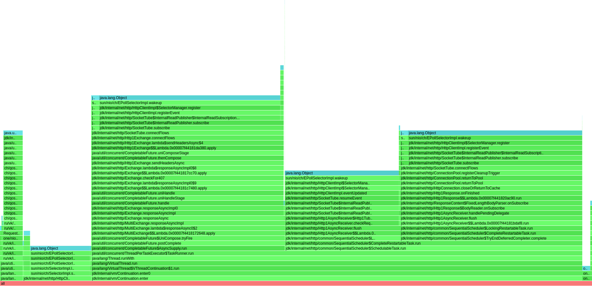

## Шардирование
Для поддержки кластерных конфигураций в данной работе был реализован Rendezvous hashing алгоритм.  
Со своей работой он справляется отлично, равномерно распределяя нагрузку по трем шардам:
```
john@Batman:~/IdeaProjects/2024-highload-dht-1/tmp/db$ du -sh *
476K    8080
476K    8090
476K    8100
```
Временная сложность рендеву хеширования O(n), и, поскольку хэш функция вычисляется для каждого шарда, здесь можно было бы попробовать заменить и без того довольно эффективную murmur3 на FarmHash, намример. Судя по [тестам](https://aras-p.info/blog/2016/08/09/More-Hash-Function-Tests/), он может показать лучший результат на большом объеме данных.

### Сравнение с предыдущей реализацией
В данной реализации было изменено несколько моментов, влияющих на производительность: 
1. Выполнение запроса производилось через Callable с дальнейшим вызовом Future.get(). Я не сразу осознал, что выполнение запроса таким образом блокирует поток, поэтому в новой реализации исполнителям отправлялся не Callable, а уже Runnable.
2. Добавленное шардирование, которое по идее должно замедлить систему из-за дополнительной работы по распределению нагрузки на ноды.

Далее произведено нагрузочное тестирование второй и третьей реализации:

**Нагрузочное тестирование PUT**

При нагрузочном тестировании put можно заметить, что более, чем 15к rps новая реализация не выдерживает
<details>
<summary>сравнение 15k rps</summary>

</details>
<details>
<summary>сравнение 20k rps</summary>

</details>
<details>
<summary>сравнение 25k rps</summary>

</details>

На каждом из графиков заметно значительное различие в задержках, возникающих после 90 персентилей. 
Если рассматривать производительность на 15к rps, то в новой версии 99% запросов имеют задержку до 21.18 мс. Самые редкие и максимальные задержки доходят до 74.62 мс.
В старой же версии средняя задержка значительно ниже - 702.85 мкс. 99% запросов имеют задержку не более 1.23 мс. Максимальные задержки в этой версии не превышают 2.89 мс

Основное отличие - шардированная версия имеет более высокую среднюю задержку и значительно большие максимальные задержки, особенно видно это на персентилях 99% и выше.

Связано это с дополнительной нагрузкой - распределением запросов по шардам, переправлением запросов с одного шарда на другой, даже не смотря на то, что данные распределяются равномерно.

<details>
<summary>wrk: cтарая реализация, выдерживающая 25к rps</summary>
<pre>
wrk -d 60 -t 64 -c 64 -R 25000 -L  -s ./src/main/java/ru/vk/itmo/test/osokindm/wrk_scripts/put_new.lua http://localhost:8080/v0/entity 

Thread Stats   Avg      Stdev     Max   +/- Stdev
Latency   673.27us  354.54us  24.08ms   69.51%
Req/Sec   417.52     44.94     1.33k    80.69%
Latency Distribution (HdrHistogram - Recorded Latency)
50.000%  673.00us
75.000%    0.92ms
90.000%    1.08ms
99.000%    1.22ms
99.900%    3.04ms
99.990%    8.30ms
99.999%   18.58ms
100.000%   24.09ms

Detailed Percentile spectrum:
Value   Percentile   TotalCount 1/(1-Percentile)

       0.055     0.000000            1         1.00
       0.255     0.100000       125176         1.11
       0.358     0.200000       251074         1.25
       0.460     0.300000       375448         1.43
       0.566     0.400000       500234         1.67
       0.673     0.500000       625531         2.00
       0.724     0.550000       688444         2.22
       0.770     0.600000       749943         2.50
       0.818     0.650000       813002         2.86
       0.869     0.700000       875112         3.33
       0.922     0.750000       938369         4.00
       0.947     0.775000       969199         4.44
       0.973     0.800000      1001014         5.00
       0.998     0.825000      1031586         5.71
       1.024     0.850000      1063094         6.67
       1.050     0.875000      1094111         8.00
       1.063     0.887500      1109463         8.89
       1.077     0.900000      1125410        10.00
       1.091     0.912500      1141430        11.43
       1.104     0.925000      1156176        13.33
       1.118     0.937500      1172041        16.00
       1.125     0.943750      1179890        17.78
       1.132     0.950000      1187410        20.00
       1.140     0.956250      1195558        22.86
       1.148     0.962500      1203172        26.67
       1.158     0.968750      1211509        32.00
       1.163     0.971875      1215197        35.56
       1.168     0.975000      1218567        40.00
       1.175     0.978125      1222774        45.71
       1.183     0.981250      1226814        53.33
       1.192     0.984375      1230506        64.00
       1.197     0.985938      1232255        71.11
       1.204     0.987500      1234448        80.00
       1.211     0.989062      1236242        91.43
       1.220     0.990625      1238202       106.67
       1.232     0.992188      1240163       128.00
       1.239     0.992969      1241040       142.22
       1.250     0.993750      1242066       160.00
       1.263     0.994531      1242986       182.86
       1.285     0.995313      1243954       213.33
       1.331     0.996094      1244923       256.00
       1.374     0.996484      1245411       284.44
       1.447     0.996875      1245894       320.00
       1.564     0.997266      1246381       365.71
       1.722     0.997656      1246869       426.67
       1.955     0.998047      1247361       512.00
       2.083     0.998242      1247602       568.89
       2.265     0.998437      1247848       640.00
       2.471     0.998633      1248091       731.43
       2.717     0.998828      1248335       853.33
       3.085     0.999023      1248580      1024.00
       3.333     0.999121      1248701      1137.78
       3.589     0.999219      1248822      1280.00
       3.879     0.999316      1248945      1462.86
       4.195     0.999414      1249067      1706.67
       4.511     0.999512      1249189      2048.00
       4.691     0.999561      1249249      2275.56
       4.939     0.999609      1249310      2560.00
       5.259     0.999658      1249371      2925.71
       5.583     0.999707      1249432      3413.33
       6.011     0.999756      1249494      4096.00
       6.259     0.999780      1249524      4551.11
       6.523     0.999805      1249554      5120.00
       6.823     0.999829      1249585      5851.43
       7.199     0.999854      1249616      6826.67
       7.547     0.999878      1249646      8192.00
       8.007     0.999890      1249661      9102.22
       8.375     0.999902      1249677     10240.00
       8.991     0.999915      1249692     11702.86
       9.807     0.999927      1249707     13653.33
      11.207     0.999939      1249722     16384.00
      11.647     0.999945      1249730     18204.44
      12.575     0.999951      1249737     20480.00
      13.599     0.999957      1249745     23405.71
      14.695     0.999963      1249753     27306.67
      15.127     0.999969      1249760     32768.00
      15.679     0.999973      1249764     36408.89
      16.271     0.999976      1249768     40960.00
      16.847     0.999979      1249772     46811.43
      17.023     0.999982      1249777     54613.33
      17.391     0.999985      1249779     65536.00
      17.871     0.999986      1249781     72817.78
      17.951     0.999988      1249783     81920.00
      18.463     0.999989      1249785     93622.86
      19.279     0.999991      1249787    109226.67
      19.647     0.999992      1249789    131072.00
      19.855     0.999993      1249790    145635.56
      19.919     0.999994      1249791    163840.00
      20.063     0.999995      1249792    187245.71
      20.143     0.999995      1249793    218453.33
      20.191     0.999996      1249794    262144.00
      20.191     0.999997      1249794    291271.11
      20.239     0.999997      1249795    327680.00
      20.239     0.999997      1249795    374491.43
      22.223     0.999998      1249796    436906.67
      22.223     0.999998      1249796    524288.00
      22.223     0.999998      1249796    582542.22
      22.367     0.999998      1249797    655360.00
      22.367     0.999999      1249797    748982.86
      22.367     0.999999      1249797    873813.33
      22.367     0.999999      1249797   1048576.00
      22.367     0.999999      1249797   1165084.44
      24.095     0.999999      1249798   1310720.00
      24.095     1.000000      1249798          inf
#[Mean    =        0.673, StdDeviation   =        0.355]
#[Max     =       24.080, Total count    =      1249798]
#[Buckets =           27, SubBuckets     =         2048]
----------------------------------------------------------
1499976 requests in 1.00m, 95.84MB read
Requests/sec:  25001.48
Transfer/sec:      1.60MB

</pre>
</details>

<details>
<summary>wrk: новая реализация, выдерживающая 15к rps</summary>
<pre>
 wrk -d 60 -t 64 -c 64 -R 15000 -L  -s ./src/main/java/ru/vk/itmo/test/osokindm/wrk_scripts/put_new.lua http://localhost:8080/v0/entity

  Thread Stats   Avg      Stdev     Max   +/- Stdev
    Latency     1.70ms    3.88ms  74.56ms   96.18%
    Req/Sec   247.61     57.51     1.00k    84.10%
  Latency Distribution (HdrHistogram - Recorded Latency)
 50.000%    1.00ms
 75.000%    1.33ms
 90.000%    1.99ms
 99.000%   21.18ms
 99.900%   49.63ms
 99.990%   64.86ms
 99.999%   73.73ms
100.000%   74.62ms

Detailed Percentile spectrum:
Value   Percentile   TotalCount 1/(1-Percentile)

       0.068     0.000000            1         1.00
       0.469     0.100000        75049         1.11
       0.628     0.200000       150095         1.25
       0.762     0.300000       225292         1.43
       0.885     0.400000       300012         1.67
       1.004     0.500000       375271         2.00
       1.062     0.550000       412872         2.22
       1.119     0.600000       450492         2.50
       1.178     0.650000       487622         2.86
       1.251     0.700000       525166         3.33
       1.334     0.750000       562538         4.00
       1.379     0.775000       581520         4.44
       1.429     0.800000       599910         5.00
       1.493     0.825000       618741         5.71
       1.583     0.850000       637428         6.67
       1.727     0.875000       656214         8.00
       1.836     0.887500       665528         8.89
       1.991     0.900000       674885        10.00
       2.217     0.912500       684318        11.43
       2.549     0.925000       693671        13.33
       3.073     0.937500       703019        16.00
       3.459     0.943750       707691        17.78
       3.983     0.950000       712384        20.00
       4.699     0.956250       717084        22.86
       5.727     0.962500       721760        26.67
       7.387     0.968750       726439        32.00
       8.575     0.971875       728788        35.56
      10.007     0.975000       731123        40.00
      11.671     0.978125       733475        45.71
      13.543     0.981250       735813        53.33
      15.575     0.984375       738158        64.00
      16.703     0.985938       739322        71.11
      18.079     0.987500       740497        80.00
      19.855     0.989062       741676        91.43
      22.063     0.990625       742842       106.67
      24.479     0.992188       744014       128.00
      25.839     0.992969       744599       142.22
      27.263     0.993750       745183       160.00
      28.911     0.994531       745776       182.86
      30.863     0.995313       746352       213.33
      33.087     0.996094       746939       256.00
      34.591     0.996484       747235       284.44
      36.383     0.996875       747524       320.00
      38.687     0.997266       747819       365.71
      41.087     0.997656       748112       426.67
      43.647     0.998047       748405       512.00
      44.991     0.998242       748549       568.89
      46.111     0.998437       748696       640.00
      47.295     0.998633       748844       731.43
      48.543     0.998828       748990       853.33
      49.791     0.999023       749136      1024.00
      50.335     0.999121       749210      1137.78
      50.975     0.999219       749283      1280.00
      51.743     0.999316       749357      1462.86
      52.703     0.999414       749428      1706.67
      53.727     0.999512       749501      2048.00
      54.239     0.999561       749538      2275.56
      54.815     0.999609       749577      2560.00
      55.583     0.999658       749611      2925.71
      56.415     0.999707       749650      3413.33
      57.055     0.999756       749684      4096.00
      57.631     0.999780       749703      4551.11
      58.079     0.999805       749721      5120.00
      58.623     0.999829       749741      5851.43
      59.359     0.999854       749758      6826.67
      61.247     0.999878       749776      8192.00
      63.135     0.999890       749785      9102.22
      65.055     0.999902       749794     10240.00
      66.431     0.999915       749803     11702.86
      67.711     0.999927       749813     13653.33
      69.183     0.999939       749822     16384.00
      69.567     0.999945       749827     18204.44
      70.015     0.999951       749831     20480.00
      70.527     0.999957       749835     23405.71
      70.911     0.999963       749840     27306.67
      71.999     0.999969       749846     32768.00
      72.255     0.999973       749847     36408.89
      72.447     0.999976       749850     40960.00
      72.575     0.999979       749851     46811.43
      73.087     0.999982       749854     54613.33
      73.535     0.999985       749857     65536.00
      73.535     0.999986       749857     72817.78
      73.599     0.999988       749858     81920.00
      73.663     0.999989       749859     93622.86
      73.855     0.999991       749861    109226.67
      73.919     0.999992       749863    131072.00
      73.919     0.999993       749863    145635.56
      73.919     0.999994       749863    163840.00
      73.919     0.999995       749863    187245.71
      74.047     0.999995       749864    218453.33
      74.367     0.999996       749865    262144.00
      74.367     0.999997       749865    291271.11
      74.367     0.999997       749865    327680.00
      74.367     0.999997       749865    374491.43
      74.559     0.999998       749866    436906.67
      74.559     0.999998       749866    524288.00
      74.559     0.999998       749866    582542.22
      74.559     0.999998       749866    655360.00
      74.559     0.999999       749866    748982.86
      74.623     0.999999       749867    873813.33
      74.623     1.000000       749867          inf
#[Mean    =        1.697, StdDeviation   =        3.884]
#[Max     =       74.560, Total count    =       749867]
#[Buckets =           27, SubBuckets     =         2048]
----------------------------------------------------------
900010 requests in 1.00m, 57.51MB read
Requests/sec:  15001.29
Transfer/sec:      0.96MB

</pre>
</details>

**Нагрузочное тестирование GET**

C get ситуация сильно хуже. Если прошлая реализация выдерживала 13k rps при заполненной БД, то в данном случае мы получили только 2k rps:
<details>
<summary>get график</summary>

</details>

<details>
<summary>wrk: get 2к rps</summary>
<pre>
 wrk -d 60 -t 64 -c 64 -R 2000 -L  -s ./src/main/java/ru/vk/itmo/test/osokindm/wrk_scripts/get.lua http://localhost:8080/v0/entity

Value   Percentile   TotalCount 1/(1-Percentile)

       0.096     0.000000            1         1.00
       0.647     0.100000         9964         1.11
       0.981     0.200000        19950         1.25
       1.625     0.300000        29893         1.43
      12.671     0.400000        39862         1.67
      29.775     0.500000        49822         2.00
      40.159     0.550000        54810         2.22
      51.647     0.600000        59783         2.50
      64.543     0.650000        64765         2.86
      77.823     0.700000        69745         3.33
      92.863     0.750000        74729         4.00
     101.503     0.775000        77224         4.44
     110.847     0.800000        79716         5.00
     121.471     0.825000        82207         5.71
     133.247     0.850000        84708         6.67
     147.711     0.875000        87198         8.00
     155.519     0.887500        88430         8.89
     164.351     0.900000        89683        10.00
     174.847     0.912500        90919        11.43
     187.007     0.925000        92171        13.33
     201.343     0.937500        93409        16.00
     210.047     0.943750        94034        17.78
     219.263     0.950000        94658        20.00
     229.759     0.956250        95280        22.86
     240.383     0.962500        95903        26.67
     253.183     0.968750        96527        32.00
     260.991     0.971875        96833        35.56
     270.335     0.975000        97144        40.00
     280.831     0.978125        97458        45.71
     292.351     0.981250        97769        53.33
     302.847     0.984375        98084        64.00
     309.503     0.985938        98239        71.11
     316.927     0.987500        98391        80.00
     324.863     0.989062        98548        91.43
     333.311     0.990625        98704       106.67
     344.063     0.992188        98859       128.00
     348.159     0.992969        98934       142.22
     354.047     0.993750        99013       160.00
     358.911     0.994531        99095       182.86
     366.335     0.995313        99169       213.33
     375.039     0.996094        99252       256.00
     377.599     0.996484        99284       284.44
     382.975     0.996875        99324       320.00
     387.583     0.997266        99363       365.71
     392.447     0.997656        99401       426.67
     399.615     0.998047        99440       512.00
     403.967     0.998242        99459       568.89
     407.295     0.998437        99480       640.00
     412.415     0.998633        99499       731.43
     416.255     0.998828        99518       853.33
     424.447     0.999023        99537      1024.00
     426.495     0.999121        99547      1137.78
     431.103     0.999219        99557      1280.00
     433.919     0.999316        99566      1462.86
     440.575     0.999414        99577      1706.67
     445.183     0.999512        99586      2048.00
     447.999     0.999561        99591      2275.56
     450.303     0.999609        99596      2560.00
     453.887     0.999658        99600      2925.71
     457.471     0.999707        99605      3413.33
     461.823     0.999756        99610      4096.00
     466.175     0.999780        99614      4551.11
     468.223     0.999805        99615      5120.00
     470.271     0.999829        99617      5851.43
     474.879     0.999854        99620      6826.67
     477.695     0.999878        99622      8192.00
     486.655     0.999890        99624      9102.22
     490.239     0.999902        99625     10240.00
     491.263     0.999915        99627     11702.86
     491.263     0.999927        99627     13653.33
     494.591     0.999939        99628     16384.00
     495.103     0.999945        99629     18204.44
     495.615     0.999951        99630     20480.00
     495.615     0.999957        99630     23405.71
     496.639     0.999963        99631     27306.67
     496.639     0.999969        99631     32768.00
     499.711     0.999973        99632     36408.89
     499.711     0.999976        99632     40960.00
     499.711     0.999979        99632     46811.43
     510.463     0.999982        99633     54613.33
     510.463     0.999985        99633     65536.00
     510.463     0.999986        99633     72817.78
     510.463     0.999988        99633     81920.00
     510.463     0.999989        99633     93622.86
     515.583     0.999991        99634    109226.67
     515.583     1.000000        99634          inf
#[Mean    =       59.942, StdDeviation   =       75.835]
#[Max     =      515.328, Total count    =        99634]
#[Buckets =           27, SubBuckets     =         2048]

</pre>
</details>

### Async-profiler

**CPU**

<details>
<summary>flamegraph</summary>

</details>

HttpClient был сделан асинхронным, с использованием newVirtualThreadPerTaskExecutor.
Таким образом, около 32% процессорного времени уходит на выполнение асинхронных запросов, что видно по упомянанию VirtualThread run.
30% процессорного времени теперь тратится на HttpServer (против 70% в прошлом этапе)

**Alloc**
<details>
<summary>flamegraph</summary>

</details>

**Lock**

В предыдущей реализации большая часть локов приходилась на пул работников и селектор треды, что в сумме и составляло 95% всех локов. 
Теперь, как можно заметить, 82% локов приходится на обработку HttpClientImpl SelectorManager, в частности метод register.
<details>
<summary>flamegraph</summary>

</details>