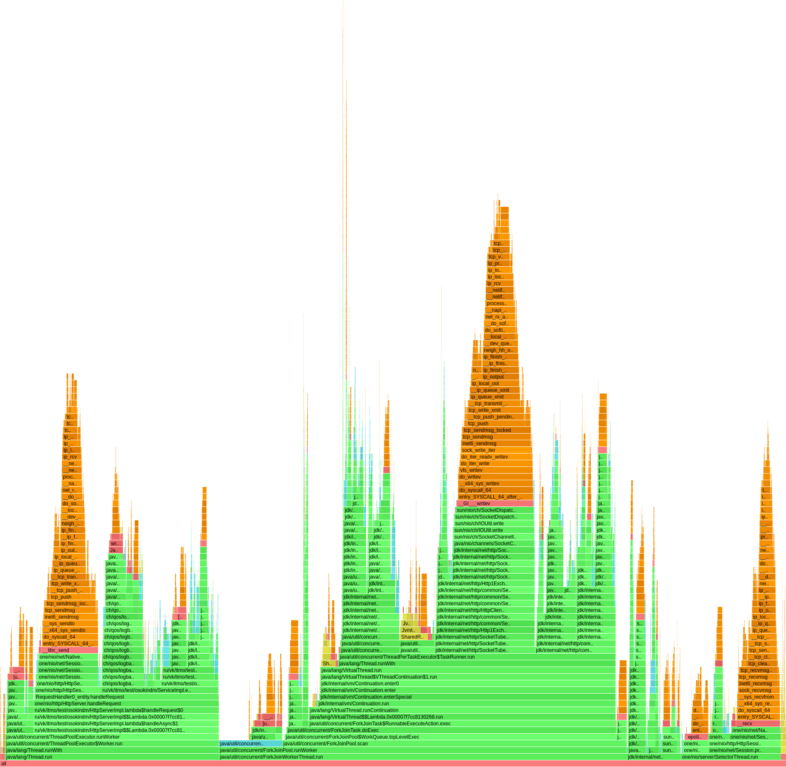
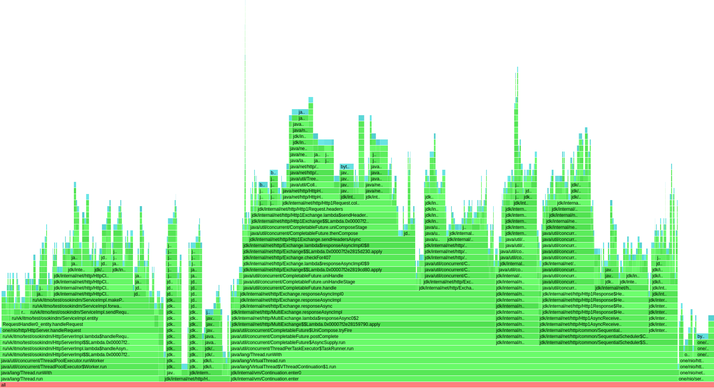
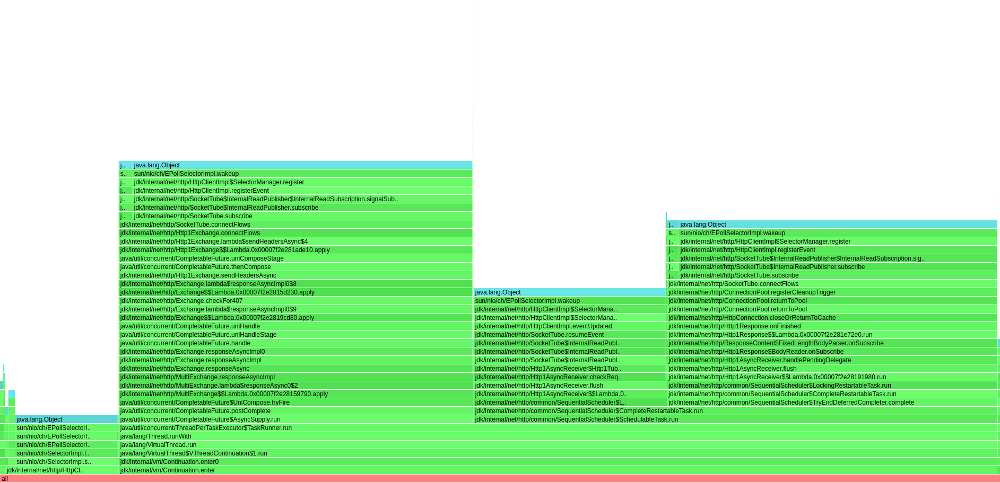
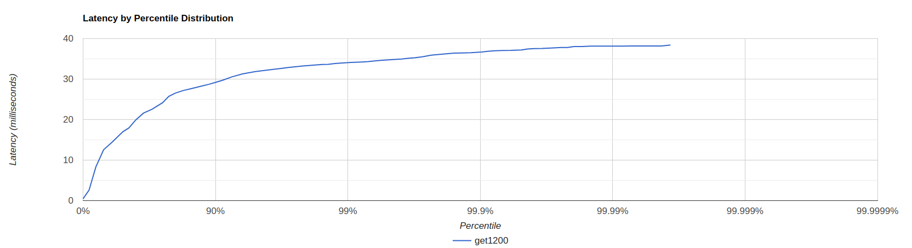
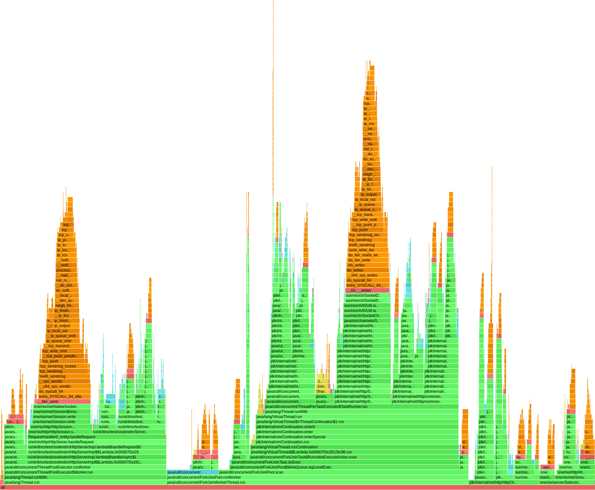
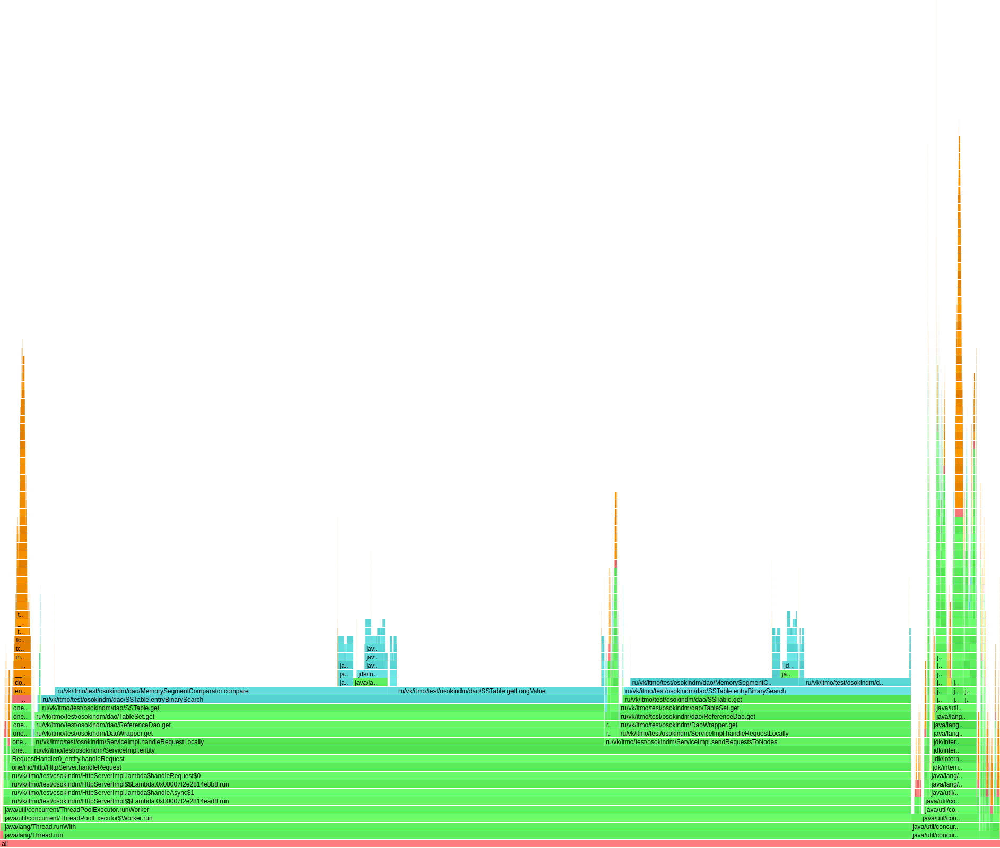
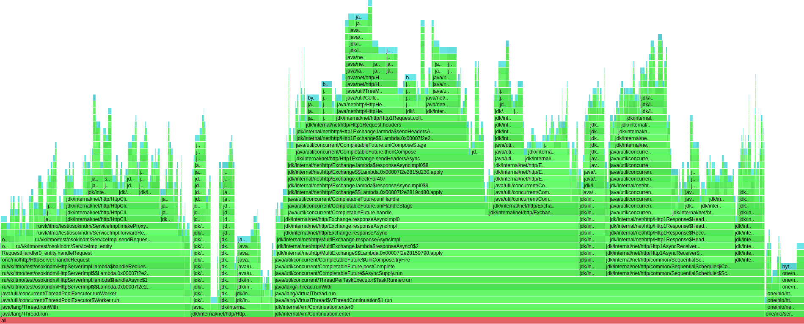
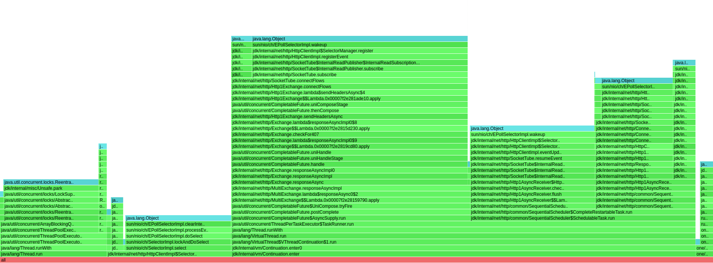

## Репликация
Требовалось реализовать поддержку хранения нескольких реплик данных в кластере для обеспечения отказоустойчивости.

Рассмотрим изменения в производительности в сравнении с предыдущим этапом.

### PUT
До добавления репликации предельное количество запросов в секунду составляло 15000.

Нагружаем новое решение, 4к rps

wrk

<pre>
 wrk -d 30 -t 64 -c 64 -R 4000 -L  -s ./src/main/java/ru/vk/itmo/test/osokindm/wrk_scripts/put_new.lua http://localhost:8080/v0/entity

Thread Stats   Avg      Stdev     Max   +/- Stdev
Latency    17.82ms   18.25ms  85.95ms   80.09%
Req/Sec    62.38      7.78    89.00     81.17%
Latency Distribution (HdrHistogram - Recorded Latency)
50.000%   10.95ms
75.000%   31.61ms
90.000%   45.28ms
99.000%   66.50ms
99.900%   77.25ms
99.990%   82.37ms
99.999%   84.74ms
100.000%   86.01ms

</pre>

График

Можно сказать, что нагрузка является допустимой, так как кривая задержки не имеет резких скачков и максимальная задержка 86ms.

Пробуем увеличить до 5к rps, сразу же получаем задержки в несколько секунд:

wrk

<pre>
 wrk -d 30 -t 64 -c 64 -R 5000 -L  -s ./src/main/java/ru/vk/itmo/test/osokindm/wrk_scripts/put_new.lua http://localhost:8080/v0/entity

Thread Stats   Avg      Stdev     Max   +/- Stdev
Latency     4.91s     1.79s    8.55s    60.85%
Req/Sec    54.40      5.55    60.00     75.00%
Latency Distribution (HdrHistogram - Recorded Latency)
50.000%    4.70s
75.000%    6.06s
90.000%    7.89s
99.000%    8.47s
99.900%    8.51s
99.990%    8.54s
99.999%    8.55s
100.000%    8.56s

</pre>

**Профилирование**
1. CPU

Флеймграф

Первое, что заметно, 40% процессорного времени уходит на работу HttpClient. Наибольшая проблема заключается в том, что использованный client.sendAsync() не работает, так как все равно блокируемся на CompletableFuture.get. Получается, что лишь добавились накладные расходы на работу виртуальных потоков. 

Выполнение локальных запросов занимает 27% времени процессора, тут никаких изменений относительно прошлой реализации нет. Ну и 12% на работу SelectorThread

2. Alloc

Флеймграф

Все так же 58% аллокаций связаны с выполнением работы Http Клиента, 1.5% из них уходят на создания новых CompletableFuture, от которых избавлюсь в следующем этапе.
Дополнительные аллокации теперь также в методе entity() при вычислении номеров нод, на которые мы отправим запрос: в RendezvousRouter теперь на 1.41% больше аллокацих, приходящихся на TreeMap, на 0.7% больше аллокаций ArrayList, чего можно было избежать путем увеличения нагрузки на cpu (пришлось бы запускать дополнительные сортировки).

Последнее, в прошлом этапе 4% приходилось на логгер (в частности внутри метода entity), я не сразу это заметил, поэтому исправил в данном решении.

3. Lock

Флеймграф

Из заметного: 3.27% локов приходились на злополучный логгер, теперь таких затрат нет. 
В остальном: 32% уходят на работу с ответами нод - отправка response, регистрация событий селектора для установления соединения между нодами (34% отправка, 32% ожидание ответа)

### GET

Начнем с 2000 rps, как прошлом этапе:

wrk

<pre>
 wrk -d 30 -t 64 -c 64 -R 2000 -L  -s ./src/main/java/ru/vk/itmo/test/osokindm/wrk_scripts/get.lua http://localhost:8080/v0/entity

Thread Stats   Avg      Stdev     Max   +/- Stdev
Latency     5.63s     1.61s    8.50s    57.74%
Req/Sec     1.43k     0.47     1.43k   100.00%
Latency Distribution (HdrHistogram - Recorded Latency)
50.000%    5.62s
75.000%    7.03s
90.000%    7.86s
99.000%    8.36s
99.900%    8.46s
99.990%    8.50s
99.999%    8.51s
100.000%    8.51s

</pre>

1500 rps:

wrk

<pre>
 wrk -d 30 -t 64 -c 64 -R 1500 -L  -s ./src/main/java/ru/vk/itmo/test/osokindm/wrk_scripts/get.lua http://localhost:8080/v0/entity

Thread Stats   Avg      Stdev     Max   +/- Stdev
Latency   406.33ms  261.34ms   1.11s    58.58%
Req/Sec    22.06      5.72    44.00     75.90%
Latency Distribution (HdrHistogram - Recorded Latency)
50.000%  376.06ms
75.000%  644.61ms
90.000%  758.78ms
99.000%  921.09ms
99.900%    1.01s
99.990%    1.09s
99.999%    1.12s
100.000%    1.12s

</pre>

Задержка все еще стабильно высокая.

Наконец 1200 rps:

wrk

<pre>
 wrk -d 30 -t 64 -c 64 -R 1200 -L  -s ./src/main/java/ru/vk/itmo/test/osokindm/wrk_scripts/get.lua http://localhost:8080/v0/entity

Thread Stats   Avg      Stdev     Max   +/- Stdev
Latency    17.17ms    9.07ms  38.37ms   60.97%
Req/Sec    18.77     18.12    62.00     89.45%
Latency Distribution (HdrHistogram - Recorded Latency)
50.000%   17.01ms
75.000%   24.21ms
90.000%   29.18ms
99.000%   34.08ms
99.900%   36.70ms
99.990%   38.14ms
99.999%   38.40ms
100.000%   38.40ms

Detailed Percentile spectrum:
Value   Percentile   TotalCount 1/(1-Percentile)

       0.460     0.000000            1         1.00
       2.577     0.100000         2398         1.11
       8.319     0.200000         4797         1.25
      12.559     0.300000         7195         1.43
      14.527     0.400000         9592         1.67
      17.007     0.500000        11992         2.00
      17.951     0.550000        13187         2.22
      19.903     0.600000        14390         2.50
      21.599     0.650000        15595         2.86
      22.591     0.700000        16797         3.33
      24.207     0.750000        17980         4.00
      25.743     0.775000        18583         4.44
      26.575     0.800000        19187         5.00
      27.183     0.825000        19798         5.71
      27.711     0.850000        20384         6.67
      28.335     0.875000        20984         8.00
      28.703     0.887500        21281         8.89
      29.183     0.900000        21585        10.00
      29.759     0.912500        21880        11.43
      30.559     0.925000        22176        13.33
      31.295     0.937500        22484        16.00
      31.551     0.943750        22626        17.78
      31.855     0.950000        22787        20.00
      32.095     0.956250        22923        22.86
      32.367     0.962500        23080        26.67
      32.671     0.968750        23227        32.00
      32.863     0.971875        23304        35.56
      33.055     0.975000        23379        40.00
      33.247     0.978125        23453        45.71
      33.407     0.981250        23527        53.33
      33.599     0.984375        23610        64.00
      33.663     0.985938        23635        71.11
      33.855     0.987500        23676        80.00
      33.983     0.989062        23713        91.43
      34.111     0.990625        23749       106.67
      34.239     0.992188        23784       128.00
      34.335     0.992969        23804       142.22
      34.495     0.993750        23822       160.00
      34.655     0.994531        23846       182.86
      34.783     0.995313        23862       213.33
      34.975     0.996094        23879       256.00
      35.135     0.996484        23888       284.44
      35.263     0.996875        23897       320.00
      35.519     0.997266        23906       365.71
      35.903     0.997656        23917       426.67
      36.159     0.998047        23925       512.00
      36.287     0.998242        23930       568.89
      36.415     0.998437        23937       640.00
      36.447     0.998633        23939       731.43
      36.511     0.998828        23944       853.33
      36.703     0.999023        23948      1024.00
      36.863     0.999121        23950      1137.78
      36.991     0.999219        23953      1280.00
      37.055     0.999316        23956      1462.86
      37.087     0.999414        23957      1706.67
      37.183     0.999512        23960      2048.00
      37.439     0.999561        23961      2275.56
      37.535     0.999609        23962      2560.00
      37.567     0.999658        23963      2925.71
      37.663     0.999707        23964      3413.33
      37.791     0.999756        23966      4096.00
      37.791     0.999780        23966      4551.11
      38.047     0.999805        23967      5120.00
      38.047     0.999829        23967      5851.43
      38.143     0.999854        23969      6826.67
      38.143     0.999878        23969      8192.00
      38.143     0.999890        23969      9102.22
      38.143     0.999902        23969     10240.00
      38.143     0.999915        23969     11702.86
      38.175     0.999927        23970     13653.33
      38.175     0.999939        23970     16384.00
      38.175     0.999945        23970     18204.44
      38.175     0.999951        23970     20480.00
      38.175     0.999957        23970     23405.71
      38.399     0.999963        23971     27306.67
      38.399     1.000000        23971          inf
#[Mean    =       17.174, StdDeviation   =        9.070]
#[Max     =       38.368, Total count    =        23971]
#[Buckets =           27, SubBuckets     =         2048]
----------------------------------------------------------
36009 requests in 30.01s, 2.30MB read
Non-2xx or 3xx responses: 21532
Requests/sec:   1200.02
Transfer/sec:     78.39KB
</pre>

График зависимости задержки от %

Результат: равномерное увеличение задержки, отсутствие резких скачков, максимальная задержка 38.4ms.

**Профилирование**

1. CPU

Был проведен тест двух случаев: в первом случае ключи, по которым производился поиск были преимущественно добавлены в бд, во втором случае преимущественно отсутствовали.
В первом случае локальная обработка запрос с дальнейшим поиском по БД заняла всего 4.5%

Флеймграф

Во втором - 87%

Флеймграф

Если же сравнивать первый флеймграф с ситуацией в PUT, то можно заметить, что в случае с PUT больше процессорного времени уходит на чтение сессии one/nio/net/Session.read с дальнейшей обработкой системных вызовов (5% против 1.74% у GET)
2. Alloc

Флеймграф

Нет существенных отличий от PUT

3. Lock 

Флеймграф

 Блокировок больше, чем при PUT. Добавился ReentrantLock, который составляет 13% локов и обеспечивает процесс one/nio/http/HttpSession.processRead
 
**Вывод**

С добавлением репликации пропускная способность PUT упала почти в 4 раза, а GET - в 1.6 раз. 