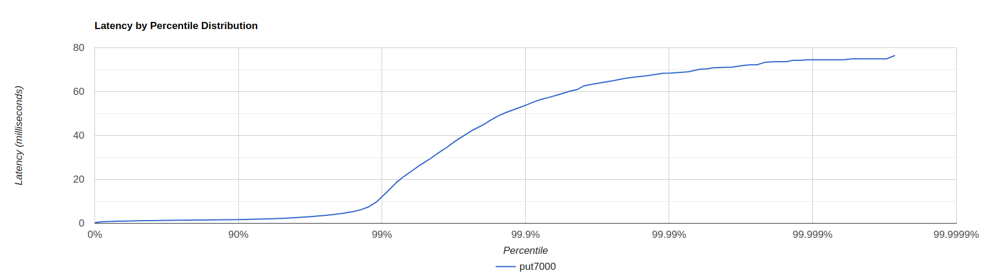
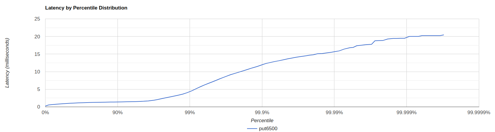
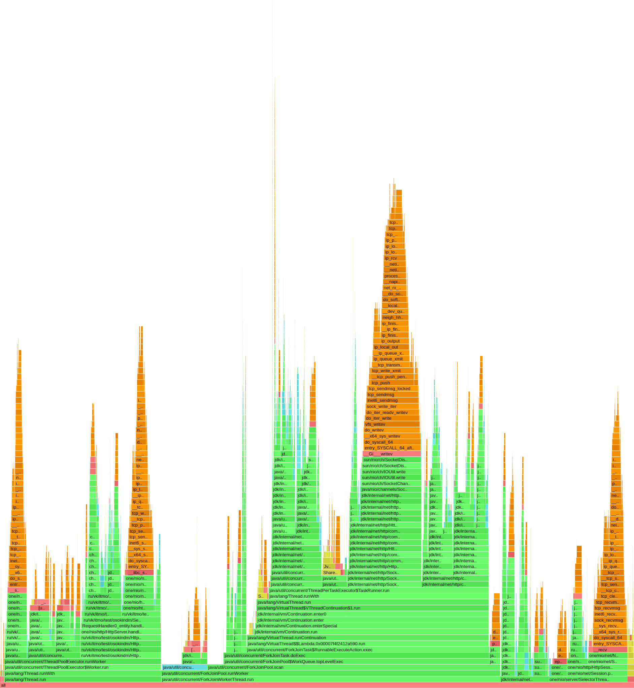
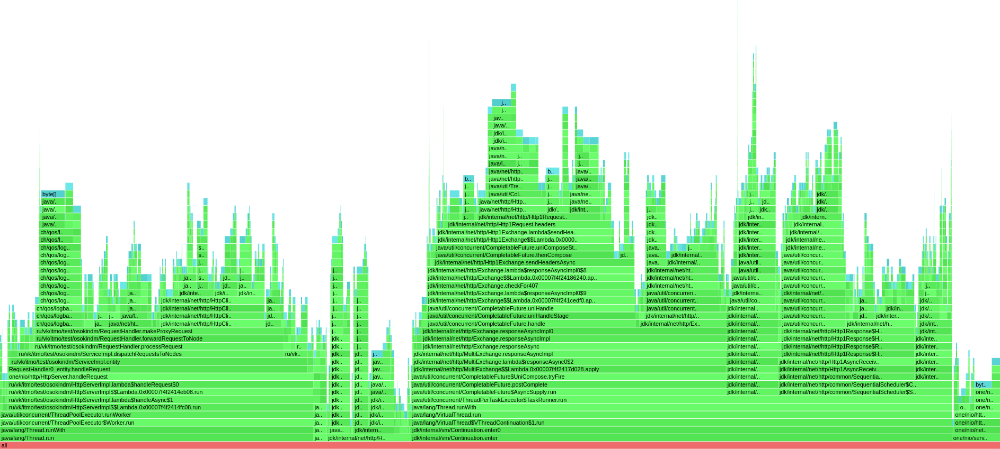
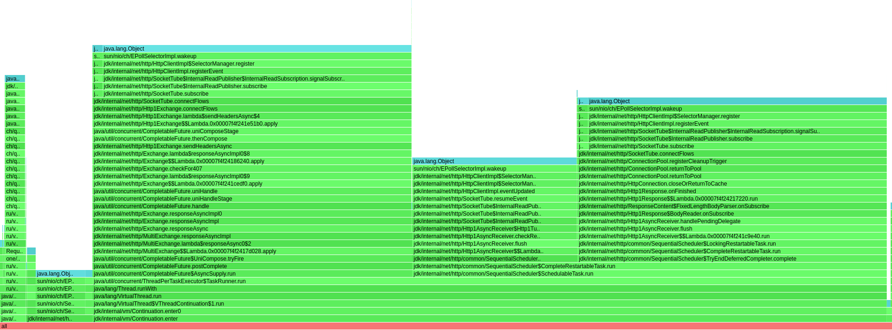
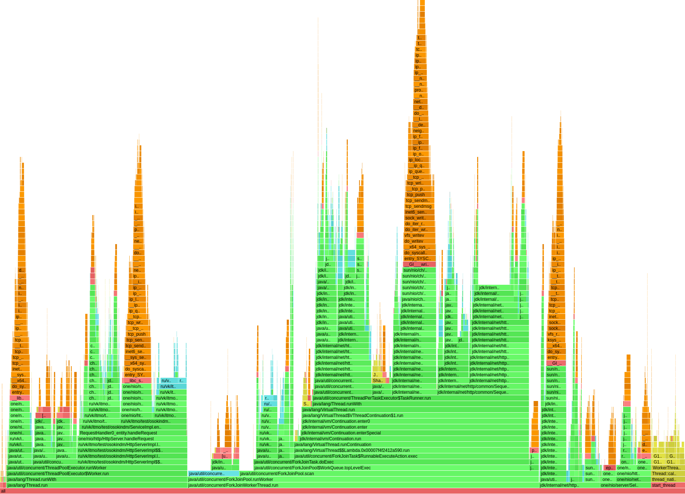
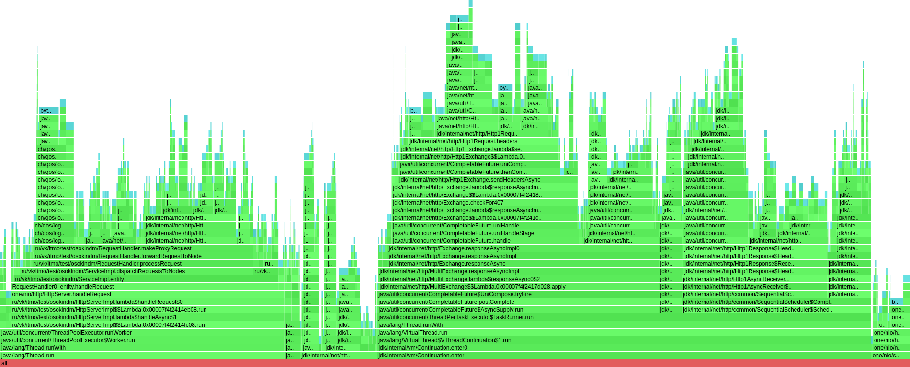

## Асинхронное взаимодействие
Требовалось параллельно отправлять запросы репликам и собирать самые быстрые ответы на CompletableFuture. 

Для реализации параллельной отправки использовался метод HttpClient.sendAsync(). Данный метод я использовал еще в прошлых этапах, но неправильно, блокируя поток get'ом. В результате чего производительность упала сильнее ожидаемого. Проверим, насколько получилось исправить ситуацию:
 ### PUT
В четвертом этапе удалось получить лишь 4к rps. 
Нагружаем новое решение. 
10к rps

wrk, 10к rps, 30 sec

<pre>
 wrk -d 30 -t 64 -c 64 -R 10000 -L  -s ./src/main/java/ru/vk/itmo/test/osokindm/wrk_scripts/put_new.lua http://localhost:8080/v0/entity

Thread Stats   Avg      Stdev     Max   +/- Stdev
Latency     1.92ms    2.62ms  43.42ms   96.56%
Req/Sec   163.20     45.88   500.00     66.37%
Latency Distribution (HdrHistogram - Recorded Latency)
50.000%    1.44ms
75.000%    1.89ms
90.000%    2.71ms
99.000%   16.51ms
99.900%   33.38ms
99.990%   38.14ms
99.999%   40.70ms
100.000%   43.46ms

</pre>

Нагрузка не является стабильной, так как при увеличении времени профилирования получаем скачок на 99 персентиле.

wrk, 10к rps, 60 sec

<pre>
 wrk -d 60 -t 64 -c 64 -R 10000 -L  -s ./src/main/java/ru/vk/itmo/test/osokindm/wrk_scripts/put_new.lua http://localhost:8080/v0/entity

Thread Stats   Avg      Stdev     Max   +/- Stdev
Latency    25.33ms   70.96ms 441.09ms   91.61%
Req/Sec   164.65     60.20   800.00     74.62%
Latency Distribution (HdrHistogram - Recorded Latency)
50.000%    1.84ms
75.000%    5.80ms
90.000%   43.90ms
99.000%  340.99ms
99.900%  391.68ms
99.990%  415.23ms
99.999%  437.76ms
100.000%  441.34ms

</pre>

7к запросов все еще многовато для сервера, так как заметен неравномерный рост кривой

График

Снизив нагрузку до 6500 rps получилось снизить максимальную задержку до 20 мс, а также избавиться от "скачка" на графике.

График

wrk, 6.5к rps, 60 sec

<pre>
 wrk -d 60 -t 64 -c 64 -R 6500 -L  -s ./src/main/java/ru/vk/itmo/test/osokindm/wrk_scripts/put_new.lua http://localhost:8080/v0/entity

Thread Stats   Avg      Stdev     Max   +/- Stdev
Latency     1.07ms  838.06us  20.45ms   96.89%
Req/Sec   106.82     28.86   333.00     92.67%
Latency Distribution (HdrHistogram - Recorded Latency)
50.000%    0.98ms
75.000%    1.24ms
90.000%    1.40ms
99.000%    4.34ms
99.900%   11.94ms
99.990%   15.69ms
99.999%   19.49ms
100.000%   20.46ms

Detailed Percentile spectrum:
Value   Percentile   TotalCount 1/(1-Percentile)

       0.231     0.000000            1         1.00
       0.542     0.100000        32685         1.11
       0.658     0.200000        65232         1.25
       0.766     0.300000        97606         1.43
       0.871     0.400000       130103         1.67
       0.975     0.500000       162553         2.00
       1.029     0.550000       178732         2.22
       1.082     0.600000       195121         2.50
       1.134     0.650000       211408         2.86
       1.186     0.700000       227755         3.33
       1.237     0.750000       243934         4.00
       1.262     0.775000       252002         4.44
       1.287     0.800000       259964         5.00
       1.313     0.825000       268205         5.71
       1.339     0.850000       276240         6.67
       1.367     0.875000       284362         8.00
       1.382     0.887500       288387         8.89
       1.400     0.900000       292586        10.00
       1.420     0.912500       296511        11.43
       1.447     0.925000       300668        13.33
       1.484     0.937500       304696        16.00
       1.508     0.943750       306682        17.78
       1.544     0.950000       308694        20.00
       1.596     0.956250       310714        22.86
       1.691     0.962500       312751        26.67
       1.900     0.968750       314772        32.00
       2.073     0.971875       315784        35.56
       2.297     0.975000       316808        40.00
       2.559     0.978125       317823        45.71
       2.831     0.981250       318829        53.33
       3.169     0.984375       319849        64.00
       3.375     0.985938       320353        71.11
       3.637     0.987500       320861        80.00
       4.019     0.989062       321368        91.43
       4.575     0.990625       321875       106.67
       5.359     0.992188       322388       128.00
       5.787     0.992969       322637       142.22
       6.235     0.993750       322891       160.00
       6.715     0.994531       323145       182.86
       7.247     0.995313       323398       213.33
       7.915     0.996094       323652       256.00
       8.287     0.996484       323779       284.44
       8.687     0.996875       323906       320.00
       9.143     0.997266       324036       365.71
       9.551     0.997656       324160       426.67
      10.063     0.998047       324289       512.00
      10.351     0.998242       324350       568.89
      10.679     0.998437       324414       640.00
      11.071     0.998633       324477       731.43
      11.471     0.998828       324542       853.33
      12.039     0.999023       324604      1024.00
      12.343     0.999121       324637      1137.78
      12.575     0.999219       324668      1280.00
      12.847     0.999316       324699      1462.86
      13.103     0.999414       324731      1706.67
      13.455     0.999512       324764      2048.00
      13.655     0.999561       324780      2275.56
      13.855     0.999609       324795      2560.00
      14.087     0.999658       324810      2925.71
      14.295     0.999707       324826      3413.33
      14.535     0.999756       324842      4096.00
      14.703     0.999780       324851      4551.11
      14.799     0.999805       324859      5120.00
      15.095     0.999829       324866      5851.43
      15.167     0.999854       324874      6826.67
      15.399     0.999878       324882      8192.00
      15.527     0.999890       324886      9102.22
      15.711     0.999902       324890     10240.00
      15.911     0.999915       324894     11702.86
      16.415     0.999927       324898     13653.33
      16.815     0.999939       324902     16384.00
      16.895     0.999945       324904     18204.44
      17.375     0.999951       324906     20480.00
      17.503     0.999957       324908     23405.71
      17.663     0.999963       324911     27306.67
      17.775     0.999969       324912     32768.00
      18.767     0.999973       324913     36408.89
      18.831     0.999976       324914     40960.00
      18.847     0.999979       324915     46811.43
      19.279     0.999982       324916     54613.33
      19.455     0.999985       324917     65536.00
      19.455     0.999986       324917     72817.78
      19.487     0.999988       324918     81920.00
      19.487     0.999989       324918     93622.86
      20.015     0.999991       324919    109226.67
      20.015     0.999992       324919    131072.00
      20.015     0.999993       324919    145635.56
      20.255     0.999994       324920    163840.00
      20.255     0.999995       324920    187245.71
      20.255     0.999995       324920    218453.33
      20.255     0.999996       324920    262144.00
      20.255     0.999997       324920    291271.11
      20.463     0.999997       324921    327680.00
      20.463     1.000000       324921          inf
#[Mean    =        1.066, StdDeviation   =        0.838]
#[Max     =       20.448, Total count    =       324921]
#[Buckets =           27, SubBuckets     =         2048]

</pre>

Таким образом, новое решение позволило увеличить rps на 2500.

#### Профилирование

CPU флеймграф

Все так же 40% процессорного времени уходит на HttpClient - асинхронную отправку запросов. 
12% - handleRequest. 8% - код, ответственный за асинхронную обработку запросов внутри dispatchRequestsToNodes (4% из которых отведено responseExecutor, выполняющего проверку собранных ответов и досрочную их отправку). 
Единственное, я не очень понял, откуда взялся ArrayBlockingQueue в разделе обработки запросов на флеймграфе, так как responseExecutor работает на LinkedBlockingQueue. Скорее всего, это связано с методом CompletableFuture.thenApply(), так как я явно не указал исполнителя, и операция выполнилась в CompletableFuture#defaultExecutor.

.

Alloc флеймграф

Различий не заметил (ch/qos/logback/classic/Logger.info не считаю)

Lock флеймграф

Аналогично. 

### GET

4 этап позволил нагрузить лишь 1200 rps. 
Проверяем 2.2к rps:

wrk

<pre>
wrk -d 30 -t 64 -c 64 -R 2200 -L  -s ./src/main/java/ru/vk/itmo/test/osokindm/wrk_scripts/get.lua http://localhost:8080/v0/entity

Thread Stats   Avg      Stdev     Max   +/- Stdev
Latency     2.33ms    1.65ms  19.70ms   87.34%
Req/Sec    36.28     49.94   111.00     65.37%
Latency Distribution (HdrHistogram - Recorded Latency)
50.000%    1.88ms
75.000%    2.64ms
90.000%    4.10ms
99.000%    9.06ms
99.900%   14.28ms
99.990%   19.12ms
99.999%   19.71ms
100.000%   19.71ms

Detailed Percentile spectrum:
Value   Percentile   TotalCount 1/(1-Percentile)

       0.263     0.000000            1         1.00
       1.051     0.100000         4414         1.11
       1.291     0.200000         8808         1.25
       1.484     0.300000        13204         1.43
       1.672     0.400000        17606         1.67
       1.876     0.500000        22009         2.00
       1.986     0.550000        24194         2.22
       2.109     0.600000        26414         2.50
       2.245     0.650000        28597         2.86
       2.425     0.700000        30797         3.33
       2.641     0.750000        33004         4.00
       2.773     0.775000        34094         4.44
       2.931     0.800000        35205         5.00
       3.125     0.825000        36298         5.71
       3.375     0.850000        37391         6.67
       3.687     0.875000        38492         8.00
       3.875     0.887500        39043         8.89
       4.099     0.900000        39598        10.00
       4.367     0.912500        40147        11.43
       4.699     0.925000        40691        13.33
       5.123     0.937500        41240        16.00
       5.367     0.943750        41515        17.78
       5.631     0.950000        41794        20.00
       5.915     0.956250        42067        22.86
       6.231     0.962500        42341        26.67
       6.655     0.968750        42616        32.00
       6.855     0.971875        42753        35.56
       7.131     0.975000        42892        40.00
       7.419     0.978125        43027        45.71
       7.759     0.981250        43165        53.33
       8.079     0.984375        43302        64.00
       8.271     0.985938        43371        71.11
       8.511     0.987500        43440        80.00
       8.823     0.989062        43508        91.43
       9.231     0.990625        43578       106.67
       9.663     0.992188        43646       128.00
       9.863     0.992969        43681       142.22
      10.111     0.993750        43716       160.00
      10.319     0.994531        43749       182.86
      10.703     0.995313        43783       213.33
      11.007     0.996094        43819       256.00
      11.207     0.996484        43835       284.44
      11.455     0.996875        43852       320.00
      11.775     0.997266        43869       365.71
      12.135     0.997656        43886       426.67
      12.655     0.998047        43904       512.00
      12.879     0.998242        43914       568.89
      13.207     0.998437        43921       640.00
      13.511     0.998633        43929       731.43
      14.039     0.998828        43938       853.33
      14.295     0.999023        43947      1024.00
      14.839     0.999121        43951      1137.78
      15.167     0.999219        43955      1280.00
      15.399     0.999316        43959      1462.86
      15.575     0.999414        43964      1706.67
      15.855     0.999512        43968      2048.00
      16.071     0.999561        43970      2275.56
      16.335     0.999609        43972      2560.00
      16.655     0.999658        43974      2925.71
      16.927     0.999707        43978      3413.33
      17.119     0.999756        43979      4096.00
      17.199     0.999780        43980      4551.11
      17.375     0.999805        43981      5120.00
      17.487     0.999829        43982      5851.43
      17.711     0.999854        43983      6826.67
      18.559     0.999878        43984      8192.00
      19.119     0.999890        43985      9102.22
      19.119     0.999902        43985     10240.00
      19.295     0.999915        43986     11702.86
      19.295     0.999927        43986     13653.33
      19.359     0.999939        43987     16384.00
      19.359     0.999945        43987     18204.44
      19.359     0.999951        43987     20480.00
      19.615     0.999957        43988     23405.71
      19.615     0.999963        43988     27306.67
      19.615     0.999969        43988     32768.00
      19.615     0.999973        43988     36408.89
      19.615     0.999976        43988     40960.00
      19.711     0.999979        43989     46811.43
      19.711     1.000000        43989          inf
#[Mean    =        2.333, StdDeviation   =        1.645]
#[Max     =       19.696, Total count    =        43989]
#[Buckets =           27, SubBuckets     =         2048]

</pre>

Больше увеличить нагрузку не удается, при 3к rps получаем среднюю задержку 1.38 с.

#### Профилирование 

CPU флеймграф

Во-первых, на флеймграфе видно, что используются другие методы CompletableFuture, на которых уходит больше времени: 16.5% против ~20% в новом решении.
Заметно также, что от асинхронной обработки больше работы появилось для gc, 5%. 
Также, HttpSession.sendResponse видно, что разбит по разным потокам. 
В остальном комментарии к put-флеймграфу справедливы и в данном, get, случае. 

.

Alloc флеймграф

Изменения минимальные, заметил только увеличение с 3.5% до 4.8% локов на Http1AsyncReceiver. 

.

Lock флеймграф

Здесь также заметно увеличение количества локов, отведенных Http1AsyncReceiver с 14% до 28%.
Но, что самое важное, с уходом CompletableFuture.get количество блокировок ThreadPoolExecutor.getTask снизилось с 14% до 0.3%, что довольно показательно. 

### Вывод
C добавлением асинхронного взаимодействия производительность увеличилась. PUT теперь выдерживает 6.5k rps, GET 2.2k rps  