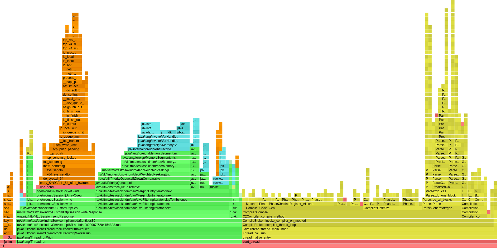
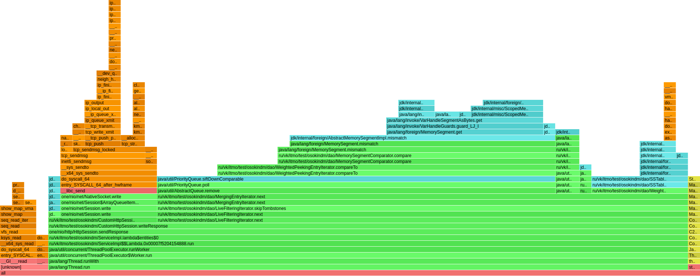
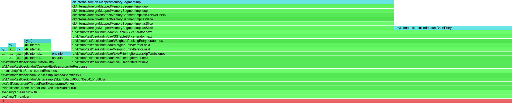

## Range-запросы
Требовалось реализовать получение диапазона данных текущего узла.

Результаты:
 
Был выполнен следующий запрос: 

```curl "http://localhost:8080/v0/entities?start=1230&end=4560000000" ```


Два запуска профайлера на cpu. При первом запуске видна работа компилятора 
<details>
<summary>CPU флеймграф</summary>

</details>

По одному запросу флеймграфы получились не очень информативные, но в целом видно, что с добавлением диапазонных get запросов процессорное время стало уходить на работу с dao - LiveFilteringIterator 75%, запись в сокет, для отправки ответа - 14% 
<details>
<summary>CPU флеймграф 2 </summary>

</details>
Аллокации только объектов BaseEntry, MemorySegment, QueueItem внутри метода write, который, на самом деле, можно было создавать самому, тем самым контролируя процесс создания объекта, ну и также аллоцируются массивы байт внутри writeChunk.
<details>
<summary>Alloc флеймграф</summary>

</details>

 Флеймграф с локами пуст. 