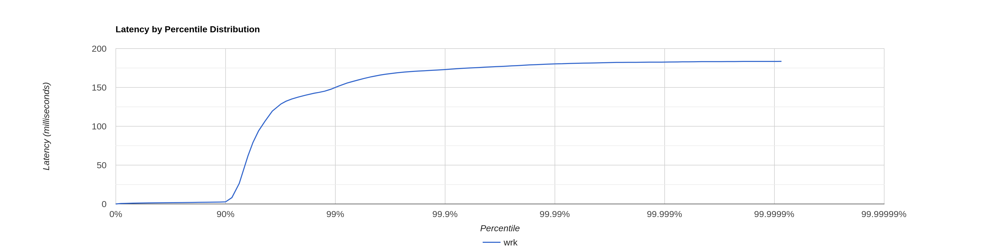
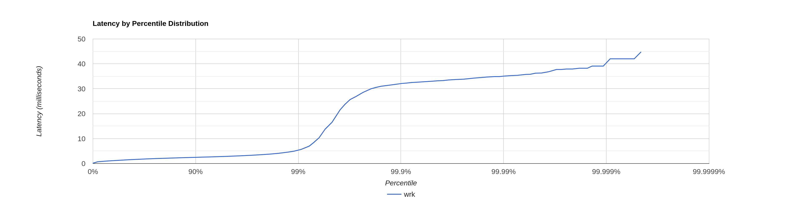
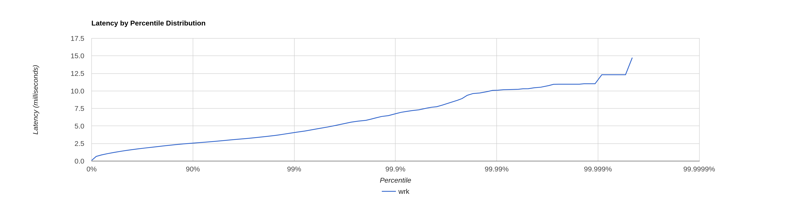

# stage 2

## PUT
### Выбор параметров

Cначала был увеличен порог для flush до 16Kb. и был получен следующий результат при
1 потоке 120 подключениях и RPS = 120 000.



При этом в логах появлялись ошибки, связанные с попыткой записи в процессе flush.
Порог для записи был увеличен до `160_384`. После чего ошибок в логах не возникало и сервис смог выдержать 130 000 RPS
в течении минуты.


Для профилирования `async-profiler` были выбраны следующие параметры:
```shell
wrk -d 60 -t 1 -c 80 -R 135000 -L -s ./lua/put_req.lua http://127.0.0.1:8080
```
```text
       Value   Percentile   TotalCount 1/(1-Percentile)

       0.014     0.000000            3         1.00
       0.455     0.100000       620041         1.11
       0.654     0.200000      1241787         1.25
       0.827     0.300000      1863238         1.43
       0.982     0.400000      2483200         1.67
       1.128     0.500000      3101703         2.00
       1.201     0.550000      3411899         2.22
       1.274     0.600000      3720848         2.50
       1.349     0.650000      4033430         2.86
       1.426     0.700000      4341376         3.33
       1.510     0.750000      4652187         4.00
       1.555     0.775000      4805866         4.44
       1.604     0.800000      4962596         5.00
       1.656     0.825000      5115455         5.71
       1.715     0.850000      5271519         6.67
       1.782     0.875000      5425194         8.00
       1.821     0.887500      5503611         8.89
       1.865     0.900000      5581473        10.00
       1.915     0.912500      5658373        11.43
       1.975     0.925000      5735650        13.33
       2.055     0.937500      5813538        16.00
       2.105     0.943750      5852211        17.78
       2.163     0.950000      5890043        20.00
       2.237     0.956250      5929477        22.86
       2.331     0.962500      5967963        26.67
       2.471     0.968750      6006584        32.00
       2.573     0.971875      6025665        35.56
       2.723     0.975000      6045111        40.00
       3.043     0.978125      6064394        45.71
       4.563     0.981250      6083728        53.33
       6.975     0.984375      6103080        64.00
       8.639     0.985938      6112774        71.11
      10.919     0.987500      6122480        80.00
      13.335     0.989062      6132167        91.43
      16.247     0.990625      6141841       106.67
      23.343     0.992188      6151524       128.00
      25.935     0.992969      6156369       142.22
      28.431     0.993750      6161217       160.00
      33.279     0.994531      6166056       182.86
      39.647     0.995313      6170892       213.33
      45.823     0.996094      6175760       256.00
      48.703     0.996484      6178161       284.44
      51.903     0.996875      6180588       320.00
      55.007     0.997266      6183011       365.71
      58.143     0.997656      6185431       426.67
      61.311     0.998047      6187850       512.00
      62.911     0.998242      6189063       568.89
      64.447     0.998437      6190279       640.00
      65.983     0.998633      6191504       731.43
      67.455     0.998828      6192724       853.33
      68.927     0.999023      6193947      1024.00
      69.631     0.999121      6194510      1137.78
      70.399     0.999219      6195140      1280.00
      71.167     0.999316      6195767      1462.86
      71.871     0.999414      6196358      1706.67
      72.575     0.999512      6196948      2048.00
      72.959     0.999561      6197268      2275.56
      73.343     0.999609      6197579      2560.00
      73.663     0.999658      6197843      2925.71
      74.047     0.999707      6198142      3413.33
      74.495     0.999756      6198462      4096.00
      74.687     0.999780      6198598      4551.11
      74.943     0.999805      6198772      5120.00
      75.199     0.999829      6198926      5851.43
      75.455     0.999854      6199075      6826.67
      75.775     0.999878      6199214      8192.00
      75.967     0.999890      6199288      9102.22
      76.159     0.999902      6199349     10240.00
      76.479     0.999915      6199436     11702.86
      76.799     0.999927      6199507     13653.33
      77.183     0.999939      6199580     16384.00
      77.439     0.999945      6199619     18204.44
      77.631     0.999951      6199657     20480.00
      77.887     0.999957      6199697     23405.71
      78.143     0.999963      6199730     27306.67
      78.463     0.999969      6199770     32768.00
      78.591     0.999973      6199785     36408.89
      78.719     0.999976      6199802     40960.00
      78.911     0.999979      6199823     46811.43
      79.167     0.999982      6199842     54613.33
      79.487     0.999985      6199862     65536.00
      79.615     0.999986      6199868     72817.78
      79.871     0.999988      6199878     81920.00
      80.063     0.999989      6199887     93622.86
      80.575     0.999991      6199898    109226.67
      81.407     0.999992      6199906    131072.00
      81.855     0.999993      6199912    145635.56
      81.983     0.999994      6199916    163840.00
      82.111     0.999995      6199921    187245.71
      82.239     0.999995      6199925    218453.33
      82.495     0.999996      6199931    262144.00
      82.559     0.999997      6199933    291271.11
      82.623     0.999997      6199936    327680.00
      82.751     0.999997      6199941    374491.43
      82.751     0.999998      6199941    436906.67
      82.943     0.999998      6199943    524288.00
      82.943     0.999998      6199943    582542.22
      83.007     0.999998      6199944    655360.00
      83.135     0.999999      6199945    748982.86
      83.263     0.999999      6199947    873813.33
      83.391     0.999999      6199949   1048576.00
      83.391     0.999999      6199949   1165084.44
      83.391     0.999999      6199949   1310720.00
      83.391     0.999999      6199949   1497965.71
      83.455     0.999999      6199950   1747626.67
      83.519     1.000000      6199952   2097152.00
      83.519     1.000000      6199952   2330168.89
      83.519     1.000000      6199952   2621440.00
      83.519     1.000000      6199952   2995931.43
      83.519     1.000000      6199952   3495253.33
      83.519     1.000000      6199952   4194304.00
      83.519     1.000000      6199952   4660337.78
      83.519     1.000000      6199952   5242880.00
      83.519     1.000000      6199952   5991862.86
      83.647     1.000000      6199953   6990506.67
      83.647     1.000000      6199953          inf
#[Mean    =        1.598, StdDeviation   =        4.439]
#[Max     =       83.584, Total count    =      6199953]
#[Buckets =           27, SubBuckets     =         2048]
----------------------------------------------------------
  7475295 requests in 1.00m, 477.64MB read
Requests/sec: 124588.49
Transfer/sec:      7.96MB
```

###  async-profiler

```shell
TITLE_PREF=PUT-t1c80rps125000
JFR_FILENAME="/media/user/DATA/projects/gitproj/DWS-ITMO-2023/sem_2/data2/profile2-put-t1-c80-rps125000.jfr"
./bin/asprof --title ${TITLE_PREF} -e cpu,alloc,lock -d 30 -f ${JFR_FILENAME} MainServ
```
```shell
PROF_NUMB=2
METHOD_NAME=put
TITLE_PREF=PUT-t1c80rps125000
JFR_FILENAME="/media/user/DATA/projects/gitproj/DWS-ITMO-2023/sem_2/data2/profile2-put-t1-c80-rps125000.jfr"
java -cp lib/converter.jar jfr2flame --alloc --title ${TITLE_PREF}-ALLOC ${JFR_FILENAME} > "/media/user/DATA/projects/gitproj/DWS-ITMO-2023/sem_2/data2/profile${PROF_NUMB}-${METHOD_NAME}-alloc.html"
java -cp lib/converter.jar jfr2flame --lock --title ${TITLE_PREF}-LOCK ${JFR_FILENAME} > "/media/user/DATA/projects/gitproj/DWS-ITMO-2023/sem_2/data2/profile${PROF_NUMB}-${METHOD_NAME}-lock.html"
java -cp lib/converter.jar jfr2flame --title ${TITLE_PREF}-CPU ${JFR_FILENAME} > "/media/user/DATA/projects/gitproj/DWS-ITMO-2023/sem_2/data2/profile${PROF_NUMB}-${METHOD_NAME}-cpu.html"
```


[CPU-GET flame graph](data/profile2-put-cpu.html)

[Allocation-GET flame graph](data/profile2-put-alloc.html)

[Lock-GET flame graph](data/profile2-put-lock.html)

### Результаты PUT
- Аналогично с GET запросами блокировки в `ArrayBlockingQueue` заняли ~77%,
оставшаяся часть у Executor'а SelectorThread'ов
- Операции `upsert` занимают ~7% процессорного времени
- Примерно 28% процессорного времени `sendResponse` обработка запроса
- Около 35% процессорного времени тратится на `getTask` ThreadPoolExecutor'а
- Стоит отметить, что при `PUT` запросах процессор используется сильно меньше, чем при `GET` 
(около 20% для `PUT` и до 90% для `GET`) - это происходит из-за с особенности хранилища
- Около 31% аллокаций занимает вставка, 3.5% аллокаций очередь и оставшаяся часть в основном занимается 
аллокациями сервера.
<br>

---------------------------------------------------
<br>

## GET
### Выбор параметров

Данные
```shell
wrk -d 55 -t 1 -c 1 -R 7000 -L -s ./lua/put_req.lua http://127.0.0.1:8080
```

При connections = 64 и RPS = 21 000 получился следующий результат Requests/sec:  19945.77
и 44.799 milisec на 100 перцентили.



Далее было изменено количество подключений до 120. Latency уменьшилась до 14.751 на 100 перцентили
и фактическое количетво запросов в сек (Requests/sec) увеличилось до 20687.92.


При изменении количества потоков от 1 до 7 особых изменений замечено не было
(latency немного увеличилась).

Очередь в `ThreadPoolExecutor` заполняется в зависимости от количества подключений
(примерно `queue_size` ≈ `connections` - `pool_size`).

Количество потоков в `ThreadPoolExecutor` рассматривалось от 20 до 100 
(в моем случае `Runtime.getRuntime().availableProcessors()` = 20). 
При увеличении числа потоков сначала производительность практически не менялась, 
а потом постепенно снижалась. 
Предположу, что это из-за того, что все данные влезают в оперативную память и 
большая часть работы это именно CPU. 

Ощутимых различий между `ArrayBlockingQueue` и `LinkedListBlockingQueue` замечено не было.

Таким образом была сделан выбор: `ArrayBlockingQueue`, `queue_capacity` = 128, `core_pool_size` = 20.

Был добавлен скрипт тестирования `get_random_req.lua`. На этом сркипте сервис может работать под большей нагрузкой 
(31 msec latency на 100 перцентили при Requests/sec:  24753.48).
Это связано с тем, что изначальный скрипт строит запросы, начиная с самых "дальних" данных, что приводит
к более длительному поиску.

Для профилирования `async-profiler` были выбраны следующие параметры:
```shell
wrk -d 60 -t 1 -c 80 -R 18000 -L -s ./lua/get_req.lua http://127.0.0.1:8080
```

```text
  Detailed Percentile spectrum:
       Value   Percentile   TotalCount 1/(1-Percentile)

       0.124     0.000000            1         1.00
       0.882     0.100000        89593         1.11
       1.115     0.200000       178913         1.25
       1.324     0.300000       268120         1.43
       1.535     0.400000       357481         1.67
       1.753     0.500000       446417         2.00
       1.869     0.550000       491119         2.22
       1.989     0.600000       535745         2.50
       2.109     0.650000       580781         2.86
       2.229     0.700000       625458         3.33
       2.351     0.750000       669657         4.00
       2.417     0.775000       691953         4.44
       2.489     0.800000       714700         5.00
       2.565     0.825000       736648         5.71
       2.653     0.850000       759067         6.67
       2.759     0.875000       781245         8.00
       2.829     0.887500       792367         8.89
       2.915     0.900000       803569        10.00
       3.029     0.912500       814714        11.43
       3.161     0.925000       825968        13.33
       3.319     0.937500       837080        16.00
       3.417     0.943750       842655        17.78
       3.529     0.950000       848179        20.00
       3.669     0.956250       853772        22.86
       3.839     0.962500       859324        26.67
       4.063     0.968750       864902        32.00
       4.203     0.971875       867781        35.56
       4.351     0.975000       870537        40.00
       4.531     0.978125       873304        45.71
       4.727     0.981250       876094        53.33
       4.963     0.984375       878848        64.00
       5.103     0.985938       880250        71.11
       5.263     0.987500       881638        80.00
       5.447     0.989062       883055        91.43
       5.651     0.990625       884442       106.67
       5.891     0.992188       885830       128.00
       6.035     0.992969       886520       142.22
       6.199     0.993750       887234       160.00
       6.379     0.994531       887916       182.86
       6.587     0.995313       888613       213.33
       6.827     0.996094       889317       256.00
       6.987     0.996484       889662       284.44
       7.151     0.996875       890009       320.00
       7.339     0.997266       890360       365.71
       7.575     0.997656       890708       426.67
       7.879     0.998047       891055       512.00
       8.055     0.998242       891228       568.89
       8.239     0.998437       891407       640.00
       8.479     0.998633       891581       731.43
       8.783     0.998828       891752       853.33
       9.135     0.999023       891926      1024.00
       9.407     0.999121       892016      1137.78
       9.703     0.999219       892100      1280.00
      10.031     0.999316       892187      1462.86
      10.359     0.999414       892276      1706.67
      10.951     0.999512       892362      2048.00
      11.215     0.999561       892405      2275.56
      11.695     0.999609       892449      2560.00
      12.191     0.999658       892493      2925.71
      12.943     0.999707       892537      3413.33
      13.527     0.999756       892580      4096.00
      13.839     0.999780       892601      4551.11
      14.175     0.999805       892623      5120.00
      14.623     0.999829       892645      5851.43
      15.311     0.999854       892667      6826.67
      15.895     0.999878       892689      8192.00
      16.111     0.999890       892699      9102.22
      16.495     0.999902       892710     10240.00
      17.007     0.999915       892721     11702.86
      17.487     0.999927       892732     13653.33
      18.047     0.999939       892743     16384.00
      18.463     0.999945       892749     18204.44
      18.767     0.999951       892755     20480.00
      18.927     0.999957       892759     23405.71
      19.119     0.999963       892765     27306.67
      19.391     0.999969       892770     32768.00
      19.487     0.999973       892773     36408.89
      19.935     0.999976       892776     40960.00
      20.047     0.999979       892779     46811.43
      20.239     0.999982       892784     54613.33
      20.239     0.999985       892784     65536.00
      20.255     0.999986       892785     72817.78
      20.303     0.999988       892787     81920.00
      20.831     0.999989       892788     93622.86
      20.991     0.999991       892789    109226.67
      21.151     0.999992       892791    131072.00
      21.151     0.999993       892791    145635.56
      21.311     0.999994       892792    163840.00
      22.687     0.999995       892793    187245.71
      22.687     0.999995       892793    218453.33
      23.247     0.999996       892794    262144.00
      23.247     0.999997       892794    291271.11
      23.279     0.999997       892795    327680.00
      23.279     0.999997       892795    374491.43
      23.279     0.999998       892795    436906.67
      23.759     0.999998       892796    524288.00
      23.759     0.999998       892796    582542.22
      23.759     0.999998       892796    655360.00
      23.759     0.999999       892796    748982.86
      23.759     0.999999       892796    873813.33
      24.159     0.999999       892797   1048576.00
      24.159     1.000000       892797          inf
#[Mean    =        1.899, StdDeviation   =        1.012]
#[Max     =       24.144, Total count    =       892797]
#[Buckets =           27, SubBuckets     =         2048]
----------------------------------------------------------
  1076449 requests in 1.00m, 76.86MB read
  Non-2xx or 3xx responses: 691518
Requests/sec:  17940.72
Transfer/sec:      1.28MB
```

###  async-profiler

```shell
./bin/asprof --title GET-t1c80rps18000 -e cpu,alloc,lock -d 30 -f "/media/user/DATA/projects/gitproj/DWS-ITMO-2023/sem_2/data2/profile2-get-t1-c80-rps18000.jfr" MainServ
```
```shell
PROF_NUMB=2
METHOD_NAME=get
java -cp lib/converter.jar jfr2flame --alloc --title GET-t1c80rps18000-ALLOC "/media/user/DATA/projects/gitproj/DWS-ITMO-2023/sem_2/data2/profile2-get-t1-c80-rps18000.jfr" > "/media/user/DATA/projects/gitproj/DWS-ITMO-2023/sem_2/data2/profile${PROF_NUMB}-${METHOD_NAME}-alloc.html"
java -cp lib/converter.jar jfr2flame --lock --title GET-t1c80rps18000-LOCK "/media/user/DATA/projects/gitproj/DWS-ITMO-2023/sem_2/data2/profile2-get-t1-c80-rps18000.jfr" > "/media/user/DATA/projects/gitproj/DWS-ITMO-2023/sem_2/data2/profile${PROF_NUMB}-${METHOD_NAME}-lock.html"
java -cp lib/converter.jar jfr2flame --title GET-t1c80rps18000-CPU "/media/user/DATA/projects/gitproj/DWS-ITMO-2023/sem_2/data2/profile2-get-t1-c80-rps18000.jfr" > "/media/user/DATA/projects/gitproj/DWS-ITMO-2023/sem_2/data2/profile${PROF_NUMB}-${METHOD_NAME}-cpu.html"
```


[CPU-GET flame graph](data/profile2-get-cpu.html)

[Allocation-GET flame graph](data/profile2-get-alloc.html)

[Lock-GET flame graph](data/profile2-get-lock.html)

### Результаты GET
- Как видно из CPU Flame graph большая часть процессорного времени (~72%) расходуется на `mismatch`, что подтверждает 
предположение о необходимом количестве потоков в `ThreadPollExecutor`
- Блокировки в `ArrayBlockingQueue` заняли ~77%, оставшаяся часть у Executor'а SelectorThread'ов
- ~53% аллокаций связаны с преобразованием типов данных и генерацие `Responce`