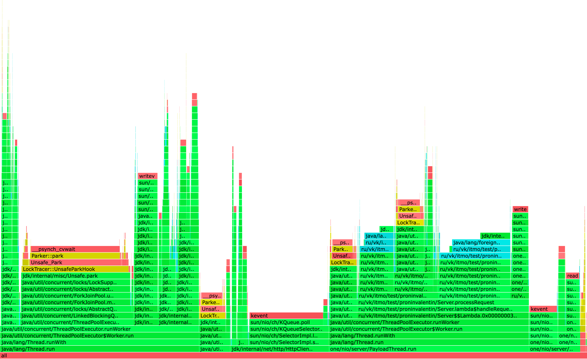
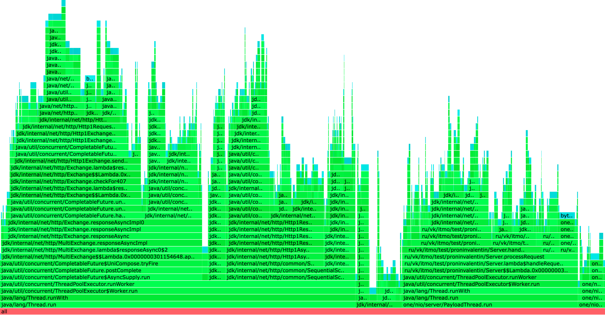
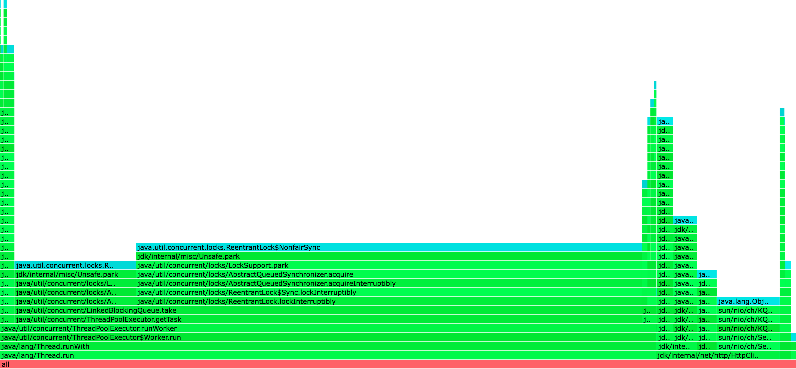

Работа происходила с тремя узлами (from=3) и кворумом из двух узлов (ack=2)

### Перцентили с PUT 5500 RPS (было 24K RPS):

```
Перцентиль     было       стало
50.000%      1.28ms ->   1.17ms 
75.000%      1.75ms ->   7.50ms
90.000%      2.27ms -> 327.42ms
99.000%      3.45ms -> 536.58ms
99.900%     23.44ms -> 558.59ms
99.990%     61.53ms -> 560.13ms
99.999%     74.24ms -> 560.13ms
100.000%    81.15ms -> 560.13ms
```

### Перцентили с GET 3300 RPS (было 28K RPS):

```
Перцентиль     было       стало
 50.000%     1.13ms ->   1.28ms 
 75.000%     1.60ms ->  12.30ms 
 90.000%     1.96ms -> 387.84ms 
 99.000%     4.29ms -> 440.83ms 
 99.900%    45.82ms -> 468.74ms 
 99.990%    53.41ms -> 471.30ms 
 99.999%    55.71ms -> 471.55ms 
100.000%    56.32ms -> 471.55ms 
```

Произошла сильная деградация производительности (для PUT запросов в ~4,4 раза, для GET запросов в ~8,5 раз),
связываю это с тем, что теперь для выполнения запроса нужно синхронно ждать ответ не от одного проксируемого узла,
как было на предыдущем этапе, а сразу от кворума узлов.
При этом, в случае, когда нужно проксировать запрос сразу к двум узлам,
мы сначала ждем ответа от первого узла, перед тем как отправить запрос ко второму узлу из-за текущей реализации в коде.

Учитывая тот факт, что распределение данных у нас происходило равномерно (это можно увидеть по вставке ниже),
можно сделать вывод, что 2/3 запросов требовали 2 прокси вызова из-за чего эти запросы были медленнее, чем 1/3 запросов,
в которых был только один прокси вызов и один вызов на лидере

```
682M	server_profiling_data10080 - сервер с портом 10080  
682M	server_profiling_data8080  - сервер с портом 8080 
682M	server_profiling_data9080  - сервер с портом 9080 
```

## Анализ Flame Graph

## PUT запросы

### CPU


Ситуация с обработкой запросов кардинально не изменилась. Мы по прежнему тратим время на отправку ответа клиенту,
ожидание ответа от проксируемых нод и выполнение логики обработки операции.
При этом процентное соотношение у операции `park` тоже не изменилось.

Все трейсы на flame graph остались теми же, изменилось лишь соотношение семплов для них

Время на:

* `ThreadPoolExecutor.getTask` уменьшилось с 14.73% до 5.82%, из-за того, что время на выполнение самой задачи
  увеличилось, как и говорил раньше - теперь ждем последовательно ответа от всех реплик.
* `HttpClientImpl$SelectorManager.run` увеличилось с 13.22% до 22.6%, предполагаю, что это из-за того, что теперь больше
  http запросов
* `ThreadPoolExecutor.runWorker` увеличилось с 34.28% до 40.59% - отправка и ожидание запросов происходит в воркерах,
  отсюда и время увеличилось

### ALLOC


Flame graph также особо не изменился за исключением части с обработкой запроса, раньше
на операцию `Server.processRequest` уходило 20.23% общего объема семплов, сейчас 24.06%.
Сейчас дополнительные ресурсы уходят на построение http запросов сразу к нескольким узлам кластера
Также больше памяти уходит на `HttpClientImpl$SelectorManager.run` думаю это также из-за того, что стало больше работы с
http запросами

### LOCK


Flame graph блокировок довольно сильно изменился

* `java/util/concurrent/ThreadPoolExecutor.getTask` теперь занимает 60%, хотя было 12%, предполагаю, что это из-за того,
  что теперь реплики тоже сабмитят задачи в свои пулы, соответственно и воркеры на них работают из-за чего общее
  количество семплов увеличилось.
* `java/util/concurrent/ThreadPoolExecutor.runWorker` внутри воркера теперь также больше семплов уходит на
  `one/nio/http/HttpSession.sendResponse`, из-за того что теперь при запросах также задействуется бОльшее количество
  узлов.  
  Стоит отметить, что на графике не видно как долго простаивают наши узлы в ожидании кворума, так например метод
  `ru/vk/itmo/test/proninvalentin/Server.waitResponses` занимает всего 0.85% от общего количества семплов из-за того,
  что блокировку там использует только `jdk/internal/net/http/HttpClientImpl.sendAsync` метод, хотя предполагаю, что
  именно из-за `waitResponse` произошла такая деградация в производительности.
* `jdk/internal/net/http/HttpClientImpl$SelectorManager.run` количество семплов увелилось с 14.91% до 21.47%, потому что
  стало больше http запросов

## GET запросы

### CPU



По сравнению с предыдущим этапом сильно поменялся только график для воркеров,

* `java/util/concurrent/ThreadPoolExecutor.getTask` также уменьшился с 15.15% до 4.68%, как и в GET запросах из-за того, 
* что дольше ждем выполнения каждой таски
* `ru/vk/itmo/test/proninvalentin/Server.processRequest` увеличилось с 12.18%% до 29.25%, этот метод и раньше занимал
  большую часть при GET запросах, т.к. кроме поиска необходимого значение его еще нужно записать в ответ клиенту.
  Теперь здесь также присутствует ожидание ответов от кворума

### ALLOC



Аналогично и GET запросам

* `SelectorManager.run` из-за увеличения взаимодействия с http клиентом стало больше аллокаций (было 5.04% стало 7.72%)
* `ru/vk/itmo/test/proninvalentin/Server.processRequest` с 21.35% до 28.89% (больше созданий http запросов, парсинга
  ответов от http и сюда же добавляется еще дополнительные поиски по бд из-за необходимости сбора кворума)

### LOCK



Такая же ситуация, что и у GET запросов, единственное, что `java/util/concurrent/ThreadPoolExecutor.getTask` занимает
еще больше семплов - 78.84%, хотя было 12.26%, так же как и в GET предполагаю,что это из-за того, что и лидер, и реплики
сабмитят задачи в свои пулы, поэтому общее количество семплов увеличилось

### Выводы

* Теперь мы можем указывать необходимое количество узлов для выполнения нашего запроса, это особенно полезно, когда мы,
  например, хотим пожертвовать скоростью на запись, в угоду скорости на чтение и для этого пишем сразу на все узлы, а
  читаем только с одного (чтобы гарантированно прочитать актуальные данные), если знаем, что чтения в нашей системе
  происходят намного чаще.
* Репликация очень сильно ухудшила производительность (для PUT запросов в ~4,4 раза, для GET запросов в ~8,5 раз),
  однако теперь данные хранятся более надежно и при необходимости, например, мы опять же можем выбирать между скоростью
  работы с нашей системой и надежностью хранения данных.

### Предложения по возможным улучшениям

* Как и в прошлом этапе, предлагаю добавить асинхронный клиент для работы с другими узлами и слать запросы не
  последовательно, а параллельно к набору из from узлов, дожидаясь ответа только от ack нужных узлов, таким образом мы
  уменьшим время ожидания ответа
* Добавить read repair, чтобы уменьшить процент неконсистентных данных, когда у двух нод 