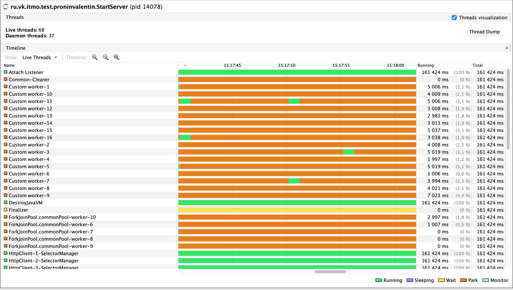

### Перцентили с PUT 7500 RPS (было 5500 RPS):

```
Перцентиль     было       стало
50.000%      1.17ms ->   1.17ms  
75.000%      7.50ms ->   8.58ms 
90.000%    327.42ms ->  52.67ms 
99.000%    536.58ms ->  73.89ms 
99.900%    558.59ms ->  79.39ms 
99.990%    560.13ms ->  91.17ms 
99.999%    560.13ms ->  91.94ms 
100.000%   560.13ms ->  91.94ms 
```

Можно сказать, что перцентили в PUT запросах уменьшились пропорционально. Сейчас не нужно отправлять запросы синхронно
на `from` количество узлов, из-за этого снизилось время ожидания, а также увеличилось количество запросов, которое может
обрабатывать сервер

### Перцентили с GET 5200 RPS (было 3300 RPS):

```
Перцентиль     было       стало
 50.000%     1.28ms ->   0.89ms
 75.000%    12.30ms ->   1.21ms
 90.000%   387.84ms ->  24.54ms
 99.000%   440.83ms ->  39.65ms
 99.900%   468.74ms ->  68.22ms
 99.990%   471.30ms ->  72.89ms
 99.999%   471.55ms ->  73.79ms
100.000%   471.55ms ->  73.79ms
```

Аналогичная история произошла и с GET запросамиForkJoinWorkerThread

## Анализ Flame Graph

## PUT запросы

### CPU


* Внутри воркера увеличилось количество семплов в `java/util/concurrent/LinkedBlockingQueue.take` с 24.48% до 29.32%.
  Думаю, что это из-за того, что у воркеров теперь уходит меньше времени на выполнение задачи из-за чего они идут сразу
  брать следующую задачу из пула
* Появился стек с `java/util/concurrent/ScheduledThreadPoolExecutor$DelayedWorkQueue.take` из-за того, что раньше у меня
  в коде была проверка на таймаут времени выполнения запроса и находилась она в блоке с синхронным ожиданием ответа
  в `httpClient`. Сейчас же из-за того, что добавили асинхронный клиент, я перенес эту проверку в
  отдельный `ScheduledExecutorService`, который через заданное время смотрит завершилась ли `Future` с запросом. Отсюда
  и стек, который занимает еще 4.32% в методе `java/util/concurrent/ThreadPoolExecutor.getTask`
* Увеличилось время на `java/util/concurrent/CompletableFuture$AsyncSupply.run`, т.к. увеличилось количество и
  самих `Future` с callback'ами не выполнение
* Также в `java/util/concurrent/ForkJoinWorkerThread.run` добавился блок с ожиданием
  кворума `ru/vk/itmo/test/proninvalentin/Server.lambda$getWaitQuorumFuture$4`, около 1%. Видимо, это и есть общий пул,
  о котором мы говорили на лекции, в который могут перепрыгивать задачи `CompletableFuture` от `httpClient`. В VisualVM
  видно, что ForkJoinPool связан с commonPool 
* `jdk/internal/net/http/HttpClientImpl$SelectorManager.run` упал с 22.60% до 14.47%, честно, не могу сказать из-за чего
  так произошло, т.к. количество работы у httpClient осталось таким же. Разве, что на общем фоне остальных операций
  уменьшился процент семплов.
* `one/nio/server/PayloadThread.run` уменьшился с 20.55% до 15.95%, тут как раз убралась часть с синхронным ожиданием
  ответа от кворума, теперь воркер тратит больше времени на взятие задачи, ее обработку и отправление запросов на другие
  ноды

### ALLOC


Не вижу значимых изменений, добавились аллокации на `java/util/concurrent/ForkJoinWorkerThread.run`, когда шлем запросы
на другие ноды и обрабатываем CompletableFuture.

### LOCK


* `java/util/concurrent/CompletableFuture$AsyncSupply.run` увеличился с 3.48% до 11.15%, из-за того, что стало больше
  асинхронных операций. Если добраться до вершины стека, то можно увидеть метод `sun/nio/ch/KQueueSelectorImpl.wakeup`.
  В [зеркале jdk7](https://github.com/openjdk-mirror/jdk7u-jdk/blob/master/src/macosx/classes/sun/nio/ch/KQueueSelectorImpl.java?ysclid=luvovg3r74790465664)
  можно увидеть, что для ожидания используется synchronized блок, отсюда и его отображение в FlameGraph
* В `java/util/concurrent/ThreadPoolExecutor.getTask` произошла аналогичная ситуация, что и на этапе, когда мы добавили
  пул воркеров - процессорных семплов стало больше, а локов стало меньше, т.к. меньше необходимо ждать следующую задачу
  из-за того, что ожидание кворума асинхронное.
* `jdk/internal/net/http/common/SequentialScheduler$SchedulableTask.run`, на удивление, очень сильно вырос с 3% до 48%.
  В jdk написано,
  что `This class can be used as a synchronization aid that assists a number of parties in running a task in a mutually exclusive fashion.`
  Как я понимаю, этот класс как раз помогает нам составлять цепочки выполнения нашей Future (в моем случае,
  использование `whenComplete` метода). А т.к. раньше я ничего не делал асинхронно, то блокировок в этом блоке не было
* В остальном без изменений, поменялись лишь пропорции стеков на FlameGraph'е

## GET запросы

### CPU

* Также добавилось работы воркерам, раньше они только брали задачу и начинали ее обрабатывать, ожидая кворума ответов от
  других нод и результата операции на текущей ноде.
  Теперь у воркеров появились затраты на работу с Future из-за асинхронной работы с `httpClient`. А именно появились
  стеки
  `jdk/internal/net/http/common/SequentialScheduler$SchedulableTask.run`
  и `java/util/concurrent/CompletableFuture$AsyncSupply.run`, которые были и при PUT запросах. Зато теперь
  запросы отправляются на ноды кластера параллельно и ответ клиенту приходит сразу при наборе необходимого
  количества `ACK` (на предыдущем этапе я дожидался ответа от всех from узлов, даже если `ACK` уже был набран).
* Увеличился объем работы по взятию задачи для воркеров, т.к. как и при PUT запросах, уменьшилось необходимое время на
  обработку этой самой задачи.

### ALLOC

* Также как и при PUT запросах добавились аллокации на `java/util/concurrent/ForkJoinWorkerThread.run`, когда шлем
  запросы на другие ноды и обрабатываем CompletableFuture.
* Заметил, что раньше у меня было два стека на FlameGraph'e `java/util/concurrent/ThreadPoolExecutor.runWorker` - один
  для http клиента, другой для воркеров, сейчас же решил попробовать использовать один пул и для httpClient и для
  воркеров, из-за этого два стека объединились в один, поэтому FlameGraph изменился, хотя на деле в системе ничего не
  поменялось.
  Попробовал нагрузить версию с разными пулами и одним общим - видимой разницы в производительности я не увидел.

### LOCK

* Такая же ситуация, что и при PUT запросах, неудивительно, учитывая, что логика обработки на уровне сервера особо не
  различается.

### Выводы

* Хоть пропускная способность и увеличилась, зато сильно усложнилась логика внутри самого кода, теперь приходится
  тратить ресурсы на организацию работы с CompletableFuture и его callback'ами.
* В предыдущем этапе я синхронно дожидался ответа от всех `from` узлов, даже если собрал необходимое `ack` ответов.
  Теперь такой проблемы нету и ответ отправляется клиенту сразу после получения `ack` ответов.

### Предложения по возможным улучшениям

* На узлы, которые ответили медленнее остальных можно попробовать слать команду с отменой выполнения запроса, т.к. мы
  уже не нуждаемся в их ответе. Но, кажется, что отменять нужно только тяжелые операции, когда мы уверены, что отмена
  выполнения операции на узлах с долгим ответом действительно сэкономит ресурсы системы, а не будет лишней нагрузкой.
  Также если нам еще понятно как отменить операции чтения с других нод, то непонятно как
  отменять операции записи (что делать если мы прислали команду на отмену записи по середине этой самой записи). Т.е.
  задача эта совсем нетривиальная