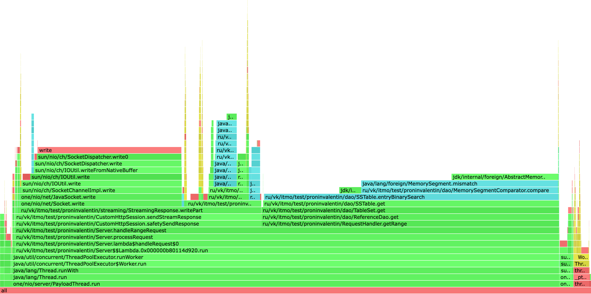
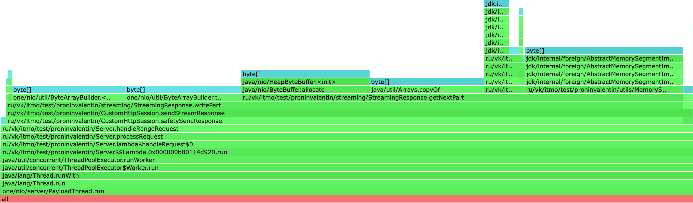
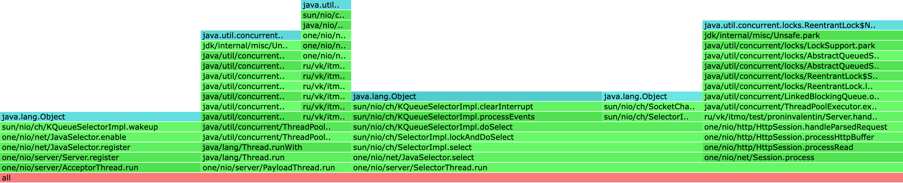

Заполнил базу ~3gb

```
1,1G	server_profiling_data10080
1,1G	server_profiling_data8080
1,1G	server_profiling_data9080
```

### CPU



На Flame Graph можно увидеть, что `AcceptorThread` и `SelectorThread` занимаются своей работой, т.е. никакой новой
нагрузки у них с появлением стриминга у них не добавилось, как это было на лекции. Связанно это с тем, что я решил
записывать стрим напрямую в сокет.

Это с одной стороны хорошо, т.к. при стандартном поведении `one nio`, записью стрима сначала
занимается `worker thread`. Но в случае если мы заполнили сокет и при этом у нас еще осталась часть данных, которую
нужно дозаписать, ее записью будет заниматься непосредственно `SelectorThread`. Сделано это для того, как я понимаю,
чтобы отложить запись в сокет на будущее, когда он освободится.

С другой стороны, рушатся все абстракции `one nio`, к тому же приходится вручную закрывать соединение в конце отправки
стрима, что негативно влияет на производительность сервера, т.к. теперь нужно каждый раз переоткрывать соединения.

Кроме `AcceptorThread` и `SelectorThread` присутствует и `PayloadThread`, который занимает львиную долю семплов (92%),
из них занимает:

* 50% `RequestHandler.getRange` в конце стека которого видно использование бинарного поиска для нахождения начала ренджа
  с данными
* 42% `CustomHttpSession.sendStreamResponse` отправка самого ответа:
    * При отправке ответа можно увидеть, что 27% семплов занимает запись в сокет
    * Оставшаяся часть - работа с итератором, конвертация MemorySegment'ов в массив байтов и сравнение MemorySegment'ов
      между собой

Не думаю, что в конкретной реализации можно сильно улучшить производительность, только если как-то решить вопрос с
закрытием сокета в конце стрима

### ALLOC



На профиле аллокаций виден только метод `Server.handleRangeRequest`, в котором происходит конвертация MemorySegment'ов в
массивы байтов и упаковка их в `ByteBuffer`. Можно увидеть, что `java/nio/ByteBuffer.allocate` занимает 18%. Думаю, что
если создать пул таких буферов и переиспользовать их для разных сокетов, то можно значительно сократить объем выделяемой
памяти, а также время на GC

### LOCK



Профиль блокировок получился довольно пустым, почему-то не удается набрать нормальное число семплов (если для CPU было
200K семплов, то для LOCK всего 12), возможно, это из-за того, что блокировок самих по себе мало и профайлер редко
замечает их, поэтому и не добавляет в профиль

Из того, что есть:

* `AcceptorThread` работает как и раньше, ничего нового нету
* `PayloadThread` берет задачу из пула и тратит время на ручное закрытие сессии после отправки стрима
* `SelectorThread` также опрашивает сессии и ставит задачи воркерам

Из нового только ручное закрытие сессии в `PayloadThread`

### Выводы

* Хоть реализация стримов через прямую запись в сокет и работает, но ломает абстракции `one nio`. Думаю, что мое ручное
  закрытие сессии может неожиданным образом откликнуться в других запросах где есть завязка на то, что при старте
  сервера выставляется настройка `closeSessions = false`.
* Реализована запись батчами, пары key-value пишутся не поштучно, а складываются в ByteBuffer перед отправкой.

### Предложения по возможным улучшениям

* Переписать в соответствии с абстракциями one nio, хоть это и приведет к тому, что SelectorThread в некоторых случаях
  будет заниматься отправкой оставшейся части стрима
* Продумать что делать если ключ или значение окажется больше размера буфера при стриминге. (Сейчас буфер = 1КБ, что
  делать если ключ или пара ключ-значение будет больше 1КБ)
* Добавить пул буферов при записи в стрим, чтобы при необходимости брать готовый буфер из пула, а не создавать новый
* Добавить возможность остановить получение данных из стрима без закрытия сокета (сейчас единственный способ - закрыть
  сокет и получить исключение с текстом "Broken pipe")