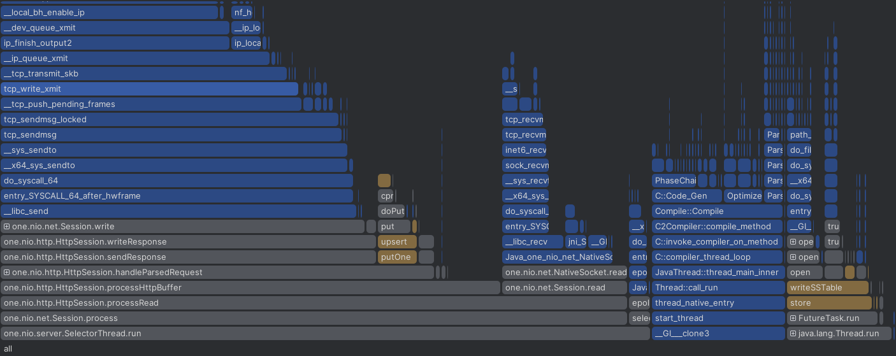
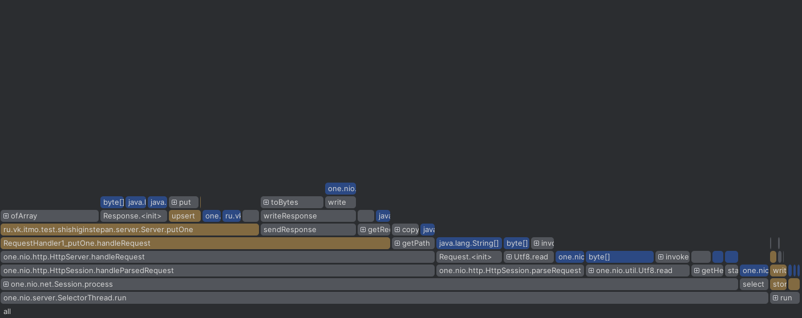
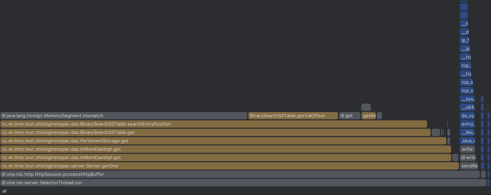
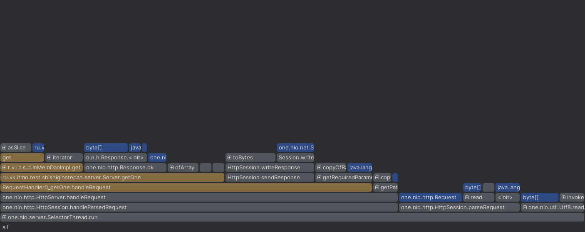
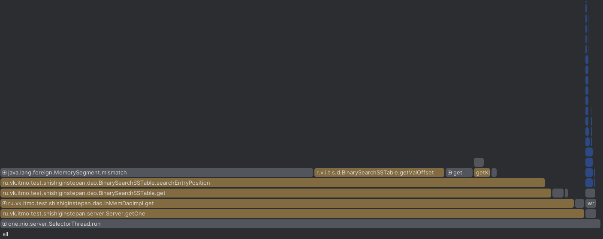
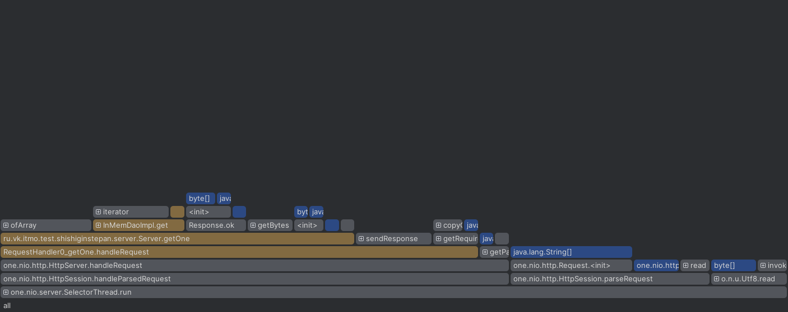
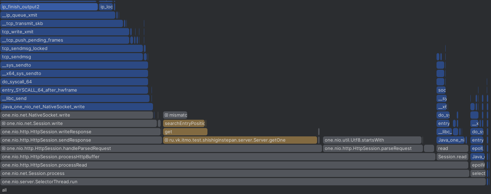
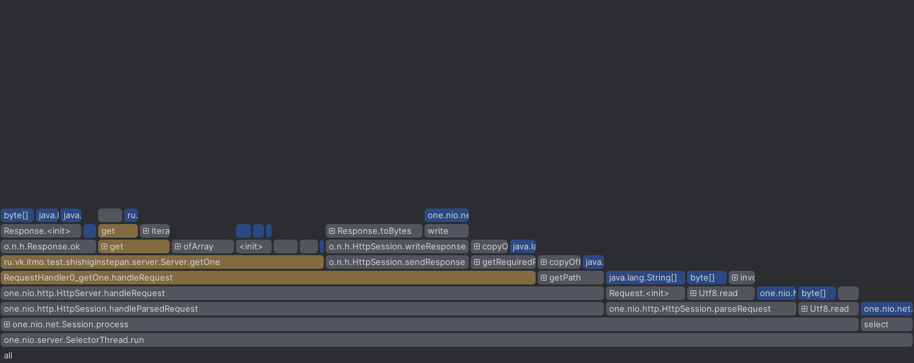
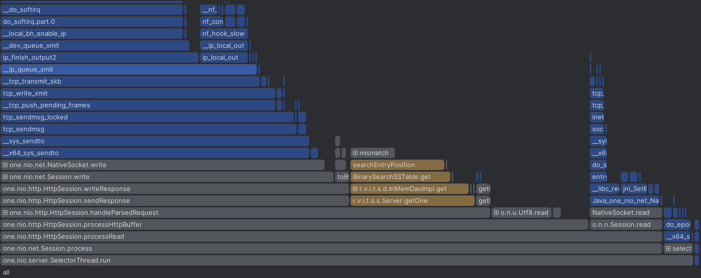
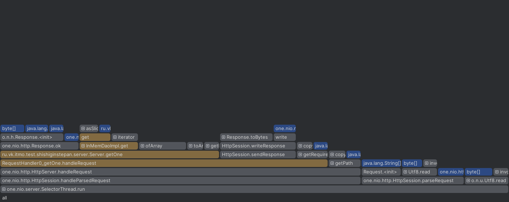

Для профилирования я провел следующий набор экспериментов

Условия:
Машина:

## Hardware Information:
- **Hardware Model:**                              ASUSTeK COMPUTER INC. Vivobook_ASUSLaptop K6500ZC_K6500ZC
- **Memory:**                                      16.0 GiB
- **Processor:**                                   12th Gen Intel® Core™ i5-12500H × 16
- **Disk Capacity:**                               500 GiB

## Software Information:
- **OS Type:**                                     64-bit
- **Kernel Version:**                              Linux 6.7.4-200.fc39.x86_64

## Команда для запуска:
`wrk -s $lua_script_path -L -c 1 -t 1 -R 40000 -d 11 http://localhost:8080`

## 1. **put запросы на чистую бд**

| perc | time   |
|------|--------|
| 50   | 653us  |
| 90   | 1.14ms |
| 99   | 2.3ms  |
| 100  | 3.65ms |
439970 requests in 11.00s, 28.11MB read

Requests/sec:  39994.88

CPU FLAMEGRAPH

ALLOC FLAMEGRAPH

## 2. get запросы на основе данных положенных в прошлом этапе

| perc | time   |
|------|--------|
| 50   | 8.48s  |
| 90   | 8.79s  |
| 99   | 8.86s  |
| 100  | 8.86s |

85652 requests in 11.00s, 5.38MB read

Non-2xx or 3xx responses: 558

Requests/sec:   7786.69

CPU FLAMEGRAPH

ALLOC FLAMEGRAPH

## 3. get запросы но увеличен разброс генерации ключа так чтобы было больше NotFound

| perc | time   |
|------|--------|
| 50   | 9.47s  |
| 90   | 9.85ms |
| 99   | 9.92s  |
| 100  | 9.93s  |

43065 requests in 11.00s, 2.75MB read

Non-2xx or 3xx responses: 14727

Requests/sec:   3915.02

Transfer/sec:    255.98KB

CPU FLAMEGRAPH

ALLOC FLAMEGRAPH

## 4. Повторение третьего этапа но после компакта

| perc | time   |
|------|--------|
| 50   | 621us  |
| 90   | 1.11ms |
| 99   | 4.5ms  |
| 100  | 4.97ms |

439971 requests in 11.00s, 28.09MB read

Non-2xx or 3xx responses: 150853

Requests/sec:  39998.28

Transfer/sec:      2.55MB

CPU FLAMEGRAPH

ALLOC FLAMEGRAPH

## 5. Повторение четвертого этапа но с меньшим разбросом ключей

| perc | time   |
|------|--------|
| 50   | 732us  |
| 90   | 1.41ms |
| 99   | 2.47ms |
| 100  | 3.1ms  |
439962 requests in 11.00s, 27.65MB read

Non-2xx or 3xx responses: 2876

Requests/sec:  39997.40

Transfer/sec:      2.51MB

CPU FLAMEGRAPH

ALLOC FLAMEGRAPH

## Выводы

* Парсинг ключа из query параметра создает лишний оверхед, тк в конце концов мы все равно хотим видеть его в виде массива байтов.
* Dao очень плохо справляется с большим набором ss таблиц, при этом compaction возвращает большую часть производительности.
* Увеличивание flush threshold (не документированный эксперимент) повышает производительность засчет меньшего количества таблиц, более того учитывая тестовые данные получилось подобрать такое значение чтобы индекс для таблицы помещался в page size, равный в моем случае 4096
* Большая часть лишних аллокаций происходит в инициализации ответов по ручкам без тела ответа.
* Увеличение промахов по ключу (т.е. запросов с статусом 400+) понижает производительность примерно на 10% при большом наборе таблиц и более чем на 40% в состоянии после compact.
* Своевременный автоматический компакт и ипмлементация блум фильтра (для сокращения поиска отсутствующих ключей) могут значительно повысить устойчивость сервиса
* В оптимальном для работы состоянии БД всего четверть времени тратит на работу с dao, остальное занимает сетевоей взаимодействие и сериализация данных, здесь нужно искать оптимизации.