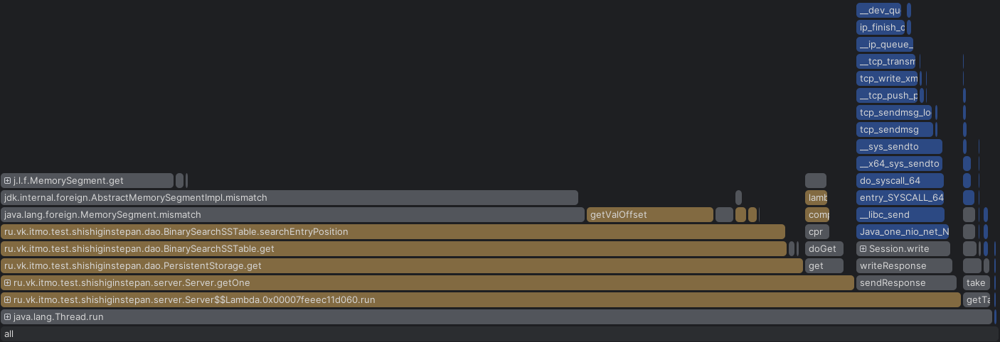

Профилирование проводил на той же машине. Ради эксперимента выключил hyper threading, явного буста в перформансе не заметил, скорее всего связано с тем что в основном операции IO характера.

В этот раз wrk запускался с следующими параметрами:
`wrk -s $lua_script_path  -t 4 -c 64 -L -R 40000 http://localhost:8080 `

Так же относительно прошлых экспериментов, увеличился размер ключей и значений в 2-4 раза.

Добиться наличия таймаутов на запросы получилось только явно ухудшая перформанс методов. Количества конектов и одиночные запросы не позволили в полноценной имплементации получить таймаут.

Разделение исполнения бизнес логики и обработки соединений привело к значимому бусту производительности. Ниже приведены флеймграфы селектор и воркер тредов.

**Селектор**

Можно заметить что порядка 10 процентов общего времени селекторы провели в блокировках при постановке в очередь тасков на обработку

**Воркер**

Воркеры же тратили на блокировку на этой очередь порядка 5 % общего времени выполнения

При этом при нагрузке на запись большинство блокировок происходит у воркер-тредов, они связаны с процессами флашей.

Обобщая, можно сделать вывод что вынесение логики выполнения dao операций в отдельный executor позволяет кратно увеличить производительность системы.

| perc | time   |
|------|--------|
| 50   | 1.25ms |
| 90   | 2.19ms |
| 99   | 2.98ms |
| 100  | 7.8ms  |
Requests/sec:  39925.29

Раньше близкие к похожим результаты можно было получить только на 1 сс таблице после компакта. Данные цифры приведены при колличестве таблиц 200+.
